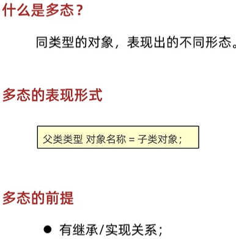
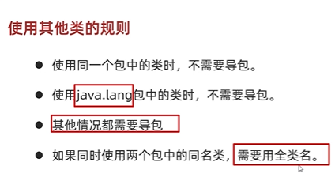
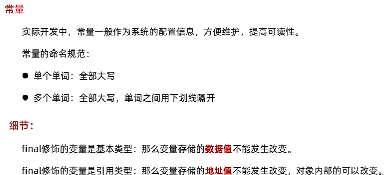

# day14

## 今日内容

- 多态polymorphism
- 包
- final
- 权限修饰符
- 代码块
- **当你将一个子类对象添加到一个父类类型的集合中时，实际上是将子类对象的引用存储在集合中。由于集合只知道它存储的是父类类型的引用，所以它只能调用父类中定义的方法。但是，由于实际存储的是子类对象的引用，所以当你从集合中取出对象并调用方法时，JVM会自动选择正确的方法来执行，这就是多态性的体现。**

## 教学目标

- [ ] 能够说出使用多态的前提条件
- [ ] 理解多态的向上转型
- [ ] 理解多态的向下转型
- [ ] 能够知道多态的使用场景

- [ ] 包的作用
- [ ] public和private权限修饰符的作用
- [ ] 描述final修饰的类的特点
- [ ] 描述final修饰的方法的特点
- [ ] 描述final修饰的变量的特点


# 第一章 多态

## 1.1 多态的形式


**多态是继封装、继承之后，面向对象的第三大特性。**

**多态是出现在继承或者实现关系中的**。

**多态体现的格式**：

```java
父类类型 变量名 = new 子类/实现类构造器;
变量名.方法名();
```

**多态的前提**：有继承关系，子类对象是可以赋值给父类类型的变量。例如Animal是一个动物类型，而Cat是一个猫类型。Cat继承了Animal，Cat对象也是Animal类型，自然可以赋值给父类类型的变量。

## 1.2 多态的使用场景

如果没有多态，在下图中register方法只能传递学生对象，其他的Teacher和administrator对象是无法传递给register方法方法的，在这种情况下，只能定义三个不同的register方法分别接收学生，老师和管理员。


有了多态之后，方法的形参就可以定义为共同的父类Person。




/*

父类引用：等号左边

指向：等号

*/

**要注意的是：**

* 当一个方法的**形参**是一个**类**，我们可以传递这个类**所有的子类对象**。
* 当一个方法的形参是一个接口，我们可以传递这个接口所有的实现类对象（后面会学）。
* 而且多态还可以根据传递的不同对象来调用不同类中的方法。


代码示例：

```java
父类：
public class Person {
    private String name;
    private int age;

    空参构造
    带全部参数的构造
    get和set方法

    public void show(){//没有static
        System.out.println(name + ", " + age);
    }
}

子类1：
public class Administrator extends Person {
    @Override
    public void show() {
        System.out.println("管理员的信息为：" + getName() + ", " + getAge());
    }
}

子类2：
public class Student extends Person{

    @Override
    public void show() {
        System.out.println("学生的信息为：" + getName() + ", " + getAge());
    }
}

子类3：
public class Teacher extends Person{

    @Override
    public void show() {
        System.out.println("老师的信息为：" + getName() + ", " + getAge());
    }
}

测试类：
public class Test {
    public static void main(String[] args) {
        //创建三个对象，并调用register方法

        Student s = new Student();
        s.setName("张三");
        s.setAge(18);


        Teacher t = new Teacher();
        t.setName("王建国");
        t.setAge(30);

        Administrator admin = new Administrator();
        admin.setName("管理员");
        admin.setAge(35);


        register(s);
        register(t);
        register(admin);


    }


    //这个方法既能接收老师，又能接收学生，还能接收管理员
    //只能把参数写成这三个类型的父类
    public static void register(Person p){
        p.show();
    }
}
```

## 1.3 多态的定义和前提

**多态**： 是指同一行为，具有多个不同表现形式。

从上面案例可以看出，Cat和Dog都是动物，都是吃这一行为，但是出现的效果（表现形式）是不一样的。

使用父类型作为参数，可以接收所有子类对象，体现多态的扩展性与便利

 **前提【重点】**

1. 有继承或者实现关系

2. 方法的重写【意义体现：不重写，无意义】

3. 父类引用指向子类对象【格式体现】

   > 父类类型：指子类对象继承的父类类型，或者实现的父接口类型。

## 1.4 多态的运行特点

调用**<u>*成员变量*</u>**时：**编译看左边，运行看左边**

调用***<u>成员方法</u>***时：**编译看左边，运行看右边**

/总结来讲，就是当调用的**<u>成员变量和成员方法</u>**在子类和父类**都有**且**重名**的情况下：

1/编译的时候：不管是 成员变量/方法 只看父类，如果没有就报错（所有上面说 不重写，没意义）

2/运行的时候：

成员变量：运行父类（会把父类的成员变量也继承下来）

成员方法：运行子类（因为子类的 虚方法表中 会把父类的 方法进行覆盖）

3/理解：引用 是在左边，也就是父类，所以会默认从父类中去找

4/内存理解：


1/java中永远是 先父类 ，再子类 加载到方法区

2/一个 继承类 在堆里创建了新的对象，父类、子类的成员变量都会创建

如果是多态（先从父类里面找），所以就是打印的 “动物”，如果没有直接报错

如果是正常的 子类 子类名=new 子类（），那就是先去子类里面找，找不到再去父类空间找，找不到再报错

3/

成员方法也是，编译的时候先去方法区中父类里面看看有没有，没有的话直接报错

然后由于子类继承下来可能会涉及到重写，所以就直接运行子类虚方法表里的方法

# **<u>*//////但是所有这些究其本质是从父类里面去找*</u>**


代码示例：

```java
Fu f = new Zi()；
//编译看左边的父类中有没有name这个属性，没有就报错
//在实际运行的时候，把父类name属性的值打印出来
System.out.println(f.name);
//编译看左边的父类中有没有show这个方法，没有就报错
//在实际运行的时候，运行的是子类中的show方法
f.show();
```

## ***//多态的优势***


第一行的理解：可以通过改变右边创建对象的类名，来改变不同类对象调用的方法

//像之前的ArrayList 也是，如果不在<>里面限制集合里的数据类型，那么所有类型的数据都可以添加到集合里去

//还有StringBuilder,有一个append（Object）(Object顶级父类，也是类似的理解)

## 1.5 多态的弊端


//exception错误 cast转换 cast to 转换成

我们已经知道多态编译阶段是看左边父类类型，如果子类有些独有的功能，此时**多态的写法就无法访问子类独有功能了**。

```java 
class Animal{
    public  void eat()｛
        System.out.println("动物吃东西！")
    ｝
}
class Cat extends Animal {  
    public void eat() {  
        System.out.println("吃鱼");  
    }  
   
    public void catchMouse() {  
        System.out.println("抓老鼠");  
    }  
}  

class Dog extends Animal {  
    public void eat() {  
        System.out.println("吃骨头");  
    }  
}

class Test{
    public static void main(String[] args){
        Animal a = new Cat();
        a.eat();
        a.catchMouse();//编译报错，编译看左边，Animal没有这个方法
    }
}
```

//父类类型范围大，子类类型范围小，范围大的转换成范围小的，要用强制类型转换，类似于基本数据类型的那种在前面用一个括号括起来

## 1.6 引用类型转换

### 1.6.1 为什么要转型

**多态的写法就无法访问子类独有功能了。**

当使用多态方式调用方法时，首先检查父类中是否有该方法，如果没有，则编译错误。也就是说，**不能调用**子类拥有，而父类没有的方法。编译都错误，更别说运行了。这也是多态给我们带来的一点"小麻烦"。所以，想要调用子类特有的方法，必须做向下转型。

回顾基本数据类型转换

- 自动转换: 范围小的赋值给范围大的.自动完成:double d = 5; 
- 强制转换: 范围大的赋值给范围小的,强制转换:int i = (int)3.14 

​     多态的转型分为向上转型（自动转换）与向下转型（强制转换）两种。

### 1.6.2 向上转型（自动转换）

- **向上转型**：多态本身是子类类型向父类类型向上转换（自动转换）的过程，这个过程是默认的。
  当父类引用指向一个子类对象时，便是向上转型。
  使用格式：

```java
父类类型  变量名 = new 子类类型();
如：Animal a = new Cat();
```

**原因是：父类类型相对与子类来说是大范围的类型，Animal是动物类，是父类类型。Cat是猫类，是子类类型。Animal类型的范围当然很大，包含一切动物。**所以子类范围小可以直接自动转型给父类类型的变量。

### 1.6.3 向下转型（强制转换）

- **向下转型**：父类类型向子类类型向下转换的过程，这个过程是强制的。
  一个已经向上转型的子类对象，将父类引用转为子类引用，可以使用强制类型转换的格式，便是向下转型。

使用格式：

```java
子类类型 变量名 = (子类类型) 父类变量名;
如:Aniaml a = new Cat();
   Cat c =(Cat) a;  
```

### 1.6.4 案例演示

当使用多态方式调用方法时，首先检查父类中是否有该方法，如果没有，则编译错误。也就是说，**不能调用**子类拥有，而父类没有的方法。编译都错误，更别说运行了。这也是多态给我们带来的一点"小麻烦"。所以，想要调用子类特有的方法，必须做向下转型。

转型演示，代码如下：

定义类：

```java
abstract class Animal {  
    abstract void eat();  
}  

class Cat extends Animal {  
    public void eat() {  
        System.out.println("吃鱼");  
    }  
    public void catchMouse() {  
        System.out.println("抓老鼠");  
    }  
}  

class Dog extends Animal {  
    public void eat() {  
        System.out.println("吃骨头");  
    }  
    public void watchHouse() {  
        System.out.println("看家");  
    }  
}
```

定义测试类：

```java
public class Test {
    public static void main(String[] args) {
        // 向上转型  
        Animal a = new Cat();  
        a.eat(); 				// 调用的是 Cat 的 eat

        // 向下转型  
        Cat c = (Cat)a;       
        c.catchMouse(); 		// 调用的是 Cat 的 catchMouse
    }  
}
```

### 1.6.5 转型的异常


父类A的对象是在子类的对象上塑造的

转型的过程中，一不小心就会遇到这样的问题，请看如下代码：

```java
public class Test {
    public static void main(String[] args) {
        // 向上转型  
        Animal a = new Cat();  
        a.eat();               // 调用的是 Cat 的 eat

        // 向下转型  
        Dog d = (Dog)a;       
        d.watchHouse();        // 调用的是 Dog 的 watchHouse 【运行报错】
    }  
}
```

这段代码可以通过编译，但是运行时，却报出了 `ClassCastException` ，类型转换异常！这是因为，明明创建了Cat类型对象，运行时，当然不能转换成Dog对象的。

## **<u>*//有关于类型转换理解：*</u>**

1.类型转换必须在继承层次类转换，即超类与子类之间；

2.兄弟类（狗是动物可以的，但说狗是猫就不行）之间不存在继承，因此也不存在类型转换/赋值

3.对类进行类型转换的一般原则如下：

1/“父=子”，（特定的子类也属于他的父类）（多层次继承的话父类还可以是更高级别的类）

2/“子=（子）父”，运行时进行检查，避免classException的一场


### 1.6.6 instanceof关键字

*********<u><u>i*n<u>stanceof   的意义：*</u>*
    *<u>1/能使用子类里面特定的成员方法</u>*
        2/核心：能保证此时一定是对子类类型的引用（区分不同的类）</u>*********</u>


因为a只是引用，这个Instanceof主要是看所引用对象的类型


JDK14的新特性


为了避免ClassCastException的发生，Java提供了 `instanceof` 关键字，给引用变量做类型的校验，格式如下：

```java
变量名 instanceof 数据类型 
如果变量属于该数据类型或者其子类类型，返回true。
如果变量不属于该数据类型或者其子类类型，返回false。
```

所以，转换前，我们最好先做一个判断，代码如下：

```java
public class Test {
    public static void main(String[] args) {
        // 向上转型  
        Animal a = new Cat();  
        a.eat();               // 调用的是 Cat 的 eat

        // 向下转型  
        if (a instanceof Cat){
            Cat c = (Cat)a;       
            c.catchMouse();        // 调用的是 Cat 的 catchMouse
        } else if (a instanceof Dog){
            Dog d = (Dog)a;       
            d.watchHouse();       // 调用的是 Dog 的 watchHouse
        }
    }  
}
```

 //引用数据类型的转化 

自动类型转换（小->大）


强制类型转换（大->小）


### 1.6.7 instanceof   X新特性 //用来看父类引用 new 对象的类型是不是后面的X类

JDK14的时候提出了新特性，把判断和强转合并成了一行

```java
//新特性
//先判断a是否为Dog类型，如果是，则强转成Dog类型，转换之后变量名为d
//如果不是，则不强转，结果直接是false
if(a instanceof Dog d){
    d.lookHome();
}else if(a instanceof Cat c){
    c.catchMouse();
}else{
    System.out.println("没有这个类型，无法转换");
}
```

### 1.7 综合练习

```java
需求：根据需求完成代码:
	1.定义狗类
		属性：
			年龄，颜色
		行为:
			eat(String something)(something表示吃的东西)
			看家lookHome方法(无参数)
2.定义猫类
	属性：
		年龄，颜色
	行为:
		eat(String something)方法(something表示吃的东西)
		逮老鼠catchMouse方法(无参数)
3.定义Person类//饲养员
	属性：
		姓名，年龄
	行为：
		keepPet(Dog dog,String something)方法
			功能：喂养宠物狗，something表示喂养的东西
	行为：
		keepPet(Cat cat,String something)方法
			功能：喂养宠物猫，something表示喂养的东西
	生成空参有参构造，set和get方法  
4.定义测试类(完成以下打印效果):
	keepPet(Dog dog,String somethind)方法打印内容如下：
		年龄为30岁的老王养了一只黑颜色的2岁的狗
		2岁的黑颜色的狗两只前腿死死的抱住骨头猛吃
	keepPet(Cat cat,String somethind)方法打印内容如下：
		年龄为25岁的老李养了一只灰颜色的3岁的猫
		3岁的灰颜色的猫眯着眼睛侧着头吃鱼
5.思考：		
	1.Dog和Cat都是Animal的子类，以上案例中针对不同的动物，定义了不同的keepPet方法，过于繁琐，能否简化，并体会简化后的好处？
	2.Dog和Cat虽然都是Animal的子类，但是都有其特有方法，能否想办法在keepPet中调用特有方法？
```
画图分析：


代码示例：

```java
//动物类（父类）
public class Animal {
    private int age;
    private String color;


    public Animal() {
    }

    public Animal(int age, String color) {
        this.age = age;
        this.color = color;
    }

    public int getAge() {
        return age;
    }

    public void setAge(int age) {
        this.age = age;
    }

    public String getColor() {
        return color;
    }

    public void setColor(String color) {
        this.color = color;
    }

    public void eat(String something){
        System.out.println("动物在吃" + something);
    }
}

//猫类（子类）
public class Cat extends Animal {

    public Cat() {
    }

    public Cat(int age, String color) {
        super(age, color);
    }

    @Override
    public void eat(String something) {
        System.out.println(getAge() + "岁的" + getColor() + "颜色的猫眯着眼睛侧着头吃" + something);
    }

    public void catchMouse(){
        System.out.println("猫抓老鼠");
    }

}

//狗类（子类）
public class Dog extends Animal {
    public Dog() {
    }

    public Dog(int age, String color) {
        super(age, color);
    }

    //行为
    //eat(String something)(something表示吃的东西)
    //看家lookHome方法(无参数)
    @Override
    public void eat(String something) {
        System.out.println(getAge() + "岁的" + getColor() + "颜色的狗两只前腿死死的抱住" + something + "猛吃");
    }

    public void lookHome(){
        System.out.println("狗在看家");
    }
}


//饲养员类
public class Person {
    private String name;
    private int age;

    public Person() {
    }

    public Person(String name, int age) {
        this.name = name;
        this.age = age;
    }

    public String getName() {
        return name;
    }

    public void setName(String name) {
        this.name = name;
    }

    public int getAge() {
        return age;
    }

    public void setAge(int age) {
        this.age = age;
    }

    //饲养狗
   /* public void keepPet(Dog dog, String something) {
        System.out.println("年龄为" + age + "岁的" + name + "养了一只" + dog.getColor() + "颜色的" + dog.getAge() + "岁的狗");
        dog.eat(something);
    }

    //饲养猫
    public void keepPet(Cat cat, String something) {
        System.out.println("年龄为" + age + "岁的" + name + "养了一只" + cat.getColor() + "颜色的" + cat.getAge() + "岁的猫");
        cat.eat(something);
    }*/


    //想要一个方法，能接收所有的动物，包括猫，包括狗
    //方法的形参：可以写这些类的父类 Animal
    
    //☆☆☆☆☆☆☆☆☆☆☆☆☆☆☆☆☆☆☆☆☆☆☆☆☆☆☆☆☆☆☆☆☆☆☆☆☆☆☆☆☆☆☆☆☆☆☆☆☆☆☆☆☆☆☆☆☆☆☆☆☆☆☆☆☆☆☆☆☆☆☆☆instanceof   的意义：
    1/能使用子类里面特定的成员方法
        2/核心：能保证此时一定是对子类类型的引用（区分不同的类）☆☆☆☆☆☆☆☆☆☆☆☆☆☆☆☆☆☆☆☆☆☆☆☆☆☆☆☆☆☆☆☆☆☆☆☆☆☆☆☆☆☆☆☆☆☆☆☆☆☆☆☆☆☆☆☆☆☆☆☆☆☆☆☆☆☆☆☆☆☆☆☆☆☆☆☆☆☆☆☆☆☆☆☆☆☆☆☆☆☆☆☆☆☆☆☆☆☆☆☆☆☆☆☆☆☆☆☆☆☆☆☆☆☆☆☆☆☆☆☆
    public void keepPet(Animal a, String something) {
        if(a instanceof Dog d){
            System.out.println("年龄为" + age + "岁的" + name + "养了一只" + a.getColor() + "颜色的" + a.getAge() + "岁的狗");
            d.eat(something);
        }else if(a instanceof Cat c){
            System.out.println("年龄为" + age + "岁的" + name + "养了一只" + c.getColor() + "颜色的" + c.getAge() + "岁的猫");
            c.eat(something);
        }else{
            System.out.println("没有这种动物");
        }
    }
}

//测试类
public class Test {
    public static void main(String[] args) {
        //创建对象并调用方法
       /* Person p1 = new Person("老王",30);
        Dog d = new Dog(2,"黑");
        p1.keepPet(d,"骨头");


        Person p2 = new Person("老李",25);
        Cat c = new Cat(3,"灰");
        p2.keepPet(c,"鱼");*/


        //创建饲养员的对象
        Person p = new Person("老王",30);
        Dog d = new Dog(2,"黑");
        Cat c = new Cat(3,"灰");
        p.keepPet(d,"骨头");
        p.keepPet(c,"鱼");

    }
}
```


# 第二章 包

## 2.1 包

​	**包**在操作系统中其实就是一个**文件夹**。**包是用来分门别类的管理技术，不同的技术类放在不同的包下**，方便管理和维护。

在IDEA项目中，建包的操作如下：


**包名的命名规范**：

```java
路径名.路径名.xxx.xxx
// 例如：com.itheima.oa
```

- 包名一般是公司域名的倒写。例如：黑马是www.itheima.com,包名就可以定义成com.itheima.技术名称。
- 包名必须用”.“连接。
- 包名的每个路径名必须是一个合法的标识符，而且不能是Java的关键字。

**包名.类名 //全类名（全限定名）**


## 2.2 导包（本来很冗杂的类名写法是写全类名，但是太麻烦了，所以导包）


导包之后，在这个类里面就可以直接用	类名	来替代	全类名

//java.lang包是java的核心包




什么时候需要导包？

​	情况一：在使用Java中提供的非核心包中的类时

​	情况二：使用自己写的其他包中的类时

什么时候不需要导包？

​	情况一：在使用Java核心包（java.lang）中的类时//**目前学了String**

​	情况二：在使用自己写的同一个包中的类时

## 2.3 使用不同包下的相同类怎么办？

假设demo1和demo2中都有一个Student该如何使用？

代码示例：

```java
//使用全类名的形式即可。
//全类名：包名 + 类名
//拷贝全类名的快捷键：选中类名crtl + shift + alt + c 或者用鼠标点copy，再点击copy Reference
com.itheima.homework.demo1.Student s1 = new com.itheima.homework.demo1.Student();
com.itheima.homework.demo2.Student s2 = new com.itheima.homework.demo2.Student();
```

# 第三章 权限修饰符

## 3.1 权限修饰符

​	在Java中提供了四种访问权限，使用不同的访问权限修饰符修饰时，被修饰的内容会有不同的访问权限，我们之前已经学习过了public 和 private，接下来我们研究一下protected和默认修饰符的作用。

- public：公共的，所有地方都可以访问。

- protected：本类 ，本包，其他包中的子类都可以访问。

- 默认（没有修饰符）：本类 ，本包可以访问。

  注意：默认是空着不写，不是default

- private：私有的，当前类可以访问。
  `public > protected > 默认 > private`

## 3.2 不同权限的访问能力

|                  | public | protected | 默认 | private |
| ---------------- | ------ | --------- | ---- | ------- |
| 同一类中         | √      | √         | √    | √       |
| 同一包中的类     | √      | √         | √    |         |
| 不同包的子类     | √      | √         |      |         |
| 不同包中的无关类 | √      |           |      |         |

可见，public具有最大权限。private则是最小权限。

编写代码时，如果没有特殊的考虑，建议这样使用权限：

- 成员变量使用`private` ，隐藏细节。
- 构造方法使用` public` ，方便创建对象。
- 成员方法使用`public` ，方便调用方法。

> 小贴士：不加权限修饰符，就是默认权限

//理解简记小tips：

private：爸爸的私房钱只有自己能用

默认：爸爸的钱上交给媳妇只有一个家里的能用，（如果外面有儿子也默认不能用，不然乱套了）

Protected：（受“法律”保护的）除了家里的人能用，外面的儿子也能用

public：公用


# 第四章 final关键字

## 4.1 概述

​	学习了继承后，我们知道，子类可以在父类的基础上改写父类内容，比如，方法重写。

如果有一个方法我不想别人去改写里面内容，该怎么办呢？

Java提供了`final` 关键字，表示修饰的内容不可变。

- **final**：  不可改变，最终的含义。可以用于修饰类、方法和变量。
  - 类：被修饰的类，不能被继承。
  - 方法：被修饰的方法，不能被重写。
  - 变量：被修饰的变量，有且仅能被赋值一次。

## 4.2 使用方式

### 4.2.1 修饰类

final修饰的类，不能被继承。

格式如下：

```java
final class 类名 {
}
```

代码:

```java
final class Fu {
}
// class Zi extends Fu {} // 报错,不能继承final的类
```

查询API发现像 `public final class String` 、`public final class Math` 、`public final class Scanner` 等，很多我们学习过的类，都是被final修饰的，目的就是供我们使用，而不让我们所以改变其内容。

### 4.2.2 修饰方法 					final“最终”


final修饰的方法，不能被**子类重写**。

**当一种方法是规则，不希望别人改变，可用final修饰**

**如果希望某类的所有方法都不希望被别人修改的时候，可以用final修饰这个类**


修饰变量时必须手动赋值（相当于常量）： 




**<u>*字符串不能改变的真正原因：*</u>**String a="";

final:代表了a所指向的地址值不能发生改变

private：说明从外界不能直接调用value这个字节数组，由于String类里面并没有写什么getValue/setValue的类方法，所以也就无法从外界对这个byte[]数组进行数值的修改


格式如下：

```java
修饰符 final 返回值类型 方法名(参数列表){
    //方法体
}
```

代码: 

```java
class Fu2 {
	final public void show1() {
		System.out.println("Fu2 show1");
	}
	public void show2() {
		System.out.println("Fu2 show2");
	}
}

class Zi2 extends Fu2 {
//	@Override
//	public void show1() {
//		System.out.println("Zi2 show1");
//	}
	@Override
	public void show2() {
		System.out.println("Zi2 show2");
	}
}
```

//在IDEA导入之前写的代码文件

记得选.iml


(静态方法里只能用静态变量)

### 4.2.3 修饰变量-局部变量

1. **局部变量——基本类型**
   基本类型的局部变量，被final修饰后，只能赋值一次，不能再更改。代码如下：

```java
public class FinalDemo1 {
    public static void main(String[] args) {
        // 声明变量，使用final修饰
        final int a;
        // 第一次赋值 
        a = 10;
        // 第二次赋值
        a = 20; // 报错,不可重新赋值

        // 声明变量，直接赋值，使用final修饰
        final int b = 10;
        // 第二次赋值
        b = 20; // 报错,不可重新赋值
    }
}
```

思考，下面两种写法，哪种可以通过编译？

写法1：

```java
final int c = 0;
for (int i = 0; i < 10; i++) {
    c = i;
    System.out.println(c);
}
```

写法2：

```java
for (int i = 0; i < 10; i++) {
    final int c = i;
    System.out.println(c);
}
```

根据 `final` 的定义，写法1报错！写法2，为什么通过编译呢？**<u>*因为每次循环，都是一次新的变量c*</u>**。这也是大家需要注意的地方。

### 4.2.4 修饰变量-成员变量

成员变量涉及到初始化的问题，初始化方式有显示初始化和构造方法初始化，只能选择其中一个：

- 显示初始化(在定义成员变量的时候立马赋值)（常用）；

```java
public class Student {
    final int num = 10;
}
```

- 构造方法初始化(在构造方法中赋值一次)（不常用，了解即可）。

  **注意：每个构造方法中都要赋值一次！**

```java
public class Student {
    final int num = 10;
    final int num2;

    public Student() {
        this.num2 = 20;
//    不能对num进行人为赋值，但是可以对num2进行 
    }
    
     public Student(String name) {
        this.num2 = 20;
//     this.num2 = 20;
    }
}
```

> 被final修饰的常量名称，一般都有书写规范，所有字母都**大写**。

## 4.3补充：代码块


1.构造代码块


如果不想用构造代码块，可以用上面这种方式

### **<u>*2.☆☆☆☆☆☆☆☆☆☆☆☆☆☆静态代码块*</u>**

1.初始化静态字段：提供一个初始值/使用一个静态代码块

2.在类第一次加载的时候会完成静态字段的初始化。**所有的静态字段初始化的方法以及静态初始化块都将依照类声明中出现的顺序执行**

在Java中，类的**静态方法是在类加载到内存时被加载的**。当Java虚拟机（JVM）加载一个类时，它会初始化该类的静态变量，并执行静态代码块。静态方法作为类的一部分，也会在这个时候被加载到内存中。

在这个过程中，静态方法会随着类的加载而被加载到内存中。一旦类被加载，静态方法就可以通过类名直接调用，而不需要创建类的实例。
需要注意的是，**静态方法的加载和执行是分开的**。**加载只是将方法的字节码加载到内存中，而执行则需要通过类名来调用。只有在程序中显式调用静态方法时，它才会执行。**

**这与静态代码块不同，静态代码块会在类加载时自动执行，而静态方法需要显式调用。**


补充：块（即复合语句）由若干条Java语句组成，并用一对大括号括起来。

**块确定了变量的作用域**，一个块可以嵌套在另一个块中，不能在两个块中定义2个同名变量//在方法中可以，因为方法的使用需要调用

//在C++中，可以在嵌套的块中定义一个变量，在内层定义的变量会遮盖外层定义的变量，可能会带来错误，Java中不允许

所以对于**静态代码块，代码块里的变量外面不能调用**，并且它随着类的加载而只加载一次


在构造代码块前面加了static

只执行一次！！！！！！！！

**<u>*如果以后有想进行初始化的数据，并且你只想他执行一次，那么可以使用静态代码块。例子：*</u>**


一般方法：


主要是因为 只要是方法都是可以被调用的 !!!!!!!!!!!!

在Java中，静态代码块中的成员变量可以被成员方法直接调用，但需要注意一些细节。
首先，静态代码块中的成员变量必须是静态的，这样它们才能在类加载时被初始化，并且可以被所有的实例共享。


#### **<u>3.局部代码块</u>**

存放在方法里面

主要是为了节约用完立马回收空间，但是现在内存太大，不用考虑