## 今日内容
- 抽象类
- 接口
- 内部类

## 教学目标 
- [ ] 能够写出抽象类的格式
- [ ] 能够写出抽象方法的格式
- [ ] 能说出抽象类的应用场景
- [ ] 写出定义接口的格式
- [ ] 写出实现接口的格式
- [ ] 说出接口中成员的特点
- [ ] 能说出接口的应用场景
- [ ] 能说出接口中为什么会出现带有方法体的方法
- [ ] 能完成适配器设计模式


## 接口：1.用来描述类应该做什么，而不指定他们具体该怎么做

2.接口中可定义常量，但是不能定义实例变量（实例字段/成员变量）

3.在接口中public可以省略，系统会帮忙写，但是在实现类重写的过程中，不可以省略

4.比如：Arrays类中的sort方法承诺可以对对象数组进行排序，但是要求对象的所属类必须实现Comparable接口

实现一：//用强制转换

public int compareTo(Object otherObject){

Emploee other=(Employee) otherObject);

return Double.compare(salary,other.salary);

}

实现二：//用泛型(泛型更好)

class Employee implements **Comparable<Employee>**{

​	public int compareTo(**Employee**  other ){

​			return Double.compare(salary,other.salary);

​	}

}

# 第一章 抽象类

## 1.1 概述

### 1.1.1 抽象类引入

​	父类中的方法，被它的子类们重写，子类各自的实现都不尽相同。那么父类的方法声明和方法主体，只有声明还有意义，而方法主体则没有存在的意义了(因为子类对象会调用自己重写的方法)。换句话说，父类可能知道子类应该有哪个功能，但是功能具体怎么实现父类是不清楚的（由子类自己决定），父类只需要提供一个没有方法体的定义即可，具体实现交给子类自己去实现。**我们把没有方法体的方法称为抽象方法。**

**Java语法规定，包含抽象方法的类就是抽象类**。

**<u>*将共性的方法抽象到父类之后，由于每个子类执行的内容不一样，父类里面不能确定具体的方法体，这个方法可以定义为抽象方法*</u>**

- **抽象方法** ： 没有方法体的方法。
- **抽象类**：//**abstract修饰的类**

## 1.2 abstract使用格式

**abstract是抽象的意思，用于修饰方法方法和类，修饰的方法是抽象方法，修饰的类是抽象类。**

### 1.2.1 抽象方法

使用`abstract` 关键字修饰方法，该方法就成了抽象方法，抽象方法只包含一个方法名，而**没有方法体。**

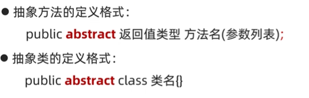

定义格式：

```java
修饰符 abstract 返回值类型 方法名 (参数列表)；
```

代码举例：

```java
public abstract void run()；
```

### 1.2.2 抽象类//

如果一个类包含抽象方法，那么该类必须是抽象类。**注意：抽象类不一定有抽象方法，但是有抽象方法的类必须定义成抽象类。**

比如有些时候，如果不希望某一个类被实例化，但是希望他的子类可以被实例化，就可以把这个类定义为抽象类

定义格式：

```java
abstract class 类名字 { 
  
}
```

代码举例：

```java
public abstract class Animal {
    public abstract void run()；
}
```


//理解：

1/子类的构造方法虽然也是要自己手动写出来，但实际上它是交给super()关键字给父类去进行共有的属性的赋值的

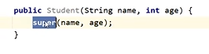

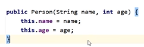


### 1.2.3 抽象类的使用

**要求**：继承抽象类的子类**必须重写父类！！！所有！！！！！的抽象方法**。否则，该子类也必须声明为抽象类。

代码举例：

```java
// 父类,抽象类
abstract class Employee {
	private String id;
	private String name;
	private double salary;
	
	public Employee() {
	}
	
	public Employee(String id, String name, double salary) {
		this.id = id;
		this.name = name;
		this.salary = salary;
	}
	
	// 抽象方法
	// 抽象方法必须要放在抽象类中
	abstract public void work();
}

// 定义一个子类继承抽象类
class Manager extends Employee {
	public Manager() {
	}
	public Manager(String id, String name, double salary) {
		super(id, name, salary);
	}
	// 2.重写父类的抽象方法
	@Override
	public void work() {
		System.out.println("管理其他人");
	}
}

// 定义一个子类继承抽象类
class Cook extends Employee {
	public Cook() {
	}
	public Cook(String id, String name, double salary) {
		super(id, name, salary);
	}
	@Override
	public void work() {
		System.out.println("厨师炒菜多加点盐...");
	}
}

// 测试类
public class Demo10 {
	public static void main(String[] args) {
		// 创建抽象类,抽象类不能创建对象
		// 假设抽象类让我们创建对象,里面的抽象方法没有方法体,无法执行.所以不让我们创建对象
//		Employee e = new Employee();
//		e.work();
		
		// 3.创建子类
		Manager m = new Manager();
		m.work();
		
		Cook c = new Cook("ap002", "库克", 1);
		c.work();
	}
}
```

此时的方法重写，是子类对父类抽象方法的完成实现，我们将这种方法重写的操作，也叫做**实现方法**。

## 1.3 抽象类的特征

抽象类的特征总结起来可以说是 **有得有失**

**有得：抽象类得到了拥有抽象方法的能力。**

**有失：抽象类失去了创建对象的能力。**

其他成员（构造方法，实例方法，静态方法等）抽象类都是具备的。

## 1.4 抽象类的细节

不需要背，只要当idea报错之后，知道如何修改即可。

关于抽象类的使用，以下为语法上要注意的细节，虽然条目较多，但若理解了抽象的本质，无需死记硬背。

1. 抽象类**不能创建对象**，如果创建，编译无法通过而报错。只能创建其非抽象子类的对象。

   > 理解：假设创建了抽象类的对象，调用抽象的方法，而抽象方法没有具体的方法体，没有意义。

2. 抽象类中，可以有构造方法，是供子类创建对象时，初始化父类成员使用的。

   > 理解：子类的构造方法中，有默认的super()，需要访问父类构造方法。

3. 抽象类中，不一定包含抽象方法，但是有抽象方法的类必定是抽象类。

   > 理解：未包含抽象方法的抽象类，目的就是不想让调用者创建该类对象，通常用于某些特殊的类结构设计。

4. 抽象类的子类，必须重写抽象父类中**所有的**抽象方法，否则子类也必须定义成抽象类，编译无法通过而报错。 

   > 理解：假设不重写所有抽象方法，则类中可能包含抽象方法。那么创建对象后，调用抽象的方法，没有意义。

5. 抽象类存在的意义 是为了被子类继承。

   > 理解：抽象类中已经实现的是模板中确定的成员，抽象类不确定如何实现的定义成抽象方法，交给具体的子类去实现。

## 1.5 抽象类存在的意义

​	抽象类存在的意义是为了被子类继承，否则抽象类将毫无意义。**抽象类可以强制让子类，一定要按照规定的格式进行重写**。

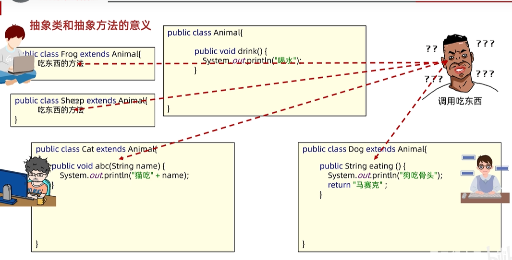

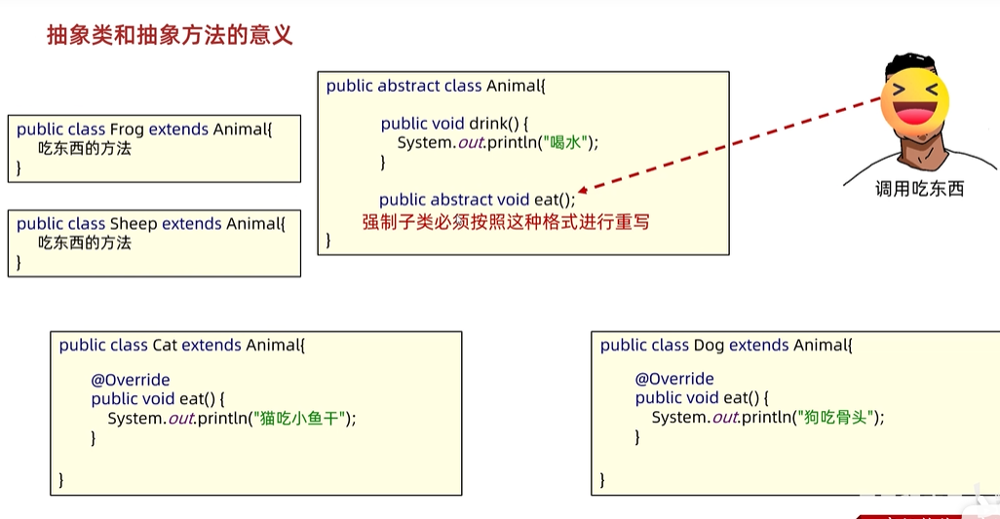

抽象类抽象方法的意义：

以后去公司工作完成一个项目一定是多个人进行完成的，把共性的抽取出来，大家都能见名知意，可以直接去父类里面找这个方法的名字进行调用（因为重写的意义就是让子类强制按照父类这种格式写）

防止很多人在定义不同子类之间那个共性的方法时取不同的名字

，进行方法调用的时候还要专门去子类里面看格式


# 第二章 接口//（一种规则/*不能发生改变*）

## 2.1 概述

我们已经学完了抽象类，抽象类中可以用抽象方法，也可以有普通方法，构造方法，成员变量等。那么什么是接口呢？**接口是更加彻底的抽象，JDK7之前，包括JDK7，接口中全部是抽象方法。接口同样是不能创建对象的**。


父类：是有相似特征的一类事物

**<u>*接口：行为的抽象*</u>**，侧重于 只要能做出这个行为就行，可以是不同大类的事物

## 2.2 定义格式

```java
//接口的定义格式：
interface 接口名称{
    // 抽象方法
}

// 接口的声明：interface
// 接口名称：首字母大写，满足“驼峰模式”
```

## 2.3 接口成分的特点

  在JDK7，包括JDK7之前，接口中的**只有**包含：抽象方法和常量

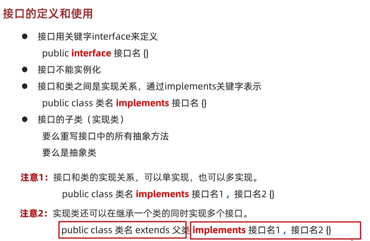


//全部子类的共有行为：一般写在父类里

部分：可以用接口

特有：写在子类自己里面


### 2.3.1.抽象方法

​       注意：**接口中的抽象方法**默认会**自动**加上**public abstract**修饰程序员**无需自己手写**！！
​       按照规范：以后接口中的抽象方法建议不要写上public abstract。因为没有必要啊，默认会加上。

**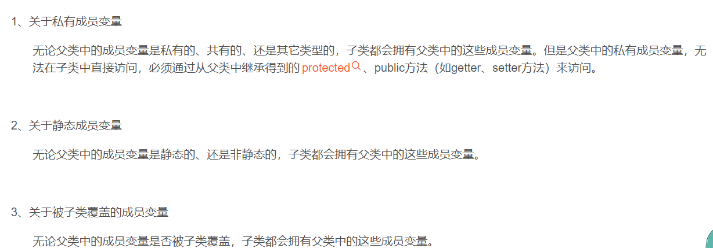**

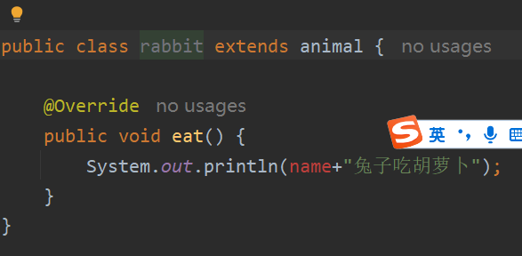

### 2.3.2 常量

 在接口中定义的成员变量默认会加上： public static final修饰。也就是说在接口中定义的成员变量实际上是一个**常量（接口是一种规则，不能发生改变）**。这里是使用public static final修饰后，变量值就不可被修改，并且是静态化的变量可以直接用接口名访问，所以也叫常量。常量必须要给初始值。常量命名规范建议字母全部大写，多个单词用下划线连接。

//**没有构造方法**：自身的成员变量为常量，并且不用给子类的成员变量赋值

接口中的变量之所以设计为不可变，是因为接口主要用于定义方法规范，而不是用于存储数据。保持接口中的变量不变可以确保接口的稳定性和一致性，避免因变量修改导致的逻辑错误‌。

尽管接口中的变量默认不能改变，但可以通过一些技巧来实现类似可变的效果。例如，可以使用默认方法在接口中提供具体的实现，然后在实现类中重写这些方法以达到修改变量的效果‌。另一种方法是使用内部类来实现对接口中变量的修改‌

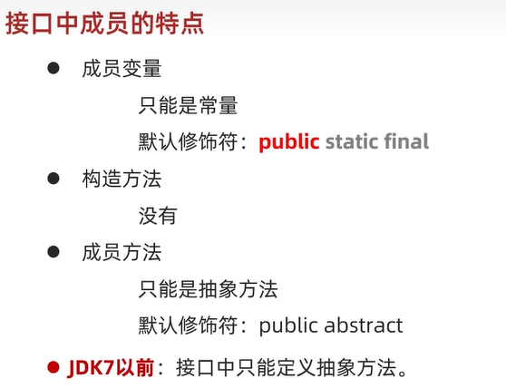

### 2.3.3 案例演示

```java
public interface InterF {
    // 抽象方法！
    //    public abstract void run();
    void run();

    //    public abstract String getName();
    String getName();

    //    public abstract int add(int a , int b);
    int add(int a , int b);


    // 它的最终写法是：
    // public static final int AGE = 12 ;
    int AGE  = 12; //常量
    String SCHOOL_NAME = "黑马程序员";

}
```

## 2.4 基本的实现

### 2.4.1 实现接口的概述

类与接口的关系为实现关系，即**类实现接口**，该类可以称为接口的实现类，也可以称为接口的子类。实现的动作类似继承，格式相仿，只是关键字不同，实现使用 ` implements`关键字。

### 2.4.2 实现接口的格式

```java
/**接口的实现：
    在Java中接口是被实现的，实现接口的类称为实现类。
    实现类的格式:*/
class 类名 implements 接口1,接口2,接口3...{

}
```

从上面格式可以看出，接口是可以被多实现的。大家可以想一想为什么呢？

### 2.4.3 类实现接口的要求和意义

1. 必须重写实现的全部接口中所有抽象方法。
2. 如果一个类实现了接口，但是没有重写完全部接口的全部抽象方法，这个类也必须定义成抽象类。
3. **意义：接口体现的是一种规范，接口对实现类是一种强制性的约束，要么全部完成接口申明的功能，要么自己也定义成抽象类。这正是一种强制性的规范。**

### 2.4.4  类与接口基本实现案例

假如我们定义一个运动员的**接口**（规范），代码如下：

```java
/**
   接口：接口体现的是规范。
 * */
public interface SportMan {
    void run(); // 抽象方法，跑步。
    void law(); // 抽象方法，遵守法律。
    String compittion(String project);  // 抽象方法，比赛。
}
```

接下来定义一个乒乓球运动员类，实现接口，实现接口的**实现类**代码如下：

```java
package com.itheima._03接口的实现;
/**
 * 接口的实现：
 *    在Java中接口是被实现的，实现接口的类称为实现类。
 *    实现类的格式:
 *      class 类名 implements 接口1,接口2,接口3...{
 *
 *
 *      }
 * */
public class PingPongMan  implements SportMan {
    @Override
    public void run() {
        System.out.println("乒乓球运动员稍微跑一下！！");
    }

    @Override
    public void law() {
        System.out.println("乒乓球运动员守法！");
    }

    @Override
    public String compittion(String project) {
        return "参加"+project+"得金牌！";
    }
}
```

**测试代码**：

```java
public class TestMain {
    public static void main(String[] args) {
        // 创建实现类对象。
        PingPongMan zjk = new PingPongMan();
        zjk.run();
        zjk.law();
        System.out.println(zjk.compittion("全球乒乓球比赛"));

    }
}
```

### 2.4.5 类与接口的多实现案例

**类与接口之间的关系是多实现的，一个类可以同时实现多个接口。**//还是不能继承多个类

//多个接口名字相同:

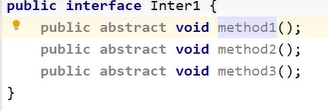

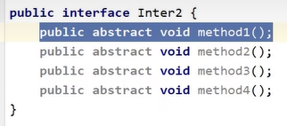

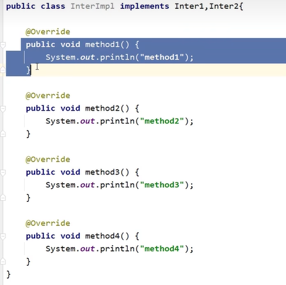

*<u>**实现类（子类）里的method1()既表示重写了Interface1里的抽象方法，也表示重写了interface2里的同名抽象方法**</u>*


首先我们先定义两个接口，代码如下：

```java
/** 法律规范：接口*/
public interface Law {
    void rule();
}

/** 这一个运动员的规范：接口*/
public interface SportMan {
    void run();
}

```

然后定义一个实现类：

```java
/**
 * Java中接口是可以被多实现的：
 *    一个类可以实现多个接口: Law, SportMan
 *
 * */
public class JumpMan implements Law ,SportMan {
    @Override
    public void rule() {
        System.out.println("尊长守法");
    }

    @Override
    public void run() {
        System.out.println("训练跑步！");
    }
}
```

从上面可以看出类与接口之间是可以多实现的，我们可以理解成实现多个规范，这是合理的。

## 2.5 接口与接口的多继承

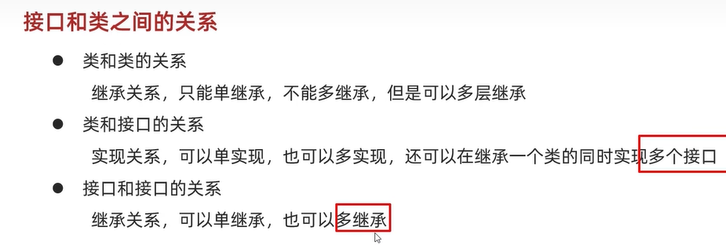


Java中，接口与接口之间是可以多继承的：也就是一个接口可以同时继承多个接口。大家一定要注意：

**类与接口是实现关系**

**接口与接口是继承关系**

接口继承接口就是把其他接口的抽象方法与本接口进行了合并。

案例演示：

```java 
public interface Abc {
    void go();
    void test();
}

/** 法律规范：接口*/
public interface Law {
    void rule();
    void test();
}

 *
 *  总结：
 *     接口与类之间是多实现的。
 *     接口与接口之间是多继承的。
 * */
public interface SportMan extends Law , Abc {
    void run();
}
```

## 2.6扩展：接口的细节

不需要背，只要当idea报错之后，知道如何修改即可。

关于接口的使用，以下为语法上要注意的细节，虽然条目较多，但若理解了抽象的本质，无需死记硬背。

1. 当两个接口中存在相同抽象方法的时候，该怎么办？//借助继承中父类通过虚方发表传递方法去理解

> 只要重写一次即可。此时重写的方法，既表示重写1接口的，也表示重写2接口的。
>
> 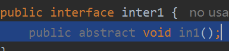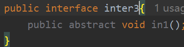

2. 实现类能不能继承A类的时候，同时实现其他接口呢？

> 继承的父类，就好比是亲爸爸一样
> 实现的接口，就好比是干爹一样
> 可以继承一个类的同时，再实现多个接口，只不过，要把接口里面所有的抽象方法，全部实现。
>
> //☆☆☆☆☆☆☆☆☆☆☆☆☆☆☆☆☆☆☆☆☆☆☆☆☆☆☆☆☆☆☆☆☆☆☆☆☆☆☆☆☆☆☆☆☆☆☆☆☆☆☆☆☆☆☆☆☆☆☆抽象类只是代表不能实例化创建对象只要是抽象方法，一定是都要强制重写的☆☆☆☆☆☆☆☆☆☆☆☆☆☆☆☆☆☆☆☆☆☆☆☆☆☆☆☆☆☆☆☆☆☆☆☆☆☆☆☆☆☆☆☆☆☆☆☆☆☆☆☆☆☆☆☆☆☆☆☆

3. 实现类能不能继承一个抽象类的时候，同时实现其他接口呢？

   

> 实现类可以继承一个抽象类的同时，再实现其他多个接口，只不过要把里面所有的抽象方法全部重写。

4. 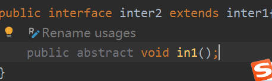

> 接口之间的继承
>
> /*当一个子类继承一个抽象类时，它必须实现所有的抽象方法，否则这个子类也必须声明为抽象类。*/
>
> 
>
> 
>
> 5.实现类Zi，实现了一个接口，还继承了一个Fu类。假设在接口中有一个方法，父类中也有一个相同的方法。子类如何操作呢？
>
> 
>
> 处理办法一：如果父类中的方法体，能满足当前业务的需求，在子类中可以不用重写。
> 处理办法二：如果父类中的方法体，不能满足当前业务的需求，需要在子类中重写。
>
> 
>
> 6.如果一个接口中，有10个抽象方法，但是我在实现类中，只需要用其中一个，该怎么办?

> 可以在接口跟实现类中间，新建一个中间类（适配器类）
> 让这个适配器类去实现接口，对接口里面的所有的方法做空重写。
> 让子类继承这个适配器类，想要用到哪个方法，就重写哪个方法。
> 因为中间类没有什么实际的意义，所以一般会把中间类定义为抽象的，不让外界创建对象

### 补充：新JDK8,9的新特性//接口如果有升级

 

### 1.接口中的默认方法（相当于直接给子类输送了一些成员方法）：


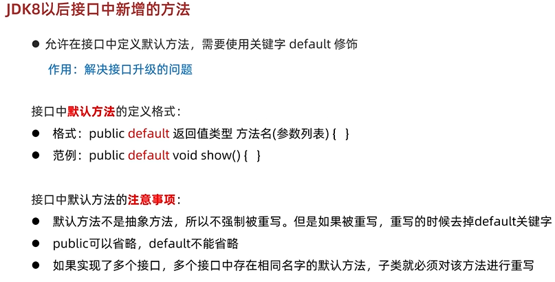

1/图片中最后一行的解释：如果这几个接口有**同名的默认方法**，一定要保证他们的**返回值类型也是相同的**，**<u>*不然会报错*</u>**，之后<u>*这个方法名代表的都是重写之后的这个方法的执行*</u>

2/说的是实现类里重写时要去掉default

原接口里修饰方法的default不能省略（省略了就会被默认为 public abstract,不能有方法体）

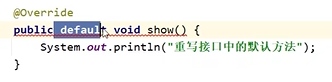

3.默认方法只能通过实现类（子类）**<u>*对象名进行调用*</u>**，不能通过接口名/实现类类名进行调用

### 2.接口中的静态方法(相当于直接给子类输送接口的静态方法（不能改变）)：

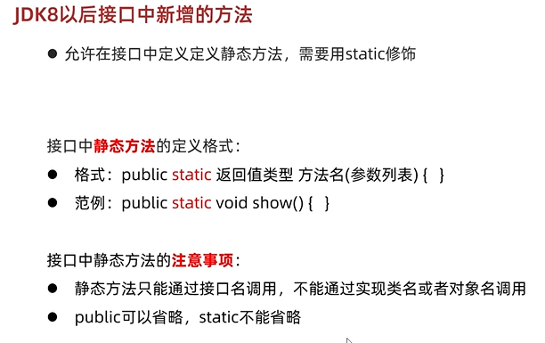

1.接口中的静态方法不能被重写//重写：子类把从父类里面继承下来的虚方法表里的方法给覆盖了//static\final\private是不能继承给虚方法表里的

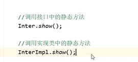

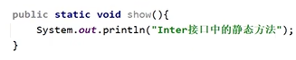

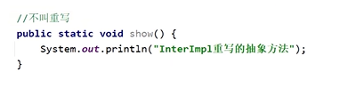

只是方法名相同而已，不是重写

//在Java中，方法重写（Override）是指子类中的方法与父类中的方法具有相同的方法名、返回类型和参数列表。当子类继承父类时，如果子类需要修改父类方法的实现，就可以使用方法重写。
在方法重写时，参数列表必须与父类方法的参数列表完全一致，包括参数的数量、类型和顺序。这意味着方法重写时，形参的名字可以与父类方法的形参名字不同，但参数列表必须相同。
例如，假设父类中有一个方法：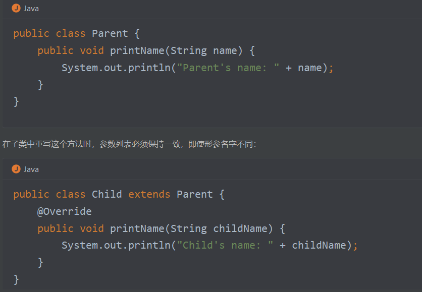


在这个例子中，printName 方法在子类中被重写，尽管形参名字从 name 变成了 childName，但参数列表（一个 String 类型的参数）保持不变。
总结来说，Java 方法重写时，形参名字不需要与父类方法的形参名字一样，但是参数列表必须完全一致

### 3.接口中的私有方法(防止被外界调用)：


把共性代码抽取出来供其他方法调用

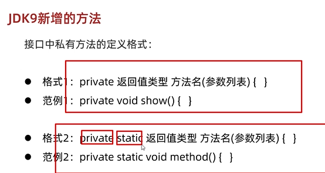

格式1：为默认方法服务

**普通的私有方法 不能写default**

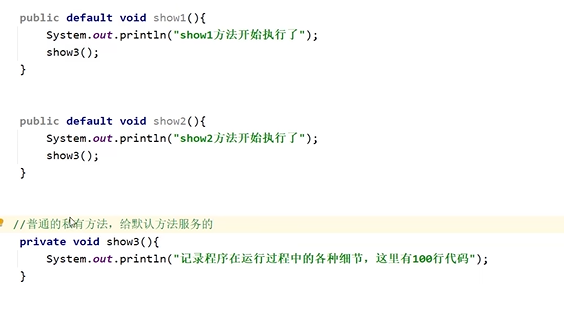

格式2 ：为静态方法服务

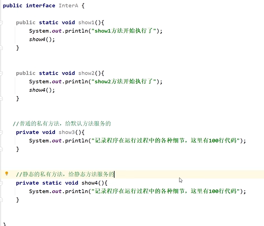

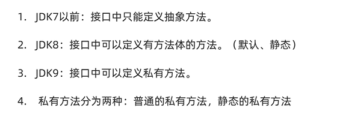

### 4.接口的应用：

1/接口的多态：仍然遵循 编译看左边，实现看右边 的原则

 

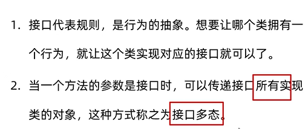

### 5.适配器Adapter//在实现类与接口之间放入第三者（适配器）

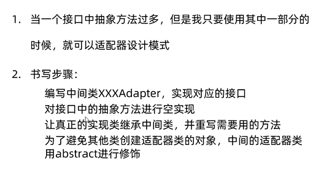

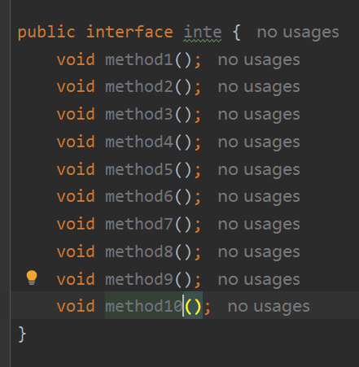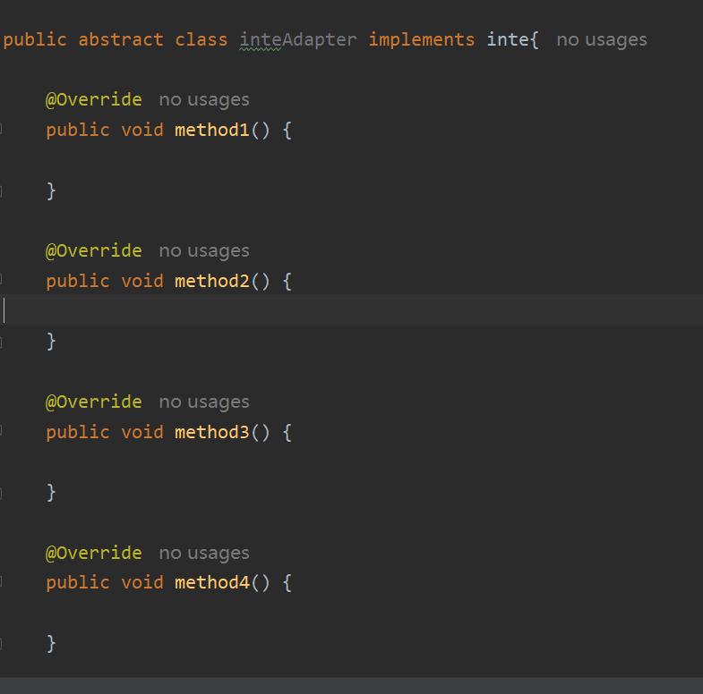


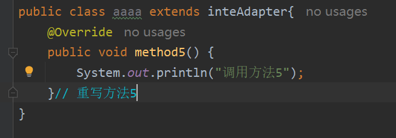

这样的话实现类就不用重写接口Inte里的所有public abstract方法

写部分就行

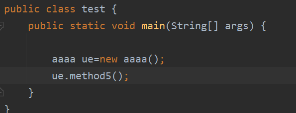

# 第三章 内部类

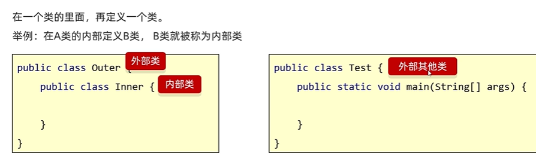

以后可以在外部其他类创建内部类的对象并调用它的方法 

## 3.1 概述

### 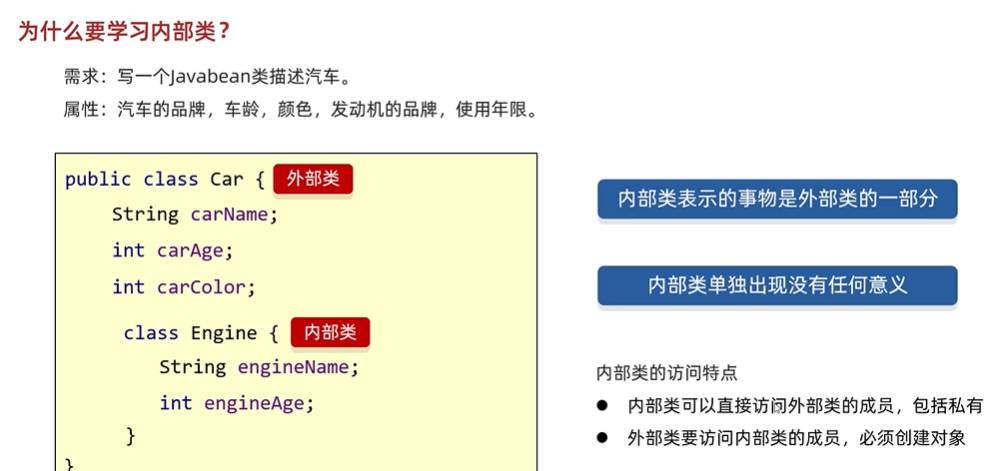3.1.1 什么是内部类

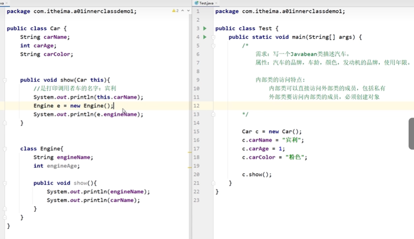

将一个类A定义在另一个类B里面，里面的那个类A就称为**内部类**，B则称为**外部类**。可以把内部类理解成寄生，外部类理解成宿主。

//相关知识的补充回顾：（上面这个图的代码的部分）

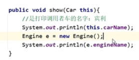

一个类的成员方法其实一般时会把这个类的对象也放在形参列表（比如这里的car this）,只不过一般不写出来

### 3.1.2 什么时候使用内部类

一个事物内部还有一个独立的事物，内部的事物脱离外部的事物无法独立使用

（B类表示的事物是A类的一部分，且B类单独存在没有意义）

1. 人里面有一颗心脏。
2. 汽车内部有一个发动机。
3. 为了实现更好的封装性。

## 3.2 内部类的分类

按定义的位置来分（1,2,3了解即可，4重点掌握）

1. **成员内部内**，类定义在了成员位置 (类中方法外称为成员位置，无static修饰的内部类)

//private 不能在外界创建和使用内部类的对象，只能在本类里面（不能用下面的直接创建方式）

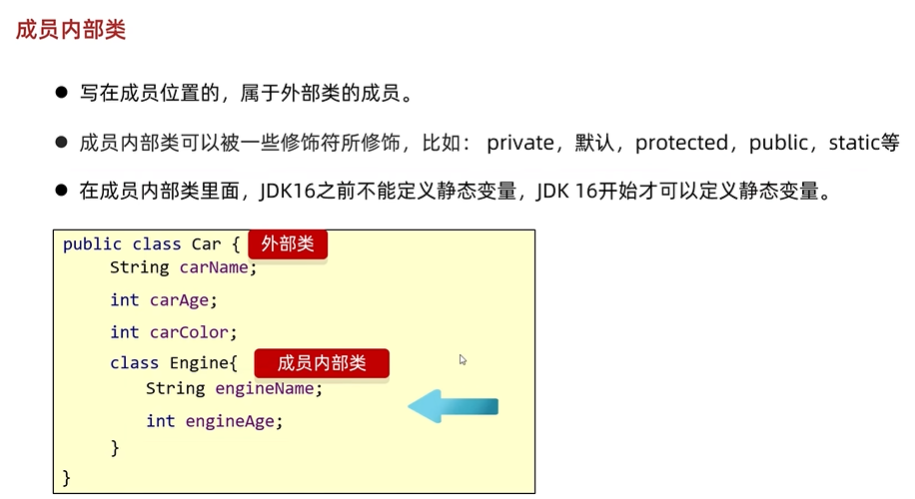

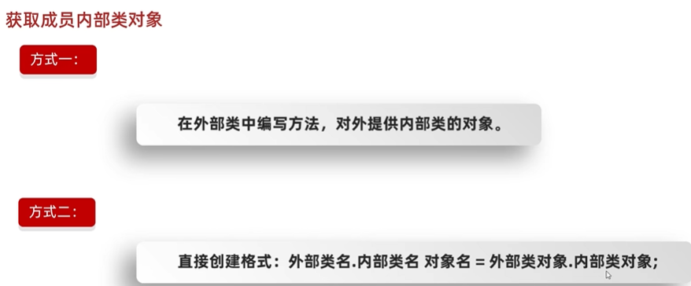

方式2示例：

<u>*核心：**内部类的对象只能依存于外部类的类对象存在**，外部类在实例化时，内部类**不会像外部类的成员变量/方法被实例化**，除非主动对内部类实例化//如果前面有修饰符可以用类似成员方法成员变量去理解*</u>

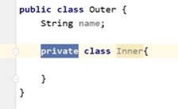

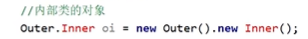


方式1（一般用在内部类被private修饰时）示例：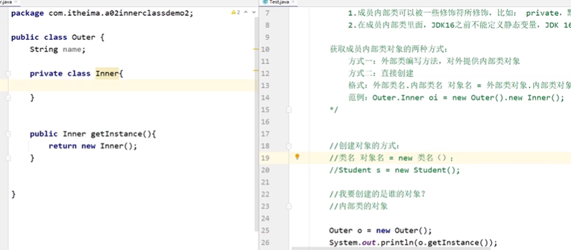

1/如果在外部其他类创建内部类的对象 一定要写**“外部类.内部类”**作为创建对象的类型

如果是在外部类的方法里面创建内部类的对象写成 **“内部类” / “外部类.内部类”**作为创建对象的类型**都可**

2/如果是通过外部类的方法返回内部类对象及其有关成员方法和变量。一定要在外部类方法里先创建内部类的对象


补充：

这个图是某个内部类的地址

$通常区分表示内部类

_通常区分表示常量

所以一般取名最好不要这样


2.**静态内部类**，类定义在了成员位置 (类中方法外称为成员位置，有static修饰的内部类)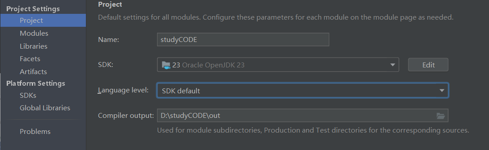

IDEA中更改JDK,SDK版本

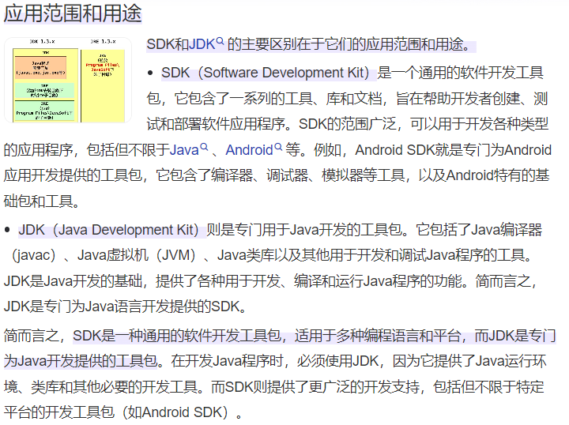


3.**局部内部类**，类定义在方法内

4.**匿名内部类**，没有名字的内部类，可以在方法中，也可以在类中方法外。

## 3.3 成员内部类

**成员内部类特点**：

- 无static修饰的内部类，属于外部类对象的。
- 宿主：外部类对象。

**内部类的使用格式**：

```java
 外部类.内部类。 // 访问内部类的类型都是用 外部类.内部类
```

**获取成员内部类对象的两种方式**：

方式一：外部直接创建成员内部类的对象

```java
外部类.内部类 变量 = new 外部类（）.new 内部类（）;
```

方式二：在外部类中定义一个方法提供内部类的对象

**案例演示**

```java
方式一：
public class Test {
    public static void main(String[] args) {
        //  宿主：外部类对象。
       // Outer out = new Outer();
        // 创建内部类对象。
        Outer.Inner oi = new Outer().new Inner();
        oi.method();
    }
}

class Outer {
    // 成员内部类，属于外部类对象的。
    // 拓展：成员内部类不能定义静态成员。
    public class Inner{
        // 这里面的东西与类是完全一样的。
        public void method(){
            System.out.println("内部类中的方法被调用了");
        }
    }
}


方式二：
public class Outer {
    String name;
    private class Inner{
        static int a = 10;
    }
    public Inner getInstance(){
        return new Inner();
    }
}

public class Test {
    public static void main(String[] args) {
        Outer o = new Outer();
        System.out.println(o.getInstance());


    }
}
```

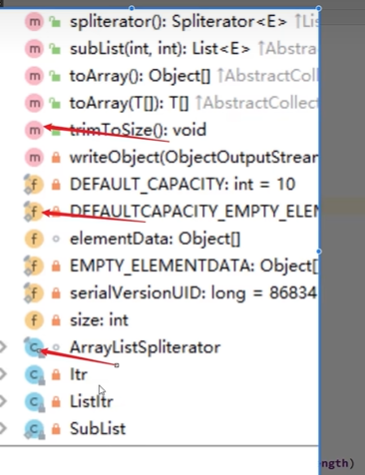

//补充：看源代码时发现 

红色m:成员方法

黄色f:成员变量（属性）

蓝色c:内部类

## 3.4 成员内部类的细节

编写成员内部类的注意点：

1. 成员内部类可以被一些修饰符所修饰，比如： private，默认，protected，public，static等
2. 在成员内部类里面，JDK16之前不能定义静态变量，JDK16开始才可以定义静态变量。
3. 创建内部类对象时，对象中有一个隐含的Outer.this记录外部类对象的地址值。（请参见3.6节的内存图）

详解：

​	内部类被private修饰，外界无法直接获取内部类的对象，只能通过3.3节中的方式二获取内部类的对象

​	被其他权限修饰符修饰的内部类一般用3.3节中的方式一直接获取内部类的对象

​	内部类被static修饰是成员内部类中的特殊情况，叫做静态内部类下面单独学习。

​	内部类如果想要访问外部类的成员变量，外部类的变量必须用final修饰，JDK8以前必须手动写final，JDK8之后不需要手动写，JDK默认加上。

## 3.5 成员内部类面试题

请在?地方向上相应代码,以达到输出的内容

```java
public class Test {
    public static void main(String[] args) {
        Outer.inner oi = new Outer().new inner();
        oi.method();
    }
}

class Outer {	// 外部类
    private int a = 30;

    // 在成员位置定义一个类
    class inner {
        private int a = 20;

        public void method() {
            int a = 10;
            System.out.println(???);	// 10   答案：a
            System.out.println(???);	// 20	答案：this.a
            System.out.println(???);	// 30	答案：Outer.this.a
        }
    }
}
```

//**内部类的方法**访问**外部类的成员变量**：
1/如果访问的变量名内部类成员和内部类的方法里**没有重名**，**直接调用**就可以

2/外部类和内部类不是继承关系，不能用super

要写**<u>*外部类名.this.外部类成员变量名*</u>**

## 3.6 成员内部类内存图


1/用到这个，外部类和内部类是两个互相独立的字节码文件，两个都会一起加载到方法区里

2//*理解 **外部类名.this**：


(这个this$0，与内部类的this区分)**<u>*内部类的对象里面有个隐藏的this用来记录外部类的地址值*</u>**

**<u>*成员方法里的变量遵循就近原则*</u>**

比如这个图里的：sout(a) 就是现在该成员方法里调用成员方法里的局部变量

涉及到this的都要到这个类的实例对象mumu里去看：
			如果只有this：代表这个对象mumu的成员变量

​			如果是outer.this:则是要在mumu这个对象里找记录outer地址的this

*/

## 3.7 静态内部类


//☆☆☆☆☆☆☆☆☆☆☆☆☆☆☆☆☆☆☆☆☆☆☆☆☆☆☆☆☆☆☆☆☆☆☆☆☆☆☆☆☆☆☆☆☆☆☆☆☆☆☆静态Static内部类与成员内部类的最大的不同：

静态内部类可以当做之前的静态成员变量成员方法去理解，所以在使用静态内部类的时候**<u>*可以不创建外部类的对象*</u>**直接进行内部类的实例化

*<u>**其他正常的成员内部类是不能离开寄主外部类独立存在的**</u>*

*<u>**但是静态内部类可以做到**</u>*

☆☆☆☆☆☆☆☆☆☆☆☆☆☆☆☆☆☆☆☆☆☆☆☆☆☆☆☆☆☆☆☆☆☆☆☆☆☆☆☆☆☆☆☆☆☆☆☆☆☆☆☆☆☆☆☆☆☆☆☆☆☆☆☆☆☆☆☆☆☆☆☆☆☆☆☆

static :
可以修饰	内部类、属性（成员变量）、方法、代码块（在类加载的时候执行，且只执行一次）

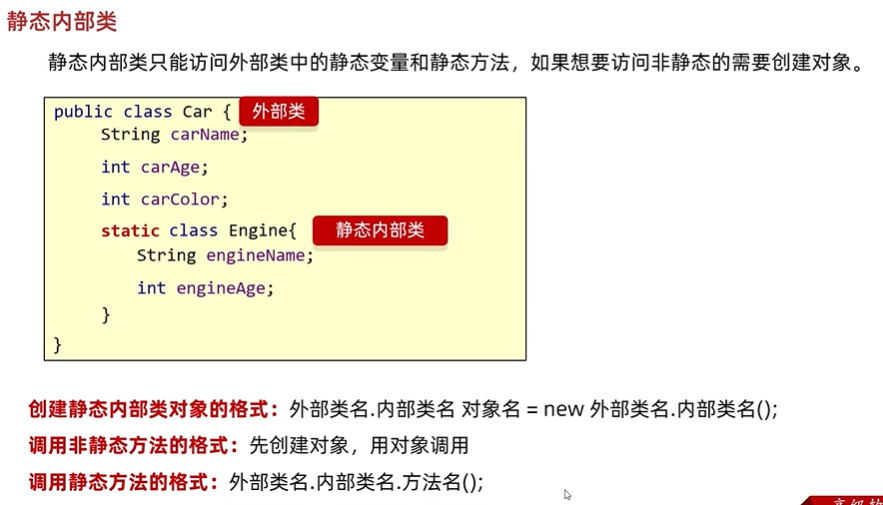


1/可以在一个类的类方法里面实例化另一个类的对象

2/A.B表示A里的B

**静态内部类特点**：

* 静态内部类是一种特殊的成员内部类。static修饰

- 有static修饰，属于外部类本身的。
- 总结：静态内部类与其他类的用法完全一样。只是访问的时候需要加上外部类.内部类。

//***最重要的：

1/不管内部类是不是静态，在外部类/其他外部类都可以直接访问内部类的静态成员变量和静态成员方法			

eg:"**外部类.内部类.静态方法（）/静态变量**"（在其他外部类里调用）

"**内部类.静态方法（）/静态变量**"（在外部类里调用）


要调用非静态的成员变量/方法时一定要先实例化这个类（与这个是否静态无关），通过对象去调用


2/对内部类来说

普通内部类可以访问任意外部类的成员变量和方法（因为普通内部类实例之前先实例了外部类（外部类不能被static修饰））

- **拓展1**:静态内部类可以直接访问外部类的静态成员。

- **拓展2**:静态内部类不可以直接访问外部类的非静态成员，如果要访问需要在这个静态内部类的方法里面创建外部类的对象。

  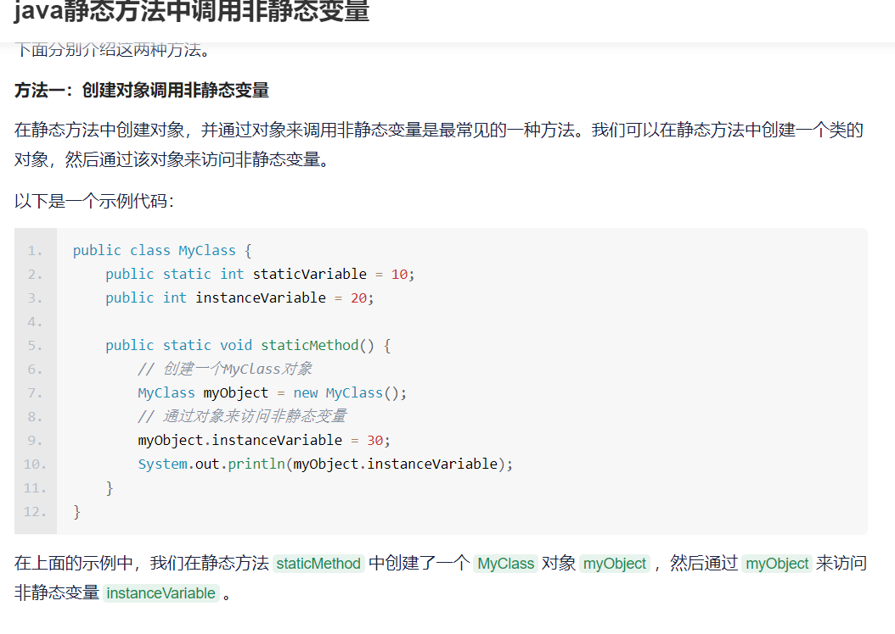

- **拓展3**:静态内部类中没有的Outer.this。

**内部类的使用格式**：

```
外部类.内部类。
```

**静态内部类对象的创建格式**：

```java
外部类.内部类  变量 = new  外部类.内部类构造器;
```

**调用方法的格式：**

* 调用非静态方法的格式：先创建对象，用对象调用
* 调用静态方法的格式：外部类名.内部类名.方法名();

**案例演示**：

```java
// 外部类：Outer01
class Outer01{
    private static  String sc_name = "黑马程序";
    // 内部类: Inner01
    public static class Inner01{
        // 这里面的东西与类是完全一样的。
        private String name;
        public Inner01(String name) {
            this.name = name;
        }
        public void showName(){
            System.out.println(this.name);
            // 拓展:静态内部类可以直接访问外部类的静态成员。
            System.out.println(sc_name);
        }
    }
}

public class InnerClassDemo01 {
    public static void main(String[] args) {
        // 创建静态内部类对象。
        // 外部类.内部类  变量 = new  外部类.内部类构造器;
        Outer01.Inner01 in  = new Outer01.Inner01("张三");
        in.showName();
    }
}
```

## 3.8 局部内部类//当成局部变量去理解

- **局部内部类** ：定义在**方法中**的类。

- 

  final可以修饰局部变量

  public,protected,private只能修饰成员，不能修饰局部变量

定义格式:

```java
class 外部类名A {
	数据类型 变量名;
	
	修饰符 返回值类型 方法名B(参数列表) {
		// …
		class 内部类C {
			// 成员变量
			// 成员方法
		}
	}
}
```

//1.外界无法访问方法内的局部变量，自然也不能直接访问方法内的局部内部类

不过在方法B里面可以创造C的对象进行一些操作

//2.C可以访问A的成员变量，也可以访问方法B的局部变量

## 3.9 匿名内部类【重点】//是一个对象

### 3.9.1 概述

**匿名内部类** ：是内部类的简化写法。他是一个隐含了名字的内部类。开发中，最常用到的内部类就是匿名内部类了。

### 3.9.2 格式//☆☆☆☆☆☆☆有个分号

```java
new 类名或者接口名() {
     重写方法;
};
```

包含了：

* 1.继承或者实现关系

* 2.所有抽象方法重写
* 3.创建对象

所以从语法上来讲，这个整体其实是匿名内部类对象


*<u>**new Swim可以理解为是大括号里类整体的对象，同时也可以理解为这个接口/父类的实现类对象**</u>*

括号内只是完成了接口/父类的重写而已

匿名内部类的理解，如果是通过类继承关系重写的也是类似的理解

### 3.9.2 什么时候用到匿名内部类 

**实际上，如果我们希望定义一个只要使用一次的类，就可考虑使用匿名内部类。匿名内部类的本质作用**

**是为了简化代码**。 

之前我们使用接口时，似乎得做如下几步操作：

1. 定义子类
2. 重写接口中的方法
3. 创建子类对象
4. 调用重写后的方法

```java
interface Swim {
    public abstract void swimming();
}

// 1. 定义接口的实现类
class Student implements Swim {
    // 2. 重写抽象方法
    @Override
    public void swimming() {
        System.out.println("狗刨式...");
    }
}

public class Test {
    public static void main(String[] args) {
        // 3. 创建实现类对象
        Student s = new Student();
        // 4. 调用方法
        s.swimming();
    }
}
```

我们的目的，最终只是为了调用方法，那么能不能简化一下，把以上四步合成一步呢？匿名内部类就是做这样的快捷方式。

### 3.9.3 匿名内部类前提和格式

匿名内部类必须**继承一个父类**或者**实现一个父接口**。

**匿名内部类格式**

```java
new 父类名或者接口名(){
    // 方法重写
    @Override 
    public void method() {
        // 执行语句
    }
};
```

### 3.9.4 使用方式

以接口为例，匿名内部类的使用，代码如下：

### <u>*使用场景：子类/实现类 实例的1次/重写的方法各不相**同*</u>**

**匿名内部类相当于既重写，又直接创建对象**

```java
interface Swim {
    public abstract void swimming();
}

public class Demo07 {
    public static void main(String[] args) {
        // 使用匿名内部类
		new Swim() {
			@Override
			public void swimming() {
				System.out.println("自由泳...");
			}
		}.swimming();

        // 接口多态☆☆☆☆☆☆☆☆☆☆☆☆☆☆☆☆☆☆☆☆☆☆☆☆☆☆☆☆☆☆☆☆☆☆☆☆☆☆☆☆☆☆☆☆☆☆☆☆☆☆☆☆☆☆☆☆☆☆☆☆☆☆☆☆☆☆☆☆☆☆☆☆☆☆☆☆☆☆☆☆☆☆☆☆☆☆☆☆☆☆☆☆☆☆☆☆☆☆☆☆☆☆☆☆☆接口 变量 = new 实现类(); // 多态,走子类的重写方法
        Swim s2 = new Swim() {
            @Override
            public void swimming() {
                System.out.println("蛙泳...");
            }
        };

        s2.swimming();
    }
}
```

### 3.9.5 匿名内部类的特点

1. 定义一个没有名字的内部类
2. 这个类实现了父类，或者父类接口
3. 匿名内部类会创建这个没有名字的类的对象

### 3.9.6 匿名内部类的使用场景

通常在方法的形式参数是接口或者抽象类时，也可以将匿名内部类作为参数传递。代码如下：

```java
interface Swim {
    public abstract void swimming();
}

public class Demo07 {
    public static void main(String[] args) {
        // 普通方式传入对象
        // 创建实现类对象
        Student s = new Student();
        
        goSwimming(s);
        // 匿名内部类使用场景:作为方法参数传递
        Swim s3 = new Swim() {
            @Override
            public void swimming() {
                System.out.println("蝶泳...");
            }
        };
        // 传入匿名内部类
        goSwimming(s3);

        // 完美方案: 一步到位
        goSwimming(new Swim() {
            public void swimming() {
                System.out.println("大学生, 蛙泳...");
            }
        });

        goSwimming(new Swim() {
            public void swimming() {
                System.out.println("小学生, 自由泳...");
            }
        });
    }

    // 定义一个方法,模拟请一些人去游泳
    public static void goSwimming(Swim s) {
        s.swimming();
    }
}
```

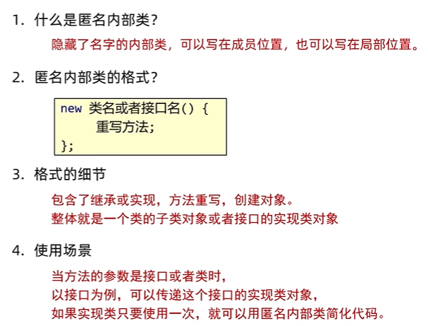

**匿名内部类其实是相当于一个实现类、子类的对象**