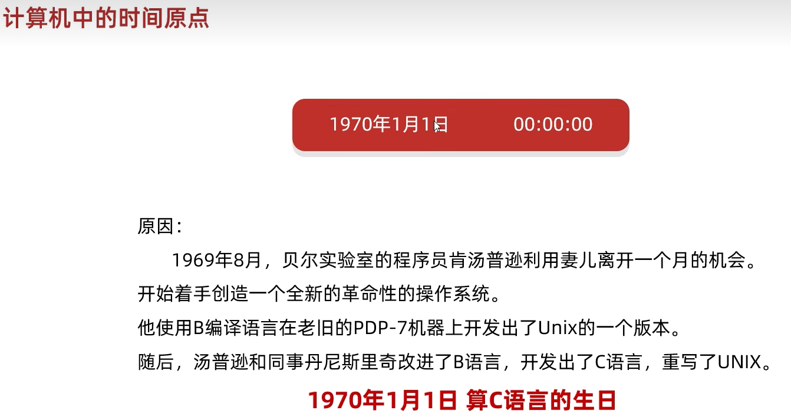
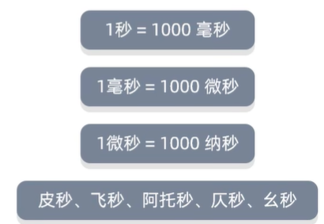
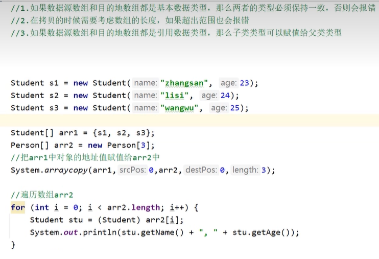
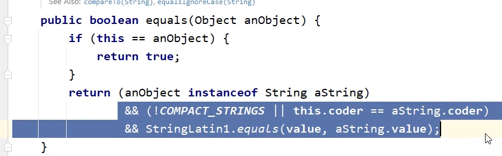
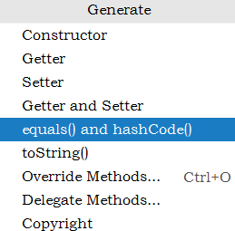
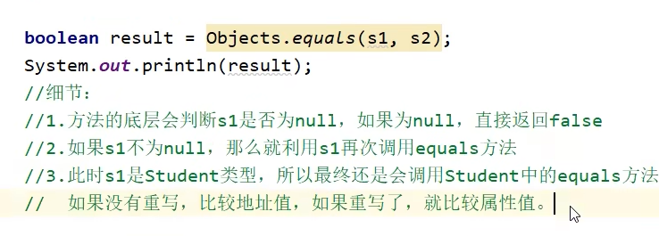
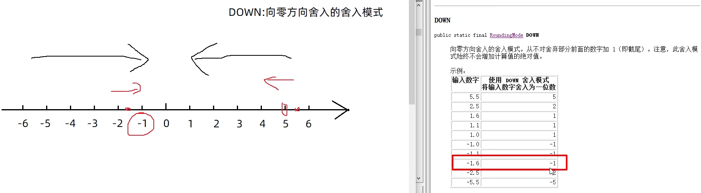

# 课程目标：记一下类名和类的作用就好

能够熟练使用Math类中的常见方法

能够熟练使用System类中的常见方法

能够理解Object类的常见方法作用

能够熟练使用Objects类的常见方法

能够熟练使用BigInteger类的常见方法

能够熟练使用BigDecimal类的常见方法

# 1 Math类

## 1.1 概述

> tips：了解内容

查看API文档，我们可以看到API文档中关于Math类的定义如下：

  

**java.lang包是java的核心包，用这个包的时候不需要导包**

Math类所在包为java.lang包，因此在使用的时候不需要进行导包。并且**<u>*Math类被final修饰了，因此该类是不能被继承，是最终类*</u>**

Math类包含执行基本数字运算的方法，我们可以使用Math类完成基本的数学运算。

**<u>Math私有化构造方法，所有的方法都是静态的</u>**

//拓展：


类的对象，那么创建对象就需要借助于构造方法。因此我们就需要首先查看一下API文档，看看API文档中针对Math类有没有提供对应的构造方法。通过API文档来查看

要想使用Math类我们就需要先创建该类的对象，那么创建对象就需要借助于构造方法。因此我们就需要首先查看一下API文档，看看API文档中针对Math类有没有提供对应的构造方法。通过API文档来查看

一下Math类的成员，如下所示：

 

在API文档中没有体现可用的构造方法，因此我们就不能直接通过new关键字去创建Math类的对象。同时我们发现Math类中的方法都是静态的，因此在使用的时候我们可以直接通过类名去调用。在Math类中

定义了很多数学运算的方法，但是我们并不可能将所有的方法学习一遍，我们主要学习的就是一些常见的方法。

## 1.2 常见方法

> tips：重点讲解内容

<font color="red" size="3">**常见方法介绍**</font>

我们要学习的Math的常见方法如下所示：

```java
public static int abs(int a)					// 返回参数的绝对值
public static double ceil(double a)	//向上取整，有小数 （进一）7.2->8	// 返回大于或等于参数的最小整数
public static double floor(double a)//向下取整，有小数，去了小数点后的小数部分（去尾）7.2->7		// 返回小于或等于参数的最大整数
public static int round(float a)				// 按照四舍五入返回最接近参数的int类型的值
public static int max(int a,int b)				// 获取两个int值中的较大值
public static int min(int a,int b)				// 获取两个int值中的较小值
public static double pow (double a,double b)	// 计算a的b次幂的值
    public static double sqrt(double a)//返回平方根
    public static double cbrt(double a)//返回立方根
public static double random()					// 返回一个[0.0,1.0)的随机值
```

1.Math.abs()的一些小BUG


absExact()相对来说更好，因为他多了一层判断是否是最小值

2.Math.ceil()


3.Math.floor()


4.


负数的那里注意不同，先不管符号去理解

只看小数部分，四舍五入，最后在加符号

5.用Math.random()生成随机数


//[1,2,...,100]

//一般写JAVA还是用Random对象调用方法去写，这个方法和其他语言的逻辑相似，理解就好

<font color="red" size="3">**案例演示**</font>

接下来我们就来演示一些这些方法的执行效果，如下所示：

```java
public class MathDemo01 {

    public static void main(String[] args) {

        // public static int abs(int a)         返回参数的绝对值
        System.out.println("-2的绝对值为：" + Math.abs(-2));
        System.out.println("2的绝对值为：" + Math.abs(2));

        // public static double ceil(double a)  返回大于或等于参数的最小整数
        System.out.println("大于或等于23.45的最小整数位：" + Math.ceil(23.45));
        System.out.println("大于或等于-23.45的最小整数位：" + Math.ceil(-23.45));

        // public static double floor(double a) 返回小于或等于参数的最大整数
        System.out.println("小于或等于23.45的最大整数位：" + Math.floor(23.45));
        System.out.println("小于或等于-23.45的最大整数位：" + Math.floor(-23.45));

        // public static int round(float a)     按照四舍五入返回最接近参数的int
        System.out.println("23.45四舍五入的结果为：" + Math.round(23.45));
        System.out.println("23.55四舍五入的结果为：" + Math.round(23.55));

        // public static int max(int a,int b)   返回两个int值中的较大值
        System.out.println("23和45的最大值为: " + Math.max(23, 45));

        // public static int min(int a,int b)   返回两个int值中的较小值
        System.out.println("12和34的最小值为: " + Math.min(12 , 34));

        // public static double pow (double a,double b)返回a的b次幂的值
        System.out.println("2的3次幂计算结果为: " + Math.pow(2,3));

        // public static double random()返回值为double的正值，[0.0,1.0)
        System.out.println("获取到的0-1之间的随机数为: " + Math.random());
    }

}
```

运行程序进行测试，控制台输出结果如下：

```java
-2的绝对值为：2
2的绝对值为：2
大于或等于23.45的最小整数位：24.0
大于或等于-23.45的最小整数位：-23.0
小于或等于23.45的最大整数位：23.0
小于或等于-23.45的最大整数位：-24.0
23.45四舍五入的结果为：23
23.55四舍五入的结果为：24
23和45的最大值为: 45
12和34的最小值为: 12
2的3次幂计算结果为: 8.0
获取到的0-1之间的随机数为: 0.7322484131745958
```

## 1.3 算法小题(质数)


需求：

​	判断一个数是否为一个质数

代码实现：

```java
public class MathDemo2 {
    public static void main(String[] args) {
        //判断一个数是否为一个质数
        System.out.println(isPrime(997));
        //997 2~996 995次
    }

    public static boolean isPrime(int number) {
        int count = 0;
        for (int i = 2; i <= Math.sqrt(number); i++) {
            count++;
            if (number % i == 0) {
                return false;
            }
        }
        System.out.println(count);
        return true;
    }
}
```

## 1.4 算法小题(自幂数)

在Java中，**/和%**都是算术运算符，用于执行除法和取模操作。它们的**优先级是相同的**，都属于同一级别。当在一个表达式中同时出现/和%时，它们会按照从左到右的顺序进行计算，除非使用括号来改变运算的优先级

自幂数，一个n位自然数等于自身各个数位上数字的n次幂之和

​	举例1：三位数  1^3 + 5^3 + 3^3 = 153  

​	举例2：四位数  1^4 + 6^4 + 3^4 + 4^3 = 1634

如果自幂数是：

* 一位自幂数，也叫做：独身数
* 三位自幂数：水仙花数  四位自幂数：四叶玫瑰数
* 五位自幂数：五角星数  六位自幂数：六合数
* 七位自幂数：北斗七星数  八位自幂数：八仙数
* 九位自幂数：九九重阳数  十位自幂数：十全十美数

```java
//要求1：统计一共有多少个水仙花数。
//水仙花数:100 ~ 999
int count = 0;
//得到每一个三位数
for (int i = 100; i <= 999; i++) {
    //个位 十位 百位
    int ge = i % 10;
    int shi = i / 10 % 10;
    int bai = i / 100 % 10;
    //判断:
    //每一位的三次方之和 跟本身 进行比较。
    double sum = Math.pow(ge, 3) + Math.pow(shi, 3) + Math.pow(bai, 3);
    if (sum == i) {
        count++;
        //System.out.println(i);

        System.out.println(count);
    }
}
```

```java
//要求2：（课后作业）证明没有两位的自幂数。
public class test {
    public static void main(String[] args) {
        int count=0;
        for (int i = 10; i <=99; i++) {
            int ge=i%10;
            int shi=i/10%10;
            if(i==Math.pow(ge,2)+Math.pow(shi,2)){
                count++;
            }
        }
        System.out.println("两位的自幂数有："+count+"个");

    }
}
```

```java
//要求3：（课后作业）分别统计有多少个四叶玫瑰数和五角星数。（答案：都是3个）
//1.四叶玫瑰数
public class test {
    public static void main(String[] args) {
        int count=0;
        for (int i = 1000; i <=9999; i++) {
            int ge=i%10;
            int shi=i/10%10;
            int bai=i/100%10;
            int qian=i/1000%10;
            if(i==Math.pow(ge,4)+Math.pow(shi,4)+Math.pow(bai,4)+Math.pow(qian,4)){
                //System.out.println(i);
                count++;
            }
        }
        System.out.println("四叶玫瑰数有："+count+"个");

    }
}
//2.五角星数
public class test {
    public static void main(String[] args) {
        int count=0;
        for (int i = 10000; i <=99999; i++) {
            int ge=i%10;
            int shi=i/10%10;
            int bai=i/100%10;
            int qian=i/1000%10;
            int wan=i/10000%10;
            if(i==Math.pow(ge,5)+Math.pow(shi,5)+Math.pow(bai,5)+Math.pow(qian,5)+Math.pow(wan,5)){
                System.out.println(i);
                count++;
            }
        }
        System.out.println("五角星数有："+count+"个");

    }
}
```

# 2 System类（工具类，提供一些与系统相关的方法）


## 2.1 概述

> tips：了解内容

查看API文档，我们可以看到API文档中关于System类的定义如下：

  


System类所在包为java.lang包，因此在使用的时候不需要进行导包。并且System**类被final修饰了，因此该类是不能被继承的**。

System包含了系统操作的一些常用的方法。比如获取当前时间所对应的毫秒值，再比如终止当前JVM等等。


要想使用System类我们就需要先创建该类的对象，那么创建对象就需要借助于构造方法。因此我们就需要首先查看一下API文档，看看API文档中针对System类有没有提供对应的构造方法。通过API文档来

查看一下System类的成员，如下所示：

 

在API文档中没有体现可用的构造方法，因此我们就不能直接通过new关键字去创建System类的对象。同时我们发现System类中的方法都是静态的，因此在使用的时候我们可以直接通过类名去调用（Nested 

Class Summary内部类或者内部接口的描述）。

## 2.2 常见方法

> tips：重点讲解内容

<font color="red" size="3">**常见方法介绍**</font>

我们要学习的System类中的常见方法如下所示：

```java
public static long currentTimeMillis()			// 获取当前时间所对应的毫秒值（当前时间为0时区所对应的时间即就是英国格林尼治天文台旧址所在位置）
public static void exit(int status)				// 终止当前正在运行的Java虚拟机，0表示正常退出，非零表示异常退出
public static native void arraycopy(Object src数据源数组,  int  srcPos起始索引, Object dest目的地数组, int destPos起始索引, int length拷贝个数); // 进行数值元素copy
```


//1. **exit(int status)**	不管是正常停止还是异常停止，程序都是停止

//2.理解：**currentTimeMillis()**是指**从时间原点**到**程序运行**所经过的**时间毫秒**

***可以通过对时间的记录start、end,计算它们之间的差值，得到运算时间，计较多种方法之间的时间效率



由于中国在东八区，


所以在我们的系统上时间原点是这个



最下面这行的时间也是以1000作为换算

//3.



第三个细节，只不过再次**获取出来赋值给对应的数据类型的时候要强制数据类型转换**

理解为 父类的范围大（值大）子类的范围小（值小）

子类 赋值给 父类----》 父类=子类//不用强制类型转换

父类 赋值给 子类----》 子类=父类//要强制类型转换

​										子类=（子类）父类//正确格式


<font color="red" size="3">**案例演示**</font>

接下来我们就来通过一些案例演示一下这些方法的特点。

<font color="blue" size="2">**案例1**</font>：演示currentTimeMillis方法

```java
public class SystemDemo01 {

    public static void main(String[] args) {

        // 获取当前时间所对应的毫秒值
        long millis = System.currentTimeMillis();

        // 输出结果
        System.out.println("当前时间所对应的毫秒值为：" + millis);

    }

}
```

运行程序进行测试，控制台的输出结果如下：

```java
当前时间所对应的毫秒值为：1576050298343
```

获取到当前时间的毫秒值的意义：我们常常来需要统计某一段代码的执行时间。此时我们就可以在执行这段代码之前获取一次时间，在执行完毕以后再次获取一次系统时间，然后计算两个时间的差值，

这个差值就是这段代码执行完毕以后所需要的时间。如下代码所示：

```java
public class SystemDemo2 {
    public static void main(String[] args) {
        //判断1~100000之间有多少个质数

        long start = System.currentTimeMillis();

        for (int i = 1; i <= 100000; i++) {
            boolean flag = isPrime2(i);
            if (flag) {
                System.out.println(i);
            }
        }
        long end = System.currentTimeMillis();
        //获取程序运行的总时间
        System.out.println(end - start); //方式一：1514 毫秒  方式二：71毫秒
    }

    //以前判断是否为质数的方式
    public static boolean isPrime1(int number) {
        for (int i = 2; i < number; i++) {
            if (number % i == 0) {
                return false;
            }
        }
        return true;
    }

    //改进之后判断是否为质数的方式（效率高）
    public static boolean isPrime2(int number) {
        for (int i = 2; i <= Math.sqrt(number); i++) {
            if (number % i == 0) {
                return false;
            }
        }
        return true;
    }
}
```

<font color="blue" size="2">**案例2**</font>：演示exit方法

```java
public class SystemDemo01 {

    public static void main(String[] args) {
        
        // 输出
        System.out.println("程序开始执行了.....");
        
        // 终止JVM
        System.exit(0);
        
        // 输出
        System.out.println("程序终止了..........");
        
    }
    
}
```

运行程序进行测试，控制台输出结果如下：

```java
程序开始执行了.....
```

此时可以看到在控制台只输出了"程序开始了..."，由于JVM终止了，因此输出"程序终止了..."这段代码没有被执行。

<font color="blue" size="2">**案例3**</font>：演示**arraycopy**方法**//数组拷贝**

方法参数说明：

```java
// src: 	 源数组
// srcPos：  源数值的开始位置
// dest：    目标数组
// destPos： 目标数组开始位置
// length:   要复制的元素个数
public static native void arraycopy(Object src,  int  srcPos, Object dest, int destPos, int length); 
```

代码如下所示：

```java
public class SystemDemo01 {

    public static void main(String[] args) {

        // 定义源数组
        int[] srcArray = {23 , 45 , 67 , 89 , 14 , 56 } ;

        // 定义目标数组
        int[] desArray = new int[10] ;

        // 进行数组元素的copy: 把srcArray数组中从0索引开始的3个元素，从desArray数组中的1索引开始复制过去
        System.arraycopy(srcArray , 0 , desArray , 1 , 3);

        // 遍历目标数组
        for(int x = 0 ; x < desArray.length ; x++) {
            if(x != desArray.length - 1) {
                System.out.print(desArray[x] + ", ");
            }else {
                System.out.println(desArray[x]);
            }

        }

    }

}
```

运行程序进行测试，控制台输出结果如下所示：

```java
0, 23, 45, 67, 0, 0, 0, 0, 0, 0
```

通过控制台输出结果我们可以看到，数组元素的确进行复制了。

使用这个方法我们也可以完成数组元素的删除操作，如下所示：

```java
public class SystemDemo02 {
    public static void main(String[] args) {
        // 定义一个数组
        int[] srcArray = {23 , 45 , 67 , 89 , 14 , 56 } ;
        // ☆☆☆☆☆☆☆☆☆☆☆☆☆☆☆☆☆☆☆☆☆☆☆☆☆☆☆☆☆☆☆☆☆☆☆☆☆☆☆☆☆☆☆☆☆☆☆☆☆☆☆☆☆☆☆☆☆☆☆☆☆☆☆☆☆☆☆☆☆☆☆☆☆☆☆☆☆删除数组中第3个元素(67)：要删除67这个元素，我们只需要将67后面的其他元素依次向前进行移动即可☆☆☆☆☆☆☆☆☆☆☆☆☆☆☆☆☆☆☆☆☆☆☆☆☆☆☆☆☆☆☆☆☆☆☆☆☆☆☆☆☆☆☆☆☆☆☆☆☆☆☆☆☆☆☆☆☆☆☆☆☆☆☆☆☆☆☆☆☆☆☆☆☆☆☆☆☆☆☆☆☆☆☆☆☆☆☆☆
        System.arraycopy(srcArray , 3 , srcArray , 2 , 3);
        // 遍历srcArray数组
        for(int x = 0 ; x < srcArray.length ; x++) {
            if(x != desArray.length - 1) {
                System.out.print(srcArray[x] + ", ");
            }else {
                System.out.println(srcArray[x]);
            }
        }
    }
}
```

运行程序进行测试，控制台的输出结果如下所示：

```java
23, 45, 89, 14, 56, 56 
```

通过控制台输出结果我们可以看到此时多出了一个56元素，此时我们只需要将最后一个位置设置为0即可。如下所示：

```java
public class SystemDemo02 {
    public static void main(String[] args) {
        // 定义一个数组
        int[] srcArray = {23 , 45 , 67 , 89 , 14 , 56 } ;
        // 删除数组中第3个元素(67)：要删除67这个元素，我们只需要将67后面的其他元素依次向前进行移动即可
        System.arraycopy(srcArray , 3 , srcArray , 2 , 3);
        // 将最后一个位置的元素设置为0
        srcArray[srcArray.length - 1] = 0 ;
        // 遍历srcArray数组
        for(int x = 0 ; x < srcArray.length ; x++) {
            if(x != srcArray.length - 1 ) {
                System.out.print(srcArray[x] + ", ");
            }else {
                System.out.println(srcArray[x]);
            }
        }
    }
}
```

运行程序进行测试，控制台输出结果如下所示：

```java
23, 45, 89, 14, 56, 0
```

此时我们可以看到元素"67"已经被删除掉了。67后面的其他元素依次向前进行移动了一位。

**arraycopy方法底层细节：**

1.如果数据源数组和目的地数组都是基本数据类型，那么两者的类型必须保持一致，否则会报错

2.在拷贝的时候需要考虑数组的长度，如果超出范围也会报错

3.如果数据源数组和目的地数组都是引用数据类型，那么子类类型可以赋值给父类类型

代码示例：

```java
public class SystemDemo3 {
    public static void main(String[] args) {
        //public static void arraycopy(数据源数组，起始索引，目的地数组，起始索引，拷贝个数) 数组拷贝
        //细节:
        //1.如果数据源数组和目的地数组都是基本数据类型，那么两者的类型必须保持一致，否则会报错
        //2.在拷贝的时候需要考虑数组的长度，如果超出范围也会报错
        //3.如果数据源数组和目的地数组都是引用数据类型，那么子类类型可以赋值给父类类型

        Student s1 = new Student("zhangsan", 23);
        Student s2 = new Student("lisi", 24);
        Student s3 = new Student("wangwu", 25);

        Student[] arr1 = {s1, s2, s3};
        Person[] arr2 = new Person[3];
        //把arr1中对象的地址值赋值给arr2中
        System.arraycopy(arr1, 0, arr2, 0, 3);

        //遍历数组arr2
        for (int i = 0; i < arr2.length; i++) {
            Student stu = (Student) arr2[i];
            System.out.println(stu.getName() + "," + stu.getAge());
        }
    }
}

class Person {
    private String name;
    private int age;

    public Person() {
    }

    public Person(String name, int age) {
        this.name = name;
        this.age = age;
    }

    /**
     * 获取
     *
     * @return name
     */
    public String getName() {
        return name;
    }

    /**
     * 设置
     *
     * @param name
     */
    public void setName(String name) {
        this.name = name;
    }

    /**
     * 获取
     *
     * @return age
     */
    public int getAge() {
        return age;
    }

    /**
     * 设置
     *
     * @param age
     */
    public void setAge(int age) {
        this.age = age;
    }

    public String toString() {
        return "Person{name = " + name + ", age = " + age + "}";
    }
}


class Student extends Person {

    public Student() {
    }

    public Student(String name, int age) {
        super(name, age);
    }
}
```

# 3 Runtime//表示当前虚拟机的运行环境 

## 3.1 概述

​	Runtime表示Java中运行时对象，可以获取到程序运行时设计到的一些信息

构造方法私有化


一个电脑只能有一个运行环境(Runtime表示)

## 3.2 常见方法

<font color="red" size="3">**常见方法介绍**</font>

我们要学习的Object类中的常见方法如下所示：

```java
public static Runtime getRuntime()		//当前系统的运行环境对象
public void exit(int status)			//停止虚拟机
    //System.exit()实际上调用的就是这个方法
public int availableProcessors()		//获得CPU的线程数
public long maxMemory()				    //JVM能从系统中获取总内存大小（单位byte）
public long totalMemory()				//JVM已经从系统中获取总内存大小（单位byte）
public long freeMemory()				//JVM剩余内存大小（单位byte）
public Process exec(String command) 	//可以用JAVA去执行cmd命令
```

processor计算机的处理器

Byte->KB->MB->GB				//1024的换算

# 理解

//1.获取Runtime的对象：
Runtime.getRuntime()

//2.Runtime.getRuntime.exit(0);//其实是System.exit();的底层源码

//3.


代码示例：

```java
public class RunTimeDemo1 {
    public static void main(String[] args) throws IOException {
        /*
            public static Runtime getRuntime() 当前系统的运行环境对象
            public void exit(int status) 停止虚拟机
            public int availableProcessors() 获得CPU的线程数
            public long maxMemory() JVM能从系统中获取总内存大小(单位byte)
            public long totalMemory() JVM已经从系统中获取总内存大小(单位byte)
            public long freeMemory() JVM剩余内存大小(单位byte)
            public Process exec(string command) 运行cmd命令
        */

        //1.获取Runtime的对象
        //Runtime r1 =Runtime.getRuntime();

        //2.exit 停止虚拟机
        //Runtime.getRuntime().exit(0);
        //System.out.println("看看我执行了吗?");


        //3.获得CPU的线程数
        System.out.println(Runtime.getRuntime().availableProcessors());//8
        //4.总内存大小,单位byte字节
        System.out.println(Runtime.getRuntime().maxMemory() / 1024 / 1024);//4064
        //5.已经获取的总内存大小,单位byte字节
        System.out.println(Runtime.getRuntime().totalMemory() / 1024 / 1024);//254
        //6.剩余内存大小
        System.out.println(Runtime.getRuntime().freeMemory() / 1024 / 1024);//251

        //7.运行cmd命令
        //shutdown :关机
        //加上参数才能执行
        //-s :默认在1分钟之后关机
        //-s -t 指定时间 : 指定关机时间
        //-a :取消关机操作
        //-r: 关机并重启
        Runtime.getRuntime().exec("shutdown -s -t 3600");


    }
}

```

## 3.3 恶搞好基友

需求：

​	界面上方按钮默认隐藏

​	界面中间有一个提示文本和三个按钮

​	当你的好基友点击中间三个按钮的时候就在N秒之后关机，不同的按钮N的值不一样

​	任意一个按钮被点击之后，上方了按钮出现。当点击上方按钮之后取消关机任务

 

```java
public class Test {
    public static void main(String[] args) {
        new MyJframe();
    }
}
```

```java
public class MyJframe extends JFrame implements ActionListener {

    JButton yesBut = new JButton("帅爆了");
    JButton midBut = new JButton("一般般吧");
    JButton noBut = new JButton("不帅，有点磕碜");
    JButton dadBut = new JButton("饶了我吧！");


    //决定了上方的按钮是否展示
    boolean flag = false;


    public MyJframe() {
        initJFrame();


        initView();


        //显示
        this.setVisible(true);
    }

    private void initView() {

        this.getContentPane().removeAll();

        if (flag) {
            //展示按钮
            dadBut.setBounds(50, 20, 100, 30);
            dadBut.addActionListener(this);
            this.getContentPane().add(dadBut);
        }


        JLabel text = new JLabel("你觉得自己帅吗？");
        text.setFont(new Font("微软雅黑", 0, 30));
        text.setBounds(120, 150, 300, 50);


        yesBut.setBounds(200, 250, 100, 30);
        midBut.setBounds(200, 325, 100, 30);
        noBut.setBounds(160, 400, 180, 30);

        yesBut.addActionListener(this);
        midBut.addActionListener(this);
        noBut.addActionListener(this);

        this.getContentPane().add(text);
        this.getContentPane().add(yesBut);
        this.getContentPane().add(midBut);
        this.getContentPane().add(noBut);

        this.getContentPane().repaint();
    }

    private void initJFrame() {
        //设置宽高
        this.setSize(500, 600);
        //设置标题
        this.setTitle("恶搞好基友");
        //设置关闭模式
        this.setDefaultCloseOperation(3);
        //置顶
        this.setAlwaysOnTop(true);
        //居中
        this.setLocationRelativeTo(null);
        //取消内部默认布局
        this.setLayout(null);
    }

    @Override
    public void actionPerformed(ActionEvent e) {
        Object obj = e.getSource();
        if (obj == yesBut) {
            //给好基友一个弹框
            showJDialog("xxx，你太自信了，给你一点小惩罚");
            try {
                Runtime.getRuntime().exec("shutdown -s -t 3600");
            } catch (IOException ioException) {
                ioException.printStackTrace();
            }
            flag = true;
            initView();

        } else if (obj == midBut) {
            System.out.println("你的好基友点击了一般般吧");

            //给好基友一个弹框
            showJDialog("xxx，你还是太自信了，也要给你一点小惩罚");

            try {
                Runtime.getRuntime().exec("shutdown -s -t 7200");
            } catch (IOException ioException) {
                ioException.printStackTrace();
            }

            flag = true;
            initView();


        } else if (obj == noBut) {
            System.out.println("你的好基友点击了不帅");

            //给好基友一个弹框
            showJDialog("xxx，你还是有一点自知之明的，也要给你一点小惩罚");

            try {
                Runtime.getRuntime().exec("shutdown -s -t 1800");
            } catch (IOException ioException) {
                ioException.printStackTrace();
            }

            flag = true;
            initView();
        } else if (obj == dadBut) {
            //给好基友一个弹框
            showJDialog("xxx，这次就饶了你~");

            try {
                Runtime.getRuntime().exec("shutdown -a");
            } catch (IOException ioException) {
                ioException.printStackTrace();
            }

        }
    }

    public void showJDialog(String content) {
        //创建一个弹框对象
        JDialog jDialog = new JDialog();
        //给弹框设置大小
        jDialog.setSize(200, 150);
        //让弹框置顶
        jDialog.setAlwaysOnTop(true);
        //让弹框居中
        jDialog.setLocationRelativeTo(null);
        //弹框不关闭永远无法操作下面的界面
        jDialog.setModal(true);

        //创建Jlabel对象管理文字并添加到弹框当中
        JLabel warning = new JLabel(content);
        warning.setBounds(0, 0, 200, 150);
        jDialog.getContentPane().add(warning);

        //让弹框展示出来
        jDialog.setVisible(true);
    }
}

```

## //关于setVisible()相关知识点的补充

1.当你创建一个 JFrame 实例后，默认情况下它是不可见的。你需要调用 setVisible(true) 方法来显示这个窗口

2.至于为什么要把这句话放在最后，这通常是因为在显示窗口之前，你可能需要先设置窗口的其他属性，比如大小、位置、布局等。如果你在设置这些属性之前就调用 setVisible(true)，那么窗口可能会在你完成所有设置之前就显示出来，这可能会导致用户体验不佳

将 setVisible(true) 放在最后还可以确保所有的组件都已经被添加到窗口中，并且所有的布局设置都已经完成。这样可以避免在窗口显示之后再添加或调整组件，从而导致窗口内容的闪烁或布局混乱

3.，setVisible 方法的作用对象可以是组件。在Java的Swing库中，setVisible 方法是 java.awt.Component 类的一个方法，它可以被任何继承自 Component 的类调用，包括 JFrame、JPanel、JButton 等组件。
当你调用 setVisible(true) 时，它会使组件变得可见，而调用 setVisible(false) 则会使组件隐藏。这对于控制组件的显示和隐藏状态非常有用，特别是在构建用户界面时，你可能需要根据用户的操作或应用程序的状态来显示或隐藏某些组件。
例如，如果你有一个 JButton 组件，你可以在某个事件发生时调用 setVisible(false) 来隐藏这个按钮，或者在另一个事件发生时调用 setVisible(true) 来显示它。

4.在Java的Swing库中，当你调用JFrame的setVisible(true)方法时，它会使整个JFrame窗体及其包含的所有组件都变得可见。这是因为**JFrame是一个顶层容器，它包含了其他组件，如JPanel、JButton、JLabel等**。**当JFrame变得可见时，它会显示所有已经添加到它的内容面板（ContentPane）中的组件。**
在你的代码示例中，this.setVisible(true);这行代码位于MyJframe类的构造函数中，它会在初始化JFrame及其组件后，使整个JFrame窗体变得可见。因此，所有在initView()方法中添加到JFrame的内容面板的组件都会随之显示出来。
需要注意的是，如果你在调用setVisible(true)之前没有将任何组件添加到JFrame的内容面板，那么即使JFrame变得可见，也不会有任何组件显示出来。此外，**如果你在调用setVisible(true)之后添加或移除组件，这些组件的可见性状态也会相应地更新。**
总结来说，当你调用JFrame的setVisible(true)方法时，它会使整个JFrame窗体及其包含的所有组件都变得可见，前提是这些组件已经被添加到JFrame的内容面板中。

```java
//自己写的代码
package ui;

import javax.swing.*;
import java.awt.event.ActionEvent;
import java.awt.event.ActionListener;
import java.io.IOException;

public class MyJframe extends JFrame implements ActionListener {
       JButton yesB=new JButton("帅爆了");
       JButton midB=new JButton("一般般吧");
       JButton noB=new JButton("不帅，有点磕碜");
       JButton dadB=new JButton("饶了我吧");//显示在上方的按钮
        boolean flag=false;//标记变量
     public MyJframe() {
         initJframe();
         initView();
         this.setVisible(true);


    }

    private void initView() {
         this.getContentPane().removeAll();
         if(flag){
             dadB.setBounds(50,20,100,300);
            dadB.addActionListener(this);
            this.getContentPane().add(dadB);
         }
         JLabel questionn=new JLabel("你觉得自己帅吗？");
         questionn.setFont(new java.awt.Font("楷体",1,30));
         questionn.setBounds(120,150,300,50);
         this.getContentPane().add(questionn);//"你觉得自己帅吗？"

        yesB.setBounds(200, 250, 100, 30);
        midB.setBounds(200, 325, 100, 30);
        noB.setBounds(160, 400, 180, 30);

        yesB.addActionListener(this);
        midB.addActionListener(this);
        noB.addActionListener(this);

        this.getContentPane().add(yesB);
        this.getContentPane().add(midB);
        this.getContentPane().add(noB);
    }

    private void initJframe() {
         this.setSize(500, 600);
         this.setTitle("恶搞好基友");
         this.setDefaultCloseOperation(3);
         this.setAlwaysOnTop(true);
         this.setLocationRelativeTo(null);//居中
        this.setLayout(null);

    }

    @Override
    public void actionPerformed(ActionEvent e) {
        Object obj=e.getSource();
        if(obj==yesB){
            showDialog("***觉得自己超级帅");
            try {
                Runtime.getRuntime().exec("shutdown -s -t 3600");//关机
            } catch (IOException ex) {
                throw new RuntimeException(ex);
            }
            flag=true;
            initView();
        }
        else if(obj==midB){
            showDialog("***觉得自己长得一般");
            try {
                Runtime.getRuntime().exec("shutdown -s -t 7200");//关机
            } catch (IOException ex) {
                throw new RuntimeException(ex);
            }
            flag=true;
            initView();

        }
        else if(obj==noB){
            showDialog("***觉得自己很丑");
            try {
                Runtime.getRuntime().exec("shutdown -s -t 10800");//关机
            } catch (IOException ex) {
                throw new RuntimeException(ex);
            }
            flag=true;
            initView();

        }
        else if(obj == dadB){
            showDialog("这次就饶了你");
            try {
                Runtime.getRuntime().exec("shutdown -a");
            } catch (IOException ex) {
                throw new RuntimeException(ex);
            }


        }
     }

     private void showDialog(String str){
         JDialog tanc=new JDialog();
         tanc.setSize(200,150);
         tanc.setAlwaysOnTop(true);
         tanc.setLocationRelativeTo(null);
         tanc.setModal(true);

         JLabel jl=new JLabel(str);
         jl.setBounds(0,0,200,150);
         tanc.getContentPane().add(jl);

         tanc.setVisible(true);

     }
}
```


```java
package ui;

import java.io.IOException;

public class test {
    public static void main(String[] args) throws IOException {
        new MyJframe();
    }
}
```

# 4 Object类(顶级父类)

如果一个类没有写出来是继承其他类，那就是继承于Object类

*<u>object类型的 变量只能用于作为任意值的一个 **泛型容器（多态）**，</u>*

*<u>**想要对其中的内容进行具体操作**，还要弄清楚对象的原始类型，并进行相应的强制转化</u>*

Object obj=new Employee("adsad",35000);

Employee e=(Employee)obj;


变量名 直接代表的是地址值（除了String\StringBuilder\StringJoiner）//map,list,set的toString也是被重写过，他们的System.out.println()打印出来的是内容，不是地址哈希值各种啥的


## 4.1 概述

> tips：重点讲解内容

查看API文档，我们可以看到API文档中关于Object类的定义如下：

 


Object类所在包是java.lang包。Object 是类层次结构的根，每个类都可以将 Object 作为超类。所有类都直接或者间接的继承自该类；换句话说，该类所具备的方法，其他所有类都继承了。


查看API文档我们可以看到，在**Object类**中提供了一个**无参构造方法**，如下所示：

 

但是一般情况下我们很少去主动的创建Object类的对象，调用其对应的方法。更多的是创建Object类的某个子类对象，然后通过子类对象调用Object类中的方法。

## 4.2 常见方法

> tips：重点讲解内容

<font color="red" size="3">**常见方法介绍**</font>

我们要学习的Object类中的常见方法如下所示：

```java
public String toString()				//返回该对象的字符串表示形式(可以看做是对象的内存地址值)
public boolean equals(Object obj)		//比较两个对象地址值是否相等；true表示相同，false表示不相同
protected Object clone()    			//对象克隆
```

## 理解

# **1.toString()**

*<u>**@后面的跟的是地址值**</u>*

*<u>**toString就是把一个对象变成字符串**</u>*，（简单理解）

/*String,StringBuilder,StringJoiner是一个很特殊的类，他们的对象名就是代表字符串的值.

除了这几个之外，**其他对象的对象名代表的是地址值**


***总而言之，关于toString()，只用记得结论：***

​		***1/直接调用对象的toString ，return 这个对象的地址字符串***

​		***2/如果想要看到属性值的话，可以重写toString方法，return相关的属性值，可以进行适当地拼接或者其他处理运算***


2.System.out.println()的理解


# **3.equals()**

只用记得结论：
		1/如果没有重写equals(),那么**默认使用Object里的equals()**进行比较，此时**比较的是地址值是否相等**

​		2/比较地址值一般意义不大，如果希望**属性值**，可以进行方法的**重写**


eg:这是一个大厂的面试题：


String里的equals()://如果是字符串，继续比较内部属性。如果不是，直接false



StringBuilder里面没有重写equals,默认继承Object里的equals://比较两个对象的地址值


<font color="red" size="3">**案例演示**</font>

接下来我们就来通过一些案例演示一下这些方法的特点。

<font color="blue" size="2">**案例1**</font>：演示toString方法

实现步骤：

1. 创建一个学生类，提供两个成员变量（name ， age）；并且提供对应的无参构造方法和有参构造方法以及get/set方法
2. 创建一个测试类（ObjectDemo01），在测试类的main方法中去创建学生对象，然后调用该对象的toString方法获取该对象的字符串表现形式，并将结果进行输出

如下所示：

Student类

```java
public class Student {

    private String name ;       // 姓名
    private String age ;        // 年龄

    // 无参构造方法和有参构造方法以及get和set方法略
    ...
        
}
```

ObjectDemo01测试类

```java
public class ObjectDemo01 {

    public static void main(String[] args) {

        // 创建学生对象
        Student s1 = new Student("itheima" , "14") ;

        // 调用toString方法获取s1对象的字符串表现形式
        String result1 = s1.toString();

        // 输出结果
        System.out.println("s1对象的字符串表现形式为：" + result1);

    }

}
```

运行程序进行测试，控制台输出结果如下所示：

```java
s1对象的字符串表现形式为：com.itheima.api.system.demo04.Student@3f3afe78
```

为什么控制台输出的结果为：com.itheima.api.system.demo04.Student@3f3afe78； 此时我们可以查看一下Object类中toString方法的源码，如下所示：

```java
public String toString() {		// Object类中toString方法的源码定义
	return getClass().getName() + "@" + Integer.toHexString(hashCode());
}
```

其中getClass().getName()对应的结果就是：com.itheima.api.system.demo04.Student；Integer.toHexString(hashCode())对应的结果就是3f3afe78。

我们常常将"com.itheima.api.system.demo04.Student@3f3afe78"这一部分称之为对象的内存地址值。但是一般情况下获取对象的内存地址值没有太大的意义。获取对象的成员变量的字符串拼接形式才

算有意义，怎么实现呢？此时我们就需要在Student类中重写Object的toString方法。我们可以通过idea开发工具进行实现，具体步骤如下所示：

1. 在空白处使用快捷键：alt + insert。此时会弹出如下的对话框

 

2. 选择toString，此时会弹出如下的对话框

 

同时选择name和age属性，点击OK。此时就会完成toString方法的重写，代码如下所示：

```java
@Override
public String toString() {
    return "Student{" +
        "name='" + name + '\'' +
        ", age='" + age + '\'' +
        '}';
}
```

这段代码就是把Student类中的成员变量进行了字符串的拼接。重写完毕以后，再次运行程序，控制台输出结果如下所示：

```java
s1对象的字符串表现形式为：Student{name='itheima', age='14'}
```

此时我们就可以清楚的查看Student的成员变量值，因此重写toString方法的意义就是以良好的格式，更方便的展示对象中的属性值


我们再来查看一下如下代码的输出：

```java
// 创建学生对象
Student s1 = new Student("itheima" , "14") ;

// 直接输出对象s1
System.out.println(s1);
```

运行程序进行测试，控制台输出结果如下所示：

```java
Student{name='itheima', age='14'}
```

我们可以看到和刚才的输出结果是一致的。那么此时也就证明直接输出一个对象，那么会默认调用对象的toString方法，因此如上代码的等同于如下代码：

```java
// 创建学生对象
Student s1 = new Student("itheima" , "14") ;

// 调用s1的toString方法，把结果进行输出
System.out.println(s1.toString());
```

因此后期为了方便进行测试，我们常常是通过输出语句直接输出一个对象的名称。


小结：

1. 在通过输出语句输出一个对象时，默认调用的就是toString()方法
2. 输出地址值一般没有意义，我们可以通过重写toString方法去输出对应的成员变量信息（快捷键：atl + insert ， 空白处 右键 -> Generate -> 选择toString）
3. toString方法的作用：以良好的格式，更方便的展示对象中的属性值
4. 一般情况下Jdk所提供的类都会重写Object类中的toString方法

<font color="blue" size="2">**案例2**</font>：演示equals方法

实现步骤：

1. 在测试类（ObjectDemo02）的main方法中，创建两个学生对象，然后比较两个对象是否相同

代码如下所示：

```java
public class ObjectDemo02 {

    public static void main(String[] args) {

        // 创建两个学生对象
        Student s1 = new Student("itheima" , "14") ;
        Student s2 = new Student("itheima" , "14") ;

        // 比较两个对象是否相等
        System.out.println(s1 == s2);

    }

}
```

运行程序进行测试，控制台的输出结果如下所示：

```java
false
```

因为"=="号比较的是对象的地址值，而我们通过new关键字创建了两个对象，它们的地址值是不相同的。因此比较结果就是false。


我们尝试调用Object类中的equals方法进行比较，代码如下所示：

```java
// 调用equals方法比较两个对象是否相等
boolean result = s1.equals(s2);

// 输出结果
System.out.println(result);
```

运行程序进行测试，控制台的输出结果为：

```java
false
```

为什么结果还是false呢？我们可以查看一下Object类中equals方法的源码，如下所示：

```java
public boolean equals(Object obj) {		// Object类中的equals方法的源码
    return (this == obj);
}
```

通过源码我们可以发现默认情况下equals方法比较的也是对象的地址值。比较内存地址值一般情况下是没有意义的，我们希望比较的是对象的属性，如果两个对象的属性相同，我们认为就是同一个对象；

那么要比较对象的属性，我们就需要在Student类中重写Object类中的equals方法。equals方法的重写，我们也可以使用idea开发工具完成，具体的操作如下所示：

1. 在空白处使用快捷键：alt + insert。此时会弹出如下的对话框

  

2. 选择equals() and hashCode()方法，此时会弹出如下的对话框

 

点击next，会弹出如下对话框：

 

选择neme和age属性点击next，此时就会弹出如下对话框：

 

取消name和age属性（因为此时选择的是在生成hashCode方法时所涉及到的属性，关于hashCode方法后期再做重点介绍），点击Finish完成生成操作。生成的equals方法和hashCode方法如下：

```java
@Override
public boolean equals(Object o) {//equals方重写的时候，形参一定是object类型的数据，因为这样object类里的equals才会被覆盖
    if (this == o) return true;
    if (o == null || getClass() != o.getClass()) return false;
    Student student = (Student) o;
    return Objects.equals(name, student.name) && Objects.equals(age, student.age);	// 比较的是对象的name属性值和age属性值
}
/*可以看出，equals的一般比较思路
1.地址
2.一方是否为空
3.两个对象的类型
4.两个对象的属性值


*/


@Override
public int hashCode() {
    return 0;
}
```

hashCode方法我们暂时使用不到，可以将hashCode方法删除。重写完毕以后运行程序进行测试，控制台输出结果如下所示：

```java
true
```

此时equals方法比较的是对象的成员变量值，而s1和s2两个对象的成员变量值都是相同的。因此比较完毕以后的结果就是true。

小结：

1. 默认情况下equals方法比较的是对象的地址值
2. 比较对象的地址值是没有意义的，因此一般情况下我们都会重写Object类中的equals方法


# **4.克隆**

**<u>*Object是定义在lang包下的，不能把代码写在lang包下*</u>**


比如：玩游戏，如果右边的一个服务器里面人太多了，让一个人去另一个服务器里面，就是用的对象克隆


<font color="blue" size="2">**案例2**</font>：对象克隆

该图是对象A的内存图：


​	把A对象的属性值完全**拷贝**给B对象，也叫对象拷贝,对象复制

**对象克隆的分类：**

>深克隆和浅克隆

**浅克隆：**

先创建一个对象

**<u>*基本数据类型拷贝的是数据，引用数据类型拷贝的是地址*</u>**

​	不管对象内部的属性是基本数据类型还是引用数据类型，都完全拷贝过来 

​	基本数据类型拷贝过来的是具体的数据，引用数据类型拷贝过来的是地址值。

​	Object类默认的是浅克隆


**深克隆：**

​	基本数据类型拷贝过来，字符串复用，引用数据类型会重新创建新的

**<u>String虽然也是引用数据类型，由于字符串是存在于串池中，串池中可以进行字符串的复用，所以不用再去创建新的</u>**


代码实现：

```java
package com.itheima.a04objectdemo;

public class ObjectDemo4 {
    public static void main(String[] args) throws CloneNotSupportedException {
        // protected object clone(int a) 对象克隆 

        //1.先创建一个对象
        int[] data = {1, 2, 3, 4, 5, 6, 7, 8, 9, 10, 11, 12, 13, 14, 15, 0};
        User u1 = new User(1, "zhangsan", "1234qwer", "girl11", data);

        //2.克隆对象
        //细节:
        //方法在底层会帮我们创建一个对象,并把原对象中的数据拷贝过去。
        //书写细节:
        //1.重写Object中的clone方法
        //2.让javabean类实现Cloneable接口
        //3.创建原对象并调用clone就可以了
        //User u2 =(User)u1.clone();

        //验证一件事情：Object中的克隆是浅克隆
        //想要进行深克隆，就需要重写clone方法并修改里面的方法体
        //int[] arr = u1.getData();
        //arr[0] = 100;

        //System.out.println(u1);
        //System.out.println(u2);


        //以后一般会用第三方工具进行克隆
        //1.第三方写的代码导入到项目中
        //2.编写代码
        //Gson gson =new Gson();
        //把对象变成一个字符串
        //String s=gson.toJson(u1);
        //再把字符串变回对象就可以了
        //User user =gson.fromJson(s, User.class);

        //int[] arr=u1.getData();
        //arr[0] = 100;

        //打印对象
        //System.out.println(user);

    }
}

package com.itheima.a04objectdemo;

import java.util.StringJoiner;


//Cloneable
//如果一个接口里面没有抽象方法
//表示当前的接口是一个标记性接口
//现在Cloneable表示一旦实现了，那么当前类的对象就可以被克降
//如果没有实现，当前类的对象就不能克隆
public class User implements Cloneable {
    private int id;
    private String username;
    private String password;
    private String path;
    private int[] data;


    public User() {
    }

    public User(int id, String username, String password, String path, int[] data) {
        this.id = id;
        this.username = username;
        this.password = password;
        this.path = path;
        this.data = data;
    }

    /**
     * 获取
     *
     * @return id
     */
    public int getId() {
        return id;
    }

    /**
     * 设置
     *
     * @param id
     */
    public void setId(int id) {
        this.id = id;
    }

    /**
     * 获取
     *
     * @return username
     */
    public String getUsername() {
        return username;
    }

    /**
     * 设置
     *
     * @param username
     */
    public void setUsername(String username) {
        this.username = username;
    }

    /**
     * 获取
     *
     * @return password
     */
    public String getPassword() {
        return password;
    }

    /**
     * 设置
     *
     * @param password
     */
    public void setPassword(String password) {
        this.password = password;
    }

    /**
     * 获取
     *
     * @return path
     */
    public String getPath() {
        return path;
    }

    /**
     * 设置
     *
     * @param path
     */
    public void setPath(String path) {
        this.path = path;
    }

    /**
     * 获取
     *
     * @return data
     */
    public int[] getData() {
        return data;
    }

    /**
     * 设置
     *
     * @param data
     */
    public void setData(int[] data) {
        this.data = data;
    }

    public String toString() {
        return "角色编号为：" + id + "，用户名为：" + username + "密码为：" + password + ", 游戏图片为:" + path + ", 进度:" + arrToString();
    }


    public String arrToString() {
        StringJoiner sj = new StringJoiner(", ", "[", "]");

        for (int i = 0; i < data.length; i++) {
            sj.add(data[i] + "");
        }
        return sj.toString();
    }

    @Override
    protected Object clone() throws CloneNotSupportedException {
        //调用父类中的clone方法
        //相当于让Java帮我们克隆一个对象，并把克隆之后的对象返回出去。

        //先把被克隆对象中的数组获取出来
        int[] data = this.data;
        //创建新的数组
        int[] newData =new int[data.length];
        //拷贝数组中的数据
        for (int i = 0; i < data.length; i++) {
            newData[i] = data[i];
        }
        //调用父类中的方法克隆对象
            User u=(User)super.clone();
        //因为父类中的克隆方法是浅克隆，替换克隆出来对象中的数组地址值
        u.data =newData;
        return u;
    }
}

```

//重写克隆方法的那个类，一定要加implements **Cloneable**

//Cloneable:是一个接口，但是没有任何抽象方法，表示这个接口的实现类一旦实现，那么当前类的对象可以被克隆。没有实现就不能被克隆

如果一个接口没有任何抽象方法，那么当前接口一定是一个标记性接口

//1.直接在类的方法里面写clone(),然后选择这个 


返回对象是Object,所以记得强制转换

**浅克隆**：不用改变上图中IDEA帮你重写好的方法


//2.**深克隆**：**<u>*相当于在浅克隆super.clone()的基础上new一些引用数据类型的新对象赋值给浅克隆出来的对象*</u>**

//深克隆也可以**使用第三方工具类去实现**


1/**super.clone()** 指的是调用**父类 Object 的 clone() 方法**。在 Java 中，Object 类提供了一个 clone() 方法，它可以用来创建一个对象的副本。但是，这个方法是受保护的，并且它执行的是浅克隆，即只复制对象的基本数据类型字段，而不复制引用类型字段。

2/相关知识点的拓展：

在Java中，**子类重写父类的方法**时，通常是为了提供一个不同的实现。但是，如果你想在子类的重写方法中**调用父类的被重写方法**，你可以使用**super关键字**来实现这一点


3/多态在方法的返回值也适用：子类可以传递给父类


# 5 Objects类

## 理解

1.

null在JAVA里表示什么都不指向，自然不能调用对象的成员方法


## 5.1 概述

> tips：了解内容

查看API文档，我们可以看到API文档中关于Objects类的定义如下：

 

Objects类所在包是在java.util包下，因此在使用的时候需要进行导包。并且Objects类是被final修饰的，因此该类不能被继承。

Objects类提供了一些对象常见操作的方法。比如判断对象是否相等，判断对象是否为null等等。


接下来我们来查看一下API文档，看一下Objects类中的成员，如下所示：

 

我们可以发现Objects类中无无参构造方法，因此我们不能使用new关键字去创建Objects的对象。同时我们可以发现Objects类中所提供的方法都是静态的。因此我们可以通过类名直接去调用这些方法。

## 5.2 常见方法

> tips：重点讲解内容

<font color="red" size="3">**常见方法介绍**</font>

我们要重点学习的Objects类中的常见方法如下所示：

```java
public static String toString(Object o) 					// 获取对象的字符串表现形式
public static boolean equals(Object a, Object b)			//先做非空判断 比较两个对象是否相等
public static boolean isNull(Object obj)					// 判断对象是否为null，如果为Null返回true，反之
public static boolean nonNull(Object obj)					// 判断对象是否不为null，与上面那个结果相反
```

## 理解

## 1.




我们要了解的Objects类中的常见方法如下所示：

```java
public static <T> T requireNonNull(T obj)					// 检查对象是否不为null,如果为null直接抛出异常；如果不是null返回该对象；
public static <T> T requireNonNullElse(T obj, T defaultObj) // 检查对象是否不为null，如果不为null，返回该对象；如果为null返回defaultObj值
public static <T> T requireNonNullElseGet(T obj, Supplier<? extends T> supplier)	// 检查对象是否不为null，如果不为null，返回该对象；如果// 为null,返回由Supplier所提供的值
```

上述方法中的T可以理解为是Object类型。


<font color="red" size="3">**案例演示**</font>

接下来我们就来通过一些案例演示一下Objects类中的这些方法特点。

<font color="blue" size="2">**案例1**</font>：演示重点学习方法

实现步骤：

1. 创建一个学生类，提供两个成员变量（name ， age）；并且提供对应的无参构造方法和有参构造方法以及get/set方法，并且重写toString方法和equals方法
2. 创建一个测试类（ObjectsDemo01）, 在该类中编写测试代码

如下所示：

Student类

```java
public class Student {

    private String name ;       // 姓名
    private String age ;        // 年龄

    // 其他代码略
    ...
        
}
```

ObjectsDemo01测试类

```java
public class ObjectsDemo01 {

    public static void main(String[] args) {

        // 调用方法
        method_04() ;

    }

    // 测试nonNull方法
    public static void method_04() {

        // 创建一个学生对象
        Student s1 = new Student("itheima" , "14") ;

        // 调用Objects类中的nonNull方法
        boolean result = Objects.nonNull(s1);

        // 输出结果
        System.out.println(result);

    }

    // 测试isNull方法
    public static void method_03() {

        // 创建一个学生对象
        Student s1 = new Student("itheima" , "14") ;

        // 调用Objects类中的isNull方法
        boolean result = Objects.isNull(s1);

        // 输出结果
        System.out.println(result);

    }

    // 测试equals方法
    public static void method_02() {

        // 创建两个学生对象
        Student s1 = new Student("itheima" , "14") ;
        Student s2 = new Student("itheima" , "14") ;

        // 调用Objects类中的equals方法，比较两个对象是否相等
        boolean result = Objects.equals(s1, s2);     // 如果Student没有重写Object类中的equals方法，此处比较的还是对象的地址值

        // 输出结果
        System.out.println(result);

    }

    // 测试toString方法
    public static void method_01() {

        // 创建一个学生对象
        Student s1 = new Student("itheima" , "14") ;

        // 调用Objects中的toString方法,获取s1对象的字符串表现形式
        String result = Objects.toString(s1);       // 如果Student没有重写Object类中的toString方法，此处还是返回的对象的地址值

        // 输出结果
        System.out.println(result);

    }

}
```

<font color="blue" size="2">**案例2**</font>：演示需要了解的方法

```java
public class ObjectsDemo02 {

    public static void main(String[] args) {

        // 调用方法
        method_03();

    }

    // 演示requireNonNullElseGet
    public static void method_03() {

        // 创建一个学生对象
        Student s1 = new Student("itheima" , "14") ;

        // 调用Objects对象的requireNonNullElseGet方法,该方法的第二个参数是Supplier类型的，查看源码我们发现Supplier是一个函数式接口,
        // 那么我们就可以为其传递一个Lambda表达式，而在Supplier接口中所定义的方法是无参有返回值的方法，因此具体调用所传入的Lambda表达式如下所示
        Student student = Objects.requireNonNullElseGet(s1, () -> {
            return new Student("itcast", "14");
        });

        // 输出
        System.out.println(student);

    }

    // 演示requireNonNullElse
    public static void method_02() {

        // 创建一个学生对象
        Student s1 = new Student("itheima" , "14") ;

        // 调用Objects对象的requireNonNullElse方法
        Student student = Objects.requireNonNullElse(s1, new Student("itcast", "14"));

        // 输出
        System.out.println(student);

    }

    // 演示requireNonNull
    public static void method_01() {

        // 创建一个学生对象
        Student s1 = new Student("itheima" , "14") ;

        // 调用Objects对象的requireNonNull方法
        Student student = Objects.requireNonNull(s1);

        // 输出
        System.out.println(student);

    }

}
```

注：了解性的方法可以可以作为扩展视频进行下发。

# 6 BigInteger类//大整数

## 6.1 引入

​	平时在存储整数的时候，Java中默认是int类型，int类型有取值范围：-2147483648 ~ 2147483647。如果数字过大，我们可以使用long类型，但是如果long类型也表示不下怎么办呢？

​	就需要用到BigInteger，可以理解为：大的整数。

​	有多大呢？理论上最大到42亿的21亿次方

​	基本上在内存撑爆之前，都无法达到这个上限。

## 6.2  概述

查看API文档，我们可以看到API文档中关于BigInteger类的定义如下：

 

BigInteger所在包是在java.math包下，因此在使用的时候就需要进行导包。我们可以使用BigInteger类进行大整数的计算

## 6.3 常见方法

<font color="red" size="3">**构造方法**</font>//下面这四个方法获取的都是BigInteger类型的对象

```java
1.public BigInteger(int num, Random rnd) 		//获取随机大整数，范围：[0 ~ 2的num次方-1]；
    //rnd表示随机数
2.public BigInteger(String val) 				//获取指定的大整数
    //val里只能是整数，不能是字母或者小数
    //默认是十进制
3.public BigInteger(String val, int radix) 	//获取指定进制的大整数
     //val里只能是整数，不能是字母或者小数
    //radix是指：val里的是radix进制数，通过这个方法返回的是其对应的十进制数
    //字符串中的数字必须跟进制吻合，不能有超出进制的数存在
    
    
    
下面这个不是构造，而是一个静态方法获取BigInteger对象
4.public static BigInteger valueOf(long val) 	//静态方法获取BigInteger的对象，内部有优化
    能表示的范围比较小，不能超出Long的取值范围
    long类型的数据要在后面加一个L，不然就会默认为Int类型
```

# 应用

最常用的是2,4

如果对象在long的取值范围内，一般建议用4；否则，用2

**构造方法小结：**

* 如果BigInteger表示的数字没有超出long的范围，可以用静态方法获取。

* 如果BigInteger表示的超出long的范围，可以用构造方法获取。

* ### **<u>*对象一旦创建，BigInteger内部记录的值不能发生改变。*</u>**

  eg:

* ### **<u>*只要进行计算都会产生一个新的BigInteger对象*</u>**,这个对象可以直接打印，打印出来的是他的数值

## 理解：

# 1.


# 2.内部优化


如果多次创建16，得到的还是同一个对象

1.BigInteger进行了equals方法的重写，

比较的是两个BigInteger之间的值是否相同，如果类型不是BigInteger那也返回false

2.用	**==**	比较的是两个BigInteger的地址值是否是同一个


# 3<font color="red" size="5">**常见成员方法**</font>

####  BigInteger是一个对象，对象是不能直接加减乘除大于小于去比较的，必须只能用方法去完成*</u>**

BigInteger类中使用最多的还是提供的进行四则运算的方法，如下：

```java
public BigInteger add(BigInteger val)					//加法
public BigInteger subtract(BigInteger val)				//减法
public BigInteger multiply(BigInteger val)				//乘法
public BigInteger divide(BigInteger val)				//除法//返回值是商
public BigInteger[] divideAndRemainder(BigInteger val)	 //除法，获取[0]商和[1]余数
public  boolean equals(Object x) 					    //比较是否相同，比较内部的属性值
public  BigInteger pow(int exponent) 					//次幂、次方
public  BigInteger max/min(BigInteger val) 				//返回较大值/较小值
public  int intValue(BigInteger val) 					//转为int类型整数，超出范围数据有误
    int:
    -2,147,483,648 到 2,147,483,647（即 -2^31 到 2^31 - 1）
        //类似的还有 longVaule、doubleValue之类的方法
```

代码实现：

```java
package com.itheima.a06bigintegerdemo;

import java.math.BigInteger;

public class BigIntegerDemo1 {
    public static void main(String[] args) {
        /*
            public BigInteger(int num, Random rnd) 获取随机大整数，范围:[0~ 2的num次方-11
            public BigInteger(String val) 获取指定的大整数
            public BigInteger(String val, int radix) 获取指定进制的大整数

            public static BigInteger valueOf(long val) 静态方法获取BigInteger的对象，内部有优化

            细节:
            对象一旦创建里面的数据不能发生改变。
        */


        //1.获取一个随机的大整数
        /* Random r=new Random();
            for (int i = e; i < 100; i++) {
            BigInteger bd1 = new BigInteger(4,r);
            System.out.println(bd1);//[@ ~ 15]}
            }
        */

        //2.获取一个指定的大整数，可以超出long的取值范围
        //细节:字符串中必须是整数，否则会报错
        /* BigInteger bd2 = new BigInteger("1.1");
            System.out.println(bd2);
        */

        /*
            BigInteger bd3 = new BigInteger("abc");
            System.out.println(bd3);
         */

        //3.获取指定进制的大整数
        //细节:
        //1.字符串中的数字必须是整数
        //2.字符串中的数字必须要跟进制吻合。
        //比如二进制中，那么只能写日和1，写其他的就报错。
        BigInteger bd4 = new BigInteger("123", 2);
        System.out.println(bd4);

        //4.静态方法获取BigInteger的对象，内部有优化
        //细节:
        //1.能表示范围比较小，只能在long的取值范围之内，如果超出long的范围就不行了。
        //2.在内部对常用的数字: -16 ~ 16 进行了优化。
        //  提前把-16~16 先创建好BigInteger的对象，如果多次获取不会重新创建新的。
        BigInteger bd5 = BigInteger.valueOf(16);
        BigInteger bd6 = BigInteger.valueOf(16);
        System.out.println(bd5 == bd6);//true


        BigInteger bd7 = BigInteger.valueOf(17);
        BigInteger bd8 = BigInteger.valueOf(17);
        System.out.println(bd7 == bd8);//false


        //5.对象一旦创建内部的数据不能发生改变
        BigInteger bd9 =BigInteger.valueOf(1);
        BigInteger bd10 =BigInteger.valueOf(2);
        //此时，不会修改参与计算的BigInteger对象中的借，而是产生了一个新的BigInteger对象记录
        BigInteger result=bd9.add(bd10);
        System.out.println(result);//3

    }
}

```

```java
package com.itheima.a06bigintegerdemo;

import java.math.BigInteger;

public class BigIntegerDemo2 {
    public static void main(String[] args) {
        /*
            public BigInteger add(BigInteger val) 加法
            public BigInteger subtract(BigInteger val) 减法
            public BigInteger multiply(BigInteger val) 乘法
            public BigInteger divide(BigInteger val) 除法，获取商
            public BigInteger[] divideAndRemainder(BigInteger val) 除法，获取商和余数
            public boolean equals(Object x) 比较是否相同
            public BigInteger pow(int exponent) 次幂
            public BigInteger max/min(BigInteger val) 返回较大值/较小值
            public int intValue(BigInteger val) 转为int类型整数，超出范围数据有误
        */

        //1.创建两个BigInteger对象
        BigInteger bd1 = BigInteger.valueOf(10);
        BigInteger bd2 = BigInteger.valueOf(5);

        //2.加法
        BigInteger bd3 = bd1.add(bd2);
        System.out.println(bd3);

        //3.除法，获取商和余数
        BigInteger[] arr = bd1.divideAndRemainder(bd2);
        System.out.println(arr[0]);
        System.out.println(arr[1]);

        //4.比较是否相同
        boolean result = bd1.equals(bd2);
        System.out.println(result);

        //5.次幂
        BigInteger bd4 = bd1.pow(2);
        System.out.println(bd4);

        //6.max
        BigInteger bd5 = bd1.max(bd2);


        //7.转为int类型整数，超出范围数据有误
        /* BigInteger bd6 = BigInteger.valueOf(2147483647L);
         int i = bd6.intValue();
         System.out.println(i);
         */

        BigInteger bd6 = BigInteger.valueOf(200);
        double v = bd6.doubleValue();
        System.out.println(v);//200.0
    }
}

```


## 6.4 底层存储方式：

1.**signum**记录biginteger的正负号

**<u>*-1 负数						0							1 正数*</u>**

2.**map数组int[]**

**存储biginteger里的数据**，把一个很大的数拆成很多段去存储，每一个小段单独的放到数组中

3.在**存储**的时候，biginteger会把它里面的那个数据转成**二进制的补码**，从右往左32为一组，把这三组再去转成各自的十进制，把这三组存储到Map数组里面


对于计算机而言，其实是没有数据类型的概念的，都是0101010101，数据类型是编程语言自己规定的，所以在实际存储的时候，先把具体的数字变成二进制，每32个bit为一组，存储在数组中。 

数组中最多能存储int元素个数：21亿多

数组中每一位能表示的数字：42亿多

理论上，BigInteger能表示的最大数字为：42亿的21亿次方。

但是还没到这个数字，电脑的内存就会撑爆，所以一般认为BigInteger是无限的。 

存储方式如图所示：


# 7 BigDecimal类//大小数/*可以表示较大的小数，解决小数运算精度失真的问题*/

## 7.1 引入


**十进制小数转化成为二进制小数存储在计算机中，由于小数部分存储的位数是有限的，多余的位数得舍去，这就造成了误差问题**

首先我们来分析一下如下程序的执行结果：

```java
public class BigDecimalDemo01 {

    public static void main(String[] args) {
        System.out.println(0.09 + 0.01);
    }

}
```

这段代码比较简单，就是计算0.09和0.01之和，并且将其结果在控制台进行输出。那么按照我们的想法在控制台输出的结果应该为0.1。那么实际的运行结果是什么呢？我们来运行一下程序，控制台的输出

结果如下所示：

```java
0.09999999999999999
```

这样的结果其实就是一个丢失精度的结果。为什么会产生精度丢失呢？

在使用float或者double类型的数据在进行数学运算的时候，很有可能会产生精度丢失问题。我们都知道计算机**底层**在**进行运算**的时候，使用的都是**二进制数据**； 当我们在程序中写了一个十进制数据 ，在进行运算的时候，计算机会将这个十进制数据转换成二进制数据，然后再进行运算，计算完毕以后计算机会把运算的结果再转换成十进制数据给我们展示； 如果我们使用的是整数类型的数据进行计算，那么在把十进制数据转换成二进制数据的时候不会存在精度问题； 如果我们的数据是一个浮点类型的数据，有的时候计算机并不会将这个数据完全转换成一个二进制数据，而是将这个将其转换成一个无限的趋近于这个十进数的二进制数据； 这样使用一个不太准确的数据进行运算的时候， 最终就会造成精度丢失；为了提高精度，Java就给我们提供了BigDecimal供我们进行数据运算。

## 7.2 概述

查看API文档，我们可以看到API文档中关于BigDecimal类的定义如下：

 

BigDecimal所在包是在java.math包下，因此在使用的时候就需要进行导包。我们可以使用BigDecimal类进行更加精准的数据计算。

## 7.3 常见方法

<font color="red" size="3">**构造方法**</font>

要用BigDecimal类，那么就需要首先学习一下如何去创建BigDecimal的对象。通过查看API文档，我们可以发现Jdk中针对BigDecimal类提供了很多的构造方法，但是最常用的构造方法是：

# 1通过构造方法获取对象

### **<u>*还有BigDecimal(double val)，可能会出现误差问题*</u>**

 

这三个一般来说不会有误差，尤其是String作为形参的时候

了解完常见的构造方法以后，我们接下来就重点介绍一下常见的成员方法。

# 2通过静态方法获取对象

BigDecimal.valueOf();//返回的是BigDecimal对象


对于该图的第三点，如果形参里面是10.0，那么每次调用这个方法返回的也是不一样的新new出来的对象


# 3<font color="red" size="3">**常见成员方法**</font>


BigDecimal类中使用最多的还是提供的进行四则运算的方法，如下：

```java
public BigDecimal add(BigDecimal value)				// 加法运算
public BigDecimal subtract(BigDecimal value)		// 减法运算
public BigDecimal multiply(BigDecimal value)		// 乘法运算
public BigDecimal divide(BigDecimal value)			// 除法运算
public BigDecimal divide(BigDecimal value,精确几位，舍入模式)//如果商是无限小数，那就只能用这个重载的divide方法，不然系统会报错
    //有很多约束要求的除法
    //关于最后的那个参数:
    BigDecimal.ROUND_HALF_UP四舍五入//过时
    //现在把这些舍弃模式单独的写进一个类里面
    RoundingMode//其实是枚举类型，但是目前可以理解为class
    (HALF_UP)四舍五入时可以选择这个
    

     
```

### 关于BigDecimal的一些处理：


**随机数获取时形参不能用BigDecimal**

## 关于RoundingMode的一些参数拓展的理解//不用背，理解就行

## 1 up


## 2.down



## 3.CEILING


## 4.FLOOR


## 5.HALF_UP


## 6.HALF_DOWN//与HALF_UP的区别是小数部分为0.5时是down


接下来我们就来通过一些案例演示一下这些成员方法的使用。

<font color="blue" size="2">**案例1**</font>：演示基本的四则运算

代码如下所示：

```java
public class BigDecimalDemo01 {

    public static void main(String[] args) {

        // 创建两个BigDecimal对象
        BigDecimal b1 = new BigDecimal("0.3") ;
        BigDecimal b2 = new BigDecimal("4") ;

        // 调用方法进行b1和b2的四则运算，并将其运算结果在控制台进行输出
        System.out.println(b1.add(b2));         // 进行加法运算
        System.out.println(b1.subtract(b2));    // 进行减法运算
        System.out.println(b1.multiply(b2));    // 进行乘法运算
        System.out.println(b1.divide(b2));      // 进行除法运算

    }

}
```

运行程序进行测试，控制台输出结果如下：

```java
4.3
-3.7
1.2
0.075
```

此时我们可以看到使用BigDecimal类来完成浮点数的计算不会存在损失精度的问题。

<font color="blue" size="2">**案例2**</font>：演示除法的特殊情况

如果使用BigDecimal类型的数据进行除法运算的时候，得到的结果是一个无限循环小数，那么就会报错：ArithmeticException。 如下代码所示：

```java
public class BigDecimalDemo02 {

    public static void main(String[] args) {

        // 创建两个BigDecimal对象
        BigDecimal b1 = new BigDecimal("1") ;
        BigDecimal b2 = new BigDecimal("3") ;

        // 调用方法进行b1和b2的除法运算，并且将计算结果在控制台进行输出
        System.out.println(b1.divide(b2));

    }

}
```

运行程序进行测试，控制台输出结果如下所示：

```java
Exception in thread "main" java.lang.ArithmeticException: Non-terminating decimal expansion; no exact representable decimal result.
	at java.base/java.math.BigDecimal.divide(BigDecimal.java:1716)
	at com.itheima.api.bigdecimal.demo02.BigDecimalDemo02.main(BigDecimalDemo02.java:14)
```

针对这个问题怎么解决，此时我们就需要使用到BigDecimal类中另外一个divide方法，如下所示：

```java
BigDecimal divide(BigDecimal divisor, int scale, int roundingMode)
```

上述divide方法参数说明：

```
divisor:			除数对应的BigDecimal对象；
scale:				精确的位数；
roundingMode:		取舍模式；
取舍模式被封装到了RoundingMode这个枚举类中（关于枚举我们后期再做重点讲解），在这个枚举类中定义了很多种取舍方式。最常见的取舍方式有如下几个：
UP(直接进1) ， FLOOR(直接删除) ， HALF_UP(4舍五入),我们可以通过如下格式直接访问这些取舍模式：枚举类名.变量名
```

接下来我们就来演示一下这些取舍模式，代码如下所示：

```java
public class BigDecimalDemo02 {

    public static void main(String[] args) {

        // 调用方法
        method_03() ;

    }

    // 演示取舍模式HALF_UP
    public static void method_03() {

        // 创建两个BigDecimal对象
        BigDecimal b1 = new BigDecimal("0.3") ;
        BigDecimal b2 = new BigDecimal("4") ;

        // 调用方法进行b1和b2的除法运算，并且将计算结果在控制台进行输出
        System.out.println(b1.divide(b2 , 2 , RoundingMode.HALF_UP));

    }

    // 演示取舍模式FLOOR
    public static void method_02() {

        // 创建两个BigDecimal对象
        BigDecimal b1 = new BigDecimal("1") ;
        BigDecimal b2 = new BigDecimal("3") ;

        // 调用方法进行b1和b2的除法运算，并且将计算结果在控制台进行输出
        System.out.println(b1.divide(b2 , 2 , RoundingMode.FLOOR));

    }

    // 演示取舍模式UP
    public static void method_01() {

        // 创建两个BigDecimal对象
        BigDecimal b1 = new BigDecimal("1") ;
        BigDecimal b2 = new BigDecimal("3") ;

        // 调用方法进行b1和b2的除法运算，并且将计算结果在控制台进行输出
        System.out.println(b1.divide(b2 , 2 , RoundingMode.UP));

    }

}
```

小结：后期在进行两个数的除法运算的时候，我们常常使用的是可以设置取舍模式的divide方法。

## 7.4 底层存储方式：

把数据看成字符串，遍历得到里面的每一个字符，把这些字符在ASCII码表上的值，都存储到数组中。


 

要记录的小数不能超过int的最大值：21个亿

但是由于电脑的内存扛不住这么多，所以可以认为是无限的
