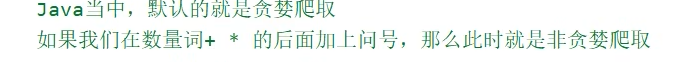

#  正则表达式的书本补充：

**1.**					.oo|eef		变成在.oo和eef里面选择

**2.**  字符类character class是一个括在括号中的可选字符集，eg:	[Jj]、[A-Za-z]

在字符类的内部，**-**	表示一个范围

**3.**  [-]    正则表达式中，如果-是字符类的第一个或者最后一个字符，那么他表示的是他自身-


## 今日内容

* 正则表达式

* 

* \f对应的是换页

  \x0B对应的字符是垂直制表符（Vertical Tab）


## 教学目标  

- [ ] 能够理解正则表达式的作用

# 作用1.

校验字符串是否满足规则

# 作用2.

在一段文本中查找满足要求的内容


- [ ] 能够使用正则表达式的字符类
- [ ] 能够使用正则表达式的逻辑运算符
- [ ] 能够使用正则表达式的预定义字符类
- [ ] 能够使用正则表达式的限定符
- [ ] 能够使用正则表达式的分组
- [ ] 能够在String的split方法中使用正则表达式

**regex正则表达式（regular expression）**

# 正则表达式//可以校验-----字符串-----是否满足一定的规则！！！！

## 1.1 正则表达式的概念及演示

- 在Java中，我们经常需要验证一些字符串，例如：年龄必须是2位的数字、用户名必须是8位长度而且只能包含大小写字母、数字等。正则表达式就是用来验证各种字符串的规则。它内部描述了一些规则，我们可以验证用户输入的字符串是否匹配这个规则。
- 先看一个不使用正则表达式验证的例子：下面的程序让用户输入一个QQ号码，我们要验证：
  - QQ号码必须是5--15位长度
  - 而且必须全部是数字
  - 而且首位不能为0

# 先把异常数据过滤，那么留下的都是满足要求的！！！！ 


```java
package com.itheima.a08regexdemo;

public class RegexDemo1 {
    public static void main(String[] args) {
        /* 假如现在要求校验一个qq号码是否正确。
            规则:6位及20位之内，日不能在开头，必须全部是数字。
            先使用目前所学知识完成校验需求然后体验一下正则表达式检验。
        */

        String qq ="1234567890";
        System.out.println(checkQQ(qq));

        System.out.println(qq.matches("[1-9]\\d{5,19}"));

    }

    public static boolean checkQQ(String qq) {
        //规则:6位及20位之内，日不能在开头，必须全部是数字 。
        //核心思想:
        //先把异常数据进行过滤
        //下面的就是满足要求的数据了。
        int len = qq.length();
        if (len < 6 || len > 20) {
            return false;
        }
        //0不能在开头
        if (qq.startsWith("0")) {
            return false;
        }
        //必须全部是数字
        for (int i = 0; i < qq.length(); i++) {
            char c = qq.charAt(i);
            if (c < '0' | c > '9') {
                return false;
            }
        }
        return true;
    }
}
```


**//注释里面的写法更好，是一层一层去排除筛选的逻辑**

**像正文中那种方式写的话会涉及到if语句的多层嵌套，代码的可读性变差**

//也就是说，一步一步踢除，比一层一层保留或许更好


- 使用正则表达式验证：

```java
public class Demo {
    public static void main(String[] args) {
        String qq ="1234567890";
        System.out.println(qq.matches("[1-9]\\d{5,19}"));
    }
}
```

**我们接下来就重点学习怎样写正则表达式**

## 1.2 正则表达式-字符类


- 语法示例：

  []表示一个范围

1. \[abc\]：代表a或者b，或者c字符中的一个。
2. \[^abc\]：代表**除**a,b,c**以外**的任何字符。**^取反**
3. [a-z]：代表a-z的所有小写字符中的一个。
4. [A-Z]：代表A-Z的所有大写字符中的一个。**<u>*//看好是中划线，不是下划线*</u>**
5. [0-9]：代表0-9之间的某一个数字字符。
6. [a-zA-Z0-9]：代表a-z或者A-Z或者0-9之间的任意一个字符。
7. [a-dm-p]：a 到 d 或 m 到 p之间的任意一个字符。

# 理解：

## 1.**//正则表达式是指字符串从左到右一个一个去匹配的**


从左到右一个一个匹配，如果匹配不成功就是直接false


正则表达式 [bac] 表示的是一个字符集合，它**匹配的是单个字符**，且这个字符必须是 b、a 或 c 中的任意一个。**如果**它需要**匹配的是多个字符**，那么它就不会匹配 "ad" 这样的字符串，直接返回false

改进措施：


//两个字符都要共同matches成功，最后才会返回true

可以像这样写


**前面的字符个数少于后面也是不对，个数一定要匹配**


- 代码示例：

```java
package com.itheima.a08regexdemo;

public class RegexDemo2 {
    public static void main(String[] args) {
        //public boolean matches(String regex):判断是否与正则表达式匹配，匹配返回true
        // 只能是a b c
        System.out.println("-----------1-------------");
        System.out.println("a".matches("[abc]")); // true
        System.out.println("z".matches("[abc]")); // false

        // 不能出现a b c
        System.out.println("-----------2-------------");
        System.out.println("a".matches("[^abc]")); // false
        System.out.println("z".matches("[^abc]")); // true
        System.out.println("zz".matches("[^abc]")); //false
        System.out.println("zz".matches("[^abc][^abc]")); //true

        // a到zA到Z(包括头尾的范围)
        System.out.println("-----------3-------------");
        System.out.println("a".matches("[a-zA-z]")); // true
        System.out.println("z".matches("[a-zA-z]")); // true
        System.out.println("aa".matches("[a-zA-z]"));//false
        System.out.println("zz".matches("[a-zA-Z]")); //false
        System.out.println("zz".matches("[a-zA-Z][a-zA-Z]")); //true
        System.out.println("0".matches("[a-zA-Z]"));//false
        System.out.println("0".matches("[a-zA-Z0-9]"));//true


        // [a-d[m-p]] a到d，或m到p
        System.out.println("-----------4-------------");
        System.out.println("a".matches("[a-d[m-p]]"));//true
        System.out.println("d".matches("[a-d[m-p]]")); //true
        System.out.println("m".matches("[a-d[m-p]]")); //true
        System.out.println("p".matches("[a-d[m-p]]")); //true
        System.out.println("e".matches("[a-d[m-p]]")); //false
        System.out.println("0".matches("[a-d[m-p]]")); //false

        // [a-z&&[def]] a-z和def的交集。为:d，e，f
        System.out.println("----------5------------");
        System.out.println("a".matches("[a-z&[def]]")); //false
        System.out.println("d".matches("[a-z&&[def]]")); //true
        System.out.println("0".matches("[a-z&&[def]]")); //false

        // [a-z&&[^bc]] a-z和非bc的交集。(等同于[ad-z])
        System.out.println("-----------6------------_");
        System.out.println("a".matches("[a-z&&[^bc]]"));//true
        System.out.println("b".matches("[a-z&&[^bc]]")); //false
        System.out.println("0".matches("[a-z&&[^bc]]")); //false

        // [a-z&&[^m-p]] a到z和除了m到p的交集。(等同于[a-1q-z])
        System.out.println("-----------7-------------");
        System.out.println("a".matches("[a-z&&[^m-p]]")); //true
        System.out.println("m".matches("[a-z&&[^m-p]]")); //false
        System.out.println("0".matches("[a-z&&[^m-p]]")); //false

    }
}

```

## 1.3 正则表达式-逻辑运算符

正则表达式中，**&只是一个简单的字符符号，没有什么含义**，&&才表示**且**

- 语法示例：
  1. &&：并且
  
  2. |    ：或者
  
  3. \  ：转义字符
  
     ### **<u>*逻辑运算符 是把它左边所有的当成一个整体，右边所有的当成一个整体去看（直到再次遇到逻辑运算符），所以要适当地加括号()或者[]*</u>**
- 代码示例：

```java
public class Demo {
	public static void main(String[] args) {
		String str = "had";
		
		//1.要求字符串是小写辅音字符开头，后跟ad
		String regex = "[a-z&&[^aeiou]]ad";
		System.out.println("1." + str.matches(regex));//1.true
		
		//2.要求字符串是aeiou中的某个字符开头，后跟ad
		regex = "[a|e|i|o|u]ad";//这种写法相当于：regex = "[aeiou]ad";
		System.out.println("2." + str.matches(regex));
	}//2.false
}

```

```java
package com.itheima.a08regexdemo;

public class RegexDemo3 {
    public static void main(String[] args) {
        // \ 转义字符 改变后面那个字符原本的含义
        //练习:以字符串的形式打印一个双引号
        //"在Java中表示字符串的开头或者结尾

        //此时\表示转义字符，改变了后面那个双引号原本的含义
        //把他变成了一个普普通通的双引号而已。
        System.out.println("\"");

        // \表示转义字符
        //两个\的理解方式：前面的\是一个转义字符，改变了后面\原本的含义，把他变成一个普普通通的\而已。
        System.out.println("c:Users\\moon\\IdeaProjects\\basic-code\\myapi\\src\\com\\itheima\\a08regexdemo\\RegexDemo1.java");


    }
}

```


## 1.4 正则表达式-预定义字符

- 语法示例：
- 
  1. "." ： 匹配任何字符。**//只要是字符都行：<u>*空格*</u>、字母、<u>*中文*</u>、数字**（除了换行符）
  
  2. "\d"：任何数字[0-9]的简写；
  
  3. "\D"：任何非数字\[^0-9\]的简写；
  
  4. "\s"： 空白字符：[ \t\n\x0B\f\r] 的简写
  
  5. "\S"： 非空白字符：\[^\s\] 的简写
  
  6. "\w"：单词字符：[a-zA-Z_0-9]的简写
  
  7. "\W"：非单词字符：\[^\w\]
  
     
  
     
  
     
  
     
  
     # **<u>\\\可以理解为一个\</u>**


# 特例记忆例子：如果只是单纯的想表示.这一个点，要用"\\\\\.",而不是用"\\."

# 转义字符的理解拓展


"""三个双引号，第一个——字符串的开头；第二个——字符串的结尾；第三个——字符串的开头，如果这样写的话第三个双引号后面所有代码都是字符串的内容，没有结束会报错

第二个本来在Windows操作系统中

D:\LLLLLLLLLLLLLLLLLLLLLLLLLLLLLLLLLLLLLLLLearning_inPerson

路径使用单反斜线，但是由于\是转义字符，在字符串里只用一个的话会转义他后面紧邻的字母，不能这样，所以前面再用一个\去把\转义


# **<u>*\改变后面字符的意思*</u>**。记住这句话就行

- # 代码示例：

```java
public class Demo {
	public static void main(String[] args) {
        //.表示任意一个字符
        System.out.println("你".matches("..")); //false
        System.out.println("你".matches(".")); //true
        System.out.println("你a".matches(".."));//true

        // \\d 表示任意的一个数字
        // \\d只能是任意的一位数字
        // 简单来记:两个\表示一个\
        System.out.println("a".matches("\\d")); // false
        System.out.println("3".matches("\\d")); // true
        System.out.println("333".matches("\\d")); // false

        //\\w只能是一位单词字符[a-zA-Z_0-9]
        System.out.println("z".matches("\\w")); // true
        System.out.println("2".matches("\\w")); // true
        System.out.println("21".matches("\\w")); // false
        System.out.println("你".matches("\\w"));//false

        // 非单词字符
        System.out.println("你".matches("\\W")); // true
        System.out.println("---------------------------------------------");
        // 以上正则匹配只能校验单个字符。


        // 必须是数字 字母 下划线 至少 6位
        System.out.println("2442fsfsf".matches("\\w{6,}"));//true
        System.out.println("244f".matches("\\w{6,}"));//false

        // 必须是数字和字符 必须是4位
        System.out.println("23dF".matches("[a-zA-Z0-9]{4}"));//true
        System.out.println("23 F".matches("[a-zA-Z0-9]{4}"));//false
        System.out.println("23dF".matches("[\\w&&[^_]]{4}"));//true
        System.out.println("23_F".matches("[\\w&&[^_]]{4}"));//false
		
	}
}
```

## 1.5 正则表达式-数量词

- 语法示例：
  1. X? : 0次或1次
  
  2. X* : 0次到多次
  
  3. X+ : 1次或多次
  
  4. X{n} : 恰好n次
  
  5. X{n,} : 至少n次
  
  6. -写在[]是表示区间范围到，写在[]外面是代表-它本身
  
  7. X{n,m}: n到m次(n和m都是包含的)
  
     **<u>*//上面的n,m不是下标，是第几个数字*</u>**
- 代码示例：

```java
public class Demo {
	public static void main(String[] args) {
		 // 必须是数字 字母 下划线 至少 6位
        System.out.println("2442fsfsf".matches("\\w{6,}"));//true
        System.out.println("244f".matches("\\w{6,}"));//false

        // 必须是数字和字符 必须是4位
        System.out.println("23dF".matches("[a-zA-Z0-9]{4}"));//true
        System.out.println("23 F".matches("[a-zA-Z0-9]{4}"));//false
        System.out.println("23dF".matches("[\\w&&[^_]]{4}"));//true
        System.out.println("23_F".matches("[\\w&&[^_]]{4}"));//false
	}
}

```

## API帮助文档可以直接搜pattern去查看正则表达式的相关规则


## 1.6 正则表达式练习1

需求：

​	请编写正则表达式验证用户输入的手机号码是否满足要求。

​	请编写正则表达式验证用户输入的邮箱号是否满足要求。

​	请编写正则表达式验证用户输入的电话号码是否满足要求。

​	验证手机号码 13112345678 13712345667 13945679027 139456790271

​	验证座机电话号码 020-2324242 02122442 027-42424 0712-3242434

​	验证邮箱号码 3232323@qq.com zhangsan@itcast.cnn dlei0009@163.com dlei0009@pci.com.cn

代码示例：

```java
package com.itheima.a08regexdemo;

public class RegexDemo4 {
    public static void main(String[] args) {
        /*
            需求
            请编写正则表达式验证用户输入的手机号码是否满足要求。请编写正则表达式验证用户输入的邮箱号是否满足要求。请编写正则表达式验证用户输入的电话号码是否满足要求。
            验证手机号码 13112345678 13712345667 13945679027 139456790271
            验证座机电话号码 020-2324242 02122442 027-42424 0712-3242434
            验证邮箱号码 3232323@qq.com zhangsan@itcast.cnn dlei0009@163.com dlei0009@pci.com.cn
        */

        //心得:
        //拿着一个正确的数据，从左到右依次去写。
        //13112345678
        //分成三部分:
        //第一部分:1 表示手机号码只能以1开头
        //第二部分:[3-9] 表示手机号码第二位只能是3-9之间的
        //第三部分:\\d{9} 表示任意数字可以出现9次，也只能出现9次
        String regex1 = "1[3-9]\\d{9}";
        System.out.println("13112345678".matches(regex1));//true
        System.out.println("13712345667".matches(regex1));//true
        System.out.println("13945679027".matches(regex1));//true
        System.out.println("139456790271".matches(regex1));//false
        System.out.println("-----------------------------------");

        //座机电话号码
        //020-2324242 02122442 027-42424 0712-3242434
        //思路:
        //在书写座机号正则的时候需要把正确的数据分为三部分
        //一:区号@\\d{2,3}
        //      0:表示区号一定是以0开头的
        //      \\d{2,3}:表示区号从第二位开始可以是任意的数字，可以出现2到3次。
        //二:- ?表示次数，0次或一次
        //三:号码 号码的第一位也不能以0开头，从第二位开始可以是任意的数字，号码的总长度:5-10位
        String regex2 = "0\\d{2,3}-?[1-9]\\d{4,9}";
        System.out.println("020-2324242".matches(regex2));
        System.out.println("02122442".matches(regex2));
        System.out.println("027-42424".matches(regex2));
        System.out.println("0712-3242434".matches(regex2));

        //邮箱号码
        //3232323@qq.com zhangsan@itcast.cnn dlei0009@163.com dlei0009@pci.com.cn
        //思路:
        //在书写邮箱号码正则的时候需要把正确的数据分为三部分
        //第一部分:@的左边 \\w+
        //      任意的字母数字下划线，至少出现一次就可以了
        //第二部分:@ 只能出现一次
        //第三部分:
        //      3.1         .的左边[\\w&&[^_]]{2,6}
        //                  任意的字母加数字，总共出现2-6次(此时不能出现下划线)
        //      3.2         . \\.
        //      3.3         大写字母，小写字母都可以，只能出现2-3次[a-zA-Z]{2,3}
        //      我们可以把3.2和3.3看成一组，这一组可以出现1次或者两次
        String regex3 = "\\w+@[\\w&&[^_]]{2,6}(\\.[a-zA-Z]{2,3}){1,2}";//表示次数的这个指的是他前面的这一个的次数（不是前面的所有）！！！！！！！！！！！！！！！！！！！！！！！！！！！！！！！！！！！！！！！！！！！！！！！！！！！！！！！！！！！！！！！！！！！！！！！！！！！！！！！！！！！！！！！！！！！！！！！！！！！！！！！！！！！！！！！！！！！！！！！！！！！！！！！！！！！！！！！！！！！！！！！！！！！！！！！！！！！！！！！！！！！！！！！！！！！！！！！！！！！！！！！！！！！！！！！！！！！！！！！！！！！！！！！！！！！！！！！！！！！！！！！！！！！！！！！！！！！！！！！！！！！！！！！！！！！！！！！！！！！！！！！！！！！！！！！！！！！！！！！！！！！！！！！！！！！！！！！！！！！！！！！！！！！！！！！！！！！！！！！！！！
        System.out.println("3232323@qq.com".matches(regex3));
        System.out.println("zhangsan@itcast.cnn".matches(regex3));
        System.out.println("dlei0009@163.com".matches(regex3));
        System.out.println("dlei0009@pci.com.cn".matches(regex3));


        //24小时的正则表达式
        String regex4 = "([01]\\d|2[0-3]):[0-5]\\d:[0-5]\\d";
        System.out.println("23:11:11".matches(regex4));

        String regex5 = "([01]\\d 2[0-3])(:[0-5]\\d){2}";
        System.out.println("23:11:11".matches(regex5));
    }
}

```

## 1.7 正则表达式练习2

# 1.拆分成几个部分2.每个部分写出相应的正则表达式(有逻辑符号的话记得要打括号//为了防止有的部分有|导致最后结果混乱)3.拼接

(10)||(11)||(12) 可以用来表示 10,11，12月

需求
	请编写正则表达式验证用户名是否满足要求。要求:大小写字母，数字，下划线一共4-16位
	请编写正则表达式验证身份证号码是否满足要求。
	简单要求:
    		18位，前17位任意数字，最后一位可以是数字可以是大写或小写的x
	复杂要求:
    		按照身份证号码的格式严格要求。

​	身份证号码:
​		41080119930228457x
​		510801197609022309
​		15040119810705387X
​		130133197204039024 
​		430102197606046442

代码示例：

```java
public class RegexDemo5 {
    public static void main(String[] args) {
        /*
            正则表达式练习:
            需求
            请编写正则表达式验证用户名是否满足要求。要求:大小写字母，数字，下划线一共4-16位
            请编写正则表达式验证身份证号码是否满足要求。
            简单要求:
                18位，前17位任意数字，最后一位可以是数字可以是大写或小写的x
            复杂要求:
                按照身份证号码的格式严格要求。

            身份证号码:
            41080119930228457x
            510801197609022309
            15040119810705387X
            130133197204039024 I
            430102197606046442
        */

        //用户名要求:大小写字母，数字，下划线一共4-16位
        String regex1 = "\\w{4,16}";
        System.out.println("zhangsan".matches(regex1));
        System.out.println("lisi".matches(regex1));
        System.out.println("wangwu".matches(regex1));
        System.out.println("$123".matches(regex1));


        //身份证号码的简单校验:
        //18位，前17位任意数字，最后一位可以是数字可以是大写或小写的x
        String regex2 = "[1-9]\\d{16}(\\d|x|x)";
        String regex3 = "[1-9]\\d{16}[\\dXx]";
        String regex5 = "[1-9]\\d{16}(\\d(?i)x)";

        System.out.println("41080119930228457x".matches(regex3));
        System.out.println("510801197609022309".matches(regex3));
        System.out.println("15040119810705387X".matches(regex3));
        System.out.println("130133197204039024".matches(regex3));
        System.out.println("430102197606046442".matches(regex3));


        //忽略大小写的书写方式
        //在匹配的时候忽略abc的大小写
        String regex4 = "a((?i)b)c";
        System.out.println("------------------------------");
        System.out.println("abc".matches(regex4));//true
        System.out.println("ABC".matches(regex4));//false
        System.out.println("aBc".matches(regex4));//true


        //身份证号码的严格校验
        //编写正则的小心得:
        //第一步:按照正确的数据进行拆分
        //第二步:找每一部分的规律，并编写正则表达式
        //第三步:把每一部分的正则拼接在一起，就是最终的结果
        //书写的时候:从左到右去书写。

        //410801 1993 02 28 457x
        //前面6位:省份，市区，派出所等信息，第一位不能是0，后面5位是任意数字       [1-9]\\d{5}
        //年的前半段: 18 19 20                                                (18|19|20)
        //年的后半段: 任意数字出现两次                                           \\d{2}
        //月份: 01~ 09 10 11 12                                               (@[1-9]|1[0-2])
        //日期: 01~09 10~19 20~29 30 31                                       (0[1-9]|[12]\\d|3[01])
        //后面四位: 任意数字出现3次 最后一位可以是数字也可以是大写x或者小写x        \\d{3}[\\dXx]
        String regex6 = "[1-9]\\d{5}(18|19|20)\\d{2}(@[1-9]|1[0-2])(@[1-9]|[12]\\d|3[01])\\d{3}[\\dxXx]";

        System.out.println("41080119930228457x".matches(regex6));
        System.out.println("510801197609022309".matches(regex6));
        System.out.println("15040119810705387X".matches(regex6));
        System.out.println("130133197204039024".matches(regex6));
        System.out.println("430102197606046442".matches(regex6));


    }
}

```

# 1.(?i)忽略大小写

1.

忽略B的大小写

2.


忽略bc的大小写

3.

**<u>*忽略后面的所有数据的大小写*</u>**

即忽略abc的大小写


# 2.以后可以借助插件any-rule，里面有合适的常用的一些插件


可以做一些合适的修改：
^表示从最开始读取，$表示一直读取到末尾，

所以删除^和$

因为matches本来就是表示从头匹配到尾的

把\改成\\\


#### 相当于下面这个：**<u>*（）相当于一整个组*</u>**


## 1.8 本地数据爬取

## **Pattern类**：表示正则表达式

//他的对象不能直接new，是通过静态方法获取的

Pattern.compile("正则表达式");

方法返回这个正则表达式的对象


Matcher类的group()方法用于获取匹配的子字符串。在调用group()方法之前，通常需要先调用find()方法来查找匹配项。find()方法会尝试在输入字符串中查找与正则表达式匹配的下一个子串，并返回一个布尔值表示是否找到了匹配。
如果你直接调用group()方法而没有先调用find()方法，那么会抛出java.lang.IllegalStateException，因为group()方法需要一个匹配的结果才能返回子字符串。

### **Matcher类**：文本匹配器，作用按照正则表达式的规则去读取字符串，从头开始读取。

两个成员方法：

 int start()

int end()

返回的索引和find（）后记录的索引一样，即end()返回的索引是	**匹配字符最后一位字符对应的索引+1**

​         	在大串中去找符合匹配规则的子串。

代码示例：

```java
package com.itheima.a08regexdemo;

import java.util.regex.Matcher;
import java.util.regex.Pattern;

public class RegexDemo6 {
    public static void main(String[] args) {
        /* 有如下文本，请按照要求爬取数据。
                Java自从95年问世以来，经历了很多版本，目前企业中用的最多的是Java8和Java11，
                因为这两个是长期支持版本，下一个长期支持版本是Java17，相信在未来不久Java17也会逐渐登上历史舞台
                要求:找出里面所有的JavaXX
         */

        String str = "Java自从95年问世以来，经历了很多版本，目前企业中用的最多的是Java8和Java11，" +
                "因为这两个是长期支持版本，下一个长期支持版本是Java17，相信在未来不久Java17也会逐渐登上历史舞台";


        //1.获取正则表达式的对象
        Pattern p = Pattern.compile("Java\\d{0,2}");
        //2.获取文本匹配器的对象
        //拿着m去读取str，找符合p规则的子串
        Matcher m = p.matcher(str);

        //3.利用循环获取
        while (m.find()) {
            String s = m.group();
            System.out.println(s);
        }


    }

    private static void method1(String str) {
        //Pattern:表示正则表达式
        //Matcher: 文本匹配器，作用按照正则表达式的规则去读取字符串，从头开始读取。
        //          在大串中去找符合匹配规则的子串。

        //获取正则表达式的对象
        Pattern p = Pattern.compile("Java\\d{0,2}");
        //获取文本匹配器的对象
        //m:文本匹配器的对象
        //str:大串
        //p:规则
        //m要在str中找符合p规则的小串
        Matcher m = p.matcher(str);

        //拿着文本匹配器从头开始读取，寻找是否有满足规则的子串
        //如果没有，方法返回false
        //如果有，返回true。在底层记录子串的起始索引和结束索引+1
        // 0,4
        boolean b = m.find();

        //方法底层会根据find方法记录的索引进行字符串的截取
        // substring(起始索引，结束索引);包头不包尾
        // (0,4)但是不包含4索引
        // 会把截取的小串进行返回。
        String s1 = m.group();
        System.out.println(s1);


        //第二次在调用find的时候，会继续读取后面的内容
        //读取到第二个满足要求的子串，方法会继续返回true
        //并把第二个子串的起始索引和结束索引+1，进行记录
        b = m.find();

        //第二次调用group方法的时候，会根据find方法记录的索引再次截取子串
        String s2 = m.group();
        System.out.println(s2);
    }
}
```

## 1.9 网络数据爬取（了解）

需求：

​	把连接:https://m.sengzan.com/jiaoyu/29104.html?ivk sa=1025883i中所有的身份证号码都爬取出来。

代码示例：

```java
public class RegexDemo7 {
    public static void main(String[] args) throws IOException {
        /* 扩展需求2:
            把连接:https://m.sengzan.com/jiaoyu/29104.html?ivk sa=1025883i
            中所有的身份证号码都爬取出来。
        */

        //创建一个URL对象
        URL url = new URL("https://m.sengzan.com/jiaoyu/29104.html?ivk sa=1025883i");
        //连接上这个网址
        //细节:保证网络是畅通
        URLConnection conn = url.openConnection();//创建一个对象去读取网络中的数据
        BufferedReader br = new BufferedReader(new InputStreamReader(conn.getInputStream()));
        String line;
        //获取正则表达式的对象pattern
        String regex = "[1-9]\\d{17}";
        Pattern pattern = Pattern.compile(regex);//在读取的时候每次读一整行
        while ((line = br.readLine()) != null) {
            //拿着文本匹配器的对象matcher按照pattern的规则去读取当前的这一行信息
            Matcher matcher = pattern.matcher(line);
            while (matcher.find()) {
                System.out.println(matcher.group());
            }
        }
        br.close();
    }
}

```

## 1.10 爬取数据练习

### **<u>*核心：只要这段文本满足这四个表达式之一就可以进行爬取*</u>**

需求：

​	把下面文本中的座机电话，邮箱，手机号，热线都爬取出来。

来黑马程序员学习Java，手机号:18512516758，18512508907或者联系邮箱:boniu@itcast.cn，座机电话:01036517895，010-98951256邮箱:bozai@itcast.cn，热线电话:400-618-9090 ，400-618-4000，4006184000，4006189090手机号的正则表达式:1[3-9]\d{9}

代码示例：

```java
package com.itheima.a08regexdemo;

import java.util.regex.Matcher;
import java.util.regex.Pattern;

public class RegexDemo8 {
    public static void main(String[] args) {
        /*
            需求:把下面文本中的座机电话，邮箱，手机号，热线都爬取出来。
            来黑马程序员学习Java，
            手机号:18512516758，18512508907或者联系邮箱:boniu@itcast.cn，
            座机电话:01036517895，010-98951256邮箱:bozai@itcast.cn，
            热线电话:400-618-9090 ，400-618-4000，4006184000，4006189090

            手机号的正则表达式:1[3-9]\d{9}
            邮箱的正则表达式:\w+@[\w&&[^_]]{2,6}(\.[a-zA-Z]{2,3}){1,2}座机电话的正则表达式:θ\d{2,3}-?[1-9]\d{4,9}
            热线电话的正则表达式:400-?[1-9]\\d{2}-?[1-9]\\d{3}

        */

        String s = "来黑马程序员学习Java，" +
                "电话:18512516758，18512508907" + "或者联系邮箱:boniu@itcast.cn，" +
                "座机电话:01036517895，010-98951256" + "邮箱:bozai@itcast.cn，" +
                "热线电话:400-618-9090 ，400-618-4000，4006184000，4006189090";

        System.out.println("400-618-9090");

        String regex = "(1[3-9]\\d{9})|(\\w+@[\\w&&[^_]]{2,6}(\\.[a-zA-Z]{2,3}){1,2})" +
                "|(0\\d{2,3}-?[1-9]\\d{4,9})" +
                "(400-?[1-9]\\d{2}-?[1-9]\\d{3})";

        //1.获取正则表达式的对象
        Pattern p = Pattern.compile(regex);

        //2.获取文本匹配器的对象
        //利用m去读取s，会按照p的规则找里面的小串
        Matcher m = p.matcher(s);
        //3.利用循环获取每一个数据 while(m.find()){
        String str = m.group();
        System.out.println(str);

    }
}
```

## 1.11 按要求爬取

# 1？=


# 2.？：


？依旧是代表前面的所有字符

：是代表获取所有（前面后面一起）

//regex2和regex3等价

# 3.？！


？代表前面的所有字符，但是只要他后面接的是！以后的内容，则满足这个正则表达式的整个（包括左边右边）字符子串不会被爬取，

否则（只满足左边，不满足右边），爬取（?!）左边满足的字符串//在这里是Java 


需求：

​	有如下文本，按要求爬取数据。   

​	 Java自从95年问世以来，经历了很多版本，目前企业中用的最多的是Java8和Java11，因为这两个是长期支持版本，下一个长期支持版本是Java17，相信在未来不久Java17也会逐渐登上历史舞台。

需求1：

​	爬取版本号为8，11.17的Java文本，但是只要Java，不显示版本号。

需求2：

​	爬取版本号为8，11，17的Java文本。正确爬取结果为：Java8 Java11 Java17 Java17

需求3：

​	爬取除了版本号为8，11，17的Java文本。
代码示例：

```java
public class RegexDemo9 {
    public static void main(String[] args) {
        /*
            有如下文本，按要求爬取数据。
                Java自从95年问世以来，经历了很多版本，目前企业中用的最多的是Java8和Java11，
                因为这两个是长期支持版本，下一个长期支持版本是Java17，相信在未来不久Java17也会逐渐登上历史舞台


            需求1:爬取版本号为8，11.17的Java文本，但是只要Java，不显示版本号。
            需求2:爬取版本号为8，11，17的Java文本。正确爬取结果为:Java8 Java11 Java17 Java17
            需求3:爬取除了版本号为8，11.17的Java文本，
        */
        String s = "Java自从95年问世以来，经历了很多版本，目前企业中用的最多的是Java8和Java11，" +
            "因为这两个是长期支持版本，下一个长期支持版本是Java17，相信在未来不久Java17也会逐渐登上历史舞台";

        //1.定义正则表达式
        //?理解为前面的数据Java
        //=表示在Java后面要跟随的数据
        //但是在获取的时候，只获取前半部分
        //需求1:
        String regex1 = "((?i)Java)(?=8|11|17)";
        //需求2:
        String regex2 = "((?i)Java)(8|11|17)";
        String regex3 = "((?i)Java)(?:8|11|17)";
        //需求3:
        String regex4 = "((?i)Java)(?!8|11|17)";

        Pattern p = Pattern.compile(regex4);
        Matcher m = p.matcher(s);
        while (m.find()) {
            System.out.println(m.group());
        }
    }
}

```

## 1.12 贪婪爬取和非贪婪爬取

```java
只写+和*表示贪婪匹配，如果在+和*后面加问号表示非贪婪爬取
+? 非贪婪匹配
*? 非贪婪匹配
贪婪爬取:在爬取数据的时候尽可能的多获取数据
非贪婪爬取:在爬取数据的时候尽可能的少获取数据

举例：
如果获取数据：ab+
贪婪爬取获取结果:abbbbbbbbbbbb
非贪婪爬取获取结果:ab
```



#### 关于*？的非贪婪爬取的一些小细节：

如果有多个 b 可供匹配，ab*? 只会匹配一个 b。
因此，ab*? 可以匹配的字符串包括：
a
ab
abbbbbb（但只匹配到 ab）
所以，如果你使用 ab*? 进行爬取，结果可能是 a 或者 ab，具体取决于你要爬取的文本中是否包含 b。如果文本中没有 b，那么结果就是 a；如果文本中有 b，那么结果就是 ab。

代码示例：

```java
public class RegexDemo10 {
    public static void main(String[] args) {
        /*
            只写+和*表示贪婪匹配

            +? 非贪婪匹配
            *? 非贪婪匹配

            贪婪爬取:在爬取数据的时候尽可能的多获取数据
            非贪婪爬取:在爬取数据的时候尽可能的少获取数据

            ab+:
            贪婪爬取:abbbbbbbbbbbb
            非贪婪爬取:ab
        */
        String s = "Java自从95年问世以来，abbbbbbbbbbbbaaaaaaaaaaaaaaaaaa" +
                "经历了很多版木，目前企业中用的最多的是]ava8和]ava11，因为这两个是长期支持版木。" +
                "下一个长期支持版本是Java17，相信在未来不久Java17也会逐渐登上历史舞台";

        String regex = "ab+";
        Pattern p = Pattern.compile(regex);
        Matcher m = p.matcher(s);

        while (m.find()) {
            System.out.println(m.group());
        }


    }
}

```

# 1.1 正则表达式在字符串里的用法

# **<u>*this是表示方法调用者的地址值*</u>**


matches的返回值只能是boolean,这个图写错了

## 1.13 String的split方法中使用正则表达式


切割完之后分别把这几个片段返回的String数组里面

- String类的split()方法原型：

  ```java
  public String[] split(String regex)
  //参数regex表示正则表达式。可以将当前字符串中匹配regex正则表达式的符号作为"分隔符"来切割字符串。
  ```

- 代码示例：

- 

```java
/*
            有一段字符串:小诗诗dqwefqwfqwfwq12312小丹丹dqwefqwfqwfwq12312小惠惠
            要求1:把字符串中三个姓名之间的字母替换为vs
            要求2:把字符串中的三个姓名切割出来*/

String s = "小诗诗dqwefqwfqwfwq12312小丹丹dqwefqwfqwfwq12312小惠惠";
//细节:
//方法在底层跟之前一样也会创建文本解析器的对象
//然后从头开始去读取字符串中的内容，只要有满足的，那么就切割。
String[] arr = s.split("[\\w&&[^_]]+");
for (int i = 0; i < arr.length; i++) {
    System.out.println(arr[i]);
}
```

## 1.14 String类的replaceAll方法中使用正则表达式//return字符串数组

<u>*这个是替换生成返回了新的字符串，原字符串不会发生改变☆☆☆☆☆☆☆☆☆☆☆☆☆☆☆☆☆☆☆☆☆☆☆☆☆☆☆*</u>

### **<u>*在JAVA中有个规律，如果一个方法的形参是叫regex,那么这个方法就一定识别正则表达式，如果不是的的话，一般不能识别的，只会被当成普通的字符串*</u>**


- String类的replaceAll()方法原型：
- 注意形参的类型：正则表达式是String类型的 
- 所以用它处理字符串的时候不用Pattern对象，和matcher文字处理器//**<u>*matcher是一次一次的处理，String是一次性整体处理完*</u>**（区别）

```java
public String replaceAll(String regex,String newStr)
//参数regex表示一个正则表达式。可以将当前字符串中匹配regex正则表达式的字符串替换为newStr。
```

- 代码示例：

```java
/*
            有一段字符串:小诗诗dqwefqwfqwfwq12312小丹丹dqwefqwfqwfwq12312小惠惠
            要求1:把字符串中三个姓名之间的字母替换为vs
            要求2:把字符串中的三个姓名切割出来*/

String s = "小诗诗dqwefqwfqwfwq12312小丹丹dqwefqwfqwfwq12312小惠惠";
//细节:
//方法在底层跟之前一样也会创建文本解析器的对象
//然后从头开始去读取字符串中的内容，只要有满足的，那么就用第一个参数去替换。
String result1 = s.replaceAll("[\\w&&[^_]]+", "vs");
System.out.println(result1);
```

## 1.15 正则表达式-分组括号( )

**细节：如何识别组号？**

**只看左括号，不看右括号，按照左括号的顺序，从左往右，依次为第一组，第二组，第三组等等**

```java
//需求1:判断一个字符串的开始字符和结束字符是否一致?只考虑一个字符
//举例: a123a b456b 17891 &abc& a123b(false)
// \\组号:表示把第X组的内容再出来用一次
String regex1 = "(.).+\\1";
System.out.println("a123a".matches(regex1));
System.out.println("b456b".matches(regex1));
System.out.println("17891".matches(regex1));
System.out.println("&abc&".matches(regex1));
System.out.println("a123b".matches(regex1));
System.out.println("--------------------------");


//需求2:判断一个字符串的开始部分和结束部分是否一致?可以有多个字符
//举例: abc123abc b456b 123789123 &!@abc&!@ abc123abd(false)
String regex2 = "(.+).+\\1";
System.out.println("abc123abc".matches(regex2));
System.out.println("b456b".matches(regex2));
System.out.println("123789123".matches(regex2));
System.out.println("&!@abc&!@".matches(regex2));
System.out.println("abc123abd".matches(regex2));
System.out.println("---------------------");

//需求3:判断一个字符串的开始部分和结束部分是否一致?开始部分内部每个字符也需要一致
//举例: aaa123aaa bbb456bbb 111789111 &&abc&&
//(.):把首字母看做一组
// \\2:把首字母拿出来再次使用
// *:作用于\\2,表示后面重复的内容出现0次或多次
String regex3 = "((.)\\2*).+\\1";
System.out.println("aaa123aaa".matches(regex3));
System.out.println("bbb456bbb".matches(regex3));
System.out.println("111789111".matches(regex3));
System.out.println("&&abc&&".matches(regex3));
System.out.println("aaa123aab".matches(regex3));
```

## 1.16 分组练习


*<u>**看图中说的以左括号为基准，从左到右**</u>*

*<u>**所以框起来蓝色的那组为第二组**</u>*


需求:

​    将字符串：我要学学编编编编程程程程程程。

​    替换为：我要学编程

**\\\1表示把第一组的数据拿出来再用一次**


以后当看到“**一致**”，就要用上面这种写法，把某一小段正则表达式看成一组，**再用一次**这组，如果要用多次可以用次数修饰符修饰


现在这个正则表达式是实现了aaa,bbb,111,&&这种连续的


后面还需要用分组实现的话，组数会发生改变，记得改成合适的组数


replace不识别正则表达式


```java
String str = "我要学学编编编编程程程程程程";

//需求:把重复的内容 替换为 单个的
//学学                学
//编编编编            编
//程程程程程程        程
//  (.)表示把重复内容的第一个字符看做一组
//  \\1表示第一字符再次出现
//  + 至少一次
//  $1 表示把正则表达式中第一组的内容，再拿出来用
String result = str.replaceAll("(.)\\1+", "$1");
System.out.println(result);
```

```
这里的"(.)\\1+"记得与上面的“((.)\\2*).+\\1”区分开，前者是用在replaceAll里面只要部分字符子串满足了这个格式都能算，但是后者描述的是一整个字符串
```

## 1.17 忽略大小写的写法

```java
//(?i) ：表示忽略后面数据的大小写
//忽略abc的大小写
String regex = "(?i)abc";
//a需要一模一样，忽略bc的大小写
String regex = "a(?i)bc";
//ac需要一模一样，忽略b的大小写
String regex = "a((?i)b)c";
```

## 1.18 非捕获分组


非捕获分组：分组之后不需要再用本组数据，仅仅是把数据括起来。


```java
//身份证号码的简易正则表达式
//非捕获分组:仅仅是把数据括起来
//特点:不占用组号
//这里\\1报错原因:(?:)就是非捕获分组，此时是不占用组号的。


//(?:) (?=) (?!)都是非捕获分组//更多的使用第一个
//String regex1 ="[1-9]\\d{16}(?:\\d|x|x)\\1";
String regex2 ="[1-9]\\d{16}(\\d Xx)\\1";
//^([01]\d|2[0-3]):[0-5]\d:[@-5]\d$

System.out.println("41080119930228457x".matches(regex2));
```


## 1.19 正则表达式练习

```java
手机号码:1[3-9]\\d{9}
座机号码：0\\d{2,3}-?[1-9]\\d{4,9}
邮箱号码：\\w+@[\\w&&[^_]]{2,6}(\\.[a-zA-Z]{2,3}){1,2}
24小时：([01]\\d|2[0-3]):[0-5]\\d:[0-5]\\d
	   ([01]\\d|2[0-3])(:[0-5]\\d){2}
用户名:	\\w{4,16}
身份证号码，简单校验：
		[1-9]\\d{16}(\\d|X|x)
		[1-9]\\d{16}[\\dXx]
		[1-9]\\d{16}(\\d(?i)X)
身份证号码，严格校验：
		[1-9]\\d{5}(18|19|20)\\d{2}(0[1-9]|1[0-2])(0[1-9|[12])\\d|3[01])\\d{3}[\\dXx]
```


# ☆☆☆☆☆☆☆☆☆☆☆☆☆☆☆☆☆☆☆补充：String对象.split()的原理机制

1.原理：

String.split() 方法在 Java 中是通过正则表达式来实现字符串分割的。具体来说，它使用了一个 **Pattern 对象**和一个 **Matcher 对象**来处理正则表达式，并根据匹配的结果来分割字符串。
**以下是 String.split() 方法的实现原理：**
**1.编译正则表达式:**当调用 split() 方法时，它会将传入的正则表达式参数编译成一个 Pattern 对象。
**2.创建 Matcher 对象：**然后，它会使用这个 Pattern 对象创建一个 Matcher 对象，并将需要分割的字符串作为参数传递给 Matcher 对象。
**3.查找匹配：**Matcher 对象会在字符串中查找与正则表达式匹配的部分。
**4.分割字符串：**每**当找到一个匹配**时（结合之前学的，Matcher对象调用find()时，会记录字符串中符合正则表达式的片段的**起始位置**和**末尾位置**（**也就是结束位置+1**）），split() 方法就会在该匹配的位置将字符串分割成两部分，并**将前一部分添加到结果数组中**。

//1.**<u>*如果已经是最后一次分割，那么剩余的字符串也会被存储到字符串数组里面*</u>**

//2.分割时的方法：从字符串的**开始**到**起始位置前（即起始位置-1）**的字符串为一个**子串a**，并**存入到字符数组里面**；

从**末尾位置（也就是结束位置+1）**到字符串**结尾**作为一个**新的子串b**重复3,4步骤，直Matcher对象.find()为false时，把<u>*右边的所有字符串也存到数组中*</u>，结束


/***以上过程简单理解，就是符合正则表达式的部分作为小刀，前面的都存到字符串数组里面，后面的继续找，如果找的时候没有字符了，那么传递的是空字符串“”，不是nul**l*/


**5.重复步骤 3 和 4：**Matcher 对象会继续在剩余的字符串中查找匹配，并重复分割过程，直到字符串的末尾。
返回结果：最终，split() 方法会返回一个包含所有分割后子字符串的数组。


注意：

**split(String regex**)//其实**默认**是下面这个方法重载的**limit=0**时候

split函数还有另一种重载方式 ：**public String [] split (String  regex, int limit)** ，看下说明limit 参数控制模式应用的次数，因此影响所得数组的长度。

1、如果 **n > 0**，代表分割字符串后数组的最大长度，则模式将被最多应用 n  - 1 次，数组的长度将不会大于 n ，而且数组的最后一项将包含所有超出最后匹配的定界符的输入。（**则最多应用n-1次模式，数组的长度将不大于n，并且数组的最后一个条目将包含最后匹配分隔符之外的所有输入**）

2、如果 **n <0**，代表获取数组所有值，不会丢弃末尾空值（**不删除最后一个空字符**），那么模式将被应用尽可能多的次数，而且数组可以是任何长度。

3、如果 **n == 0**，那么模式将被应用尽可能多的次数，数组可以是任何长度，并且结尾空字符串将被丢弃。（**数组可能为任意长度，数组最后的空字符串将会被抛弃**）


例子：

如果limit=1,那么就是这一整个字符串直接存到字符数组里（不用进行分割）


