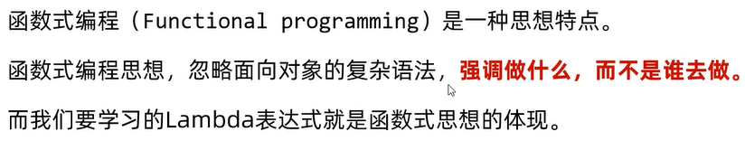
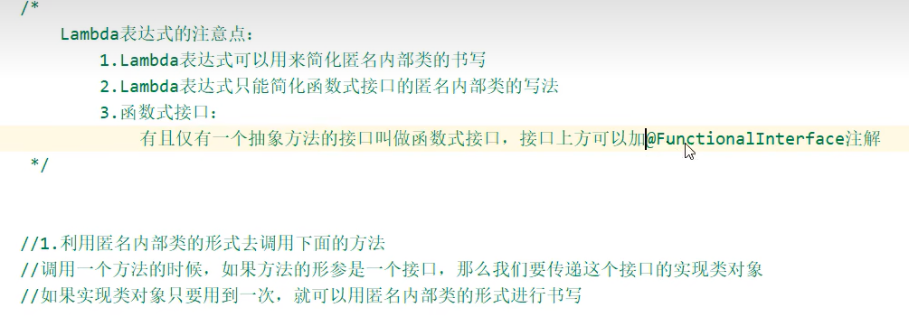
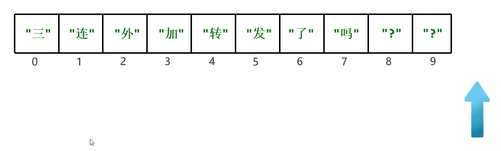
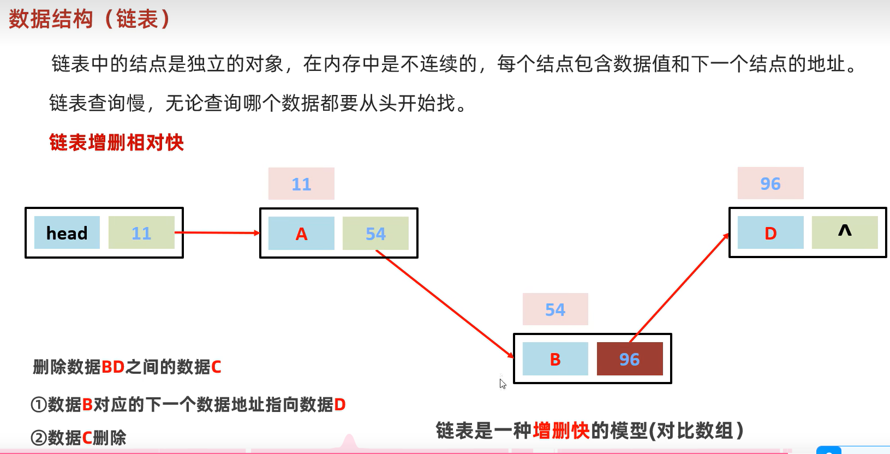

implementation 实现类

# 1 补充：Arrays

1.

java写的这个binariSearch要求数组必须**升序**


插入点：就是当前 数值 放到数组中符合顺序应该放置的位置索引

fill:把数组中的每一个元素都进行覆盖


# 2补充：lambda表达式

### 1.函数式编程：

 





不熟悉的话可以由匿名内部类的写法慢慢改过来

技巧：


1.把多余的部分删去，留着方法体

2.方法体前面的（）表示形参

3.（）与{之间加一个	->	即可


该图3.的理解：**更关注于方法体**，减少对面向对象相关知识内容的关注

更加简洁

#### 2.

由于method(Swim s),所以可以知道lambda表达式对应的接口肯定是Swim

由于方法体只写了一个，所以必须保证接口里也只有一个方法


### 3.Lambda的再简化


1.如果没有参数，（）不能省略

2.例子：


**省略核心：可推导，可省略**

1//省略数据类型//因为参数类型可以和接口里面形参的类型、顺序一一对应


2//由于是2个，不能直接去（）

3//

### 3.Lambdad的例子：//把这个字符串数组按照字符串长度一次排起来

**<u>*//☆☆☆☆☆☆☆☆☆☆☆☆☆☆☆☆☆☆☆☆☆☆☆☆☆☆☆☆☆☆☆☆☆☆☆☆☆☆☆☆☆☆☆☆☆☆☆☆☆☆☆☆☆☆☆☆☆☆☆☆☆☆☆☆☆如果以后要把数组中的数据按照指定的方式进行排列，就要用sort方法，而且指定排序的规则☆☆☆☆☆☆☆☆☆☆☆☆☆☆☆☆☆☆☆☆☆☆☆☆☆☆☆*</u>**


## 1.Collection集合

### 1.1数组和集合的区别【理解】

- 相同点

  都是容器,可以存储多个数据

- 不同点

  - 数组的长度是不可变的,集合的长度是可变的

  - 数组可以存基本数据类型和引用数据类型

    集合只能存引用数据类型,如果要存基本数据类型,需要存对应的包装类

### 1.2集合类体系结构【理解】


单列集合：每次只能处理一个数据

双列集合：每次可以处理两个数据（一对）


1.List

**1//**有序：存取的顺序一样

eg:存：1 2 3

取 1 2 3

### 1.3Collection 集合概述和使用【应用】

- Collection集合概述

  - 是单列集合的顶层接口,它表示一组对象,这些对象也称为Collection的元素
  - JDK 不提供此接口的任何直接实现.它提供更具体的子接口(如Set和List)实现

- 创建Collection集合的对象

  - 多态的方式
  - 具体的实现类ArrayList

- Collection集合常用方法

  | 方法名                     | 说明                                                         |
  | :------------------------- | :----------------------------------------------------------- |
  | boolean add(E e)           | 添加元素      //**如果集合里面的元素已经有了，再添加一个相同的 会返回false;** |
  | boolean remove(Object o)   | 从集合中移除指定的元素**// 如果要删除的元素不存在，返回false** |
  | void   clear()             | 清空集合中的元素                                             |
  | boolean contains(Object o) | 判断集合中是否存在指定的元素**//底层是根据equals去进行遍历判断的** |
  | boolean isEmpty()          | 判断集合是否为空**//底层是判断集合的长度是否为0**            |
  | int   size()               | 集合的长度，也就是集合中元素的个数                           |


1//

而不是根据索引删，比如set就没有索引

2//**关于contains中equals的重写问题：**//**如果集合中的是自定义对象**

<u>*//对象是字符串的时候，底层也是调用equals进行重写，只不过String里的equals早就被JAVA重写好了*</u>


3//上面的方法表里面**形参**基本是	**对象（符合泛型的对象）**

并且**要保证 是同一个对象**


### 1.4Collection集合的遍历

#### 1.4.1 迭代器遍历//不依赖索引

通过创建 蓝色那个指针，移动指针来获取元素

- 迭代器介绍

  - 迭代器,集合的专用遍历方式

  - **Iterator<E> iterator()**: 返回此集合中元素的迭代器,通过集合对象的iterator()方法得到

  - **格式：**

    **Iterator<String>    迭代器对象的名称=集合对象的名称.iterator();**

  - 

  - //**获取一个迭代器对象**，这个对象相当于下面那个**蓝色的箭头**，并且指向集合中索引为0的位置

- 迭代器**Iterator中**的**常用方法**（这两个通常结合在一起用）

  ​	1//**boolean hasNext()**: //**判断当前位置是否有元素**可以被**取出**

  此时返回false

  2//**E next():** **获取当前**位置的元素,将**迭代器对象移向下一个索引**位置

- Collection集合的遍历

- **1//**

- (1)遍历结束，**”没有这个元素“**，由于不依赖索引，所以报错时不是索引越界

  （2）如果还想让指针指向0索引的位置，只能重新获取一个迭代器的对象，与上一次获取的是两个不同的迭代器对象
  
  （3）如果希望某个元素被重复使用，可以把这个元素的值赋值给一个变量，重复调用这个变量即可
  
  

如果集合中有四个元素不会报错，但是五个元素代码就会报错

while执行一次，该图的迭代器移动的指向：“aaa”->"ccc"->"eee"->noSuceElementE

但是最好一个hasNext(),对应一个Next()

(4)

这样会出现**并发错误**


迭代器返回的最后一个元素就是上一次迭代器调用next()方法返回的那个对象（虽然他现在指向下一个元素去了）


**不能用集合里的方法（remove）去删除、增加元素，要用迭代器里的**


当**迭代器遍历完**了，**可以用集合的方法进行操作**；

如果还没有，最多只能用迭代器里的remove

但是在迭代器循环的过程中，不能进行这样的操作

next()与remove之间存在强依赖型

如果要用一次remove

前面 必须也要用一次next**//否则，会出现ILLegalStateException**


多次remove被调用，每次调用前一定要调用next

## 因为		**remove 会删除上次 调用next返回的元素**


- **2//**

  

  ```java
  public class IteratorDemo1 {
      public static void main(String[] args) {
          //创建集合对象
          Collection<String> c = new ArrayList<>();
  
          //添加元素
          c.add("hello");
          c.add("world");
          c.add("java");
          c.add("javaee");
  
          //Iterator<E> iterator()：返回此集合中元素的迭代器，通过集合的iterator()方法得到
          Iterator<String> it = c.iterator();
  
          //用while循环改进元素的判断和获取
          while (it.hasNext()) {
              String s = it.next();
              System.out.println(s);
          }
      }
  }
  ```

- 迭代器中删除的方法

  ​	void remove(): 删除迭代器对象当前指向的元素

  ```java
  public class IteratorDemo2 {
      public static void main(String[] args) {
          ArrayList<String> list = new ArrayList<>();
          list.add("a");
          list.add("b");
          list.add("b");
          list.add("c");
          list.add("d");
  
          Iterator<String> it = list.iterator();
          while(it.hasNext()){
              String s = it.next();
              if("b".equals(s)){
                  //指向谁,那么此时就删除谁.
                  it.remove();
              }
          }
          System.out.println(list);
      }
  }
  ```

#### 1.4.2 增强for


- 介绍

  - 它是JDK5之后出现的,其内部原理是**一个Iterator迭代器**
  - **实现Iterable接口的类**才**可以使用迭代器和增强for**//
  - 简化**数组**和**单列**（Collection集合）的遍历

- 格式

  ​	for(集合/数组中元素的数据类型 变量名 :  集合/数组名) {

  ​		// 已经将当前遍历到的元素封装到变量中了,直接使用变量即可

  ​	}

  

（一个自定义的变量名）s表示**第三方变量**，他在循环中**依次表示**数组/集合中的**每一个元素**，**需要时**用它的时候**直接调用**s即可


**原来的集合和这个第三方变量之间是没有什么必然联系的**


- 代码

  ```java
  public class MyCollectonDemo1 {
      public static void main(String[] args) {
          ArrayList<String> list =  new ArrayList<>();
          list.add("a");
          list.add("b");
          list.add("c");
          list.add("d");
          list.add("e");
          list.add("f");
  
          //1,数据类型一定是集合或者数组中元素的类型
          //2,str仅仅是一个变量名而已,在循环的过程中,依次表示集合或者数组中的每一个元素
          //3,list就是要遍历的集合或者数组
          for(String str : list){
              System.out.println(str);
          }
      }
  }
  ```

- 细节点注意：

1.报错NoSuchElementException       

 2.迭代器遍历完毕，指针不会复位        

3.循环中只能用一次next方法        

4.迭代器遍历时，不能用集合的方法进行增加或者删除

```java
public class A04_CollectionDemo4 {
    public static void main(String[] args) {
      /*
        迭代器的细节注意点：
            1.报错NoSuchElementException
            2.迭代器遍历完毕，指针不会复位
            3.循环中只能用一次next方法
            4.迭代器遍历时，不能用集合的方法进行增加或者删除
            	暂时当做一个结论先行记忆，在今天我们会讲解源码详细的再来分析。
                如果我实在要删除：那么可以用迭代器提供的remove方法进行删除。
                如果我要添加，暂时没有办法。(只是暂时)
       */

        //1.创建集合并添加元素
        Collection<String> coll = new ArrayList<>();
        coll.add("aaa");
        coll.add("bbb");
        coll.add("ccc");
        coll.add("ddd");

        //2.获取迭代器对象
        //迭代器就好比是一个箭头，默认指向集合的0索引处
        Iterator<String> it = coll.iterator();
        //3.利用循环不断的去获取集合中的每一个元素
        while(it.hasNext()){
            //4.next方法的两件事情：获取元素并移动指针
            String str = it.next();
            System.out.println(str);
        }

        //当上面循环结束之后，迭代器的指针已经指向了最后没有元素的位置
        //System.out.println(it.next());//NoSuchElementException

        //迭代器遍历完毕，指针不会复位
        System.out.println(it.hasNext());

        //如果我们要继续第二次遍历集合，只能再次获取一个新的迭代器对象
        Iterator<String> it2 = coll.iterator();
        while(it2.hasNext()){
            String str = it2.next();
            System.out.println(str);
        }
    }
}
```

#### 1.4.3 lambda表达式

多态方式创造的对象，在看源码的时候要选择去看他的实现类


（上图只用关注for循环即可），其中accept()括号内的是每次接收到集合元素的第三方变量

	

利用forEach方法，再结合lambda表达式的方式进行遍历

```java
public class A07_CollectionDemo7 {
    public static void main(String[] args) {
       /* 
        lambda表达式遍历：
                default void forEach(Consumer<? super T> action):
        */

        //1.创建集合并添加元素
        Collection<String> coll = new ArrayList<>();
        coll.add("zhangsan");
        coll.add("lisi");
        coll.add("wangwu");
        //2.利用匿名内部类的形式
        //底层原理：
        //其实也会自己遍历集合，依次得到每一个元素
        //把得到的每一个元素，传递给下面的accept方法
        //s依次表示集合中的每一个数据
       /* coll.forEach(new Consumer<String>() {
            @Override
            public void accept(String s) {
                System.out.println(s);
            }
        });*/

        //lambda表达式
        coll.forEach(s -> System.out.println(s));
    }
}
```


## 2.List集合//collection里的方法都继承了，上面的集合遍历方式也可以用

### 2.1List集合的概述和特点【记忆】

- List集合的概述
  - 有序集合,这里的有序指的是存取顺序
  - 用户可以精确控制列表中每个元素的插入位置,用户可以通过整数索引访问元素,并搜索列表中的元素
  - 与Set集合不同,列表通常允许重复的元素
- List集合的特点
  - 存取有序
  - 可重复
  - **有索引**

### 2.2List集合的特有方法【应用】

- 方法介绍

  | 方法名                          | 描述                                                         |
  | ------------------------------- | ------------------------------------------------------------ |
  | void add(int index,E   element) | 在此集合中的指定位置插入**指定的元素****//不写index的话默认加到最后**//******原来的索引以及之后的元素都后移1位**** |
  | E remove(int   index)           | 删除指定索引处的元素，返回被删除的元素                       |
  | E remove(Object o)              | 返回boolean ,当前对象是否删除成功                            |
  | E set(int index,E   element)    | 修改指定索引处的元素，返回被修改的元素                       |
| E get(int   index)              | 返回指定索引处的元素                                         |

接口不能直接创建对象，所以右边new了他实现类的对象


这个现象的解释：虽然解释成remove没有去自动装箱拆箱

**但是最本质的原因就是：实参跟形参类型一致的方法优先被调用**


- 示例代码

  ```java
  public class MyListDemo {
      public static void main(String[] args) {
          List<String> list = new ArrayList<>();
          list.add("aaa");
          list.add("bbb");
          list.add("ccc");
          //method1(list);
          //method2(list);
          //method3(list);
          //method4(list);
      }
  
      private static void method4(List<String> list) {
          //        E get(int index)		返回指定索引处的元素
          String s = list.get(0);
          System.out.println(s);
      }
  
      private static void method3(List<String> list) {
          //        E set(int index,E element)	修改指定索引处的元素，返回被修改的元素
          //被替换的那个元素,在集合中就不存在了.
          String result = list.set(0, "qqq");
          System.out.println(result);
          System.out.println(list);
      }
  
      private static void method2(List<String> list) {
          //        E remove(int index)		删除指定索引处的元素，返回被删除的元素
          //在List集合中有两个删除的方法
          //第一个 删除指定的元素,返回值表示当前元素是否删除成功
          //第二个 删除指定索引的元素,返回值表示实际删除的元素
          String s = list.remove(0);
          System.out.println(s);
          System.out.println(list);
      }
  
      private static void method1(List<String> list) {
          //        void add(int index,E element)	在此集合中的指定位置插入指定的元素
          //原来位置上的元素往后挪一个索引.
          list.add(0,"qqq");
          System.out.println(list);
      }
  }
  ```

### 2.3List集合的五种遍历方式【应用】

1. 迭代器：遍历过程中	删除元素
2. 列表迭代器//List所独有的，set不能用//遍历过程中
3. 增强for
4. Lambda表达式//仅仅想遍历，获取每一个元素对他们进行操作      2.3.     都可以
5. 普通for循环//遍历的时候操作索引

## 补充：列表迭代器//迭代器的子接口

在迭代中可以**add()**//相比较迭代器而言//在迭代器**当前指向位置**的**后面**进行添加


代码示例：

```java
//创建集合并添加元素
List<String> list = new ArrayList<>();
list.add("aaa");
list.add("bbb");
list.add("ccc");

//1.迭代器
/*Iterator<String> it = list.iterator();
     while(it.hasNext()){
        String str = it.next();
        System.out.println(str);
}*/


//2.增强for
//下面的变量s，其实就是一个第三方的变量而已。
//在循环的过程中，依次表示集合中的每一个元素
/* for (String s : list) {
       System.out.println(s);
   }*/

//3.Lambda表达式
//forEach方法的底层其实就是一个循环遍历，依次得到集合中的每一个元素
//并把每一个元素传递给下面的accept方法
//accept方法的形参s，依次表示集合中的每一个元素
//list.forEach(s->System.out.println(s) );


//4.普通for循环
//size方法跟get方法还有循环结合的方式，利用索引获取到集合中的每一个元素
/*for (int i = 0; i < list.size(); i++) {
            //i:依次表示集合中的每一个索引
            String s = list.get(i);
            System.out.println(s);
        }*/

// 5.列表迭代器
//获取一个列表迭代器的对象，里面的指针默认也是指向0索引的

//额外添加了一个方法：在遍历的过程中，可以添加元素
ListIterator<String> it = list.listIterator();
while(it.hasNext()){
    String str = it.next();
    if("bbb".equals(str)){
        //qqq
        it.add("qqq");
    }
}
System.out.println(list);
```

### 2.4 细节点注意：

List系列集合中的两个删除的方法

```java
1.直接删除元素
2.通过索引进行删除
```
代码示例:

```java
//List系列集合中的两个删除的方法
//1.直接删除元素
//2.通过索引进行删除

//1.创建集合并添加元素
List<Integer> list = new ArrayList<>();

list.add(1);
list.add(2);
list.add(3);


//2.删除元素
//请问：此时删除的是1这个元素，还是1索引上的元素？
//为什么？//[1, 3]
//因为在调用方法的时候，如果方法出现了重载现象
//优先调用，实参跟形参类型一致的那个方法。

//list.remove(1);


//手动装箱，手动把基本数据类型的1，变成Integer类型
Integer i = Integer.valueOf(1);

list.remove(i);

System.out.println(list);

```

## 3.数据结构//计算机存储、组织数据的方式

## 数据结构的学习指南：


### 3.1数据结构之栈和队列【记忆】

- **栈结构**

  ​	先进后出

  

  

  数据进入栈模型的过程：**压栈/进栈**

  

数据离开栈模型的过程：**弹栈/出栈**


栈内存也是利用这样的存储结构

栈内存中 fuction,method,main方法又从栈内存依次弹出


- **队列结构**

  ​	先进先出
  
  

**数据从后端进入，从前端出去**


### 3.2数据结构之数组和链表【记忆】

- **数组**结构

  ​	**查询快、增删慢**

  

- **链表**结构

  ​	**查询慢、增删快**
  
  结点：链表中的每一个元素
  
  
  
  ##### 1//单链表
  
  

**^**记录：**空地址**




链表查询慢，无论查询哪个数据都要从头开始找：
因为存储某个数据的结点地址值只有他前面那个结点里面有存储，以此类推，只能从最开始去查找

##### 2//双链表


注意看，这里指的是查找	第N个元素，不是说查找的数据内容

说双向链表能够提高查找效率的原因：可以对N进行判断，看看离链表表头还是表尾近，哪边近就从哪边开始去查询


## 4.List集合的实现类

### 4.1List集合子类的特点【记忆】

- **ArrayList集合**

  ​	底层是**数组**结构实现，查询快、增删慢

- **LinkedList集合**

  ​	底层是**双向链表**结构实现，查询慢、增删快（如果操作是首位元素，速度也是极快）
  
  //所以LinkedList本身多了很多**直接操作首尾元素**的**特有API**
  
  #### linkedList本身也是可以用索引的，但是这个索引是基于链表指向依次遍历实现的
  
  在Java中，List接口的实现类通常都提供了索引访问的功能，这是因为List接口本身就定义了通过索引访问元素的方法，例如get(int index)、set(int index, E element)、add(int index, E element)等。这些方法允许你通过整数索引来访问、修改或添加列表中的元素。
  然而，LinkedList作为List接口的一个实现类，虽然它也提供了索引访问的方法，但它的内部实现并不是基于数组的，而是基于双向链表。在双向链表中，每个元素（节点）都包含一个指向前一个元素的引用和一个指向后一个元素的引用。因此，当你在LinkedList中使用索引访问元素时，实际上是在遍历链表，从链表的头部或尾部开始，根据索引值逐步移动到目标位置。

### 4.2LinkedList集合的特有功能【应用】//这些方法混个眼熟就行，以后用的不多，更多的是用List里面和collection里面的方法

- 特有方法

  | 方法名                    | 说明                                                      |
  | ------------------------- | --------------------------------------------------------- |
  | public void addFirst(E e) | 在该列表开头插入指定的元素                                |
  | public void addLast(E e)  | 将指定的元素追加到此列表的末尾//add方法也是默认往末尾添加 |
  | public E getFirst()       | 返回此列表中的第一个元素                                  |
  | public   E getLast()      | 返回此列表中的最后一个元素                                |
  | public E removeFirst()    | 从此列表中删除并返回第一个元素                            |
  | public   E removeLast()   | 从此列表中删除并返回最后一个元素                          |

- 示例代码

  ```java
  public class MyLinkedListDemo4 {
      public static void main(String[] args) {
          LinkedList<String> list = new LinkedList<>();
          list.add("aaa");
          list.add("bbb");
          list.add("ccc");
  //        public void addFirst(E e)	在该列表开头插入指定的元素
          //method1(list);
  
  //        public void addLast(E e)	将指定的元素追加到此列表的末尾
          //method2(list);
  
  //        public E getFirst()		返回此列表中的第一个元素
  //        public E getLast()		返回此列表中的最后一个元素
          //method3(list);
  
  //        public E removeFirst()		从此列表中删除并返回第一个元素
  //        public E removeLast()		从此列表中删除并返回最后一个元素
          //method4(list);
        
      }
  
      private static void method4(LinkedList<String> list) {
          String first = list.removeFirst();
          System.out.println(first);
  
          String last = list.removeLast();
          System.out.println(last);
  
          System.out.println(list);
      }
  
      private static void method3(LinkedList<String> list) {
          String first = list.getFirst();
          String last = list.getLast();
          System.out.println(first);
          System.out.println(last);
      }
  
      private static void method2(LinkedList<String> list) {
          list.addLast("www");
          System.out.println(list);
      }
  
      private static void method1(LinkedList<String> list) {
          list.addFirst("qqq");
          System.out.println(list);
      }
  }
  ```

## 5. 源码分析

## 补充：ArrayList集合的底层原理

## 

元素的个数也是代表着**集合的长度**（数组的长度）


数据的添加：


add:一个一个数据的去添加

add all:一次性去添加很多数据


elementdata是底层数组的名称

**添加数据的一种情况：一个一个的添加**


然后再把原数组数据拷贝到新数组中，如果要添加数据，就在10索引及其后面**挨个添加**即可

如果还是添加满了，仍然继续（3）步骤的操作

**添加过程中的另一种情况：一次性添加很多数据**


### 5.1 ArrayList源码分析：


核心步骤：

1. 创建ArrayList对象的时候，他在底层先创建了一个长度为0的数组。

   数组名字：elementDate，定义变量size。

   size这个变量有两层含义：
   ①：元素的个数，也就是集合的长度
   ②：下一个元素的存入位置

2. 添加元素，添加完毕后，size++

扩容时机一：

3. 当存满时候，会创建一个新的数组，新数组的长度，是原来的1.5倍，也就是长度为15.再把所有的元素，全拷贝到新数组中。如果继续添加数据，这个长度为15的数组也满了，那么下次还会继续扩容，还是1.5倍。

扩容时机二：

4. 一次性添加多个数据，扩容1.5倍不够，怎么办呀？

   如果一次添加多个元素，1.5倍放不下，那么新创建数组的长度以实际为准。

举个例子：
在一开始，如果默认的长度为10的数组已经装满了，在装满的情况下，我一次性要添加100个数据很显然，10扩容1.5倍，变成15，还是不够，

怎么办？

此时新数组的长度，就以实际情况为准，就是110

具体分析过程可以参见视频讲解。

**建立完数组，第一次添加数据：**

//DEFAULTCAPACITY_EMPTY_ELEMENTDATA表示空数组


**第二次以及之后再次添加数据：**


## 补充：LinkedList的底层原理


item 结点存储的数据

next 下一个结点的地址

prev前一个节点的地址 


first 头结点

last 尾结点


构造方法只要一调用，对象就有了，即使是构造方法里什么都没有也是这样，并且这个对象的属性值和 在写码时成员变量设置的值 是一样的，除非构造方法里有改变 


### 5.2 LinkedList源码分析：

底层是双向链表结构

核心步骤如下：

1. 刚开始创建的时候，底层创建了两个变量：一个记录头结点first，一个记录尾结点last，默认为null
2. 添加第一个元素时，底层创建一个结点对象，first和last都记录这个结点的地址值
3. 添加第二个元素时，底层创建一个结点对象，第一个结点会记录第二个结点的地址值，last会记录新结点的地址值

具体分析过程可以参见视频讲解。


### 5.3 迭代器源码分析：


iterator这个方法实现了ArrayList的内部类对象

cursor游标、光标（英语翻译）

lastRet刚刚操作索引的位置


Object[] elementData = ArrayList.this.elementData;


把数组的地址传到方法内，这样调用的时候就不用到外部类里面找了，提高效率

迭代器遍历相关的三个方法：

* Iterator<E> iterator()  ：获取一个迭代器对象

* boolean hasNext()       ：判断当前指向的位置是否有元素

* E next()                ：获取当前指向的元素并移动指针


###### 综上：为了避免迭代器的并发错误：ConcurrentModificationException()

**一定要保证：**
**在创建迭代器对象之后————>该迭代器完成遍历之前，不能对集合的进行	增、删、移动**

eg:

错误示范：

**1//**


**2//**


**原因：**看hasNext的源码

如果是在集合还没有添加元素时，就建立了	迭代器对象， 那么hasNext会直接报错，更不用提括号内的遍历了


**上面这种方式	与增强for遍历的区别:**


增强for遍历其实本质上很像下面这种迭代器遍历，都是在集合元素改变完成之后，遍历之前开始创建迭代器对象

**正确示范:**


## 5.4 迭代器相关理解的补充：

noSuchException :没有这样的元素 错误

1.for each 循环会被编译器看成是一个 **带迭代器的循环**


