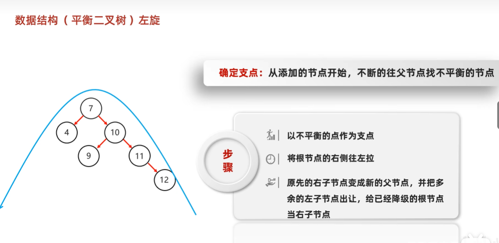
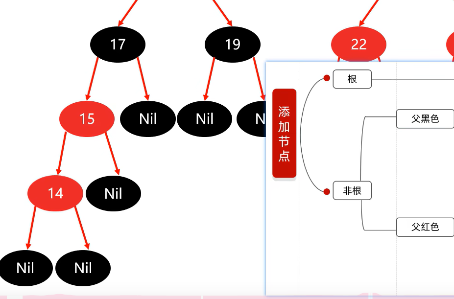

## 1.泛型	Generics

### 1.1泛型概述//可以理解为保安

- 泛型的介绍//**检查、限定集合存储的数据类型**

  ​	泛型是JDK5中引入的特性，它提供了编译时类型安全检测机制

  **泛型**只能**支持引用数据类型**


//在Java中，集合（Collections）是用来存储和操作一组对象的容器。集合可以存储不同类型的对象，包括基本数据类型和引用数据类型。然而，由于集合是基于对象的，所以当你将基本数据类型放入集合时，它们会被自动装箱（Autoboxing）为对应的包装类（Wrapper Class）。
以下是一些常见的集合类型及其对基本数据类型和引用数据类型的支持：
ArrayList、LinkedList、Vector 等：这些集合可以存储任何类型的对象，包括基本数据类型和引用数据类型。当你将基本数据类型放入这些集合时，它们会被自动装箱为对应的包装类。例如，int 会被装箱为 Integer，double 会被装箱为 Double 等。
HashSet、TreeSet、LinkedHashSet 等：这些集合也可以存储任何类型的对象，包括基本数据类型和引用数据类型。同样，当你将基本数据类型放入这些集合时，它们会被自动装箱为对应的包装类。
HashMap、TreeMap、LinkedHashMap 等：这些集合是键值对（Key-Value Pair）的映射，其中键和值都可以是任何类型的对象，包括基本数据类型和引用数据类型。当你将基本数据类型作为键或值放入这些集合时，它们会被自动装箱为对应的包装类。
需要注意的是，虽然集合可以存储基本数据类型，但在使用时需要考虑到自动装箱和拆箱（Unboxing）的性能开销。在某些情况下，特别是在性能敏感的代码中，使用基本数据类型的数组可能会比使用集合更高效。
此外，Java还提供了一些专门用于存储基本数据类型的集合类，如 IntArrayList、LongArrayList 等，这些类可以避免自动装箱和拆箱的开销，从而提高性能。但这些类并不是Java标准库的一部分，需要使用第三方库来提供


//比如 Iterator是不能强制类型转化为 String类型的

//就像多态一样，子类的特有方法是没办法调用的，在这里只能调用Object的方法


创建迭代器时的泛型要和集合里的泛型保持一致


- 泛型的好处

  1. 把运行时期的问题提前到了编译期间，其实在写码的时候如果写了泛型的话，IDEA会自动帮你标红那些不符合的数据
  2. 避免了强制类型转换，导致不恰当的强转使代码报错

- 泛型的定义格式

  
  
  泛型中不能写基本数据类型，因为**基本数据类型不能转化成Object类型的数据**
  
  
  
  - <类型>: 指定一种类型的格式.尖括号里面可以任意书写,一般只写一个字母.例如: <E> <T>
  - <类型1,类型2…>: 指定多种类型的格式,多种类型之间用逗号隔开.例如: <E,T> <K,V>
  
  ## 泛型的补充：JAVA中的泛型是    伪泛型

##### 1.

泛型：可以理解是一个看门的保安，他只是限制你进入集合一定是要某种类型的数据；


在写JAVA文件时，里面是真正的存在泛型的

当编译成class字节码文件的时候，泛型会消失，这个现象叫“**<u>*泛型的擦除*</u>**”


但是数据元素存储在集合中时，是当做**Object对象来存储**的，只有需要从集合中获取数据元素时，又把它按照**泛型强制转化**（比如图中转化成String）**获取出来**


因为之前JAVA的老版本在集合里用的对象是Object写的，流传世界很广，如果要改动这些屎山代码，不现实；开发者就想出加一个类型限定，控制输入集合的对象类型，保证他们是一致的

#### 2.泛型类

可以作用于	字段、方法返回值类型、局部变量


#### 3.泛型方法

//姓名，年龄的数据类型不确定的情况


**只有一个方法**的**数据类型不确定**，没有必要把泛型定义在类后面

可以直接定义在方法上面


调用泛型方法的时候 ，泛型放在方法名的前面

eg:String middle=ArrayAlg.<String>getMiddle("John","Q.","Public");

//如果不写泛型，调用的时候编译器会自动分析括号里的数据类型并把这些数据类型与类里面的方法形参类型匹配

eg:String middle=ArrayAlg.getMiddle("John","Q.","Public");

但有时他的匹配会出现错误//当然你可以通过这样的方式去查看编译器到底是怎么匹配数据类型的


这个方法叫做	**泛型方法**


**工具类在定义的时候，建议私有化构造方法，不让外界创建它的对象**


调用方法时，一旦传递了数据，泛型的类型就被确定了


一定要先定义，才能使用

下面这种写法不对，没定义直接使用了


这样写才对：


总结：泛型类和泛型方法：
**一定都是先定义，再使用**（不管是用在成员变量还是形参方法里）

要么在 类 那里定义， 要么在方法定义


写通配符的时候，不用去定义


#### 4.泛型接口


#### <u>*泛型接口的使用方式：*</u>

##### 1//实现类给出具体的类型


##### 2//实现类延续泛型，创建实现类对象时在确定类型


创建对象的时候一定要再给出泛型（放在类名后面）


### 5.泛型的 通配符 和 继承：

1//泛型不具备继承性2//合理利用通配符


写通配符的时候，方法和类 不用去定义泛型


**“数据有继承，泛型无继承”**这句话主要是在描述Java中类的继承和泛型类型参数之间的区别。
**数据有继承**： 在Java中，类的继承是面向对象编程的一个核心概念。当一个类（子类）继承另一个类（父类）时，它会获得父类的所有属性和方法。这意味着子类可以访问和使用父类的成员，并且可以根据需要重写或扩展这些成员。例如，如果有一个Animal类和一个Cat类继承自Animal，那么Cat类将拥有Animal类的所有属性和方法，并且可以添加自己的特定属性和方法。
**泛型无继承**： 泛型是Java中用于提供编译时类型安全的一种机制。它允许你指定一个类或方法可以接受哪些类型的参数。然而，泛型类型参数本身并不支持继承**//可以被限定**。这意味着，如果你有一个泛型类MyClass<T>，你不能将MyClass<Subtype>视为MyClass<Supertype>的子类，即使Subtype是Supertype的子类。
例如，如果你有一个泛型类MyList<T>，并且你有一个MyList<Animal>和一个MyList<Cat>，你不能将MyList<Cat>视为MyList<Animal>的子类，即使Cat是Animal的子类。这是因为**泛型类型参数T在编译时是固定的，它不会随着实际类型参数的变化而变化。**
为了解决这个问题，Java引入了通配符（Wildcards），如? extends T和? super T，它们允许你在使用泛型时表达类型之间的继承关系。例如，MyList<? extends Animal>表示一个可以存储Animal或其子类的列表，但你不能向这个列表中添加任何元素，因为编译器无法确定具体的类型。


# 补充：树


###### 1.基本结构

##### 

没有的结点就会记录为：null

二叉树中，任意节点的度<=2


##### 2.基本术语


##### 3.二叉查找树//每次添加元素的时候都会进行元素的比较

##### 二叉查找树	存 和 查找都是一样的方式：

小的在左边，大的在右边，一样的是不存**//可能会导致左右子树的高度差很大（查询效率也会降低）**

##### 


上面这个图 以7为结点，把4,10,5放到合适的位置


##### 4.遍历方式


**中序遍历：按照从小到大的顺序去排列的！！！！！！important**

一棵树要**提高查询效率**，**左边右边**的子树**高度**要**差不多**长才行


##### 5.平衡二叉树：左右子树的高度差	<=1


**1.左旋**

1//


2//



记住：9是10的左子节点


**2.右旋：**

1//


2//  


**3.数据结构（平衡二叉树）需要旋转的四种情况：**

添加节点的位置：

1//**左左**（根结点的左子树的左子树处添加//不管是左添加、右添加都一样）：一次右旋

2//**左右**：先局部左旋，再整体右旋

3//**右右**：一次左旋

4//**右左**：先局部右旋，再整体左旋


（1）左添加和右添加不影响


（2）6是添加的结点


错误示范：像左左一样进行一次右旋


正确思路：


变成左左


##### 3.小结

查找是从根结点开始

**平衡二叉树也是一种特别的二叉查找树**

普通的二叉树、二叉查找树不用旋转

平衡二叉树、红黑树需要旋转

为什么需要旋转？（旋转的触发时机）（添加一个结点后，树不平衡，用旋转使他重新保持平衡）


##  6.红黑树


#### 1.红黑规则


在上图两个空的下面再挂两个叶子结点nill，里面没有参数，平时没什么意义。对查找、遍历都不考虑Nill，只不过是对规则5的判断可能会有用（用来统计个数）

**简单路径**：顺着箭头（不能逆着箭头方向），无论往哪走都行


### 2.


把18当成当前结点，再在表里面找对应的情况




当前结点是14，14是15的左子结点


红黑树左旋右旋的时候先暂时不用考虑Nilly叶子结点，转完了再把叶子结点补上就OK


把父作为当前结点并左旋，再进行判断


只要能**看懂** 红黑规则、并且能**看懂**添加红黑树的结点的规则即可


### **红黑树的增删改查效率会比较高**


## 2.Set集合


### 2.1Set集合概述和特点【应用】

+ **不可以存储重复元素**//<u>*add的返回值对这个判断很有用*</u>
+ 没有索引,不能使用普通for循环遍历

### 2.2Set集合的使用【应用】

存储字串并遍历

```java
public class MySet1 {
    public static void main(String[] args) {
      	//创建集合对象
        Set<String> set = new TreeSet<>();
      	//添加元素
        set.add("ccc");
        set.add("aaa");
        set.add("aaa");
        set.add("bbb");

//        for (int i = 0; i < set.size(); i++) {
//            //Set集合是没有索引的，所以不能使用通过索引获取元素的方法
//        }
      
      	//遍历集合
        Iterator<String> it = set.iterator();
        while (it.hasNext()){
            String s = it.next();
            System.out.println(s);
        }
        System.out.println("-----------------------------------");
        for (String s : set) {
            System.out.println(s);
        }
    }
}
```

## 3.TreeSet集合

### 3.1TreeSet集合概述和特点【应用】

+ 不可以存储重复元素
+ 没有索引
+ **可**以将元素按照规则进行**排序**
  + TreeSet()：根据其元素的自然排序进行排序
  + TreeSet(Comparator comparator) ：根据指定的比较器进行排序


## 补充：

1.底层基于 红黑树实现

2.默认排序：从小到大（如果存的数据类型是integer类型）

**1//**JAVA重写了 Integer,Double类型的toString


**2//**从首字母开始挨个比较（先比较第一个字母，在比较第二个字母...），与字符串的长度无关，只要有一个字母能确定大小关系，后面的就不用再看了

现在起名字的时候暂时不写中文，因为中文对应的码我们暂时不知道

“”<"a"//空字符串小于a

****

**3//**如果是自定义对象，怎么排列？


this表示当前要进行添加的对象，o表示从根节点开始的比较对象，比较的方式和查找二叉树一样

### 3.2TreeSet集合基本使用【应用】

存储Integer类型的整数并遍历

```java
public class TreeSetDemo01 {
    public static void main(String[] args) {
        //创建集合对象
        TreeSet<Integer> ts = new TreeSet<Integer>();

        //添加元素
        ts.add(10);
        ts.add(40);
        ts.add(30);
        ts.add(50);
        ts.add(20);

        ts.add(30);

        //遍历集合
        for(Integer i : ts) {
            System.out.println(i);
        }
    }
}
```

### 3.3自然排序Comparable的使用【应用】

- 案例需求

  - 存储学生对象并遍历，创建TreeSet集合使用无参构造方法
  - 要求：按照年龄从小到大排序，年龄相同时，按照姓名的字母顺序排序
- 实现步骤
- 

由于TreeSet的底层是红黑树，用不到哈希表，所以就不用去重写hashCode、equals方法

但要去指定排序规则

1. 使用空参构造创建TreeSet集合
   + 用TreeSet集合存储自定义对象，无参构造方法使用的是自然排序对元素进行排序的
2. 自定义的Student类实现Comparable接口
   + 自然排序，就是让元素所属的类实现Comparable接口，重写compareTo(T o)方法
   + **重写接口中的compareTo方法**//这个方法是    数据的类方法
   + 重写方法时，一定要注意排序规则必须按照要求的主要条件和次要条件来写

- 代码实现

  学生类

  ```java
  public class Student implements Comparable<Student>{
      private String name;
      private int age;

      public Student() {
      }

      public Student(String name, int age) {
          this.name = name;
          this.age = age;
      }

      public String getName() {
          return name;
      }

      public void setName(String name) {
          this.name = name;
      }

      public int getAge() {
          return age;
      }

      public void setAge(int age) {
          this.age = age;
      }

      @Override
      public String toString() {
          return "Student{" +
                  "name='" + name + '\'' +
                  ", age=" + age +
                  '}';
      }

      @Override
      public int compareTo(Student o) {
          //按照对象的年龄进行排序
          //主要判断条件: 按照年龄从小到大排序
          int result = this.age - o.age;
          //次要判断条件: 年龄相同时，按照姓名的字母顺序排序
          result = result == 0 ? this.name.compareTo(o.getName()) : result;
          return result;
      }
  }
  ```

  测试类

  ```java
  public class MyTreeSet2 {
      public static void main(String[] args) {
          //创建集合对象
          TreeSet<Student> ts = new TreeSet<>();
  	    //创建学生对象
          Student s1 = new Student("zhangsan",28);
          Student s2 = new Student("lisi",27);
          Student s3 = new Student("wangwu",29);
          Student s4 = new Student("zhaoliu",28);
          Student s5 = new Student("qianqi",30);
  		//把学生添加到集合
          ts.add(s1);
          ts.add(s2);
          ts.add(s3);
          ts.add(s4);
          ts.add(s5);
  		//遍历集合
          for (Student student : ts) {
              System.out.println(student);
          }
      }
  }
  ```

### 3.4比较器排序Comparator的使用【应用】


空参构造：就是按照默认的方式进行排序


**字符串String中实现了comparable接口，也重写了compareto方法**


该接口是一个函数式接口


- 案例需求

  - 存储老师对象并遍历，创建TreeSet集合使用带参构造方法
  - 要求：按照年龄从小到大排序，年龄相同时，按照姓名的字母顺序排序

- 实现步骤

  - 用TreeSet集合存储自定义对象，带参构造方法使用的是比较器排序对元素进行排序的
  - 比较器排序，就是让集合构造方法接收Comparator的实现类对象，重写compare(T o1,T o2)方法
  - 重写方法时，一定要注意排序规则必须按照要求的主要条件和次要条件来写

- 代码实现

  老师类

  ```java
  public class Teacher {
      private String name;
      private int age;

      public Teacher() {
      }

      public Teacher(String name, int age) {
          this.name = name;
          this.age = age;
      }

      public String getName() {
          return name;
      }

      public void setName(String name) {
          this.name = name;
      }

      public int getAge() {
          return age;
      }

      public void setAge(int age) {
          this.age = age;
      }

      @Override
      public String toString() {
          return "Teacher{" +
                  "name='" + name + '\'' +
                  ", age=" + age +
                  '}';
      }
  }
  ```

  测试类

  ```java
  public class MyTreeSet4 {
      public static void main(String[] args) {
        	//创建集合对象
          TreeSet<Teacher> ts = new TreeSet<>(new Comparator<Teacher>() {
              @Override
              public int compare(Teacher o1, Teacher o2) {
                  //o1表示现在要存入的那个元素
                  //o2表示已经存入到集合中的元素
                
                  //主要条件
                  int result = o1.getAge() - o2.getAge();
                  //次要条件
                  result = result == 0 ? o1.getName().compareTo(o2.getName()) : result;
                  return result;
              }
          });
  		//创建老师对象
          Teacher t1 = new Teacher("zhangsan",23);
          Teacher t2 = new Teacher("lisi",22);
          Teacher t3 = new Teacher("wangwu",24);
          Teacher t4 = new Teacher("zhaoliu",24);
  		//把老师添加到集合
          ts.add(t1);
          ts.add(t2);
          ts.add(t3);
          ts.add(t4);
  		//遍历集合
          for (Teacher teacher : ts) {
              System.out.println(teacher);
          }
      }
  }
  ```

### 3.5两种比较方式总结【理解】

**this-o**			//**当前结点-已有结点**《基本上是**升序**》

+ 两种比较方式小结
  + 自然排序: 自定义类实现Comparable接口,重写compareTo方法,根据返回值进行排序
  + 比较器排序: 创建TreeSet对象的时候传递Comparator的实现类对象,重写compare方法,根据返回值进行排序
  + 在使用的时候,默认使用自然排序,当自然排序不满足现在的需求时,必须使用比较器排序


**1//一般来说，选默认排序方式**

**像String，Integer这种compareTo已经被写好了的方法，如果想改变这两种数据类型的排序方式，就只能Comparator重写方法**

**2//默认方法	和	comparator	同时存在时，优先调用comparator,这也就是为什么1//能实现的原因**


+ 两种方式中关于返回值的规则
  + 如果返回值为负数，表示当前存入的元素是较小值，存左边
  
    
  
  + 返回值=0时，元素重复了，不存
  
  + 如果返回值为正数，表示当前存入的元素是较大值，存右边

## 4.数据结构

### 4.1二叉树【理解】

+ 二叉树的特点

  + 二叉树中,任意一个节点的度要小于等于2
    + 节点: 在树结构中,每一个元素称之为节点
    + 度: 每一个节点的子节点数量称之为度

+ 二叉树结构图

  

### 4.2二叉查找树【理解】

+ 二叉查找树的特点

  + 二叉查找树,又称二叉排序树或者二叉搜索树
  + 每一个节点上最多有两个子节点
  + 左子树上所有节点的值都小于根节点的值
  + 右子树上所有节点的值都大于根节点的值

+ 二叉查找树结构图

  

+ 二叉查找树和二叉树对比结构图

  

+ 二叉查找树添加节点规则

  + 小的存左边
  + 大的存右边
  + 一样的不存

  

### 4.3平衡二叉树【理解】

+ 平衡二叉树的特点

  + 二叉树左右两个子树的高度差不超过1
  + 任意节点的左右两个子树都是一颗平衡二叉树

+ 平衡二叉树旋转

  + 旋转触发时机

    + 当添加一个节点之后,该树不再是一颗平衡二叉树

  + 左旋

    + 就是将根节点的右侧往左拉,原先的右子节点变成新的父节点,并把多余的左子节点出让,给已经降级的根节点当右子节点

    

    

  + 右旋

    + 就是将根节点的左侧往右拉,左子节点变成了新的父节点,并把多余的右子节点出让,给已经降级根节点当左子节点

      

      

+ 平衡二叉树和二叉查找树对比结构图

  

+ 平衡二叉树旋转的四种情况

  + 左左

    + 左左: 当根节点左子树的左子树有节点插入,导致二叉树不平衡

    + 如何旋转: 直接对整体进行右旋即可

      

  + 左右

    + 左右: 当根节点左子树的右子树有节点插入,导致二叉树不平衡

    + 如何旋转: 先在左子树对应的节点位置进行左旋,在对整体进行右旋

      

  + 右右

    + 右右: 当根节点右子树的右子树有节点插入,导致二叉树不平衡

    + 如何旋转: 直接对整体进行左旋即可

      

  + 右左

    + 右左:当根节点右子树的左子树有节点插入,导致二叉树不平衡

    + 如何旋转: 先在右子树对应的节点位置进行右旋,在对整体进行左旋

      

### 4.3红黑树【理解】

- 红黑树的特点

  - 平衡二叉B树
  - 每一个节点可以是红或者黑
  - 红黑树不是高度平衡的,它的平衡是通过"自己的红黑规则"进行实现的

- 红黑树的红黑规则有哪些

  1. 每一个节点或是红色的,或者是黑色的

  2. 根节点必须是黑色

  3. 如果一个节点没有子节点或者父节点,则该节点相应的指针属性值为Nil,这些Nil视为叶节点,每个叶节点(Nil)是黑色的

  4. 如果某一个节点是红色,那么它的子节点必须是黑色(不能出现两个红色节点相连 的情况)

  5. 对每一个节点,从该节点到其所有后代叶节点的简单路径上,均包含相同数目的黑色节点

- 红黑树添加节点的默认颜色

  - 添加节点时,默认为红色,效率高

    

- 红黑树添加节点后如何保持红黑规则

  - 根节点位置
    - 直接变为黑色
  - 非根节点位置
    - 父节点为黑色
      - 不需要任何操作,默认红色即可
    - 父节点为红色
      - 叔叔节点为红色
        1. 将"父节点"设为黑色,将"叔叔节点"设为黑色
        2. 将"祖父节点"设为红色
        3. 如果"祖父节点"为根节点,则将根节点再次变成黑色
      - 叔叔节点为黑色
        1. 将"父节点"设为黑色
        2. 将"祖父节点"设为红色
        3. 以"祖父节点"为支点进行旋转

##5.HashSet集合

### 5.1HashSet集合概述和特点【应用】

- 底层数据结构是**哈希表**//一种对于增删查改数据性能都较好的结构
- 存取无序
- 不可以存储重复元素
- 没有索引,不能使用普通for循环遍历
- 


如果哈希值相同，那么就会挨个去equal这个哈希值对应的挂上去的这些元素组成的列表，如果新元素跟里面每个元素都不一样，那就存在最下面

如果有equal，那就直接舍去，保证了哈希表**无重复**的性质


默认因子：是数组的扩容时机，当数组元素的个数是（数组长度*扩容因子时），数组的长度会**扩容**成**原数组长度的2倍（图片这里是32）**


当链表的长度>8 **而且** 数组长度 >= 64 时，**当前的链表会自动转化成红黑树**


如果不重写，那么底层是用		地址值去计算哈希值，用地址值去进行equals比较

所以当希望通过属性值去计算哈希值   或者   希望通过属性值进行equals比较，一定要进行重写


### 1.HashSet为什么存 和 取的顺序不一样？

存：按照上面的逻辑

取：从0索引开始，把该索引上的链表/红黑树查找完，才进行下一个索引的查找

### 2.HashSet为什么没索引？

这个数组有索引，但每个索引里面也会有链表/红黑树，很复杂就取消了索引机制

### 3.HashSet是利用什么机制保证数据去重？

HashCode方法，equals方法

### 5.2HashSet集合的基本应用【应用】

**如果是自定义对象一定要重写	hashcode,equals方法**

String、integer类型已经被重写好啦，不用管

存储字符串并遍历

```java
public class HashSetDemo {
    public static void main(String[] args) {
        //创建集合对象
        HashSet<String> set = new HashSet<String>();

        //添加元素
        set.add("hello");
        set.add("world");
        set.add("java");
        //不包含重复元素的集合
        set.add("world");

        //遍历
        for(String s : set) {
            System.out.println(s);
        }
    }
}
```

### 5.3哈希值【理解】


- 哈希值简介

  ​	是JDK根据对象的地址或者字符串或者数字算出来的int类型的数值

- 如何获取哈希值

  ​	Object类中的public int hashCode()：返回对象的哈希码值

- 哈希值的特点

  - 同一个对象多次调用hashCode()方法返回的哈希值是相同的
  - 默认情况下，不同对象的哈希值是不同的。而重写hashCode()方法，可以实现让不同对象的哈希值相同

### 5.4哈希表结构【理解】

- JDK1.8以前

  ​	数组 + 链表

- JDK1.8以后

  - 节点个数少于等于8个

    ​	数组 + 链表

  - 节点个数多于8个

    ​	数组 + 红黑树

  

### 5.5HashSet集合存储学生对象并遍历【应用】

- 案例需求

  - 创建一个存储学生对象的集合，存储多个学生对象，使用程序实现在控制台遍历该集合
  - 要求：学生对象的成员变量值相同，我们就认为是同一个对象

- 代码实现

  学生类

  ```java
  public class Student {
      private String name;
      private int age;
  
      public Student() {
      }
  
      public Student(String name, int age) {
          this.name = name;
          this.age = age;
      }
  
      public String getName() {
          return name;
      }
  
      public void setName(String name) {
          this.name = name;
      }
  
      public int getAge() {
          return age;
      }
  
      public void setAge(int age) {
          this.age = age;
      }
  
      @Override
      public boolean equals(Object o) {
          if (this == o) return true;
          if (o == null || getClass() != o.getClass()) return false;
  
          Student student = (Student) o;
  
          if (age != student.age) return false;
          return name != null ? name.equals(student.name) : student.name == null;
      }
  
      @Override
      public int hashCode() {
          int result = name != null ? name.hashCode() : 0;
          result = 31 * result + age;
          return result;
      }
  }
  ```

  测试类

  ```java
  public class HashSetDemo02 {
      public static void main(String[] args) {
          //创建HashSet集合对象
          HashSet<Student> hs = new HashSet<Student>();
  
          //创建学生对象
          Student s1 = new Student("林青霞", 30);
          Student s2 = new Student("张曼玉", 35);
          Student s3 = new Student("王祖贤", 33);
  
          Student s4 = new Student("王祖贤", 33);
  
          //把学生添加到集合
          hs.add(s1);
          hs.add(s2);
          hs.add(s3);
          hs.add(s4);
  
          //遍历集合(增强for)
          for (Student s : hs) {
              System.out.println(s.getName() + "," + s.getAge());
          }
      }
  }
  ```

- 总结

  ​	HashSet集合存储自定义类型元素,要想实现元素的唯一,要求必须重写hashCode方法和equals方法


### 5.6LinkedHashSet的底层原理


**有序**（存储与取出的顺序一致）、不重复、无索引


（该图中最右边那个是头结点，最左边这个是尾结点）//添加与遍历的顺序都是按这个双向链表：从头结点 到尾结点的顺序


//linkedhashset的效率比hashset更低一点