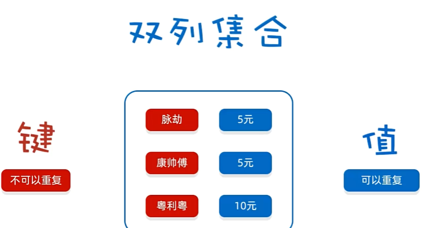

## 1.Map集合//映射

##  补充：

### 1.根据键获取值

如果要获取一个没有出现在映射里的键的值，可以用getOrDefault//这样返回的值就可以不是初始化

eg:

Map<String,Integer> scores=...;

int score=scores.getOrDefault(id,0);//如果键里没这个id，就返回0

2.键必须唯一，当用put添加键值对对象，该键map里面已经有了，则值会进行**取代**，并且**返回被取代的value值**

3.加载因子//与扩容时机有关，也叫 装填因子 0.0-1.0

4.keySet不是HashSet或TreeSet,而是实现了Set接口的另外某个类的对象

###### 关于MapEntry:

Map.Entry 是 Java 中 Map 接口的一个内部接口，它代表了 Map 中的一个键值对（key-value pair）

Map.Entry 接口提供了以下方法：
getKey(): 返回键值对中的键。
getValue(): 返回键值对中的值。
setValue(V value): 设置键值对中的值。这个方法通常在需要修改 Map 中某个键对应的值时使用

### 1.1Map集合概述和特点【理解】




- Map集合概述

  ```java
  interface Map<K,V>  K：键的类型；V：值的类型
  ```

- Map集合的特点

  - 双列集合,一个键对应一个值，**一一对应**
  - 键不可以重复,值可以重复

- Map集合的基本使用

  ```java
  public class MapDemo01 {
      public static void main(String[] args) {
          //创建集合对象
          Map<String,String> map = new HashMap<String,String>();

          //V put(K key, V value) 将指定的值与该映射中的指定键相关联
          map.put("itheima001","林青霞");
          map.put("itheima002","张曼玉");
          map.put("itheima003","王祖贤");
          map.put("itheima003","柳岩");

          //输出集合对象
          System.out.println(map);
      }
  }
  ```

### 1.2Map集合的基本功能【应用】

- 方法介绍

  | 方法名                              | 说明                                                         |
  | ----------------------------------- | ------------------------------------------------------------ |
  | **V**   put(K key,V   value)        | **添加元素//覆盖**     **添加数据的时候1.key不存在，直接把键值对对象添加到map集合里面，并且返回null   2.key存在，会把原有的键值对对象的value值覆盖，并且把被覆盖的value值返回** |
  | **V**   remove(Object key)          | 根据键删除整个键值对元素，并把这个键值对的**value值返回**    |
  | void   clear()                      | 移除所有的键值对元素                                         |
  | boolean containsKey(Object key)     | 判断集合是否包含指定的键                                     |
  | boolean containsValue(Object value) | 判断集合是否包含指定的值                                     |
  | boolean isEmpty()                   | 判断集合是否为空                                             |
  | int size()                          | 集合的长度，也就是集合中键值对的个数                         |

- 示例代码

  ```java
  public class MapDemo02 {
      public static void main(String[] args) {
          //创建集合对象
          Map<String,String> map = new HashMap<String,String>();

          //V put(K key,V value)：添加元素
          map.put("张无忌","赵敏");
          map.put("郭靖","黄蓉");
          map.put("杨过","小龙女");

          //V remove(Object key)：根据键删除键值对元素
  //        System.out.println(map.remove("郭靖"));
  //        System.out.println(map.remove("郭襄"));

          //void clear()：移除所有的键值对元素
  //        map.clear();

          //boolean containsKey(Object key)：判断集合是否包含指定的键
  //        System.out.println(map.containsKey("郭靖"));
  //        System.out.println(map.containsKey("郭襄"));

          //boolean isEmpty()：判断集合是否为空
  //        System.out.println(map.isEmpty());

          //int size()：集合的长度，也就是集合中键值对的个数
          System.out.println(map.size());

          //输出集合对象
          System.out.println(map);
      }
  }
  ```

### 1.3Map集合的获取功能【应用】

- 方法介绍

  | 方法名                               | 说明                     |
  | ------------------------------------ | ------------------------ |
  | V   get(Object key)                  | 根据键获取值             |
  | Set<K>   keySet()                    | 获取所有键的集合         |
  | Collection<V>   values()             | 获取所有值的集合         |
  | Set<**Map.Entry**<K,V>>   entrySet() | 获取所有键值对对象的集合 |


## 内部接口（嵌套接口的相关拓展）：

**非静态的内部接口必须由外部类的内部类来实现**，因为它们是与外部类的实例相关联的。内部类可以访问外部类的所有成员，这使得它们成为实现内部接口的理想选择。

在Java中，一个接口可以包含另一个接口，这种接口被称为内部接口或嵌套接口。内部接口可以是静态的，也可以是非静态的。如果是静态的，它可以被视为外部接口的一个静态成员；如果是非静态的，它必须通过外部类或接口的实例来访问。
以下是一个内部接口的示例：


在这个示例中，OuterInterface 包含了一个非静态内部接口 InnerInterface 和一个静态内部接口 StaticInnerInterface。InnerInterface 和 StaticInnerInterface 都定义了一些方法，但没有提供具体实现。
要实现内部接口，你需要在外部类中创建一个内部类，并让这个内部类实现内部接口。例如：


- 示例代码

  ```java
  public class MapDemo03 {
      public static void main(String[] args) {
          //创建集合对象
          Map<String, String> map = new HashMap<String, String>();

          //添加元素
          map.put("张无忌", "赵敏");
          map.put("郭靖", "黄蓉");
          map.put("杨过", "小龙女");

          //V get(Object key):根据键获取值
  //        System.out.println(map.get("张无忌"));
  //        System.out.println(map.get("张三丰"));

          //Set<K> keySet():获取所有键的集合
  //        Set<String> keySet = map.keySet();
  //        for(String key : keySet) {
  //            System.out.println(key);
  //        }

          //Collection<V> values():获取所有值的集合
          Collection<String> values = map.values();
          for(String value : values) {
              System.out.println(value);
          }
      }
  }
  ```

### 1.4Map集合的遍历(方式1)【键找值】//键单独成一个集合，再遍历这个键集合

**不是所有的 Map 和 Collection 的实现类都可以直接调用 forEach 遍历、迭代器遍历或增强 for 遍历。**具体来说：
**Map 接口：**
本身并不直接支持 forEach 方法、迭代器遍历或增强 for 遍历，因为 Map 是由键值对组成的集合，而**不是单个元素的集合。**
但是，你可以通过 **Map 的 keySet()、values() 或 entrySet() 方法获取一个 Set、Collection 或 Set<Map.Entry<K, V>>，**然后对<u>*这些集合使用 forEach、迭代器或增强 for 进行遍历。*</u>
**Collection 接口：**
Collection 接口的**所有实现类都支持**迭代器遍历和增强 for 遍历，因为这些遍历方式是 Collection 接口定义的一部分。
总结一下：
Map 接口需要通过获取其**键集、值集或键值对集**来**间接使用** forEach、迭代器或增强 for 遍历。


- 遍历思路

  - 我们刚才存储的元素都是成对出现的，所以我们把Map看成是一个夫妻对的集合
    - 把所有的丈夫给集中起来
    - 遍历丈夫的集合，获取到每一个丈夫
    - 根据丈夫去找对应的妻子

- 步骤分析

  - **获取所有键的集合。用keySet()方法实现**
  - 遍历键的集合，获取到每一个键。用增强for实现  
  - 根据键去找值。用get(Object key)方法实现

- 代码实现

  ```java
  public class MapDemo01 {
      public static void main(String[] args) {
          //创建集合对象
          Map<String, String> map = new HashMap<String, String>();

          //添加元素
          map.put("张无忌", "赵敏");
          map.put("郭靖", "黄蓉");
          map.put("杨过", "小龙女");

          //获取所有键的集合。用keySet()方法实现
          Set<String> keySet = map.keySet();
          //遍历键的集合，获取到每一个键。用增强for实现
          for (String key : keySet) {
              //根据键去找值。用get(Object key)方法实现
              String value = map.get(key);
              System.out.println(key + "," + value);
          }
      }
  }
  ```

### 1.5Map集合的遍历(方式2)【键值对】//键值对单独成一个集合，再遍历这个集合，最后    键值对对象.getKey()/.getValue()  即可

- 遍历思路

  - 我们刚才存储的元素都是成对出现的，所以我们把Map看成是一个夫妻对的集合
    - 获取所有结婚证的集合
    - 遍历结婚证的集合，得到每一个结婚证
    - 根据结婚证获取丈夫和妻子

- 步骤分析

  - 获取所有键值对对象的集合
    - Set<Map.Entry<K,V>> entrySet()：获取所有键值对对象的集合
  - 遍历键值对对象的集合，得到每一个键值对对象
    - 用增强for实现，得到每一个Map.Entry
  - 根据键值对对象获取键和值
    - 用getKey()得到键
    - 用getValue()得到值


补充：

数据前面都要写类型

至于键值对对象的类型

**Map.Entry<K,V>**

有时会写成

**Entry<K,V>**把前面的Map省略，是因为已经导包

..........Map**.Entry**(比第一种写法的导包多了加粗部分的内容)

- 代码实现

  ```java
  public class MapDemo02 {
      public static void main(String[] args) {
          //创建集合对象
          Map<String, String> map = new HashMap<String, String>();

          //添加元素
          map.put("张无忌", "赵敏");
          map.put("郭靖", "黄蓉");
          map.put("杨过", "小龙女");

          //获取所有键值对对象的集合
          Set<Map.Entry<String, String>> entrySet = map.entrySet();
          //遍历键值对对象的集合，得到每一个键值对对象
          for (Map.Entry<String, String> me : entrySet) {
              //根据键值对对象获取键和值
              String key = me.getKey();
              String value = me.getValue();
              System.out.println(key + "," + value);
          }
      }
  }
  ```

### 3.Map集合的遍历（方式3）（Lambda表达式）

本质上和 方式2 的遍历很相似

##### 增强for和for-each遍历的区别与联系：

**增强 for 遍历**
增强 for 遍历是 Java 5 引入的特性，它专门用于遍历数组和实现了 Iterable 接口的集合类。增强 for 循环的语法如下：


增强 for 循环会自动迭代集合或数组中的元素，将每个元素依次赋值给循环变量，然后执行循环体中的代码。
**forEach 方法**
forEach 方法是 Java 8 引入的 Iterable 接口的默认方法，它允许你使用一个 Consumer 接口的实现来遍历集合中的元素。forEach 方法的语法如下：


forEach 方法接受一个 **BiConsumer 类型的参数，这个参数是一个函数式接口**，它定义了一个接受两个参数并返回一个结果的操作。在 forEach 方法内部，会遍历集合中的每个元素，并将元素作为参数传递给 BiConsumer 接口的实现。
**本质比较**：
**语法形式：**增强 for 遍历使用特定的语法结构，而 forEach 方法是通过调用集合对象的方法来实现遍历。
灵活性：forEach 方法更加灵活，因**为它可以接受一个函数式接口的实现作为参数**，这**允许**你在遍历过程中执行**更复杂的操作**。而**增强 for 循环**的循环体中**只能执行简单的代码块**。
适用性：**增强 for** 遍历适用于**数组**和实现了 Iterable 接口的集合类，而 forEach 方法只能用于实现了 Iterable 接口的集合类。
总结
forEach 遍历和增强 for 遍历的本质是相似的，都是为了简化遍历过程。**增强 for 遍历是一种语法结构**，而 **forEach 方法是一个函数式接口的实现**，它提供了更多的灵活性和适用性。在实际使用中，可以根据具体需求选择合适的遍历方式

*<u>在Java中，Map接口本身并没有实现Iterable接口。Map接口主要用于存储键值对，而Iterable接口则用于支持迭代操作，即可以通过for-each循环来遍历集合中的元素。</u>*
*<u>然而，Map接口提供了一个entrySet()方法，该方法返回一个Set集合，**其中包含了Map中的所有键值对。这个Set集合实现了Iterable接口**，因此可以使用forEach方法来遍历Map中的键值对。</u>*
*<u><u>在你的代码示例中，TreeMap<Integer, String>是Map的一个实现类，它通过entrySet()方法获取一个Set集合，然后使用forEach方法来遍历这个集合。在accept方法中，你可以对每个键值对执行自定义的操作，例如写入到文件中。</u>*</u>

**源码：**


只不过这里的话，**Map**可以直接用**foreach**去进行遍历**键值对对象**//调用这个方法的时候也是只能对键值对对象整体进行遍历

# **HashMap集合**


## 2.HashMap集合

### 2.1HashMap集合概述和特点【理解】

+ HashMap底层是哈希表结构的

+ **依赖hashCode方法和equals方法保证键的唯一**//只保证键的唯一，与值无关

+ 如果键要存储的是自定义对象，需要重写hashCode和equals方法

  如果值存储的是自定义对象，不用重写hashCode和equals方法

+ *<u>**HashMap和HashSet不同的是：**</u>*

  *<u>**HashMap用键值去计算hashcode，然后如果！！！！键的属性值！！！也与已存在的值相同，会去替换，而不是舍弃**</u>*

  

### 2.2HashMap集合应用案例【应用】

- 案例需求

  - 创建一个HashMap集合，键是学生对象(Student)，值是居住地 (String)。存储多个元素，并遍历。
  - 要求保证键的唯一性：如果学生对象的成员变量值相同，我们就认为是同一个对象

- 代码实现

  学生类

  ```java
  public class Student {
      private String name;
      private int age;

      public Student() {
      }

      public Student(String name, int age) {
          this.name = name;
          this.age = age;
      }

      public String getName() {
          return name;
      }

      public void setName(String name) {
          this.name = name;
      }

      public int getAge() {
          return age;
      }

      public void setAge(int age) {
          this.age = age;
      }

      @Override
      public boolean equals(Object o) {
          if (this == o) return true;
          if (o == null || getClass() != o.getClass()) return false;

          Student student = (Student) o;

          if (age != student.age) return false;
          return name != null ? name.equals(student.name) : student.name == null;
      }

      @Override
      public int hashCode() {
          int result = name != null ? name.hashCode() : 0;
          result = 31 * result + age;
          return result;
      }
  }
  ```

  测试类

  ```java
  public class HashMapDemo {
      public static void main(String[] args) {
          //创建HashMap集合对象
          HashMap<Student, String> hm = new HashMap<Student, String>();

          //创建学生对象
          Student s1 = new Student("林青霞", 30);
          Student s2 = new Student("张曼玉", 35);
          Student s3 = new Student("王祖贤", 33);
          Student s4 = new Student("王祖贤", 33);

          //把学生添加到集合
          hm.put(s1, "西安");
          hm.put(s2, "武汉");
          hm.put(s3, "郑州");
          hm.put(s4, "北京");

          //遍历集合
          Set<Student> keySet = hm.keySet();
          for (Student key : keySet) {
              String value = hm.get(key);
              System.out.println(key.getName() + "," + key.getAge() + "," + value);
          }
      }
  }
  ```


## 2.3LinkedHashMap

#### 1.


**HashMap中toString的源码↑**


## 3.TreeMap集合

### 3.1TreeMap集合概述和特点【理解】

**不重复，无索引，可排序 是针对 键来说的**


+ TreeMap底层是红黑树结构
+ 依赖自然排序或者比较器排序,对键进行排序
+ 如果键存储的是自定义对象,需要**实现Comparable接口**或者在**创建TreeMap对象时候给出比较器排序规则**

### 3.2TreeMap集合应用案例【应用】

+ 案例需求

  + 创建一个TreeMap集合,键是学生对象(Student),值是籍贯(String),学生属性姓名和年龄,按照年龄进行排序并遍历
  + 要求按照学生的年龄进行排序,如果年龄相同则按照姓名进行排序

+ 代码实现

  学生类

  ```java
  public class Student implements Comparable<Student>{
      private String name;
      private int age;

      public Student() {
      }

      public Student(String name, int age) {
          this.name = name;
          this.age = age;
      }

      public String getName() {
          return name;
      }

      public void setName(String name) {
          this.name = name;
      }

      public int getAge() {
          return age;
      }

      public void setAge(int age) {
          this.age = age;
      }

      @Override
      public String toString() {
          return "Student{" +
                  "name='" + name + '\'' +
                  ", age=" + age +
                  '}';
      }

      @Override
      public int compareTo(Student o) {
          //按照年龄进行排序
          int result = o.getAge() - this.getAge();
          //次要条件，按照姓名排序。
          result = result == 0 ? o.getName().compareTo(this.getName()) : result;
          return result;
      }
  }
  ```

  测试类

  ```java
  public class Test1 {
      public static void main(String[] args) {
        	// 创建TreeMap集合对象
          TreeMap<Student,String> tm = new TreeMap<>();
        
  		// 创建学生对象
          Student s1 = new Student("xiaohei",23);
          Student s2 = new Student("dapang",22);
          Student s3 = new Student("xiaomei",22);
        
  		// 将学生对象添加到TreeMap集合中
          tm.put(s1,"江苏");
          tm.put(s2,"北京");
          tm.put(s3,"天津");
        
  		// 遍历TreeMap集合,打印每个学生的信息
          tm.forEach(
                  (Student key, String value)->{
                      System.out.println(key + "---" + value);
                  }
          );
      }
  }
  ```


## 3.3Map的综合小练习

一些小tips:

1//如果统计的东西比较多，不方便使用计数器思想，可以利用集合进行统计

2//或许会有这样的想法：在student类里面设置count计数器，但是不是很合适：
	（1）如果在student类里面放计数器的话，每次都要去找对这个对象里的count值进行修改，感觉效率不是很高

​	（2）这样的设置主要还是对student类的属性造成了影响，因为一个学生对象不是很合适带着这样的属性值**//这样的话是构成对象内部的联系**


在Java的Map接口中，键（key）和值（value）是一种映射关系。每个键都映射到一个特定的值。这种映射关系是通过put(K key, V value)方法建立的，其中K是键的类型，V是值的类型。当你向Map中添加一个键值对时，你实际上是在创建一个从键到值的映射。**//对象与外部值之间的联系**

所以经过分析，这题我们用map去进行统计

---------------------------------------------------------------------------------------

--------------------------------------------------------------------------------


某班80名学生，现在需要组成秋游活动

班长提供了4个景点（A、B、C、D）

每个学生只能选择一个景点，请统计出最终哪个景点想去的人数最多


```java
public class test{
    public static void main(String[] args){
       /* 某班80名学生，现在需要组成秋游活动

        班长提供了4个景点（A、B、C、D）

        每个学生只能选择一个景点，请统计出最终哪个景点想去的人数最多*/
        Random ran=new Random();
        char[] choose={'A','B','C','D'};
        char[] result=new char[80];
        for (int i = 0; i < 80; i++) {
            result[i]=choose[ran.nextInt(choose.length)];
        }//随机产生选择结果

        //开始进行统计
        HashMap<Character,Integer> counr=new HashMap<>();
        for (int i = 0; i < result.length; i++) {
            if(counr.containsKey(result[i])){
                int count=counr.get(result[i]);//记录之前这个地方的次数
                counr.put(result[i],++count);
            }
            else{
                counr.put(result[i],1);

            }
        }//记录成功


        //找出最大值/*这个过程必须得遍历完才能找出*/
        int ma=0;//这里不能随便设置成ABCD中任何一个城市的次数，因为可能那个城市没有在表中
        Set<Character> ka=counr.keySet();
        Iterator<Character> it=ka.iterator();
        int co=0;
        while(it.hasNext()){
            Character c=it.next();
            co=counr.get(c);
            ma=    (ma>=co)  ? ma:co;
        }
        System.out.println(ma);//打印最大次数

        //遍历找出最大次数对应的城市
        Iterator<Character> it2=ka.iterator();
        while(it2.hasNext()){
            Character c=it2.next();
            if(counr.get(c)==ma){
                System.out.println(c);

            }
        }

    }
}
```

## 3.4TreeMap小练习

**1.当TreeMap的键值是自定义对象的时候，一定要记得写排序的方法，不然会报错**

# 4.源码解析

## 1.HashMap的源码解析

### 补充：


1.

最后那个void表示方法的返回值

2.

clear()是重写的父类 （灰色字体）里面的方法


重写的Map接口里的方法

3.

方法也变成灰色，点了之后会跳转

继承了Map里的方法

4.↑是重写接口/类的方法

→是继承接口/类的方法

5.

f表示属性值------------成员变量/常量

6.

接口Entry继承于Map中

7.

**类**，如果已经是在一个类里面来进行查找，那么这些类都是这个类的			**内部类**

8.

左移4次

<<n 左移n次，乘2的n次方


## 1.1

**1.**

onlyAbsent:true重复的数据不会覆盖

false:重复的数据不保留，会覆盖//默认


最后那个参数暂时不用管

# **在阅读源码的时候还要在脑海中想象出数据结构的变化**

1.

2.

数组中键值对内部包含的属性是要分情况讨论的

3.

一开始用空参对象创造了数组之后，其实数组本身还没有被创建，是一个null

下面调用put方法的时候，数组才存在


## 关于comparable和comparator的一些理解

1.实际上，**每个自定义的类**都**可以实现**comparable这个接口并重写compareto这个方法，只不过是这样的方法主要是用在 **要让一个类实现排序服务**的需求下（比如TreeMap,Arrays里的sort）

2.HashMap和TreeMap在添加元素的时候使用的是hashcode,equals的方法，TreeMap在前者的基础上调用了 comparable/comparator进行排序的实现


