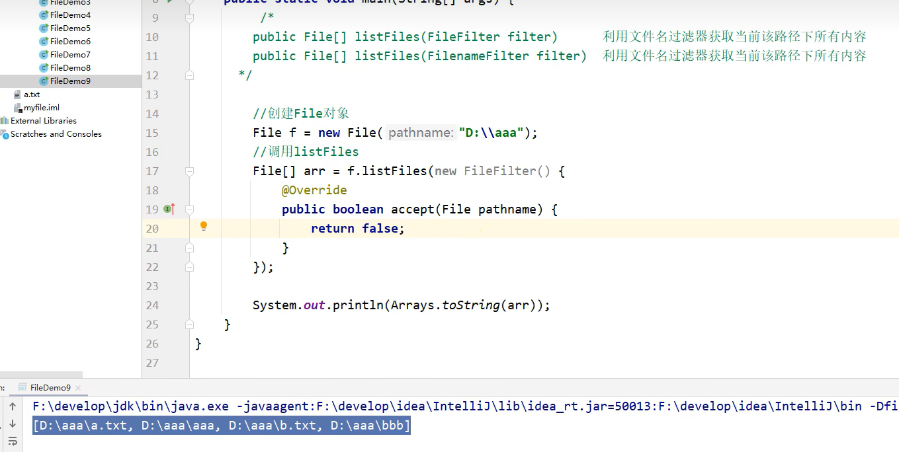

# 书本中关于异常的一些理解和额外的补充：

###### 1.异常的意义：

向用户通知错误、保存所有工作、允许用户妥善地退出程序

##### 2.异常经常出现在：

用户输入错误

设备错误：打印机没纸、打印机被关了

物理限制：磁盘已满

代码错误

##### 3.

Error类结构层次描述了JAVA运行时系统的内部错误和资源耗尽的问题//一般不用管

不继承IOException这个类

非检查型异常unchecked：派生于Error或RuntimeException类的异常
检查型异常checked：其他异常//编译器将检查你是否为检查型异常提供了异常处理器

##### 4.下面的4种情况会抛出异常

**{**1/调用了一个抛出检查型异常的方法eg:FileInputStream构造器

2/检测到一个错误，并用throw抛出一个检查型异常**}**

3/程序出现错误，eg:a[-1]=0会出现一个非检查型异常

4/Java虚拟机或运行时库出现内部错误

##### 5.关于异常在方法头部的声明//不用声明非检查型异常

如果想要传播一个检查型异常，必须在方法的首部写throws

JAVA的内部错误，即从error继承的异常**不用声明**，因为任何代码都可能报这些错

从runtimeException继承的那些异常也不用声明

###### 6.如果超类中没有抛出任何检查型异常，子类也不可以


# 1. 异常//程序中可能出现的问题

## 1.1 异常概念

异常，就是不正常的意思。在生活中:医生说,你的身体某个部位有异常,该部位和正常相比有点不同,该部位的功能将受影响.在程序中的意思就是：

* **异常** ：指的是程序在执行过程中，出现的非正常的情况，最终会导致**JVM的非正常停止。**

在Java等面向对象的编程语言中，**异常本身是一个类**，**产生异常就是创建异常对象并抛出了一个异常对象**。Java处理异常的方式是中断处理。

> 异常指的并不是语法错误,语法错了,编译不通过,不会产生字节码文件,根本不能运行.

## 1.2 异常体系

异常机制其实是帮助我们**找到**程序中的问题，异常的根类是`java.lang.Throwable`，其下有两个子类：`java.lang.Error`与`java.lang.Exception`，平常所说的异常指`java.lang.Exception`。


**Throwable体系：**

* **Error**:严重错误Error，无法通过处理的错误，只能事先避免，好比绝症。

* 

* 

* **Exception（异常体系最上层的父类）**:表示异常，异常产生后程序员可以通过代码的方式纠正，使程序继续运行，是必须要处理的。好比感冒、阑尾炎。

  

**Throwable中的常用方法：**

* `public void printStackTrace()`:打印异常的详细信息。

  *包含了异常的类型,异常的原因,还包括异常出现的位置,在开发和调试阶段,都得使用printStackTrace。*

* `public String getMessage()`:获取发生异常的原因。

  *提示给用户的时候,就提示错误原因。*

* `public String toString()`:获取异常的类型和异常描述信息(不用)。

***出现异常,不要紧张,把异常的简单类名,拷贝到API中去查。***


## 1.3 异常分类

## 异常的作用：

1.用来查看bug的关键参考信息

2.可以作为方法内部的一种特殊返回值，以便通知调用者底层的


invoke运行


我们平常说的异常就是指Exception，因为这类异常一旦出现，我们就要对代码进行更正，修复程序。

**异常(Exception)的分类**:根据在编译时期还是运行时期去检查异常?

* **编译时期异常**:checked异常。在编译时期,就会检查,如果没有处理异常,则编译失败。(如日期格式化异常)//JAVA不会运行代码，只会检查语法是否错误，或者做一些性能的优化：
  eg: String s="a"+"b"+"c";

  会被优化成

  String s="abc";

  **主要是用来提醒程序员检查本地信息**

  

* **运行时期异常**:runtime异常。在运行时期,检查异常.在编译时期,运行异常不会编译器检测(不报错)。(如数学异常)

  **由于代码出错导致程序出现问题**

​    

## 1.4 异常的产生过程解析

先运行下面的程序，程序会产生一个数组索引越界异常ArrayIndexOfBoundsException。我们通过图解来解析下异常产生的过程。

 工具类

```java
public class ArrayTools {
    // 对给定的数组通过给定的角标获取元素。
    public static int getElement(int[] arr, int index) {
        int element = arr[index];
        return element;
    }
}
```

 测试类

```java
public class ExceptionDemo {
    public static void main(String[] args) {
        int[] arr = { 34, 12, 67 };
        intnum = ArrayTools.getElement(arr, 4)
        System.out.println("num=" + num);
        System.out.println("over");
    }
}
```

上述程序执行过程图解：

 

## 1.5 抛出异常throw


这张图是把不符合条件的结果直接打印在控制台给人看，但是调用这个方法的调用处并不知道返回的结果是啥


所以现在就是要让调用处知道这个返回的不符合条件的结果，并做出相应的处理


## **抛出一个 异常 的对象**


异常就可以对遇到不符合的数据进行运行失败的处理


#### 1//JVM默认处理方式


此时控制台中会用**红色字体**打印异常

#### 2//自己处理捕获    好处：可以让程序继续往下执行，不会停止程序


补充：

1.如果try中没有问题，怎么执行？

答：try中的代码会全部执行完，但是不执行catch里面的代码，只有出现异常才执行catch里的

2.如果try中有多个问题，怎么执行？

答：

只要一生成异常对象，就会立马跳转到catch里面看看对象能不能被捕获


如果不能捕获就报错


如果要捕获多个异常，这些异常中如果存在父子关系，那么父类建议写在下面，不然下面的catch永远执行不到了//因为实际上可能对于不同的异常情况，做出的处理可能会不同


在JDK7以后，如果对于不同的catch对象，他们的执行操作一样，可以用 | 将他们隔开写在一起，表示如果出现A异常或者B异常的话，采取同一种处理方案 /// 不建议用 因为可能会出错


3.如果try中遇到的问题没有被捕获，怎么执行？

答：虚拟机默认处理，就是在控制台中红字打印，并停止程序运行


4.如果try中遇到了问题，那么try下面的其他代码还会执行吗？
答：


只要已生成异常对象，try后面的就不再执行，就会跳转到catch


#### 3//抛出处理//有点相当于return


运行时期异常可以省略不写

如果throw抛出给调用者，但是不对异常对象进行任何处理，那么最后这个异常对象会被传给JVM，然后打印异常并且终止程序的运行


所以还要手动捕获异常对象  


主要是在方法里面出现异常之后就没有继续执行下去的必要了，所以要抛出异常


#### 有关数组的一些小问题：


比如说数组有length，那么这个length肯定是需要占用一定的存储空间的，不可能为0

k的指向不为Null,而是一个地址


在编写程序时，我们必须要考虑程序出现问题的情况。比如，在定义方法时，方法需要接受参数。那么，当调用方法使用接受到的参数时，首先需要先对参数数据进行合法的判断，数据若不合法，就应该告诉调用者，传递合法的数据进来。这时需要使用抛出异常的方式来告诉调用者。

在java中，提供了一个**throw**关键字，它用来抛出一个指定的异常对象。那么，抛出一个异常具体如何操作呢？

1. 创建一个异常对象。封装一些提示信息(信息可以自己编写)。

2. 需要将这个异常对象告知给调用者。怎么告知呢？怎么将这个异常对象传递到调用者处呢？通过关键字throw就可以完成。throw 异常对象。

   throw**用在方法内**，用来抛出一个异常对象，将这个异常对象传递到调用者处，并结束当前方法的执行。

**使用格式：**

```
throw new 异常类名(参数);
```

 例如：

```java
throw new NullPointerException("要访问的arr数组不存在");

throw new ArrayIndexOutOfBoundsException("该索引在数组中不存在，已超出范围");
```

学习完抛出异常的格式后，我们通过下面程序演示下throw的使用。

```java
public class ThrowDemo {
    public static void main(String[] args) {
        //创建一个数组 
        int[] arr = {2,4,52,2};
        //根据索引找对应的元素 
        int index = 4;
        int element = getElement(arr, index);

        System.out.println(element);
        System.out.println("over");
    }
    /*
     * 根据 索引找到数组中对应的元素
     */
    public static int getElement(int[] arr,int index){ 
       	//判断  索引是否越界
        if(index<0 || index>arr.length-1){
             /*
             判断条件如果满足，当执行完throw抛出异常对象后，方法已经无法继续运算。
             这时就会结束当前方法的执行，并将异常告知给调用者。这时就需要通过异常来解决。 
              */
             throw new ArrayIndexOutOfBoundsException("哥们，角标越界了```");
        }
        int element = arr[index];
        return element;
    }
}
```

> 注意：如果产生了问题，我们就会throw将问题描述类即异常进行抛出，也就是将问题返回给该方法的调用者。
>
> 那么对于调用者来说，该怎么处理呢？一种是进行捕获处理，另一种就是继续讲问题声明出去，使用throws声明处理。

## 1.6 声明异常throws

**声明异常**：将问题标识出来，报告给调用者。如果方法内通过throw抛出了编译时异常，而没有捕获处理（稍后讲解该方式），那么必须通过throws进行声明，让调用者去处理。

关键字**throws**运用于方法声明之上,用于表示当前方法.

**声明异常格式：**

```
修饰符 返回值类型 方法名(参数) throws 异常类名1,异常类名2…{   }	
```

声明异常的代码演示：

```java
public class ThrowsDemo {
    public static void main(String[] args) throws FileNotFoundException {
        read("a.txt");
    }

    // 如果定义功能时有问题发生需要报告给调用者。可以通过在方法上使用throws关键字进行声明
    public static void read(String path) throws FileNotFoundException {
        if (!path.equals("a.txt")) {//如果不是 a.txt这个文件 
            // 我假设  如果不是 a.txt 认为 该文件不存在 是一个错误 也就是异常  throw
            throw new FileNotFoundException("文件不存在");
        }
    }
}
```

throws用于进行异常类的声明，若该方法可能有多种异常情况产生，那么在throws后面可以写多个异常类，用逗号隔开。

```java
public class ThrowsDemo2 {
    public static void main(String[] args) throws IOException {
        read("a.txt");
    }

    public static void read(String path)throws FileNotFoundException, IOException {
        if (!path.equals("a.txt")) {//如果不是 a.txt这个文件 
            // 我假设  如果不是 a.txt 认为 该文件不存在 是一个错误 也就是异常  throw
            throw new FileNotFoundException("文件不存在");
        }
        if (!path.equals("b.txt")) {
            throw new IOException();
        }
    }
}
```

#### 编译器将严格执行throws说明符。如果调了一个抛出检查型异常的方法，那么必须处理这个异常或者传递这个异常。一般来说，需要捕获那些你知道如何处理的异常，而继续传播那些你不知道怎么处理的异常。如果想传递一个异常，就必须在方法的首部添加throws,提醒调用者这个方法可能会抛出一个异常


## 1.7 捕获异常try…catch

如果异常出现的话,会立刻终止程序,所以我们得处理异常:

1. **！！！！！！！！！！！！该方法不处理,而是声明抛出,由该方法的调用者来处理(throws)！！！！！！！！！！！！**。//非检查型异常写不写throws问题不大，但是检查型异常一定要写
2. 在方法中使用try-catch的语句块来处理异常。

**try-catch**的方式就是捕获异常。

* **捕获异常**：Java中对异常有针对性的语句进行捕获，可以对出现的异常进行指定方式的处理。

捕获异常语法如下：

```java
try{
     编写可能会出现异常的代码
}catch(异常类型  e){
     处理异常的代码
     //记录日志/打印异常信息/继续抛出异常
}
```

**try：**该代码块中编写可能产生异常的代码。

**catch：**用来进行某种异常的捕获，实现对捕获到的异常进行处理。

> 注意:try和catch都不能单独使用,必须连用。

演示如下：

```java
public class TryCatchDemo {
    public static void main(String[] args) {
        try {// 当产生异常时，必须有处理方式。要么捕获，要么声明。
            read("b.txt");
        } catch (FileNotFoundException e) {// 括号中需要定义什么呢？
          	//try中抛出的是什么异常，在括号中就定义什么异常类型
            System.out.println(e);
        }
        System.out.println("over");
    }
    /*
     *
     * 我们 当前的这个方法中 有异常  有编译期异常
     */
    public static void read(String path) throws FileNotFoundException {
        if (!path.equals("a.txt")) {//如果不是 a.txt这个文件 
            // 我假设  如果不是 a.txt 认为 该文件不存在 是一个错误 也就是异常  throw
            throw new FileNotFoundException("文件不存在");
        }
    }
}
```

如何获取异常信息：

Throwable类中定义了一些查看方法:

* `public String getMessage()`:获取异常的描述信息,原因(提示给用户的时候,就提示错误原因。


* `public String toString()`:获取异常的类型和异常描述信息(不用)。
* `public void printStackTrace()`:打印异常的跟踪栈信息并输出到控制台。//仅仅是 在控制台以红色 的信息打印出来，**但是并没有停止程序的运行**

​            *包含了异常的类型,异常的原因,还包括异常出现的位置,在开发和调试阶段,都得使用printStackTrace。*


getMessage返回的字符串是第一行蓝色的部分

toString获取的是第一行的部分

printStackTrace打印的就是第一行第二行的全部（比第一行多了位置信息）//最常用，因为它包含的信息最多


### System.err

会把内容以红色的字体打印出来

它和正常的打印一起出现时，控制栏的打印结果的顺序可能会与代码的顺序不一致，正常现象，与多线程有关


在开发中呢也可以在catch将编译期异常转换成运行期异常处理。

多个异常使用捕获又该如何处理呢？

1. 多个异常分别处理。
2. 多个异常一次捕获，多次处理。
3. 多个异常一次捕获一次处理。

一般我们是使用一次捕获多次处理方式，格式如下：

```java
try{
     编写可能会出现异常的代码
}catch(异常类型A  e){  当try中出现A类型异常,就用该catch来捕获.
     处理异常的代码
     //记录日志/打印异常信息/继续抛出异常
}catch(异常类型B  e){  当try中出现B类型异常,就用该catch来捕获.
     处理异常的代码
     //记录日志/打印异常信息/继续抛出异常
}
```

> 注意:这种异常处理方式，要求多个catch中的异常不能相同，并且若catch中的多个异常之间有子父类异常的关系，那么子类异常要求在上面的catch处理，父类异常在下面的catch处理。

## 1.8 finally 代码块

**finally**：有一些特定的代码无论异常是否发生，都需要执行。另外，因为异常会引发程序跳转，导致有些语句执行不到。而finally就是解决这个问题的，在finally代码块中存放的代码都是一定会被执行的。

什么时候的代码必须最终执行？

当我们在try语句块中打开了一些物理资源(磁盘文件/网络连接/数据库连接等),我们都得在使用完之后,最终关闭打开的资源。

finally的语法:

 try...catch....finally:自身需要处理异常,最终还得关闭资源。

> 注意:finally不能单独使用。

比如在我们之后学习的IO流中，当打开了一个关联文件的资源，最后程序不管结果如何，都需要把这个资源关闭掉。

finally代码参考如下：

```java
public class TryCatchDemo4 {
    public static void main(String[] args) {
        try {
            read("a.txt");
        } catch (FileNotFoundException e) {
            //抓取到的是编译期异常  抛出去的是运行期 
            throw new RuntimeException(e);
        } finally {
            System.out.println("不管程序怎样，这里都将会被执行。");
        }
        System.out.println("over");
    }
    /*
     *
     * 我们 当前的这个方法中 有异常  有编译期异常
     */
    public static void read(String path) throws FileNotFoundException {
        if (!path.equals("a.txt")) {//如果不是 a.txt这个文件 
            // 我假设  如果不是 a.txt 认为 该文件不存在 是一个错误 也就是异常  throw
            throw new FileNotFoundException("文件不存在");
        }
    }
}
```

> 当只有在try或者catch中调用退出JVM的相关方法,此时finally才不会执行,否则finally永远会执行。

## 1.9 异常注意事项

* 运行时异常被抛出可以不处理。即不捕获也不声明抛出。
* 如果父类抛出了多个异常,子类覆盖父类方法时,只能抛出相同的异常或者是他的子集。
* 父类方法没有抛出异常，子类覆盖父类该方法时也不可抛出异常。此时子类产生该异常，只能捕获处理，不能声明抛出
* 当多异常处理时，捕获处理，前边的类不能是后边类的父类
* 在try/catch后可以追加finally代码块，其中的代码一定会被执行，通常用于资源回收。

## 1.10 自定义异常类：概述

**为什么需要自定义异常类:**

我们说了Java中不同的异常类,分别表示着某一种具体的异常情况,那么在开发中总是有些异常情况是SUN没有定义好的,此时我们根据自己业务的异常情况来定义异常类。,例如年龄负数问题,考试成绩负数问题。

在上述代码中，发现这些异常都是JDK内部定义好的，但是实际开发中也会出现很多异常,这些异常很可能在JDK中没有定义过,例如年龄负数问题,考试成绩负数问题.那么能不能自己定义异常呢？

**什么是自定义异常类:**

在开发中根据自己业务的异常情况来定义异常类.

自定义一个业务逻辑异常: **LoginException**。一个登陆异常类。


**异常类如何定义:**（类名要见名知意）//起名一定要在最后加上Exception/RuntimeException

1. 自定义一个编译期异常: 自定义类 并继承于`java.lang.Exception`。**//提醒程序员检查本地信息**
2. 自定义一个运行时期的异常类:自定义类 并继承于`java.lang.RuntimeException`。**//由于参数错误而导致的异常**


空参/代参构造 选前两个就行

第二个的形参里的message是指报错的信息//throw异常对象的时候可以自定义异常信息


#### 你看上面的继承体系，说白了，自定义异常 其实就是 自己定义 异常的 ！！！！！！名字！！！！！

## 1.11 自定义异常的练习

要求：我们模拟登陆操作，如果用户名已存在，则抛出异常并提示：亲，该用户名已经被注册。

首先定义一个登陆异常类LoginException：

```java
// 业务逻辑异常
public class LoginException extends Exception {
    /**
     * 空参构造
     */
    public LoginException() {
    }

    /**
     *
     * @param message 表示异常提示
     */
    public LoginException(String message) {
        super(message);
    }
}
```

模拟登陆操作，使用数组模拟数据库中存储的数据，并提供当前注册账号是否存在方法用于判断。

```java
public class Demo {
    // 模拟数据库中已存在账号
    private static String[] names = {"bill","hill","jill"};
   
    public static void main(String[] args) {     
        //调用方法
        try{
            // 可能出现异常的代码
            checkUsername("nill");
            System.out.println("注册成功");//如果没有异常就是注册成功
        } catch(LoginException e) {
            //处理异常
            e.printStackTrace();
        }
    }

    //判断当前注册账号是否存在
    //因为是编译期异常，又想调用者去处理 所以声明该异常
    public static boolean checkUsername(String uname) throws LoginException {
        for (String name : names) {
            if(name.equals(uname)){//如果名字在这里面 就抛出登陆异常
                throw new LoginException("亲"+name+"已经被注册了！");
            }
        }
        return true;
    }
}
```

# 2. File类


## 2.1 概述

`java.io.File` 类是文件和目录路径名的抽象表示，主要用于文件和目录的创建、查找和删除等操作。

路径不必对应着某个实际存在的文件，它仅仅是一个抽象的名字序列。当你要创建文件时，首先要创建一个路径，然后调用对应的方法区创建对应的文件

## 2.2 构造方法


涉及到路径的拼接，还是蓝色划线的构造方法稳妥一点，因为不同的操作系统路径分隔符不一样，用构造方法话，会先获取系统相应的构造分割符，再进行拼接

- `public File(String pathname) ` ：通过将给定的**路径名字符串**转换为抽象路径名来创建新的 File实例。  
- `public File(String parent, String child) ` ：从**父路径名字符串和子路径名字符串**创建新的 File实例。
- `public File(File parent, String child)` ：从**父抽象路径名和子路径名字符串**创建新的 File实例。  


- 构造举例，代码如下：

```java
// 文件路径名
String pathname = "D:\\aaa.txt";
File file1 = new File(pathname); 

// 文件路径名
String pathname2 = "D:\\aaa\\bbb.txt";
File file2 = new File(pathname2); 

// 通过父路径和子路径字符串
 String parent = "d:\\aaa";
 String child = "bbb.txt";
 File file3 = new File(parent, child);

// 通过父级File对象和子路径字符串
File parentDir = new File("d:\\aaa");
String child = "bbb.txt";
File file4 = new File(parentDir, child);
```

> 小贴士：
>
> 1. 一个File对象代表硬盘中实际存在的一个文件或者目录。
> 2. 无论该路径下是否存在文件或者目录，都不影响File对象的创建。

## 2.3 常用方法

### 获取功能的方法


**publid long lastModified()**

-  `public String getAbsolutePath() ` ：返回此File的绝对路径名字符串。

不管创建File对象里的是相对路径还是绝对路径，该方法返回的一定是绝对路径 

- ` public String getPath() ` ：**将此File转换为定义文件时使用的路径**

定义对象时，括号里写的啥，返回的就是啥

- `public String getName()`  ：返回由此File表示的文件或目录的名称。  

如果调用者是文件夹，返回值是文件夹的名字eg:bbb

如果调用者是文件，返回值是文件以及文件的后缀名

eg: a.txt

- `public long length()`  ：返回由此File表示的文件的长度。 

  这个方法只能返回文件的大小

  //单位是 **字节**，如果要**KB**，就要**/1024**；
  
  如果要**MB** 就要**/1024/1024**；
  
  **无法获取文件夹**的大小//如果有返回值，是不对的
  
  如果要获取一个文件夹的大小，需要把这个文件夹里面所有的文件大小都累加在一起
  
  
  
  
  
  
  
  方法演示，代码如下：
  
  ```java
  public class FileGet {
      public static void main(String[] args) {
          File f = new File("d:/aaa/bbb.java");     
          System.out.println("文件绝对路径:"+f.getAbsolutePath());
          System.out.println("文件构造路径:"+f.getPath());
          System.out.println("文件名称:"+f.getName());
          System.out.println("文件长度:"+f.length()+"字节");
  
          File f2 = new File("d:/aaa");     
          System.out.println("目录绝对路径:"+f2.getAbsolutePath());
          System.out.println("目录构造路径:"+f2.getPath());
          System.out.println("目录名称:"+f2.getName());
          System.out.println("目录长度:"+f2.length());
      }
  }
  输出结果：
  文件绝对路径:d:\aaa\bbb.java
  文件构造路径:d:\aaa\bbb.java
  文件名称:bbb.java
  文件长度:636字节
  
  目录绝对路径:d:\aaa
  目录构造路径:d:\aaa
  目录名称:aaa
  目录长度:4096
  ```

> API中说明：length()，表示文件的长度。但是File对象表示目录，则返回值未指定。

### 绝对路径和相对路径

- **绝对路径**：从盘符开始的路径，这是一个完整的路径。

- **相对路径**：**相对于项目目录**的路径，这是一个便捷的路径，开发中经常使用。

  以根部件开始的路径   /和 C:\ 是绝对路径,否则，就是相对路径

- 


此时这个a.txt在项目里的myFile模块里的a.txt


此时这个a.txt直接在项目里，没在模块里

- 

```java
public class FilePath {
    public static void main(String[] args) {
      	// D盘下的bbb.java文件
        File f = new File("D:\\bbb.java");
        System.out.println(f.getAbsolutePath());
      	
		// 项目下的bbb.java文件
        File f2 = new File("bbb.java");
        System.out.println(f2.getAbsolutePath());
    }
}
输出结果：
D:\bbb.java
D:\idea_project_test4\bbb.java
```

### 判断功能的方法

- `public boolean exists()` ：此File表示的文件或目录是否实际存在。
- `public boolean isDirectory()` ：此File表示的是否为目录。
- `public boolean isFile()` ：此File表示的是否为文件。

方法演示，代码如下：

```java
public class FileIs {
    public static void main(String[] args) {
        File f = new File("d:\\aaa\\bbb.java");
        File f2 = new File("d:\\aaa");
      	// 判断是否存在
        System.out.println("d:\\aaa\\bbb.java 是否存在:"+f.exists());
        System.out.println("d:\\aaa 是否存在:"+f2.exists());
      	// 判断是文件还是目录
        System.out.println("d:\\aaa 文件?:"+f2.isFile());
        System.out.println("d:\\aaa 目录?:"+f2.isDirectory());
    }
}
输出结果：
d:\aaa\bbb.java 是否存在:true
d:\aaa 是否存在:true
d:\aaa 文件?:false
d:\aaa 目录?:true
```

### 创建删除功能的方法//路径一定是唯一的、不能有重复的，后缀名/是文件还是文件夹  都不影响

- **`public boolean createNewFile()`** ：当且仅当具有该名称的文件尚不存在时，创建一个新的空文件。 

  

  

  ddd没有后缀的文件名

- **`public boolean delete()`** ：删除由此File表示的文件或目录。  

  **aaa\bbb\ccc其中aaa,bbb也算是有内容的文件夹（aaa,bbb,ccc除了目前文件夹的嵌套之外，没有其他内容）**

  

- **`public boolean mkdir()`** ：创建由此File表示的目录。

- **`public boolean mkdirs()`** ：创建由此File表示的目录，包括任何必需但不存在的父目录。


mkdirs的源码，先判断路径存不存在，在创建单级文件夹看是否成功，不行的话才执行后面的操作，所以虽然不经常用mkdir,但这里还是要了解

**mkdirs也可以创建单击文件夹，以后一律使用这个就行**


- 

方法演示，代码如下：

```java
public class FileCreateDelete {
    public static void main(String[] args) throws IOException {
        // 文件的创建
        File f = new File("aaa.txt");
        System.out.println("是否存在:"+f.exists()); // false
        System.out.println("是否创建:"+f.createNewFile()); // true
        System.out.println("是否存在:"+f.exists()); // true
		
     	// 目录的创建
      	File f2= new File("newDir");	
        System.out.println("是否存在:"+f2.exists());// false
        System.out.println("是否创建:"+f2.mkdir());	// true
        System.out.println("是否存在:"+f2.exists());// true

		// 创建多级目录
      	File f3= new File("newDira\\newDirb");
        System.out.println(f3.mkdir());// false
        File f4= new File("newDira\\newDirb");
        System.out.println(f4.mkdirs());// true
      
      	// 文件的删除
       	System.out.println(f.delete());// true
      
      	// 目录的删除
        System.out.println(f2.delete());// true
        System.out.println(f4.delete());// false
    }
}
```

> API中说明：delete方法，如果此File表示目录，则目录必须为空才能删除。

# 空的文件夹调用listFiles()方法时，返回的是一个长度为0的数组；当调用者是一个需要有权限才能进入的文档时，**listFiles**这个方法返回null;当文件对象去调用这个方法的时候，返回值也是null

## 补充：数组的长度为0，和 引用数组的变量指向Null的区别：

**数组的长度为0**：这意味着数组中没有任何元素。数组的长度是在创建数组时确定的，并且不能更改。如果你创建了一个长度为0的数组，那么它就是一个空数组，不包含任何元素。例如：
int[] emptyArray = new int[0];
**数组指向null**：这意味着数组变量**没有引用任何数组对象**。在Java中，数组是对象，因此需要使用new关键字来创建数组实例。如果你将数组变量设置为null，那么它就不再指向任何数组对象。例如：
int[] nullArray = null;

总结：
数组的**长度为0**表示**数组存在，但没有元素**。
数组**指向null**表示数组变量**没有引用任何数组对象**。

在Java中，**长度为0的数组是占用内存空间的。**尽管数组中没有存储任何元素，但数组对象本身仍然需要一些内存来**存储其元数据**，例如数组的长度、类型等信息。
**对象头**：每个Java对象都有一个对象头，包含了对象的一些基本信息，如哈希码、锁状态、GC信息等。对象头的大小通常是固定的，与数组的长度无关。
**数组长度**：数组对象需要存储其长度信息，以便在运行时知道数组的大小。
**数组元素**：即使数组的长度为0，也需要为数组元素预留内存空间，尽管这些空间当前没有被使用。


## 2.4 目录的遍历

重点掌握蓝色的，其他的了解就行

**1.**listRoots获取系统中的所有盘符

**2.**list获取的是名字//不管是文件名还是文件夹名

**3.**有文件过滤器的list()方法重载

当前路径就是操作文件时左上角的这个，展示出来的是这个路径下的内容


如果是return false;最后String数组是空数组[]


更正一下，这里的 第一个形参应该是parent - 父抽象路径（File类型）
第二个形参应该是child - 子路径名字符串 

File是文件和目录路径名的抽象表示形式。 


这个FilenameFilter其实就相当于 accep会依次指向当前目录下的不同文件//通过第二个参数实现，并把他们存到一个String[]数组最后返回

**4.**像这样只有一个参数表示的就是绝对路径了




- `public String[] list()` ：返回一个String数组，表示该File目录中的所有子文件或目录。
- `public File[] listFiles()` ：返回一个**File数组**，表示该File目录中的所有的**子文件或目录**。//隐藏的也能被返回 


```java
public class FileFor {
    public static void main(String[] args) {
        File dir = new File("d:\\java_code");
      
      	//获取当前目录下的文件以及文件夹的名称。
		String[] names = dir.list();
		for(String name : names){
			System.out.println(name);
		}
        //获取当前目录下的文件以及文件夹对象，只要拿到了文件对象，那么就可以获取更多信息
        File[] files = dir.listFiles();
        for (File file : files) {
            System.out.println(file);
        }
    }
}
```

> 小贴士：
>
> 调用listFiles方法的File对象，表示的必须是实际存在的目录，否则返回null，无法进行遍历。
>
> ## 子路径、子路径名、父路径、父路径名、父抽象路径名、相对路径、绝对路径的理解：
>
> 子路径（Subpath）：指的是文件或目录相对于其父目录的路径。这可以是一个完整的路径，从父目录开始，到子文件或目录结束。例如，如果父目录是/path/to/directory，子路径可以是/path/to/directory/subdirectory或/path/to/directory/file.txt。
> 子路径名（Subpath Name）：指的是子路径中的最后一部分，即文件或目录的名称。这是子路径的一个组成部分，不包括父目录的信息。例如，如果子路径是/path/to/directory/subdirectory，子路径名就是subdirectory。如果子路径是/path/to/directory/file.txt，子路径名就是file.txt。
>
> 父路径（Parent Path）：指的是文件或目录的上一级目录的完整路径。这包括从文件系统的根目录开始，到父目录结束的所有部分。例如，如果文件的路径是/path/to/directory/file.txt，父路径就是/path/to/directory。
> 父路径名（Parent Path Name）：指的是父路径中的最后一部分，即父目录的名称。这是父路径的一个组成部分，不包括根目录或其他上级目录的信息。例如，如果父路径是/path/to/directory，父路径名就是directory。
>
> "父抽象路径名"（Parent Abstract Path Name）这个术语并不常见，通常我们使用"父路径"（Parent Path）或"父路径名"（Parent Path Name）来表示文件或目录的上一级目录的路径。如果你指的是文件或目录的上一级目录的抽象路径名，那么它就是File对象的getParent()方法返回的字符串。//也就是				绝对路径的字符串=父抽象路径名+子路径名
>
> 
>
> 父路径与子路径都可以用相对路径（相对于当前的路径）表示
>
> 只不过：
>
> 父路径的话是前面的所有
>
> 子路径的话更突出相对于当前的路径；例如，如果你当前的工作目录是D:\Codeeeeeeeeeeeeeeeeeeeeeeeeeee\java\mylearn，你可以使用相对路径.\src\mypackage\test.java来表示test.java文件。//子路径要从当前的路径下去延伸，不管**./**省不省略
>
> 

## 2.5 综合练习

#### 练习1：创建文件夹

​	在当前模块下的aaa文件夹中创建一个a.txt文件

代码实现：

```java
public class Test1 {
    public static void main(String[] args) throws IOException {
        //需求：在当前模块下的aaa文件夹中创建一个a.txt文件

        //1.创建a.txt的父级路径
        File file = new File("myfile\\aaa");
        //2.创建父级路径
        //如果aaa是存在的，那么此时创建失败的。
        //如果aaa是不存在的，那么此时创建成功的。
        file.mkdirs();
        //3.拼接父级路径和子级路径
        File src = new File(file,"a.txt");
        boolean b = src.createNewFile();
        if(b){
            System.out.println("创建成功");
        }else{
            System.out.println("创建失败");
        }
    }
}
```

#### 练习2：查找文件（不考虑子文件夹）

​	定义一个方法找某一个文件夹中，是否有以avi结尾的电影（暂时不需要考虑子文件夹）

代码示例：

```java
public class Test2 {
    public static void main(String[] args) {
        /*需求：
             定义一个方法找某一个文件夹中，是否有以avi结尾的电影。
	        （暂时不需要考虑子文件夹）
        */

        File file = new File("D:\\aaa\\bbb");
        boolean b = haveAVI(file);
        System.out.println(b);
    }
    /*
    * 作用：用来找某一个文件夹中，是否有以avi结尾的电影
    * 形参：要查找的文件夹
    * 返回值：查找的结果  存在true  不存在false
    * */
    public static boolean haveAVI(File file){// D:\\aaa
        //1.进入aaa文件夹，而且要获取里面所有的内容
        File[] files = file.listFiles();
        //2.遍历数组获取里面的每一个元素
        for (File f : files) {
            //f：依次表示aaa文件夹里面每一个文件或者文件夹的路径
            if(f.isFile() && f.getName().endsWith(".avi")){
                return true;
            }
        }
        //3.如果循环结束之后还没有找到，直接返回false
        return false;
    }
}
```

### 练习3：（考虑子文件夹）//递归

### 进入文件夹 ：相当于listFiles

​	找到电脑中所有以avi结尾的电影。（需要考虑子文件夹）

代码示例：

```java
public class Test3 {
    public static void main(String[] args) {
        /* 需求：
        找到电脑中所有以avi结尾的电影。（需要考虑子文件夹）


        套路：
            1，进入文件夹
            2，遍历数组
            3，判断
            4，判断

        */

        findAVI();

    }

    public static void findAVI(){
        //获取本地所有的盘符
        File[] arr = File.listRoots();
        for (File f : arr) {
            findAVI(f);
        }
    }

    public static void findAVI(File src){//"C:\\
        //1.进入文件夹src
        File[] files = src.listFiles();
        //2.遍历数组,依次得到src里面每一个文件或者文件夹
        if(files != null){
            for (File file : files) {
                if(file.isFile()){
                    //3，判断，如果是文件，就可以执行题目的业务逻辑
                    String name = file.getName();
                    if(name.endsWith(".avi")){
                        System.out.println(file);
                    }
                }else{
                    //4，判断，如果是文件夹，就可以递归
                    //细节：再次调用本方法的时候，参数一定要是src的次一级路径
                    findAVI(file);
                }
            }
        }
    }
}
```

### 练习4：删除多级文件夹

需求： 如果我们要删除一个有内容的文件夹
	   1.先删除文件夹里面所有的内容
           2.再删除自己

代码示例：

```java
public class Test4 {
    public static void main(String[] args) {
        /*
           删除一个多级文件夹
           如果我们要删除一个有内容的文件夹
           1.先删除文件夹里面所有的内容
           2.再删除自己
        */

        File file = new File("D:\\aaa\\src");
        delete(file);

    }

    /*
    * 作用：删除src文件夹
    * 参数：要删除的文件夹
    * */
    public static void delete(File src){
        //1.先删除文件夹里面所有的内容
        //进入src
        File[] files = src.listFiles();
        //遍历
        for (File file : files) {
            //判断,如果是文件，删除
            if(file.isFile()){
                file.delete();
            }else {
                //判断,如果是文件夹，就递归
                delete(file);
            }
        }
        //2.再删除自己
        src.delete();
    }
}
```

### 练习5：统计大小//该文件夹下所有文件的总大小

## 空文件夹的大小length也是0，即文件夹的大小是其中的文件大小的总和，文件夹本身没有大小

​	需求：统计一个文件夹的总大小

代码示例：

```java
public class Test5 {
    public static void main(String[] args) {
       /*需求：
            统计一个文件夹的总大小
      */


        File file = new File("D:\\aaa\\src");

        long len = getLen(file);
        System.out.println(len);//4919189
    }

    /*
    * 作用：
    *       统计一个文件夹的总大小
    * 参数：
    *       表示要统计的那个文件夹
    * 返回值：
    *       统计之后的结果
    *
    * 文件夹的总大小：
    *       说白了，文件夹里面所有文件的大小
    * */
    public static long getLen(File src){
        //1.定义变量进行累加
        long len = 0;
        //2.进入src文件夹
        File[] files = src.listFiles();
        //3.遍历数组
        for (File file : files) {
            //4.判断
            if(file.isFile()){
                //我们就把当前文件的大小累加到len当中
                len = len + file.length();
            }else{
                //判断，如果是文件夹就递归
                len = len + getLen(file);
            }
        }
        return len;
    }
}
```

### 练习6：统计文件个数

  需求：统计一个文件夹中每种文件的个数并打印。（考虑子文件夹）
            打印格式如下：
            txt:3个
            doc:4个
            jpg:6个

代码示例：

```java
public class Test6 {
    public static void main(String[] args) throws IOException {
        /*
            需求：统计一个文件夹中每种文件的个数并打印。（考虑子文件夹）
            打印格式如下：
            txt:3个
            doc:4个
            jpg:6个
        */
        File file = new File("D:\\aaa\\src");
        HashMap<String, Integer> hm = getCount(file);
        System.out.println(hm);
    }

    /*
    * 作用：
    *       统计一个文件夹中每种文件的个数
    * 参数：
    *       要统计的那个文件夹
    * 返回值：
    *       用来统计map集合
    *       键：后缀名 值：次数
    *
    *       a.txt
    *       a.a.txt
    *       aaa（不需要统计的）
    *
    *
    * */
    public static HashMap<String,Integer> getCount(File src){
        //1.定义集合用来统计
        HashMap<String,Integer> hm = new HashMap<>();
        //2.进入src文件夹
        File[] files = src.listFiles();
        //3.遍历数组
        for (File file : files) {
            //4.判断，如果是文件，统计
            if(file.isFile()){
                //a.txt
                String name = file.getName();
                String[] arr = name.split("\\.");
                if(arr.length >= 2){
                    String endName = arr[arr.length - 1];
                    if(hm.containsKey(endName)){
                        //存在
                        int count = hm.get(endName);
                        count++;
                        hm.put(endName,count);
                    }else{
                        //不存在
                        hm.put(endName,1);
                    }
                }
            }else{
                //5.判断，如果是文件夹，递归
                //sonMap里面是子文件中每一种文件的个数
                HashMap<String, Integer> sonMap = getCount(file);
                //hm:  txt=1  jpg=2  doc=3
                //sonMap: txt=3 jpg=1
                //遍历sonMap把里面的值累加到hm当中
                Set<Map.Entry<String, Integer>> entries = sonMap.entrySet();
                for (Map.Entry<String, Integer> entry : entries) {
                    String key = entry.getKey();
                    int value = entry.getValue();
                    if(hm.containsKey(key)){
                        //存在
                        int count = hm.get(key);
                        count = count + value;
                        hm.put(key,count);
                    }else{
                        //不存在
                        hm.put(key,value);
                    }
                }
            }
        }
        return hm;
    }
}
```

# 涉及递归程序的时候，如果有一个量在每次递归中都一直存在并且他的值不会因为递归结束而改变（即 不是局部变量），那么这个量通常设置为return 值！！！！！！！！！！！！！！！！！！！！！！！！！！！

