# 1. IO概述

程序运行的时候，数据的运行是保存在内存中的，程序只要一停止，数据就会丢失。

#### File类只能对文件本身进行操作，不能读写文件里面存储的数据

## 1.1 什么是IO

生活中，你肯定经历过这样的场景。当你编辑一个文本文件，忘记了`ctrl+s` ，可能文件就白白编辑了。当你电脑上插入一个U盘，可以把一个视频，拷贝到你的电脑硬盘里。那么数据都是在哪些设备上的呢？键盘、内存、硬盘、外接设备等等。

我们把这种数据的传输，可以看做是一种数据的流动，按照流动的方向，以内存为基准，分为`输入input` 和`输出output` ，即流向内存是输入流，流出内存的输出流。

Java中I/O操作主要是指使用`java.io`包下的内容，进行输入、输出操作。**输入**也叫做**读取**数据，**输出**也叫做作**写出**数据。

#### 读取input：把本地中的文件加载到程序中

#### 写output：把程序中的文件保存到本地文件之中

#### 是程序（内存）在本地文件里写，从本地文件里读

## 1.2 IO的分类

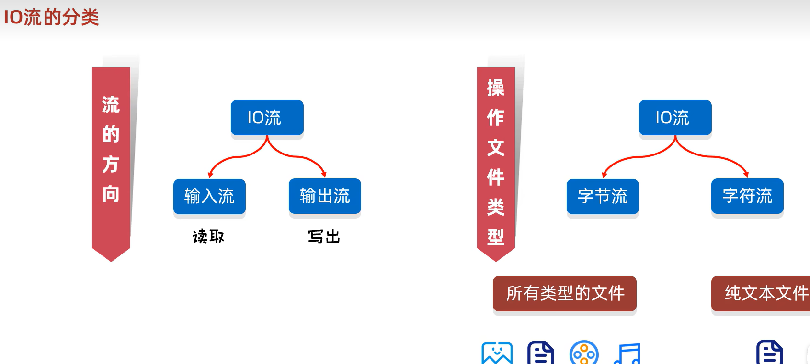

根据数据的流向分为：**输入流**和**输出流**。

* **输入流** ：把数据从`其他设备`上读取到`内存`中的流。 
* **输出流** ：把数据从`内存` 中写出到`其他设备`上的流。

格局数据的类型分为：**字节流**和**字符流**。

* **字节流** ：以字节为单位，读写数据的流。//可以操作所有类型的文件（图片、音频、视频...）
* **字符流** ：以字符为单位，读写数据的流。//只能操作纯文本文件//txt文件，md文件

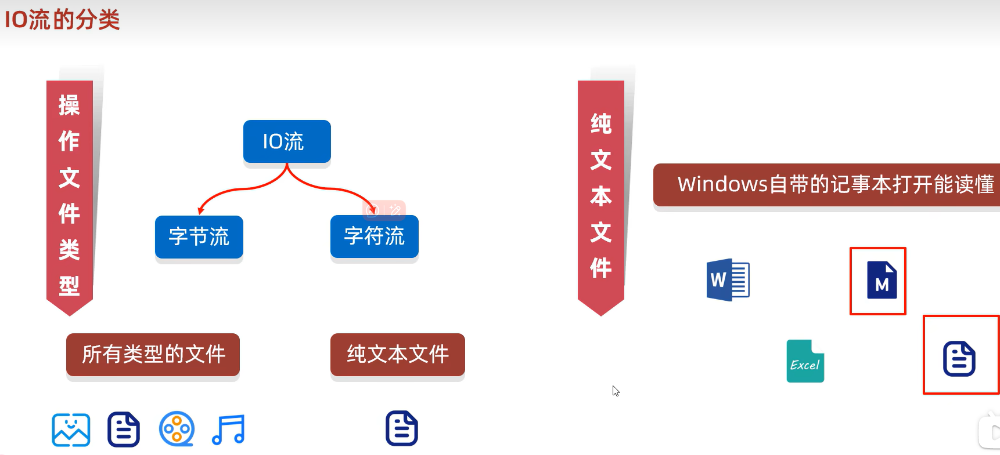

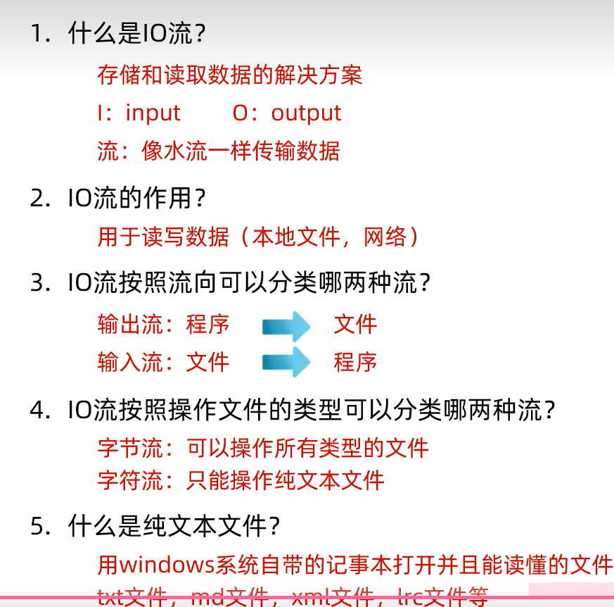

## 1.3 IO的流向说明图解

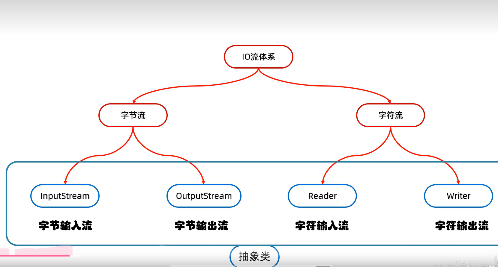

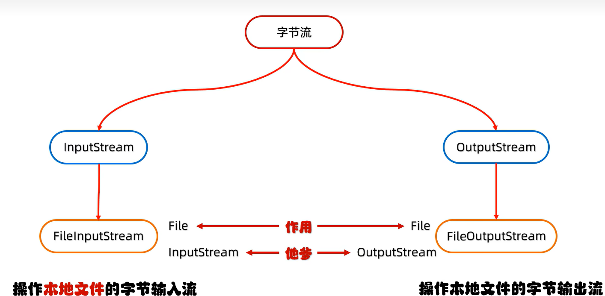


## 1.4 顶级父类们

|         |          **输入流**           |             输出流             |
| :-----: | :------------------------: | :-------------------------: |
| **字节流** | 字节输入流<br />**InputStream** | 字节输出流<br />**OutputStream** |
| **字符流** |   字符输入流<br />**Reader**    |    字符输出流<br />**Writer**    |

# 2. 字节流

## 2.1 一切皆为字节

一切文件数据(文本、图片、视频等)在存储时，都是以二进制数字的形式保存，都一个一个的字节，那么传输时一样如此。所以，字节流可以传输任意文件数据。在操作流的时候，我们要时刻明确，无论使用什么样的流对象，底层传输的始终为二进制数据。

## 2.2 字节输出流【OutputStream】

`java.io.OutputStream `抽象类是表示字节输出流的所有类的超类，将指定的字节信息写出到目的地。它定义了字节输出流的基本共性功能方法。

* `public void close()` ：关闭此输出流并释放与此流相关联的任何系统资源。  
* `public void flush() ` ：刷新此输出流并强制任何缓冲的输出字节被写出。  
* `public void write(byte[] b)`：将 b.length字节从指定的字节数组写入此输出流。  
* `public void write(byte[] b, int off, int len)` ：从指定的字节数组写入 len字节，从偏移量 off开始输出到此输出流。  
* `public abstract void write(int b)` ：将指定的字节输出流。

> 小贴士：
>
> close方法，当完成流的操作时，必须调用此方法，释放系统资源。

## 2.3 FileOutputStream类//可以操作本地文件

#### FileOutputStream的相关理解：

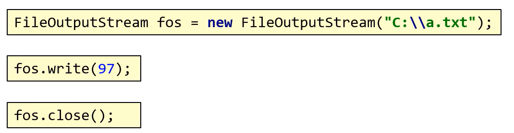


FileOutputStream对象相当于是在程序和文件之中建立了一条供数据传输的 **单行道**


write开始进行数据传输


close释放资源，相当于把这条路给砸了

##### IOException是FileNotFoundException的父类

`OutputStream`有很多子类，我们从最简单的一个子类开始。

`java.io.FileOutputStream `类是文件输出流，用于将数据写出到文件。

### 构造方法//FileOutputStream的一些需要注意的细节：

**1.创建字节输出流对象**：

1/参数是字符串或者File类型的对象都可以   **2/如果这个文件不存在会创建一个新的文件，但是要保证父级路径是存在的（这里的父级路径说的是 当前文件名前面的所有字符串所指向的路径）！！！！！！！**3/如果这个文件已经存在，那么构造方法会清空文件里的所有内容

**2.写数据**：

1/write方法的参数是整数，但实际上写到本地文件中的是整数在ASCII上对应的字符

如果要在文件中展示数字型的97

那么可以分别调用两次write方法，第一次参数：写9的ASCII，第二次参数：写7的ASCII

**3.释放数据**：

如果不释放数据（“通道”），其实底层这个文件的资源一直在被占用（比如正在运行，导致无法删除），无法对这个文件进行其他的操作


* `public FileOutputStream(File file)`：创建文件输出流以写入由指定的 File对象表示的文件。 
* `public FileOutputStream(String name)`： 创建文件输出流以指定的名称写入文件。  //其实源码中 还是会根据这个name调用一个构造生成File类型的对象

当你创建一个流对象时，必须传入一个文件路径。该路径下，如果没有这个文件，会创建该文件。如果有这个文件，会清空这个文件的数据。

* 构造举例，代码如下：

```java
public class FileOutputStreamConstructor throws IOException {
    public static void main(String[] args) {
   	 	// 使用File对象创建流对象
        File file = new File("a.txt");
        FileOutputStream fos = new FileOutputStream(file);
      
        // 使用文件名称创建流对象
        FileOutputStream fos = new FileOutputStream("b.txt");
    }
}
```


### 写出字节数据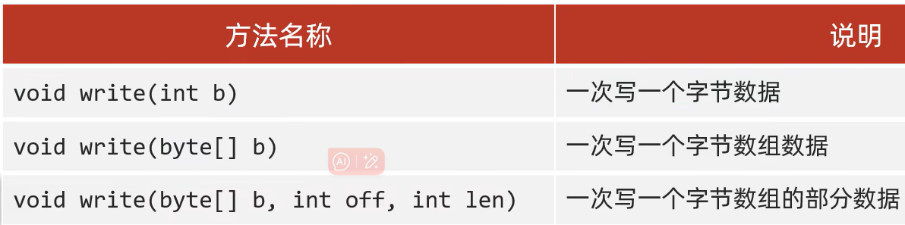

这里的int off是指开始的索引

#### byte[]数组可以通过 String对象.getBytes()获得

1. **写出字节**：`write(int b)` 方法，每次可以写出一个字节数据，代码使用演示：

```java
public class FOSWrite {
    public static void main(String[] args) throws IOException {
        // 使用文件名称创建流对象
        FileOutputStream fos = new FileOutputStream("fos.txt");     
      	// 写出数据
      	fos.write(97); // 写出第1个字节
      	fos.write(98); // 写出第2个字节
      	fos.write(99); // 写出第3个字节
      	// 关闭资源
        fos.close();
    }
}
输出结果：
abc
```

> 小贴士：
>
> 1. 虽然参数为int类型四个字节，但是只会保留一个字节的信息写出。
> 2. 流操作完毕后，必须释放系统资源，调用close方法，千万记得。

2. **写出字节数组**：`write(byte[] b)`，每次可以写出数组中的数据，代码使用演示：

```java
public class FOSWrite {
    public static void main(String[] args) throws IOException {
        // 使用文件名称创建流对象
        FileOutputStream fos = new FileOutputStream("fos.txt");     
      	// 字符串转换为字节数组
      	byte[] b = "黑马程序员".getBytes();
      	// 写出字节数组数据
      	fos.write(b);
      	// 关闭资源
        fos.close();
    }
}
输出结果：
黑马程序员
```

3. **写出指定长度字节数组**：`write(byte[] b, int off, int len)` ,每次写出从off索引开始，len个字节，代码使用演示：

   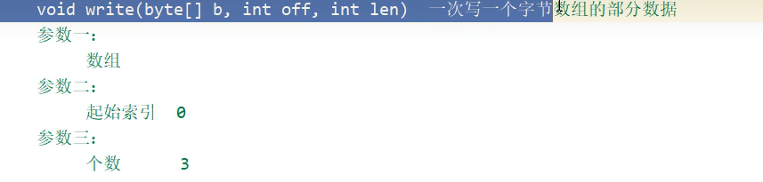

```java
public class FOSWrite {
    public static void main(String[] args) throws IOException {
        // 使用文件名称创建流对象
        FileOutputStream fos = new FileOutputStream("fos.txt");     
      	// 字符串转换为字节数组
      	byte[] b = "abcde".getBytes();
		// 写出从索引2开始，2个字节。索引2是c，两个字节，也就是cd。
        fos.write(b,2,2);
      	// 关闭资源
        fos.close();
    }
}
输出结果：
cd
```

### 数据追加续写

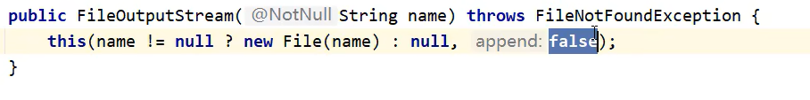

看他会把String的name实例化成一个File对象

这里的this实际上调用的是下面这个构造方法。第二个形参是指 续写开关，默认是false,所以同名文件会清空内容，手动给第二个参数写true,就打开了续写开关**//续写的时候，相当于光标在上一次write的最后一个位置处**

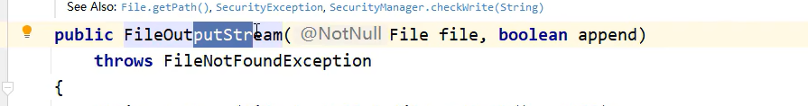


经过以上的演示，每次程序运行，创建输出流对象，都会清空目标文件中的数据。如何保留目标文件中数据，还能继续添加新数据呢？

- `public FileOutputStream(File file, boolean append)`： 创建文件输出流以写入由指定的 File对象表示的文件。  
- `public FileOutputStream(String name, boolean append)`： 创建文件输出流以指定的名称写入文件。  

这两个构造方法，参数中都需要传入一个boolean类型的值，`true` 表示追加数据，`false` 表示清空原有数据。这样创建的输出流对象，就可以指定是否追加续写了，代码使用演示：

```java
public class FOSWrite {
    public static void main(String[] args) throws IOException {
        // 使用文件名称创建流对象
        FileOutputStream fos = new FileOutputStream("fos.txt"，true);     
      	// 字符串转换为字节数组
      	byte[] b = "abcde".getBytes();
		// 写出从索引2开始，2个字节。索引2是c，两个字节，也就是cd。
        fos.write(b);
      	// 关闭资源
        fos.close();
    }
}
文件操作前：cd
文件操作后：cdabcde
```

### 写出换行

早期的window系统中是表示回车（光标移动到本行的最左边），换行（光标下移一位）

Windows系统里，换行符号是**`\r\n`** 。（现在我的win把以前的额=这个 习惯延续下来了）//	**\r\n,\n,\r的效果一样  \n\r相当于两次回车换行了**

Linux:\n

Mac:\r


在win操作系统中，java对回车换行进行了优化

虽然完整的是\r\n,但是我们写其中一个\r或者\n。java也能底层实现代码的补全，实现换行；

**建议不要省略，还是写完整**


以指定是否追加续写了，代码使用演示：

```java
public class FOSWrite {
    public static void main(String[] args) throws IOException {
        // 使用文件名称创建流对象
        FileOutputStream fos = new FileOutputStream("fos.txt");  
      	// 定义字节数组
      	byte[] words = {97,98,99,100,101};
      	// 遍历数组
        for (int i = 0; i < words.length; i++) {
          	// 写出一个字节
            fos.write(words[i]);
          	// 写出一个换行, 换行符号转成数组写出
            fos.write("\r\n".getBytes());
        }
      	// 关闭资源
        fos.close();
    }
}

输出结果：
a
b
c
d
e
```

> * 回车符`\r`和换行符`\n` ：
>   * 回车符：回到一行的开头（return）。
>   * 换行符：下一行（newline）。
> * 系统中的换行：
>   * Windows系统里，每行结尾是 `回车+换行` ，即`\r\n`；
>   * Unix系统里，每行结尾只有 `换行` ，即`\n`；
>   * Mac系统里，每行结尾是 `回车` ，即`\r`。从 Mac OS X开始与Linux统一。

## 2.4 字节输入流【InputStream】

`java.io.InputStream `抽象类是表示字节输入流的所有类的超类，可以读取字节信息到内存中。它定义了字节输入流的基本共性功能方法。

- `public void close()` ：关闭此输入流并释放与此流相关联的任何系统资源。    
- `public abstract int read()`： 从输入流读取数据的下一个字节。 
- `public int read(byte[] b)`： 从输入流中读取一些字节数，并将它们存储到字节数组 b中 。

> 小贴士：
>
> close方法，当完成流的操作时，必须调用此方法，释放系统资源。

## 2.5 FileInputStream类

`java.io.FileInputStream `类是文件输入流，从文件中读取字节。

### 构造方法

* `FileInputStream(File file)`： 通过打开与实际文件的连接来创建一个 FileInputStream ，该文件由文件系统中的 File对象 file命名。 
* `FileInputStream(String name)`： 通过打开与实际文件的连接来创建一个 FileInputStream ，该文件由文件系统中的路径名 name命名。

##### FileInputStream:构造方法的细节：

1.如果路径指向的文件不存在会直接报错，因为读取操作数据应该是在文件里，创造一个新的空的文件是没有任何意义的

2.当你创建一个流对象时，必须传入一个文件路径。该路径下，如果没有该文件,会抛出`FileNotFoundException` 。

- 构造举例，代码如下：

```java
public class FileInputStreamConstructor throws IOException{
    public static void main(String[] args) {
   	 	// 使用File对象创建流对象
        File file = new File("a.txt");
        FileInputStream fos = new FileInputStream(file);
      
        // 使用文件名称创建流对象
        FileInputStream fos = new FileInputStream("b.txt");
    }
}
```

### 读取字节数据

1. **读取字节**：`read`方法（一次一次的去调用），每次可以读取一个字节的数据，提升为int类型，读取到文件末尾，返回`-1`，代码使用演示：

   **一次读一个字节，返回值是对应的ASCII数值。如果读取时，光标所在的位置已经是末尾了，那再次调用read()返回的结果是-1**

   #### 读取一次，指针后移一位！！！！！！！！！！！！！！！！！！		//先读取，再后移

   如果文件中有一个看上去很像负一的数：-1,那么还是分开来读的，先读负号，再调用读1

```java
public class FISRead {
    public static void main(String[] args) throws IOException{
      	// 使用文件名称创建流对象
       	FileInputStream fis = new FileInputStream("read.txt");
      	// 读取数据，返回一个字节
        int read = fis.read();
        System.out.println((char) read);
        read = fis.read();
        System.out.println((char) read);
        read = fis.read();
        System.out.println((char) read);
        read = fis.read();
        System.out.println((char) read);
        read = fis.read();
        System.out.println((char) read);
      	// 读取到末尾,返回-1
       	read = fis.read();
        System.out.println( read);
		// 关闭资源
        fis.close();
    }
}
输出结果：
a
b
c
d
e
-1
```

循环改进读取方式，代码使用演示：

```java
public class FISRead {
    public static void main(String[] args) throws IOException{
      	// 使用文件名称创建流对象
       	FileInputStream fis = new FileInputStream("read.txt");
      	// 定义变量，保存数据
        int b ；
        // 循环读取
        while ((b = fis.read())!=-1) {
            System.out.println((char)b);
        }
		// 关闭资源
        fis.close();
    }
}
输出结果：
a
b
c
d
e
```

> 小贴士：
>
> 1. 虽然读取了一个字节，但是会自动提升为int类型。
> 2. 流操作完毕后，必须释放系统资源，调用close方法，千万记得。

2. **使用字节数组读取**：`read(byte[] b)`，每次读取b的长度个字节到数组中，返回读取到的有效字节个数，读取到末尾时，返回`-1` ，代码使用演示：

   ##### 文件读写的时候，win的回车换行也会被默认为是\r\n,由于read是一个一个的读取，所以最后相当于分别读取了\r和\n

```java
public class FISRead {
    public static void main(String[] args) throws IOException{
      	// 使用文件名称创建流对象.
       	FileInputStream fis = new FileInputStream("read.txt"); // 文件中为abcde
      	// 定义变量，作为有效个数
        int len ；
        // 定义字节数组，作为装字节数据的容器   
        byte[] b = new byte[2];
        // 循环读取
        while (( len= fis.read(b))!=-1) {
           	// 每次读取后,把数组变成字符串打印
            System.out.println(new String(b));
        }
		// 关闭资源
        fis.close();
    }
}

输出结果：
ab
cd
ed
```

错误数据`d`，是由于最后一次读取时，只读取一个字节`e`，数组中，上次读取的数据没有被完全替换，所以要通过`len` ，获取有效的字节，代码使用演示：

```java
public class FISRead {
    public static void main(String[] args) throws IOException{
      	// 使用文件名称创建流对象.
       	FileInputStream fis = new FileInputStream("read.txt"); // 文件中为abcde
      	// 定义变量，作为有效个数
        int len ；
        // 定义字节数组，作为装字节数据的容器   
        byte[] b = new byte[2];
        // 循环读取
        while (( len= fis.read(b))!=-1) {
           	// 每次读取后,把数组的有效字节部分，变成字符串打印
            System.out.println(new String(b，0，len));//  len 每次读取的有效字节个数
        }
		// 关闭资源
        fis.close();
    }
}

输出结果：
ab
cd
e
```

> 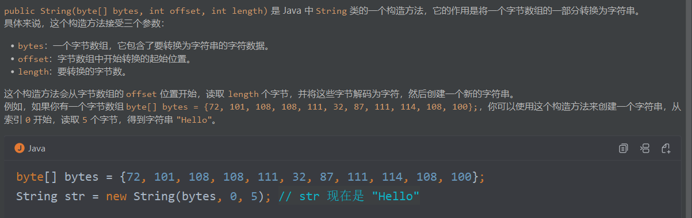
>
> 小贴士：
>
> 使用数组读取，每次读取多个字节，减少了系统间的IO操作次数，从而提高了读写的效率，建议开发中使用。

#### 文件拷贝的基本操作：


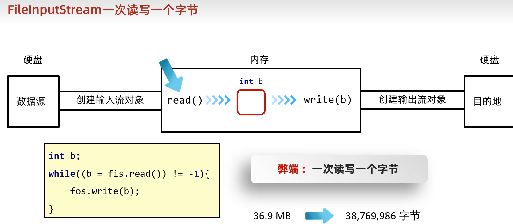

太慢了，读一个写一个

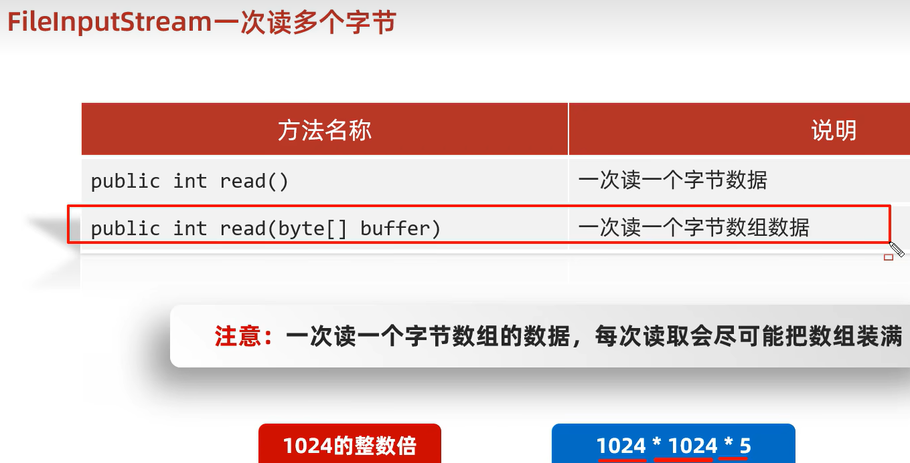

**byte占用1个字节**

read():

空参读取：返回的是这个字符的ASCII码值

byte[]作为参数读取：返回的是本次读取的字符个数，每次读取的时候尽可能把byte[]数组装满，此时数组里面装的就是读取到的字符

**读取的鼠标（蓝色的）本次 读取完毕之后指向下一个即将读取的字符位置**

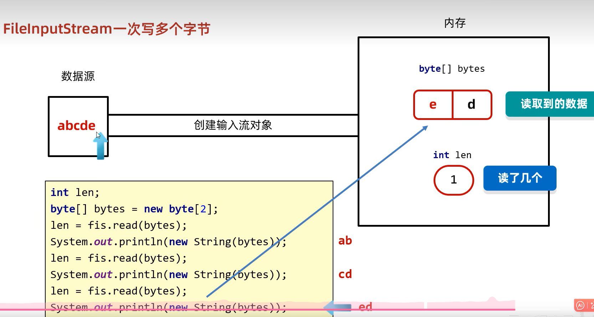

第三次read返回的是1，但是在byte[]数组中只覆盖了索引为0处的元素

如果还要进行第四次读取，那么返回的是-1，byte[]数组中还是{e,d}

##### 在read()过程中，不管是有参还是无参调用，只要（蓝色的鼠标读取不到数据），都是返回-1


下面是一个比较好的解决方法：
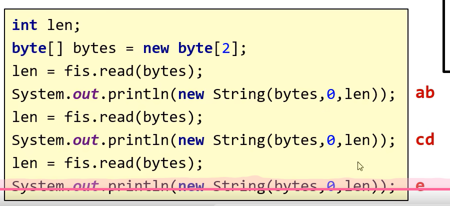

来自String的一种构造方法


## 2.6 字节流练习：图片复制


### 复制原理图解


### 案例实现

复制图片文件，代码使用演示：

```java
public class Copy {
    public static void main(String[] args) throws IOException {
        // 1.创建流对象
        // 1.1 指定数据源
        FileInputStream fis = new FileInputStream("D:\\test.jpg");
        // 1.2 指定目的地
        FileOutputStream fos = new FileOutputStream("test_copy.jpg");

        // 2.读写数据
        // 2.1 定义数组
        byte[] b = new byte[1024];
        // 2.2 定义长度
        int len;
        // 2.3 循环读取
        while ((len = fis.read(b))!=-1) {
            // 2.4 写出数据
            fos.write(b, 0 , len);
        }

        // 3.关闭资源
        fos.close();
        fis.close();
    }
}
```

> 小贴士：
>
> 流的关闭原则：先开后关，后开先关。

## 补充：字符集：

### 1.ascii

ascii有128个数据 0~127 所以计算机存储英文的时候一个字节就足够存储了（一个字节=8个bit 能存256个数据）


### 2.大致了解


下面这四种字符集统称为ANSI


Unicode字符集也叫作 **万国码**

### 3.GBK

（1.英文）


（2.中文）


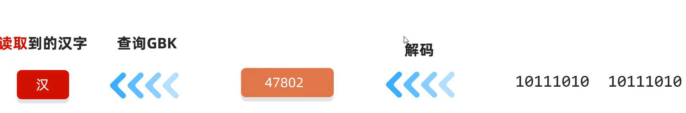


底层也是以开头的来区分中文还是英文的

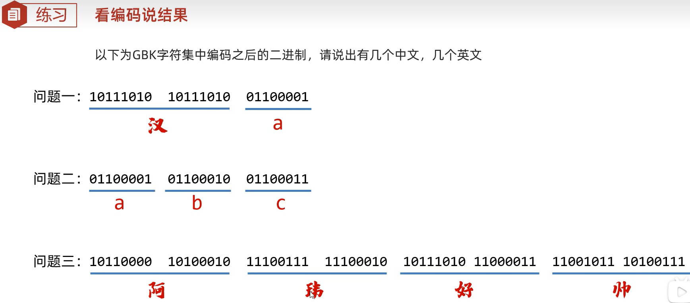


1/从左往右看，左边的第一位字节（8bit）叫做 高位字节，右边的字节叫做	低位字节

2/不需要对二进制再进行变动，直接存储这个二进制进入内存即可

3/如果硬要转化成十进制，那么高位字节转换完后一定是负数，低位字节可能正可能负

4/

**解码：**把实际存储在硬盘上的二进制按照一定的规则进行计算，变成字符集上对应的数据

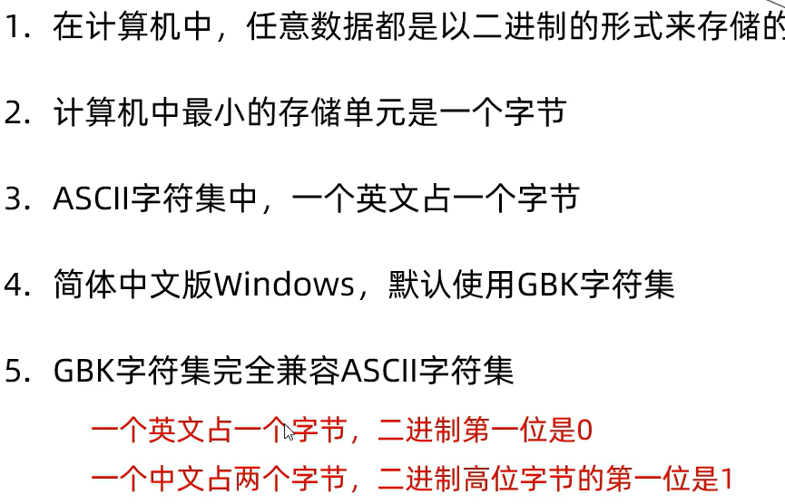

### 4.Unicode字符集

UTF	(	Unicode Transfer	Format)

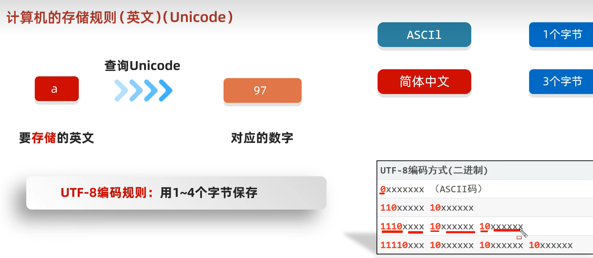

红色的部分是人为手动写的（格式化），中间的各种x需要查询Unicode表对应的值进行填写

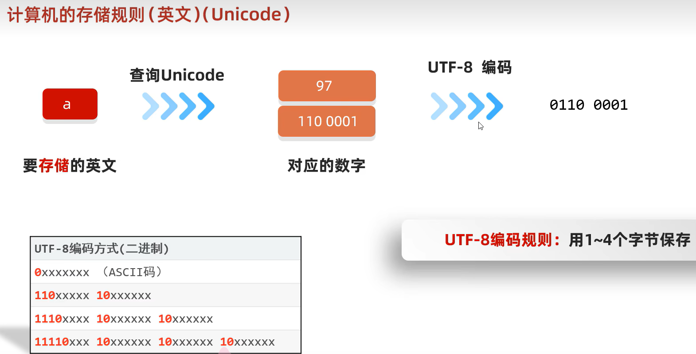

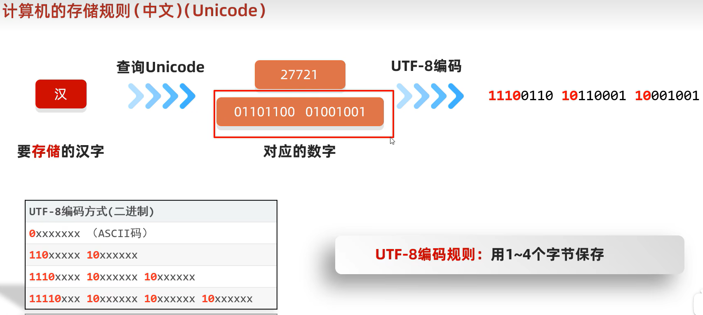


#### 补充：

1.UTF-8是一个字符集吗？

答：不是，是Unicode字符集的一种编码方式

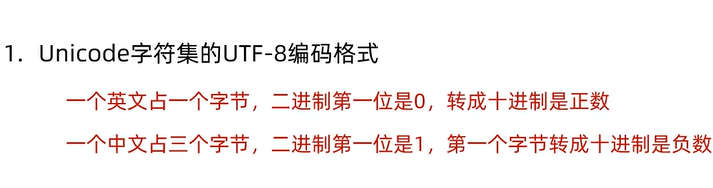


## 为什么会有乱码？

负数在字符集中 系统会显示	问号	或者	方框，因为查找不到对应的数据

#### 1.

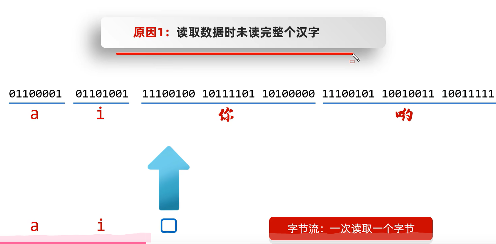


#### 2.正常情况下：

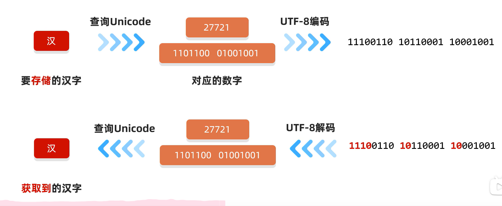

错误情况：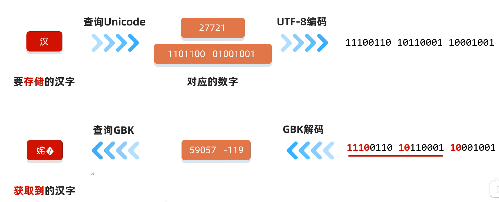


#### 3.如何避免乱码出现：

***<u>1.不要使用字节流去读取文本文件</u>***

***<u>2.编码解码时使用同一个码表，同一种编码方式</u>***


##### 疑问：字节流读取中文会乱码，但是为什么拷贝不乱码呢？

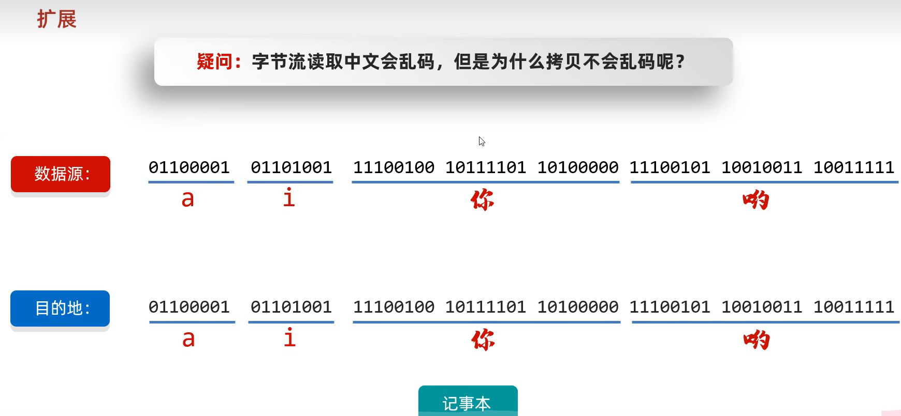

字节流读取数据的时候是一个一个字节的进行读取

如果记事本本身用的编码表和字符集和数据源的一样，是不会出现乱码的


eclipse默认GBK

idea默认Unicode UTF-8

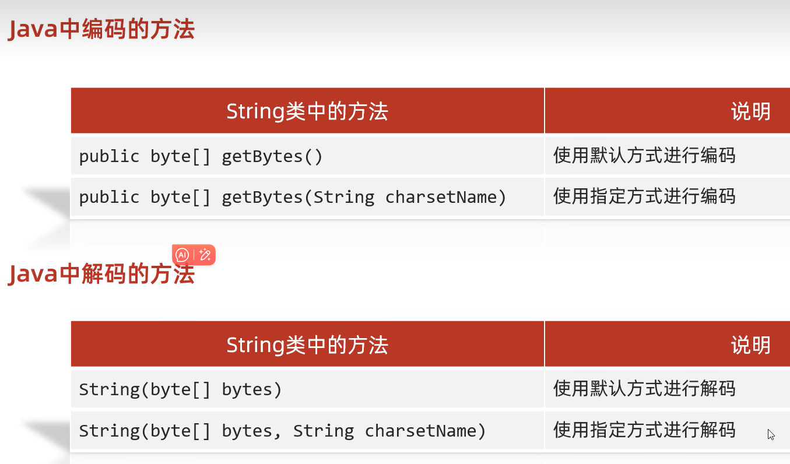

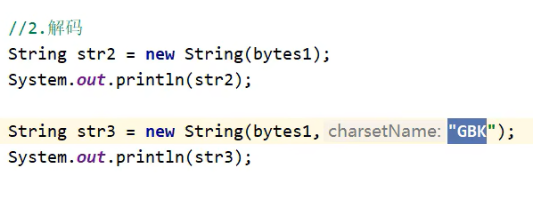

# 3. 字符流

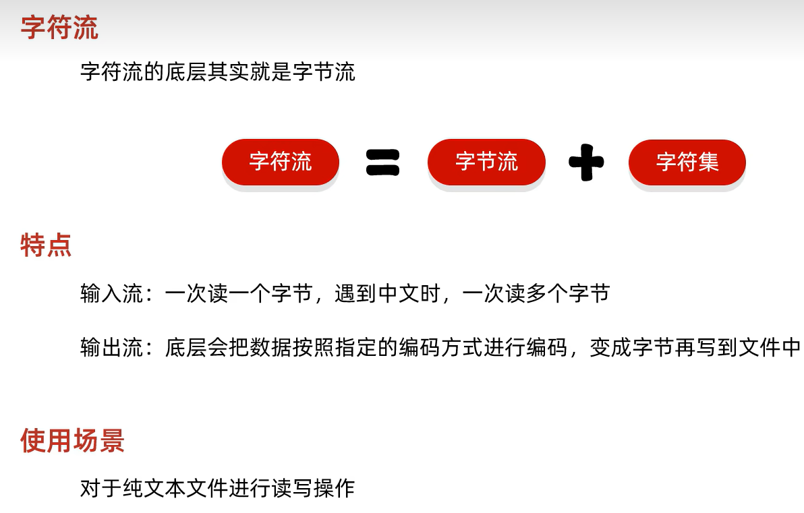

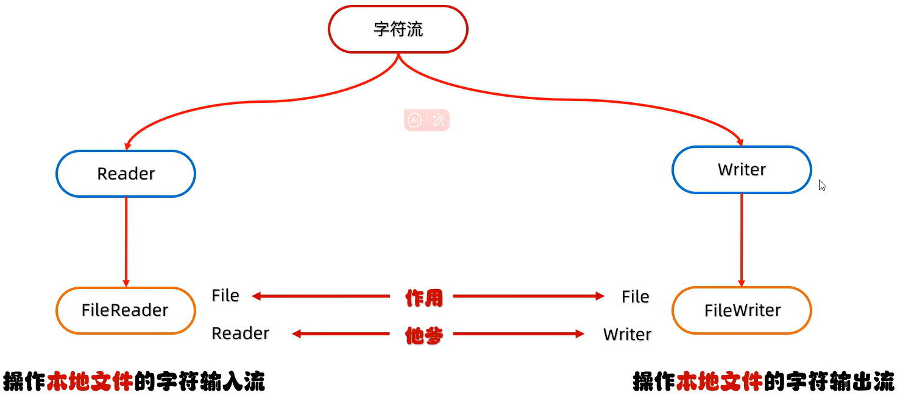

当使用字节流读取文本文件时，可能会有一个小问题。就是遇到中文字符时，可能不会显示完整的字符，那是因为一个中文字符可能占用多个字节存储。所以Java提供一些字符流类，以字符为单位读写数据，专门用于处理文本文件。

## 3.1 字符输入流【Reader】

`java.io.Reader`抽象类是表示用于读取字符流的所有类的超类，可以读取字符信息到内存中。它定义了字符输入流的基本共性功能方法。

- `public void close()` ：关闭此流并释放与此流相关联的任何系统资源。    
- `public int read()`： 从输入流读取一个字符。 
- `public int read(char[] cbuf)`： 从输入流中读取一些字符，并将它们存储到字符数组 cbuf中 。

## 3.2 FileReader类  

`java.io.FileReader `类是读取字符文件的便利类。构造时使用系统默认的字符编码和默认字节缓冲区。

> 小贴士：
>
> 1. 字符编码：字节与字符的对应规则。Windows系统的中文编码默认是GBK编码表。
>
>    idea中UTF-8
>
> 2. 字节缓冲区：一个字节数组，用来临时存储字节数据。

### 构造方法

**如果读取的文件不存在，也是会直接报错的**

- `FileReader(File file)`： 创建一个新的 FileReader ，给定要读取的File对象。   
- `FileReader(String fileName)`： 创建一个新的 FileReader ，给定要读取的文件的名称。  

当你创建一个流对象时，必须传入一个文件路径。类似于FileInputStream 。

- 构造举例，代码如下：

```java
public class FileReaderConstructor throws IOException{
    public static void main(String[] args) {
   	 	// 使用File对象创建流对象
        File file = new File("a.txt");
        FileReader fr = new FileReader(file);
      
        // 使用文件名称创建流对象
        FileReader fr = new FileReader("b.txt");
    }
}
```

### 读取字符数据

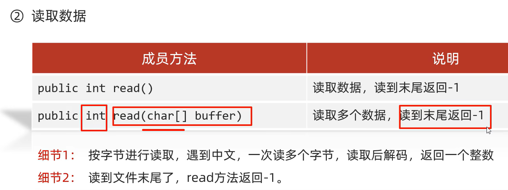

#### read() 会一个字符一个字符的读（这个方法的底层还是字节流的那个读取，只不过会根据读取数据的类型决定一次读取多少个字节）

下面这个是空参read()的一个小小细节:

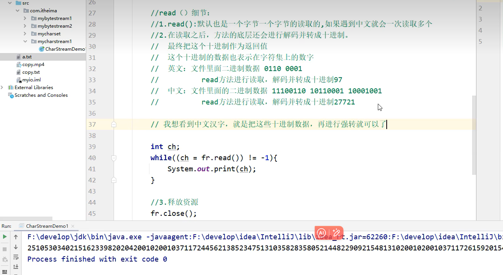

#### read(char[] buffer) 和字节流的实现一样，一次可以读多个数据，并把读取到的数据存储到char[]数组中     //那个int 代表的是读取字符的个数


1. **读取字符**：`read`方法，每次可以读取一个字符的数据，提升为int类型，读取到文件末尾，返回`-1`，循环读取，代码使用演示：

```java
public class FRRead {
    public static void main(String[] args) throws IOException {
      	// 使用文件名称创建流对象
       	FileReader fr = new FileReader("read.txt");
      	// 定义变量，保存数据
        int b ；
        // 循环读取
        while ((b = fr.read())!=-1) {
            System.out.println((char)b);
        }
		// 关闭资源
        fr.close();
    }
}
输出结果：
黑
马
程
序
员
```

> 小贴士：虽然读取了一个字符，但是会自动提升为int类型。
>

2. **使用字符数组读取**：`read(char[] cbuf)`，每次读取b的长度个字符到数组中，返回读取到的有效字符个数，读取到末尾时，返回`-1` ，代码使用演示：**//注意是char类型的数据**

```java
public class FRRead {
    public static void main(String[] args) throws IOException {
      	// 使用文件名称创建流对象
       	FileReader fr = new FileReader("read.txt");
      	// 定义变量，保存有效字符个数
        int len ；
        // 定义字符数组，作为装字符数据的容器
         char[] cbuf = new char[2];
        // 循环读取
        while ((len = fr.read(cbuf))!=-1) {
            System.out.println(new String(cbuf));
        }
		// 关闭资源
        fr.close();
    }
}
输出结果：
黑马
程序
员序
```

获取有效的字符改进，代码使用演示：

```java
public class FISRead {
    public static void main(String[] args) throws IOException {
      	// 使用文件名称创建流对象
       	FileReader fr = new FileReader("read.txt");
      	// 定义变量，保存有效字符个数
        int len ；
        // 定义字符数组，作为装字符数据的容器
        char[] cbuf = new char[2];
        // 循环读取
        while ((len = fr.read(cbuf))!=-1) {
            System.out.println(new String(cbuf,0,len));
        }
    	// 关闭资源
        fr.close();
    }
}

输出结果：
黑马
程序
员
```

### 3.2.1 字符输入流的原理解析：

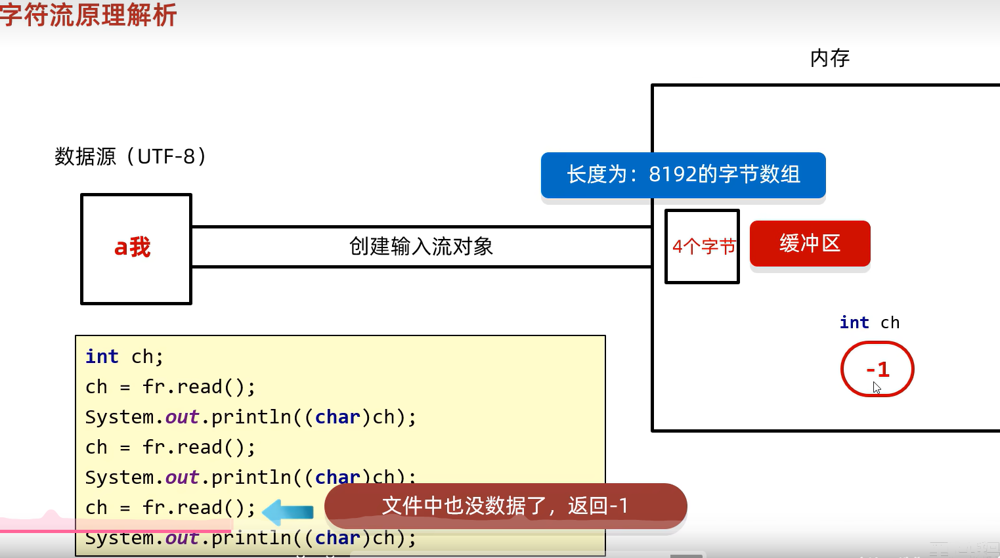

1.创建字符输入流的时候，相当于内存和文件之间有了一个连接的通道，同时，会在内存中会创建一个8192字节的数组作为缓冲区

2.每次read()读取之前，都会去缓冲区看看有没有数据可以被读取

如果没有，就会去文件中读取数据，**尽可能装满缓冲区**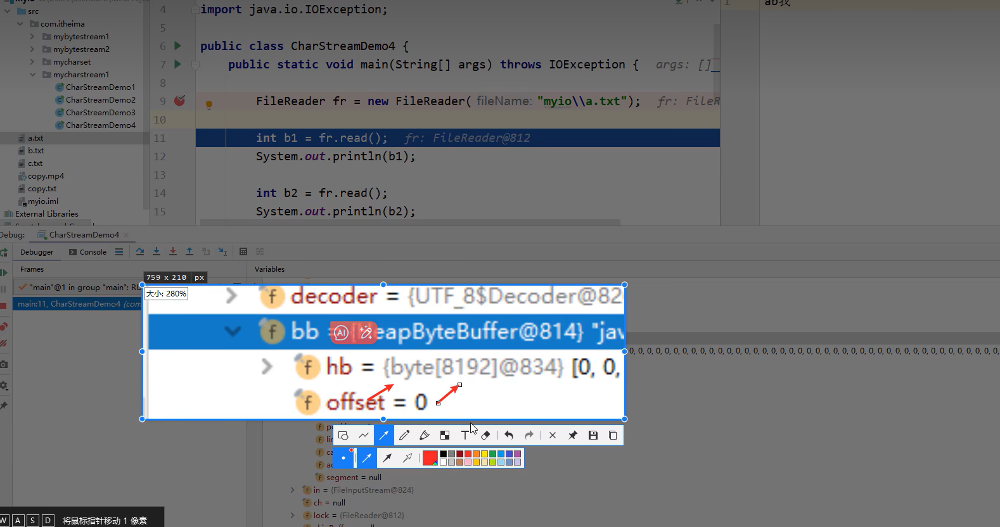

**（↑这个就是缓冲区）**

然后每次从缓冲区去读取数据，减少了频繁去硬盘中读取数据的过程，效率会有很大的提升

3.然后按照UTF-8的形式依次去读取（IDEA），比如这里当第二次read()的时候，是一次性读取三个字节，并把它转成相应的Unicode码的十进制，赋值给ch

4.最后缓冲区没数据了，去文件里面看也读完了，所以返回-1

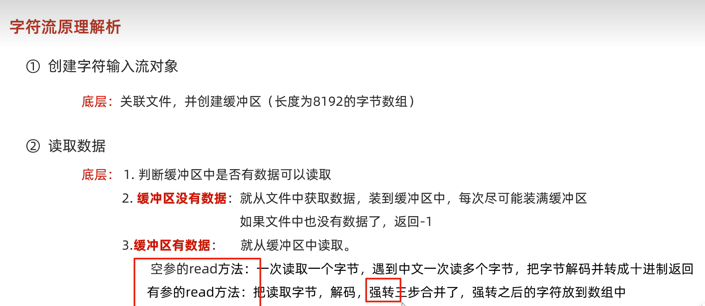

#### 只有字符流有缓冲区，字节流没有缓冲区

思考：当创建write流对象的时候，续写开关的关闭会使该文件的内容全部clear（），那么请问此时还能把文件的内容读出来吗？

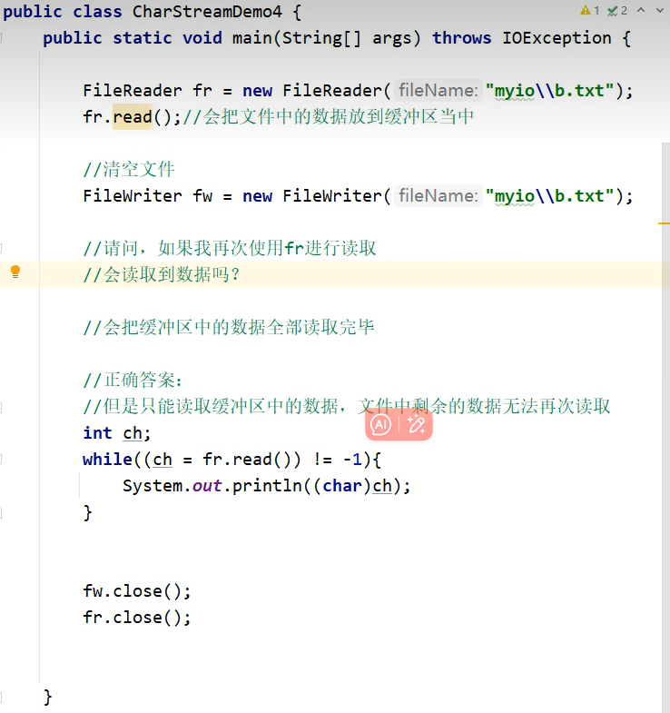

每次要调用read()之前，会从文件中把数据尽可能多的加载到缓冲区中虽然后面创建write流对象的时候源文件的内容被清空了，但是缓冲区内的数据是可以读出来的

### 3.2.2 字符输出流的原理解析：

1.创建输出流对象的同时底层在内存上创建了一个8192的字节数组（缓冲区）

2.字节流是没有缓冲区的，直接写到文件之中。但是字符流有缓冲区，要先写到缓冲区中

3.什么时候缓冲区的数据保存到文件里呢？
1/缓冲区装满了，他自己保存

2/人为的刷新flush

3/释放资源close()//关闭通道之前会先检查缓冲区有没有数据，有的话会把缓冲区的数据全部立马写到文件里

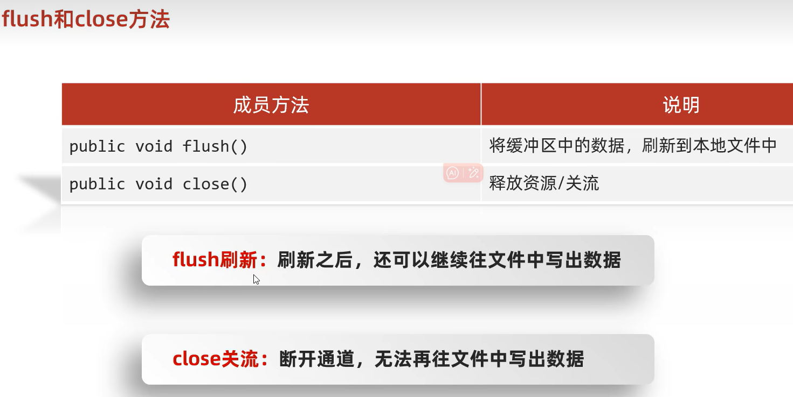

4.每write一次，就把那一次的数据写到缓冲区里面（不是像输入流的那种全部一起写）

#### 缓冲区相关机制的补充：


#### 字节流： 可以拷贝任意类型的文件  字符流：读取纯文本文件中的数据	/	往纯文本文件中写出数据

## 3.3 字符输出流【Writer】

`java.io.Writer `抽象类是表示用于写出字符流的所有类的超类，将指定的字符信息写出到目的地。它定义了字节输出流的基本共性功能方法。

- `void write(int c)` 写入单个字符。
- `void write(char[] cbuf) `写入字符数组。 
- `abstract  void write(char[] cbuf, int off, int len) `写入字符数组的某一部分,off数组的开始索引,len写的字符个数。 
- `void write(String str) `写入字符串。 
- `void write(String str, int off, int len)` 写入字符串的某一部分,off字符串的开始索引,len写的字符个数。
- `void flush() `刷新该流的缓冲。  
- `void close()` 关闭此流，但要先刷新它。 

## 3.4 FileWriter类

`java.io.FileWriter `类是写出字符到文件的便利类。构造时使用系统默认的字符编码和默认字节缓冲区。

### 构造方法

- `FileWriter(File file)`： 创建一个新的 FileWriter，给定要读取的File对象。   
- `FileWriter(String fileName)`： 创建一个新的 FileWriter，给定要读取的文件的名称。  
- **这两种构造方法是默认关闭续写的，所以当你创建对象的时候，文件如果存在，他会清空**//如果不想清空，想继续续写，可以在第二个参数那里改写续写开关


当你创建一个流对象时，必须传入一个文件路径，类似于FileOutputStream。

- 构造举例，代码如下：

```java
public class FileWriterConstructor {
    public static void main(String[] args) throws IOException {
   	 	// 使用File对象创建流对象
        File file = new File("a.txt");
        FileWriter fw = new FileWriter(file);
      
        // 使用文件名称创建流对象
        FileWriter fw = new FileWriter("b.txt");
    }
}
```

### 基本写出数据

**写出字符**：`write(int b)` 方法，每次可以写出一个字符数据，代码使用演示：

```java
public class FWWrite {
    public static void main(String[] args) throws IOException {
        // 使用文件名称创建流对象
        FileWriter fw = new FileWriter("fw.txt");     
      	// 写出数据
      	fw.write(97); // 写出第1个字符
      	fw.write('b'); // 写出第2个字符
      	fw.write('C'); // 写出第3个字符
      	fw.write(30000); // 写出第4个字符，中文编码表中30000对应一个汉字。
      
      	/*
        【注意】关闭资源时,与FileOutputStream不同。
      	 如果不关闭,数据只是保存到缓冲区，并未保存到文件。
        */
        // fw.close();
    }
}
输出结果：
abC田
```

> 小贴士：
>
> 1. 虽然参数为int类型四个字节，但是只会保留一个字符的信息写出。
> 2. 未调用close方法，数据只是保存到了缓冲区，并未写出到文件中。

### 关闭和刷新

因为内置缓冲区的原因，如果不关闭输出流，无法写出字符到文件中。但是关闭的流对象，是无法继续写出数据的。如果我们既想写出数据，又想继续使用流，就需要`flush` 方法了。

* `flush` ：刷新缓冲区，流对象可以继续使用。
* `close `:先刷新缓冲区，然后通知系统释放资源。流对象不可以再被使用了。**//几乎所有的IO流都要关流，随着课程的深入，以后特别记一下不用关流的流即可**//关闭一个输出流的同时还会冲刷用于该输出流的缓冲区，把这些数据生出。如果不关闭，那么写出字节的最后一个包永远不可能被传递，除非人为的调用flush方法

代码使用演示：

```java
public class FWWrite {
    public static void main(String[] args) throws IOException {
        // 使用文件名称创建流对象
        FileWriter fw = new FileWriter("fw.txt");
        // 写出数据，通过flush
        fw.write('刷'); // 写出第1个字符
        fw.flush();
        fw.write('新'); // 继续写出第2个字符，写出成功
        fw.flush();
      
      	// 写出数据，通过close
        fw.write('关'); // 写出第1个字符
        fw.close();
        fw.write('闭'); // 继续写出第2个字符,【报错】java.io.IOException: Stream closed
        fw.close();
    }
}
```

> 小贴士：即便是flush方法写出了数据，操作的最后还是要调用close方法，释放系统资源。

### 写出其他数据

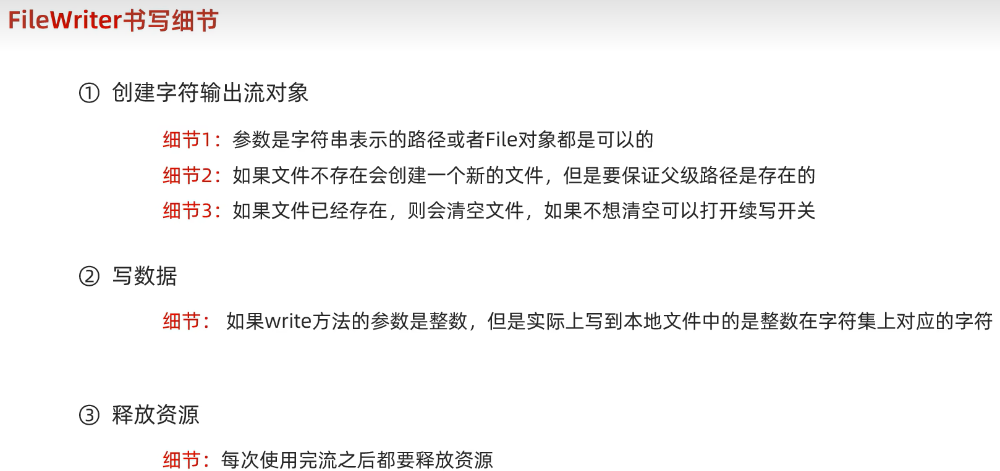

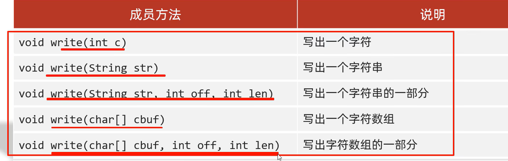

1/在调用write(int c)这个方法的时候，这个c相当于是某个字符在Unicode中对应的十进制码，他会把这个码根据相应的编码规则转化成符合要求的 二进制码，存储到内存之中

2/中文状态的标点符所占内存的字节大小和汉字一样大小

1. **写出字符数组** ：`write(char[] cbuf)` 和 `write(char[] cbuf, int off, int len)` ，每次可以写出字符数组中的数据，用法类似FileOutputStream，代码使用演示：

```java
public class FWWrite {
    public static void main(String[] args) throws IOException {
        // 使用文件名称创建流对象
        FileWriter fw = new FileWriter("fw.txt");     
      	// 字符串转换为字节数组
      	char[] chars = "黑马程序员".toCharArray();
      
      	// 写出字符数组
      	fw.write(chars); // 黑马程序员
        
		// 写出从索引2开始，2个字节。索引2是'程'，两个字节，也就是'程序'。
        fw.write(b,2,2); // 程序
      
      	// 关闭资源
        fos.close();
    }
}
```

2. **写出字符串**：`write(String str)` 和 `write(String str, int off, int len)` ，每次可以写出字符串中的数据，更为方便，代码使用演示：

```java
public class FWWrite {
    public static void main(String[] args) throws IOException {
        // 使用文件名称创建流对象
        FileWriter fw = new FileWriter("fw.txt");     
      	// 字符串
      	String msg = "黑马程序员";
      
      	// 写出字符数组
      	fw.write(msg); //黑马程序员
      
		// 写出从索引2开始，2个字节。索引2是'程'，两个字节，也就是'程序'。
        fw.write(msg,2,2);	// 程序
      	
        // 关闭资源
        fos.close();
    }
}
```

3. **续写和换行**：操作类似于FileOutputStream。

```java
public class FWWrite {
    public static void main(String[] args) throws IOException {
        // 使用文件名称创建流对象，可以续写数据
        FileWriter fw = new FileWriter("fw.txt"，true);     
      	// 写出字符串
        fw.write("黑马");
      	// 写出换行
      	fw.write("\r\n");
      	// 写出字符串
  		fw.write("程序员");
      	// 关闭资源
        fw.close();
    }
}
输出结果:
黑马
程序员
```

> 小贴士：字符流，只能操作文本文件，不能操作图片，视频等非文本文件。
>
> 当我们单纯读或者写文本文件时  使用字符流 其他情况使用字节流

# 4. IO异常的处理

### try-catch的异常处理（了解知道有这么回事，看得懂代码就行）

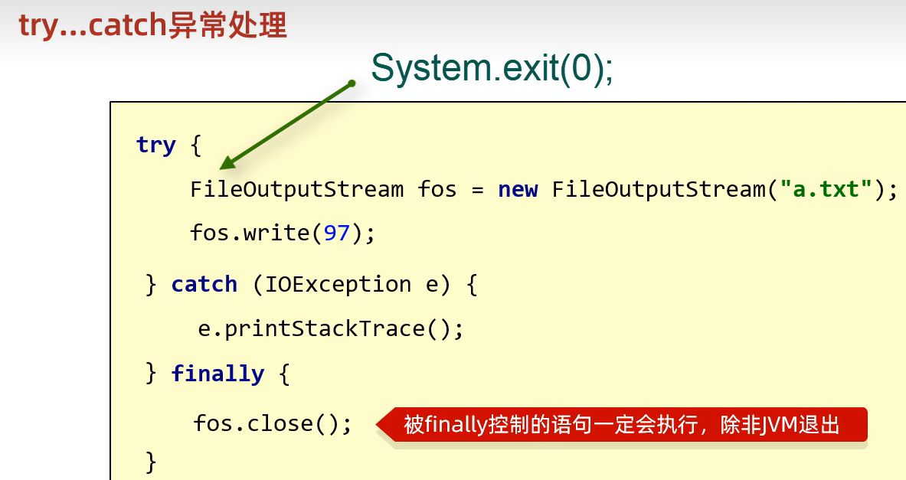

1.如果try中没有异常，那么执行的代码从try->finally

2.如果try中有异常，那么那个异常跳转到catch->finally

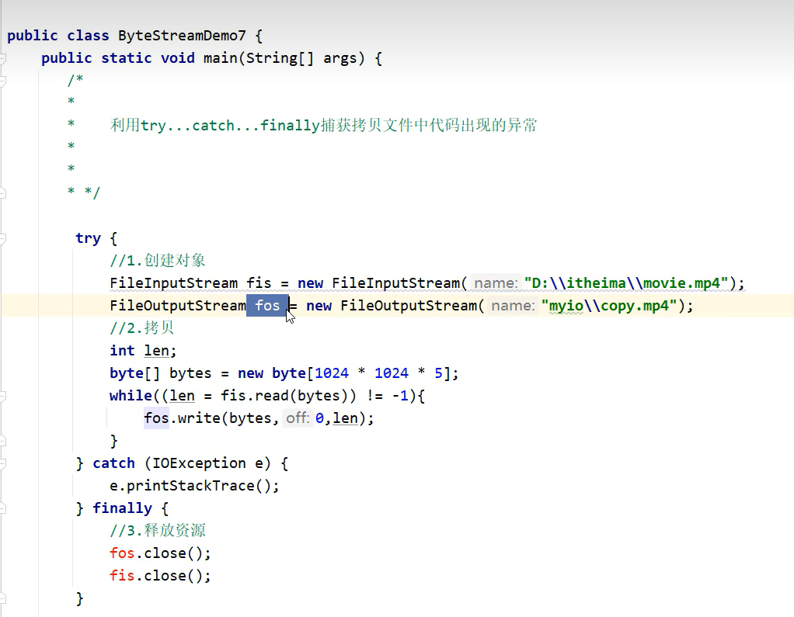

变量依然只能在所属的大括号内使用，除非定义为成员变量

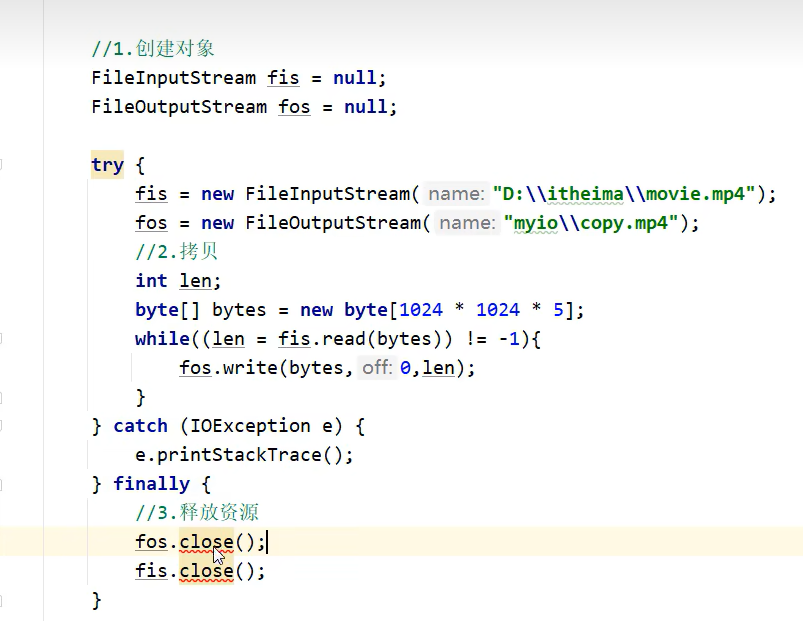

1/注意这里的new FileInputStream不能写在try-catch的外面，因为try-catch本来就是为了捕获IOException，然而这个new对象的时候本身也是可能会出现编译时异常的

2/要对fos,fis进行初始化，你在try里的初始化在编译的时候不会对finally里的对应变量造成影响

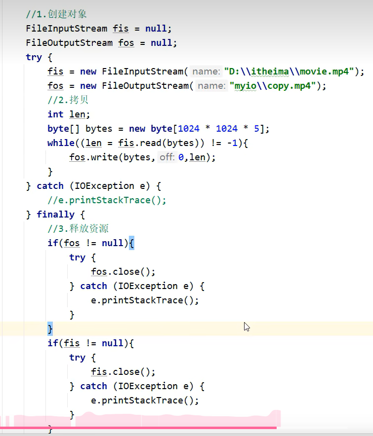

### JDK7前处理

之前的入门练习，我们一直把异常抛出，而实际开发中并不能这样处理，建议使用`try...catch...finally` 代码块，处理异常部分，代码使用演示：

```java  
public class HandleException1 {
    public static void main(String[] args) {
      	// 声明变量
        FileWriter fw = null;
        try {
            //创建流对象
            fw = new FileWriter("fw.txt");
            // 写出数据
            fw.write("黑马程序员"); //黑马程序员
        } catch (IOException e) {
            e.printStackTrace();
        } finally {
            try {
                if (fw != null) {
                    fw.close();
                }
            } catch (IOException e) {
                e.printStackTrace();
            }
        }
    }
}
```

### JDK7的处理(扩展知识点了解内容)

##### 了解即可：

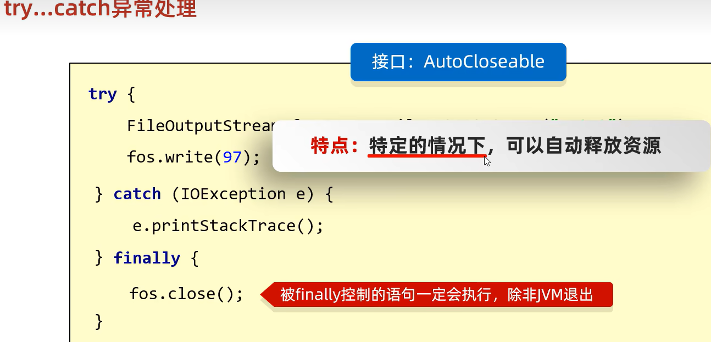

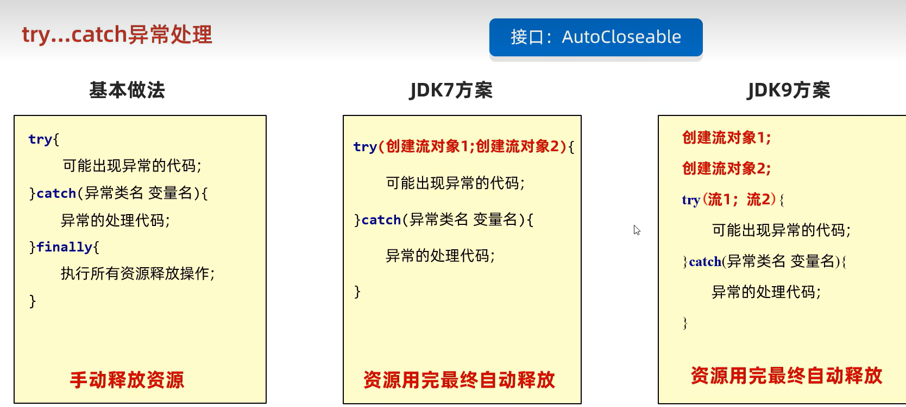

jdk7，jdk9中创建的流对象是 AutoCloseable接口的 实现类对象，他们都表示try-catch代码块里的代码执行完之后自动释放 

刚才所创建的流对象


还可以使用JDK7优化后的`try-with-resource` 语句，该语句确保了每个资源在语句结束时关闭。所谓的资源（resource）是指在程序完成后，必须关闭的对象。

格式：

```java
try (创建流对象语句，如果多个,使用';'隔开) {
	// 读写数据
} catch (IOException e) {
	e.printStackTrace();
}
```

代码使用演示：

```java
public class HandleException2 {
    public static void main(String[] args) {
      	// 创建流对象
        try ( FileWriter fw = new FileWriter("fw.txt"); ) {
            // 写出数据
            fw.write("黑马程序员"); //黑马程序员
        } catch (IOException e) {
            e.printStackTrace();
        }
    }
}
```

### JDK9的改进(扩展知识点了解内容)

JDK9中`try-with-resource` 的改进，对于**引入对象**的方式，支持的更加简洁。被引入的对象，同样可以自动关闭，无需手动close，我们来了解一下格式。

改进前格式：

```java
// 被final修饰的对象
final Resource resource1 = new Resource("resource1");
// 普通对象
Resource resource2 = new Resource("resource2");
// 引入方式：创建新的变量保存
try (Resource r1 = resource1;
     Resource r2 = resource2) {
     // 使用对象
}
```

改进后格式：

```java
// 被final修饰的对象
final Resource resource1 = new Resource("resource1");
// 普通对象
Resource resource2 = new Resource("resource2");

// 引入方式：直接引入
try (resource1; resource2) {
     // 使用对象
}
```

改进后，代码使用演示：

```java
public class TryDemo {
    public static void main(String[] args) throws IOException {
       	// 创建流对象
        final  FileReader fr  = new FileReader("in.txt");
        FileWriter fw = new FileWriter("out.txt");
       	// 引入到try中
        try (fr; fw) {
          	// 定义变量
            int b;
          	// 读取数据
          	while ((b = fr.read())!=-1) {
            	// 写出数据
            	fw.write(b);
          	}
        } catch (IOException e) {
            e.printStackTrace();
        }
    }
}
```

# 5. 综合练习

## 练习1：拷贝文件夹//要特别注意新文件（夹）的名字//文件夹要手动创建，但是文件可以是输出流new的时候自行创建

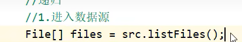

如果要拷贝的文件夹有权限设置，那么返回的是null，所以进行非空判断就可以了

```java
public class Test01 {
    public static void main(String[] args) throws IOException {
        //拷贝一个文件夹，考虑子文件夹

        //1.创建对象表示数据源
        File src = new File("D:\\aaa\\src");
        //2.创建对象表示目的地
        File dest = new File("D:\\aaa\\dest");

        //3.调用方法开始拷贝
        copydir(src,dest);


    }

    /*
    * 作用：拷贝文件夹
    * 参数一：数据源
    * 参数二：目的地
    *
    * */
    private static void copydir(File src, File dest) throws IOException {
        dest.mkdirs();
        //递归
        //1.进入数据源
        File[] files = src.listFiles();
        //2.遍历数组
        for (File file : files) {
            if(file.isFile()){
                //3.判断文件，拷贝
                FileInputStream fis = new FileInputStream(file);
                FileOutputStream fos = new FileOutputStream(new File(dest,file.getName()));
                byte[] bytes = new byte[1024];
                int len;
                while((len = fis.read(bytes)) != -1){
                    fos.write(bytes,0,len);
                }
                fos.close();
                fis.close();
            }else {
                //4.判断文件夹，递归
                copydir(file, new File(dest,file.getName()));
            }
        }
    }
}

```

## 练习2：文件加密

### 异或^:如果一个数字异或另外一个数字2次，得到的结果还是他本身

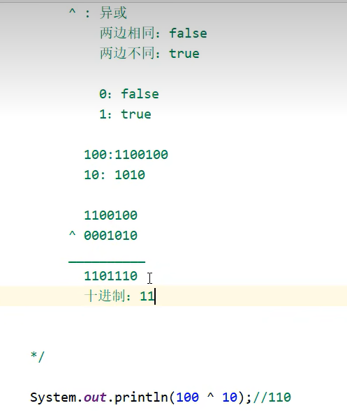

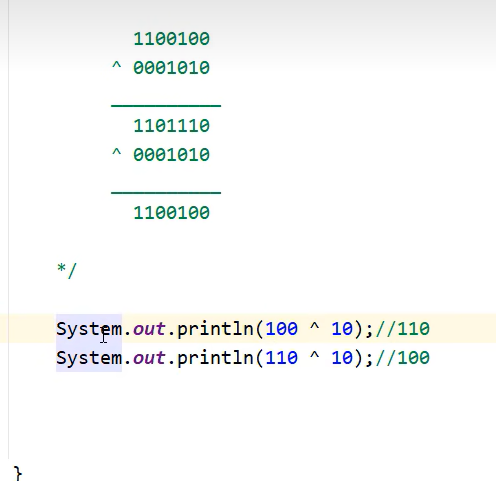

#### Arrays.setAll()使int数组中的每个数据都进行异或处理(但这里是byte数组，处理不了)：


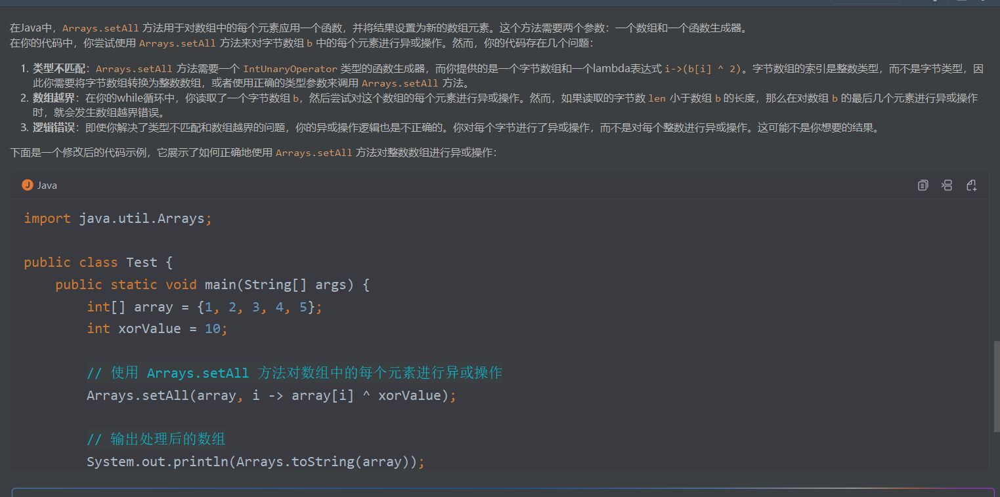

```java
public class Test02 {
    public static void main(String[] args) throws IOException {
        /*
            为了保证文件的安全性，就需要对原始文件进行加密存储，再使用的时候再对其进行解密处理。
            加密原理：
                对原始文件中的每一个字节数据进行更改，然后将更改以后的数据存储到新的文件中。
            解密原理：
                读取加密之后的文件，按照加密的规则反向操作，变成原始文件。

             ^ : 异或
                 两边相同：false
                 两边不同：true

                 0：false
                 1：true

               100:1100100
               10: 1010

               1100100
             ^ 0001010
             __________
               1101110
             ^ 0001010
             __________
               1100100

        */
    }

    public static void encryptionAndReduction(File src, File dest) throws IOException {
        FileInputStream fis = new FileInputStream(src);
        FileOutputStream fos = new FileOutputStream(dest);
        int b;
        while ((b = fis.read()) != -1) {
            fos.write(b ^ 2);
        }
        //4.释放资源
        fos.close();
        fis.close();
    }


}
//执行一次，得到的是加密文件	a1	；然后再把	scr换成a1, dest写另一个路径，再次执行这个代码就得到了重写的解密文件
```

## 练习3：数字排序

文本文件中有以下的数据：
                2-1-9-4-7-8
 将文件中的数据进行排序，变成以下的数据：
                1-2-4-7-8-9

### 实现方式一：由于目前学的是从文件中获取数据和向文件中写数据，暂时还没学直接更改文件中的数据，所以更改内容这一步是在程序中完成

```java
public class Test03 {
    public static void main(String[] args) throws IOException {
        /*
            文本文件中有以下的数据：
                2-1-9-4-7-8
            将文件中的数据进行排序，变成以下的数据：
                1-2-4-7-8-9
        */


        //1.读取数据
        FileReader fr = new FileReader("myio\\a.txt");
        StringBuilder sb = new StringBuilder();
        int ch;
        while((ch = fr.read()) != -1){
            sb.append((char)ch);
        }
        fr.close();
        System.out.println(sb);
        //2.排序
        String str = sb.toString();
        String[] arrStr = str.split("-");//2-1-9-4-7-8

        ArrayList<Integer> list = new ArrayList<>();
        for (String s : arrStr) {
            int i = Integer.parseInt(s);
            list.add(i);
        }
        Collections.sort(list);
        System.out.println(list);
        //3.写出
        FileWriter fw = new FileWriter("myio\\a.txt");
        for (int i = 0; i < list.size(); i++) {
            if(i == list.size() - 1){
                fw.write(list.get(i) + "");
            }else{
                fw.write(list.get(i) + "-");
            }
        }//字符流输出的一定要是字符（串）的形式，不然会报错☆☆☆☆☆☆☆☆☆☆☆☆☆☆☆☆☆☆☆☆☆☆☆☆☆☆☆☆☆☆☆☆☆☆☆☆☆☆☆☆☆☆☆☆☆☆☆☆☆☆☆☆☆☆☆☆☆☆☆☆☆这里把流的结果赋值给一个数组而不是foreach，主要是考虑到后面如果是最后一个数据，后面不能用“-”输出，需要用索引控制，而foreach显然不能达到这样的效果☆☆☆☆☆☆☆☆☆☆☆☆☆☆☆☆☆☆☆☆☆☆☆☆☆☆☆☆☆☆☆☆☆☆☆☆☆☆☆☆☆☆☆☆☆☆☆☆☆☆☆☆☆☆☆☆☆☆☆☆☆☆☆☆☆☆☆
        fw.close();//这里用fori循环不用for循环的原因就是需要通过索引来控制保证输出的最后一个数据后面没哟“-”
    }
}
```

实现方式二：

```java
public class Test04 {
    public static void main(String[] args) throws IOException {
        /*
            文本文件中有以下的数据：
                2-1-9-4-7-8
            将文件中的数据进行排序，变成以下的数据：
                1-2-4-7-8-9

           细节1：
                文件中的数据不要换行

            细节2:
                bom头
        */
        //1.读取数据
        FileReader fr = new FileReader("myio\\a.txt");
        StringBuilder sb = new StringBuilder();
        int ch;
        while((ch = fr.read()) != -1){
            sb.append((char)ch);
        }
        fr.close();
        System.out.println(sb);
        //2.排序
        Integer[] arr = Arrays.stream(sb.toString()
                                      .split("-"))
            .map(Integer::parseInt)
            .sorted()//☆☆☆☆☆☆☆☆☆☆☆☆☆☆☆☆☆☆☆☆☆☆☆☆☆☆☆☆☆☆☆☆☆☆☆☆☆☆☆☆☆☆☆☆☆☆☆☆☆☆☆☆☆☆☆☆☆☆☆☆☆数组都有直接的sorted()方法☆☆☆☆☆☆☆☆☆☆☆☆☆☆☆☆☆☆☆☆☆☆☆☆☆☆☆☆☆☆☆☆☆☆☆☆☆☆☆☆☆☆☆☆☆☆☆☆☆☆☆☆☆☆☆☆☆☆☆☆☆☆☆☆☆☆☆
            .toArray(Integer[]::new);
        //3.写出
        FileWriter fw = new FileWriter("myio\\a.txt");
        String s = Arrays.toString(arr).replace(", ","-");//arr是int型的数组，直接输出的话可能会出问题尤其是对于字符流
        String result = s.substring(1, s.length() - 1);
        fw.write(result);
        fw.close();
    }
}
```


### BOM头：

如果是关联本地的一些文件，可能这些文件的开头会有一些隐藏的字符文件标记，即bom头


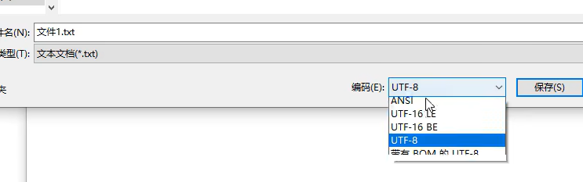

这样是没有bom头的


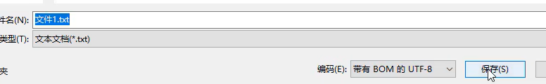

这样是有bom头的，读取文件的时候会把那些bom头读取到

#### 补充：Arrays和Collections的区别：

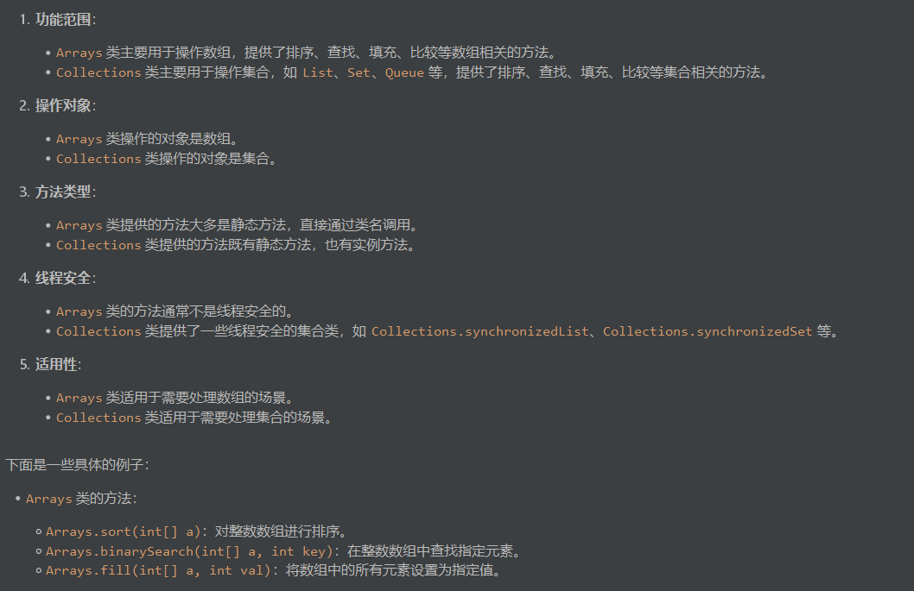


## 总结：不管是字节流还是字符流，write中如果是Int/byte的数据，那么代表的是这个数据的Unicode的十进制值，如果是byte数组（字节流），也是这样的表示，，，，如果是char[] String[] String则代表的就是这个字符一样的字符数据

