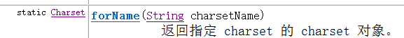
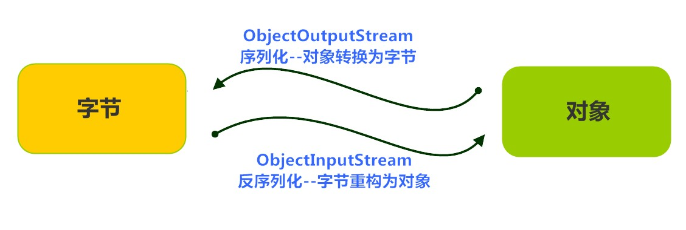
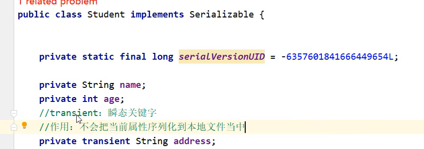
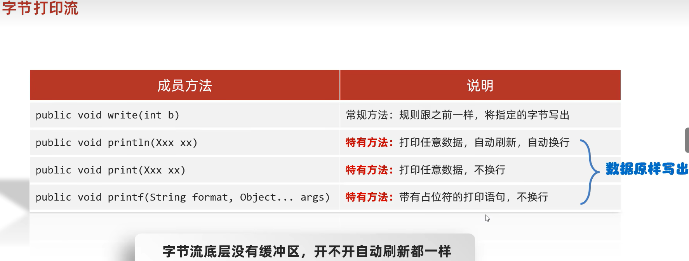

FileReader,FileWriter中已经有缓冲区了，所以BufferedReader,BufferedWriter提升的效率不明显，但是里面有两个很好用的方法

# 1. 缓冲流


昨天学习了基本的一些流，作为IO流的入门，今天我们要见识一些更强大的流。比如能够高效读写的缓冲流，能够转换编码的转换流，能够持久化存储对象的序列化流等等。这些功能更为强大的流，都是在基本的流对象基础之上创建而来的，就像穿上铠甲的武士一样，相当于是对基本流对象的一种增强。


缓冲流本身不能直接读取，写 文件中的数据，真正 读写 数据的还是之前的基本流，只不过是缓冲区的作用 使基本流的读取数据变更高

## 1.1 概述//一次读取单个字节和多个字节与FileInputStream的实现是一样的，前者用int型变量接收，后者用byte[]数组接收

缓冲流,也叫高效流，是对4个基本的`FileXxx` 流的增强，所以也是4个流，按照数据类型分类：

* **字节缓冲流**：`BufferedInputStream`，`BufferedOutputStream` 
* **字符缓冲流**：`BufferedReader`，`BufferedWriter`

缓冲流的基本原理，是在创建流对象时，会创建一个内置的默认大小的缓冲区数组，通过缓冲区读写，**减少系统IO次数**，从而提高读写的效率。

## 1.2 字节缓冲流

### 构造方法

* `public BufferedInputStream(InputStream in)` ：创建一个 新的缓冲输入流。 
* `public BufferedOutputStream(OutputStream out)`： 创建一个新的缓冲输出流。


第一行那个是默认8192缓冲区大小

第二行的构造方法是可以手动设置缓冲区的大小


#### 对字节缓冲输入/出流进行close的时候，不用自己去关闭里面的InputStream()/OutputStream(),因为对字节缓冲输入/出流来说，在把缓冲区的数据刷新flush到文件时，不管有没有异常，已经把里面的InputStream()/OutputStream()在方法里面关闭了


构造举例，代码如下：

```java
// 创建字节缓冲输入流
BufferedInputStream bis = new BufferedInputStream(new FileInputStream("bis.txt"));
// 创建字节缓冲输出流
BufferedOutputStream bos = new BufferedOutputStream(new FileOutputStream("bos.txt"));
```

### 提升效率的原理：


**输入缓冲区	**和	**输出缓冲区	**是两个不同的缓冲区

**缓冲输入流的两个部分：**

基本流：从文件中读取数据
缓冲区1：把读取的数据尽可能多的填满输入缓冲区

**缓冲输出流的两个部分：**

缓冲区2：当缓冲区2的数据被填满之后，通过基本流向文件中写数据
基本流：向文件中写数据


**内存中的这个Int b就是频繁的在两个缓冲区中进行数据的传递：**<u>*//这个过程是发生在内存中，内存中运行的时间基本可以忽略不计，所以其实所说的效率提升，节省的是内存与硬盘来回传输打交道的时间*</u>
如果缓冲区1中的数据被b读取完了，那么缓冲区1会再次从数据源中读取尽可能多的数据

如果缓冲区2中的数据已经被写满了，那么缓冲区2中的数据会被基本流写到目的地中


如果定义的是用数组进行传输，会传输的更快，这个数组与缓冲区不冲突

### 效率测试

查询API，缓冲流读写方法与基本的流是一致的，我们通过复制大文件（375MB），测试它的效率。

1. 基本流，代码如下：

```java
public class BufferedDemo {
    public static void main(String[] args) throws FileNotFoundException {
        // 记录开始时间
      	long start = System.currentTimeMillis();
		// 创建流对象
        try (
        	FileInputStream fis = new FileInputStream("jdk9.exe");
        	FileOutputStream fos = new FileOutputStream("copy.exe")
        ){
        	// 读写数据
            int b;
            while ((b = fis.read()) != -1) {
                fos.write(b);
            }
        } catch (IOException e) {
            e.printStackTrace();
        }
		// 记录结束时间
        long end = System.currentTimeMillis();
        System.out.println("普通流复制时间:"+(end - start)+" 毫秒");
    }
}

十几分钟过去了...
```

2. 缓冲流，代码如下：

```java
public class BufferedDemo {
    public static void main(String[] args) throws FileNotFoundException {
        // 记录开始时间
      	long start = System.currentTimeMillis();
		// 创建流对象
        try (
        	BufferedInputStream bis = new BufferedInputStream(new FileInputStream("jdk9.exe"));
	     BufferedOutputStream bos = new BufferedOutputStream(new FileOutputStream("copy.exe"));
        ){
        // 读写数据
            int b;
            while ((b = bis.read()) != -1) {
                bos.write(b);
            }
        } catch (IOException e) {
            e.printStackTrace();
        }
		// 记录结束时间
        long end = System.currentTimeMillis();
        System.out.println("缓冲流复制时间:"+(end - start)+" 毫秒");
    }
}

缓冲流复制时间:8016 毫秒
```
如何更快呢？

使用数组的方式，代码如下：

```java
public class BufferedDemo {
    public static void main(String[] args) throws FileNotFoundException {
      	// 记录开始时间
        long start = System.currentTimeMillis();
		// 创建流对象
        try (
			BufferedInputStream bis = new BufferedInputStream(new FileInputStream("jdk9.exe"));
		 BufferedOutputStream bos = new BufferedOutputStream(new FileOutputStream("copy.exe"));
        ){
          	// 读写数据
            int len;
            byte[] bytes = new byte[8*1024];
            while ((len = bis.read(bytes)) != -1) {
                bos.write(bytes, 0 , len);
            }
        } catch (IOException e) {
            e.printStackTrace();
        }
		// 记录结束时间
        long end = System.currentTimeMillis();
        System.out.println("缓冲流使用数组复制时间:"+(end - start)+" 毫秒");
    }
}
缓冲流使用数组复制时间:666 毫秒
```

## 1.3 字符缓冲流

### 构造方法


构造举例，代码如下：

```java
// 创建字符缓冲输入流
BufferedReader br = new BufferedReader(new FileReader("br.txt"));
// 创建字符缓冲输出流
BufferedWriter bw = new BufferedWriter(new FileWriter("bw.txt"));
```

### 特有方法

字符缓冲流的基本方法与普通字符流调用方式一致，不再阐述，我们来看它们具备的特有方法。


### 1/readLine()遇到回车换行符会停止，并且不把回车换行读取到他的内容里面，读取完之后，（假如读取操作使用光标进行的），光标会去到下一行的最开头位置

#### 2/BufferedReader对象.readLine()=null时代表着文件已经被读完了

### 3/BufferedWriter对象.newLine()  每调用一次，相当于文件中的光标移动到了下一行的最开头//因为不同的操作系统对于换行的表示是不同的，而这个方法是根据操作系统进行相应的操作

#### 4/续写开关是在基本流里面在有，缓冲流里面没有（下图的写法是正确的）


`readLine`方法演示，代码如下：

```java
public class BufferedReaderDemo {
    public static void main(String[] args) throws IOException {
      	 // 创建流对象
        BufferedReader br = new BufferedReader(new FileReader("in.txt"));
		// 定义字符串,保存读取的一行文字
        String line  = null;
      	// 循环读取,读取到最后返回null
        while ((line = br.readLine())!=null) {
            System.out.print(line);
            System.out.println("------");
        }
		// 释放资源
        br.close();
    }
}
```

`newLine`方法演示，代码如下：

  ```java
public class BufferedWriterDemo throws IOException {
    public static void main(String[] args) throws IOException  {
      	// 创建流对象
		BufferedWriter bw = new BufferedWriter(new FileWriter("out.txt"));
      	// 写出数据
        bw.write("黑马");
      	// 写出换行
        bw.newLine();
        bw.write("程序");
        bw.newLine();
        bw.write("员");
        bw.newLine();
		// 释放资源
        bw.close();
    }
}
输出效果:
黑马
程序
员
  ```

### 小结：


**注意：8192在字节缓冲流中指的是缓冲区中byte[]的长度为8192**

**8192在字符缓冲流中指的是缓冲区中char[]的长度为8192**


### 补充：当时间差特别小的时候，两个操作的时间差换算成毫秒也可能是0，太小了没法被捕捉到

### String.valueOf() 是 Java 中的一个静态方法，它用于将非字符串类型的数据转换为字符串类型。这个方法可以接受多种类型的参数，包括基本数据类型（如 int、long、float、double、boolean、char 等）和对象类型。如果传入的参数是对象，那么 valueOf() 方法会调用该对象的 toString() 方法来获取字符串表示。

请注意，String.valueOf() 和 Integer.parseInt() 是不同的方法，用于不同的转换目的。String.valueOf() 用于将任何类型转换为字符串，而 Integer.parseInt() 用于将字符串转换为整数。

**为了减少失误，通常在parseInt()的括号里先用String.ValueOf()进行处理**

## ☆☆☆☆☆☆☆☆☆☆☆☆☆☆☆☆☆☆☆☆☆☆☆☆☆☆☆☆☆☆☆☆☆☆☆☆☆☆☆☆☆☆☆☆☆☆☆☆☆☆所有流输入流遍历完源文件之后，想再次遍历，就需要close本数据流，重新创建一个新的数据流。//也就是说，一个数据流在一个文件里只能遍历一次，之后就失效了☆☆☆☆☆☆☆☆☆☆☆☆☆☆☆☆☆☆☆

## 1.4 练习:文本排序

#### 由于缓冲流是有缓冲区的，所以当流把数据传给缓冲区 / 缓冲区通过流给文件传输数据 结束之后，可以直接对流close()

### 关于升序：

**1/**


**2/**treemap和treeset其本身针对键是数值类型的时候 默认是升序

请将文本信息恢复顺序。

```
3.侍中、侍郎郭攸之、费祎、董允等，此皆良实，志虑忠纯，是以先帝简拔以遗陛下。愚以为宫中之事，事无大小，悉以咨之，然后施行，必得裨补阙漏，有所广益。
8.愿陛下托臣以讨贼兴复之效，不效，则治臣之罪，以告先帝之灵。若无兴德之言，则责攸之、祎、允等之慢，以彰其咎；陛下亦宜自谋，以咨诹善道，察纳雅言，深追先帝遗诏，臣不胜受恩感激。
4.将军向宠，性行淑均，晓畅军事，试用之于昔日，先帝称之曰能，是以众议举宠为督。愚以为营中之事，悉以咨之，必能使行阵和睦，优劣得所。
2.宫中府中，俱为一体，陟罚臧否，不宜异同。若有作奸犯科及为忠善者，宜付有司论其刑赏，以昭陛下平明之理，不宜偏私，使内外异法也。
1.先帝创业未半而中道崩殂，今天下三分，益州疲弊，此诚危急存亡之秋也。然侍卫之臣不懈于内，忠志之士忘身于外者，盖追先帝之殊遇，欲报之于陛下也。诚宜开张圣听，以光先帝遗德，恢弘志士之气，不宜妄自菲薄，引喻失义，以塞忠谏之路也。
9.今当远离，临表涕零，不知所言。
6.臣本布衣，躬耕于南阳，苟全性命于乱世，不求闻达于诸侯。先帝不以臣卑鄙，猥自枉屈，三顾臣于草庐之中，咨臣以当世之事，由是感激，遂许先帝以驱驰。后值倾覆，受任于败军之际，奉命于危难之间，尔来二十有一年矣。
7.先帝知臣谨慎，故临崩寄臣以大事也。受命以来，夙夜忧叹，恐付托不效，以伤先帝之明，故五月渡泸，深入不毛。今南方已定，兵甲已足，当奖率三军，北定中原，庶竭驽钝，攘除奸凶，兴复汉室，还于旧都。此臣所以报先帝而忠陛下之职分也。至于斟酌损益，进尽忠言，则攸之、祎、允之任也。
5.亲贤臣，远小人，此先汉所以兴隆也；亲小人，远贤臣，此后汉所以倾颓也。先帝在时，每与臣论此事，未尝不叹息痛恨于桓、灵也。侍中、尚书、长史、参军，此悉贞良死节之臣，愿陛下亲之信之，则汉室之隆，可计日而待也。
```

### 案例分析

1. 逐行读取文本信息。
2. 把读取到的文本存储到集合中
3. 对集合中的文本进行排序
4. 遍历集合，按顺序，写出文本信息。

### 案例实现

```java
public class Demo05Test {
    public static void main(String[] args) throws IOException {
        //1.创建ArrayList集合,泛型使用String
        ArrayList<String> list = new ArrayList<>();
        //2.创建BufferedReader对象,构造方法中传递FileReader对象
        BufferedReader br = new BufferedReader(new FileReader("10_IO\\in.txt"));
        //3.创建BufferedWriter对象,构造方法中传递FileWriter对象
        BufferedWriter bw = new BufferedWriter(new FileWriter("10_IO\\out.txt"));
        //4.使用BufferedReader对象中的方法readLine,以行的方式读取文本
        String line;
        while((line = br.readLine())!=null){
            //5.把读取到的文本存储到ArrayList集合中
            list.add(line);
        }
        //6.使用Collections集合工具类中的方法sort,对集合中的元素按照自定义规则排序
        Collections.sort(list, new Comparator<String>() {
            /*
                o1-o2:升序
                o2-o1:降序
             */
            @Override
            public int compare(String o1, String o2) {
                //依次比较集合中两个元素的首字母,升序排序
                return o1.charAt(0)-o2.charAt(0);
            }
        });
        //7.遍历ArrayList集合,获取每一个元素
        for (String s : list) {
            //8.使用BufferedWriter对象中的方法wirte,把遍历得到的元素写入到文本中(内存缓冲区中)
            bw.write(s);
            //9.写换行
            bw.newLine();
        }
        //10.释放资源
        bw.close();
        br.close();
    }
}
```


### 案例补充：


### 

#### 这里要特别注意，如果读入和写出的都是针对同一个File对象的时候，一定要记得当创建写对象的时候，如果不人为的打开续写开关，原文件里的数据是会被立马清空的

## 当你创建了FileReader或者BufferedReader或者BufferedInputStream，是不会立马从文件中加载数据到缓冲区的，一定是read读取数据操作的前一步//可以理解成这个方法的内部首先是把数据尽可能多的加载到缓冲区里来

# 2. 转换流//属于字符流，是一种高级流，也相当于对字节流进行了封装处理


创建一个转换输入流的时候，是需要包装字节流的，包装之后就变成了字符流，就拥有字符流的特性//	**可以根据字符集一次读取多个字节；	读取数据不会乱码**

转换输出流是把字符流包装成字节流，因为在文件中是以字节的形式存储数据，所以要把内存中的数据转化成字节的形式输出

### 两种常见的用法：

1.指定字符集读写**//淘汰了 **直接用FileReader即可

**2.字节流想要使用字符流中的方法**

### ANSI：使用平台默认的编码方式 对于中文来说是GBK

## 2.1 字符编码和字符集

### 字符编码

计算机中储存的信息都是用二进制数表示的，而我们在屏幕上看到的数字、英文、标点符号、汉字等字符是二进制数转换之后的结果。按照某种规则，将字符存储到计算机中，称为**编码** 。反之，将存储在计算机中的二进制数按照某种规则解析显示出来，称为**解码** 。比如说，按照A规则存储，同样按照A规则解析，那么就能显示正确的文本符号。反之，按照A规则存储，再按照B规则解析，就会导致乱码现象。

编码:字符(能看懂的)--字节(看不懂的)

解码:字节(看不懂的)-->字符(能看懂的)

* **字符编码`Character Encoding`** : 就是一套自然语言的字符与二进制数之间的对应规则。

  编码表:生活中文字和计算机中二进制的对应规则

### 字符集

* **字符集 `Charset`**：也叫编码表。是一个系统支持的所有字符的集合，包括各国家文字、标点符号、图形符号、数字等。

计算机要准确的存储和识别各种字符集符号，需要进行字符编码，一套字符集必然至少有一套字符编码。常见字符集有ASCII字符集、GBK字符集、Unicode字符集等。

可见，当指定了**编码**，它所对应的**字符集**自然就指定了，所以**编码**才是我们最终要关心的。

* **ASCII字符集** ：
  * ASCII（American Standard Code for Information Interchange，美国信息交换标准代码）是基于拉丁字母的一套电脑编码系统，用于显示现代英语，主要包括控制字符（回车键、退格、换行键等）和可显示字符（英文大小写字符、阿拉伯数字和西文符号）。
  * 基本的ASCII字符集，使用7位（bits）表示一个字符，共128字符。ASCII的扩展字符集使用8位（bits）表示一个字符，共256字符，方便支持欧洲常用字符。
* **ISO-8859-1字符集**：
  * 拉丁码表，别名Latin-1，用于显示欧洲使用的语言，包括荷兰、丹麦、德语、意大利语、西班牙语等。
  * ISO-8859-1使用单字节编码，兼容ASCII编码。
* **GBxxx字符集**：
  * GB就是国标的意思，是为了显示中文而设计的一套字符集。
  * **GB2312**：简体中文码表。一个小于127的字符的意义与原来相同。但两个大于127的字符连在一起时，就表示一个汉字，这样大约可以组合了包含7000多个简体汉字，此外数学符号、罗马希腊的字母、日文的假名们都编进去了，连在ASCII里本来就有的数字、标点、字母都统统重新编了两个字节长的编码，这就是常说的"全角"字符，而原来在127号以下的那些就叫"半角"字符了。
  * **GBK**：最常用的中文码表。是在GB2312标准基础上的扩展规范，使用了双字节编码方案，共收录了21003个汉字，完全兼容GB2312标准，同时支持繁体汉字以及日韩汉字等。
  * **GB18030**：最新的中文码表。收录汉字70244个，采用多字节编码，每个字可以由1个、2个或4个字节组成。支持中国国内少数民族的文字，同时支持繁体汉字以及日韩汉字等。
* **Unicode字符集** ：
  * Unicode编码系统为表达任意语言的任意字符而设计，是业界的一种标准，也称为统一码、标准万国码。
  * 它最多使用4个字节的数字来表达每个字母、符号，或者文字。有三种编码方案，UTF-8、UTF-16和UTF-32。最为常用的UTF-8编码。
  * UTF-8编码，可以用来表示Unicode标准中任何字符，它是电子邮件、网页及其他存储或传送文字的应用中，优先采用的编码。互联网工程工作小组（IETF）要求所有互联网协议都必须支持UTF-8编码。所以，我们开发Web应用，也要使用UTF-8编码。它使用一至四个字节为每个字符编码，编码规则：
    1. 128个US-ASCII字符，只需一个字节编码。
    2. 拉丁文等字符，需要二个字节编码。 
    3. 大部分常用字（含中文），使用三个字节编码。
    4. 其他极少使用的Unicode辅助字符，使用四字节编码。

## 2.2 编码引出的问题

在IDEA中，使用`FileReader` 读取项目中的文本文件。由于IDEA的设置，都是默认的`UTF-8`编码，所以没有任何问题。但是，当读取Windows系统中创建的文本文件时，由于Windows系统的默认是GBK编码，就会出现乱码。

```java
public class ReaderDemo {
    public static void main(String[] args) throws IOException {
        FileReader fileReader = new FileReader("E:\\File_GBK.txt");
        int read;
        while ((read = fileReader.read()) != -1) {
            System.out.print((char)read);
        }
        fileReader.close();
    }
}
输出结果：
���
```

那么如何读取GBK编码的文件呢？ 

## 2.3 InputStreamReader类  


第一行：使用平台默认的字符编码

第二行第二个参数：指定字符编码

## InputStreamReader中的字节编码取决于文件本身的编码，而OutputStreamWriter生成文件的编码取决于字节的编码

### 转换流本身就是☆☆☆☆☆☆☆☆☆☆字符流☆☆☆☆☆☆☆☆☆☆☆☆☆☆

转换流`java.io.InputStreamReader`，是Reader的子类，是从字节流到字符流的桥梁。它读取字节，并使用指定的字符集将其解码为字符。它的字符集可以由名称指定，也可以接受平台的默认字符集。 

### 构造方法

* `InputStreamReader(InputStream in)`: 创建一个使用默认字符集的字符流。 
* `InputStreamReader(InputStream in, String charsetName)`: 创建一个指定字符集的字符流。

构造举例，代码如下： 

```java
InputStreamReader isr = new InputStreamReader(new FileInputStream("in.txt"));
InputStreamReader isr2 = new InputStreamReader(new FileInputStream("in.txt") , "GBK");
```

### 指定编码读取

```java
public class ReaderDemo2 {
    public static void main(String[] args) throws IOException {
      	// 定义文件路径,文件为gbk编码
        String FileName = "E:\\file_gbk.txt";
      	// 创建流对象,默认UTF8编码
        InputStreamReader isr = new InputStreamReader(new FileInputStream(FileName));
      	// 创建流对象,指定GBK编码
        InputStreamReader isr2 = new InputStreamReader(new FileInputStream(FileName) , "GBK");
		// 定义变量,保存字符
        int read;
      	// 使用默认编码字符流读取,乱码
        while ((read = isr.read()) != -1) {
            System.out.print((char)read); // ��Һ�
        }
        isr.close();
      
      	// 使用指定编码字符流读取,正常解析
        while ((read = isr2.read()) != -1) {
            System.out.print((char)read);// 大家好
        }
        isr2.close();
    }
}
```


**charset这个类型是用来表示字符编码的**




### JDK11之后，FileReader的父类是InputStreamReader,InputStreamReader的父类是Reader!!!!!!!!!

## 2.4 OutputStreamWriter类

转换流`java.io.OutputStreamWriter` ，是Writer的子类，是从字符流到字节流的桥梁。使用指定的字符集将字符编码为字节。它的字符集可以由名称指定，也可以接受平台的默认字符集。 

### 构造方法

- `OutputStreamWriter(OutputStream in)`: 创建一个使用默认字符集的字符流。 //使用平台默认的编码方式将数据写出
- `OutputStreamWriter(OutputStream in, String charsetName)`: 创建一个指定字符集的字符流。


**由于OutputStreamWriter本身就是一个字符流，所以可以用字符流里的方法**

构造举例，代码如下： 

```java
OutputStreamWriter isr = new OutputStreamWriter(new FileOutputStream("out.txt"));
OutputStreamWriter isr2 = new OutputStreamWriter(new FileOutputStream("out.txt") , "GBK");
```

### 指定编码写出

```java
public class OutputDemo {
    public static void main(String[] args) throws IOException {
      	// 定义文件路径
        String FileName = "E:\\out.txt";
      	// 创建流对象,默认UTF8编码
        OutputStreamWriter osw = new OutputStreamWriter(new FileOutputStream(FileName));
        // 写出数据
      	osw.write("你好"); // 保存为6个字节
        osw.close();
      	
		// 定义文件路径
		String FileName2 = "E:\\out2.txt";
     	// 创建流对象,指定GBK编码
        OutputStreamWriter osw2 = new OutputStreamWriter(new FileOutputStream(FileName2),"GBK");
        // 写出数据
      	osw2.write("你好");// 保存为4个字节
        osw2.close();
    }
}
```


**虽然说向文件中写数据采用的编码方式在这个例子中是GBK方式，但是IDEA打开文件时采用的编码方式是UTF-8，所以有些时候用GBK写的文件，IDEA打开看是乱码。但是千万不要在IDEA中更改文件，建议从本地文件中直接打开那个文件看程序的运行结果就行**


## ☆☆☆☆☆☆☆☆☆☆☆☆☆☆☆☆☆☆☆☆☆☆☆一些关于编码方式的补充（来自书的查询）！！！！！！！！！：

### 1.易混淆的点：

**Unicode**：JAVA针对字符使用的是Unicode标准，**Unicode是一种字符集**，它为每种语言中的每个字符设定了统一并且唯一的二进制编码，以满足跨语言、跨平台进行文本转换、处理的要求。‌

Unicode的详细介绍：
Unicode是一种为了解决传统字符编码方案局限而产生的标准，它包括字符集和编码方案。Unicode占用两个字节，容纳65536个字符，可以容纳全世界所有语言文字的编码。在Unicode中，所有的字符都按一个字符处理，它们都有一个唯一的Unicode码。Unicode的编码方式包括UTF-8、UTF-16和UTF-32等，这些编码方式使得Unicode能够在不同平台和语言之间进行文本的转换和处理。

<u>***编码方式：***</u>

**GBK**：**GBK并不是直接采用Unicode，而是基于GB2312和GBK编码规则。**‌

GBK编码是为了支持中文而设计的，它扩展了ASCII编码，使其能够表示更多的字符，包括中文。GBK编码中，小于127的字符与ASCII编码相同，大于127的字符则通过两个字节来表示一个汉字，第一个字节称为高字节，第二个字节称为低字节。这种编码方式使得GBK能够表示大约7000多个简体汉字‌1。

尽管GBK编码不是直接采用Unicode，**但它与Unicode有一定的兼容性**。在转换过程中，**通常需要将GBK编码转换为Unicode编码**，**然后再转换为UTF-8或其他所需的编码格式**。例如，将GBK转换为UTF-8时，需要先将GBK编码转换为Unicode码，然后再将Unicode码转换为UTF-8编码‌

**UTF-8,UTF-16:**都是常用的编码方式、

其中UTF-16有两种形式，分别为“高位优先”和“低位优先”，考虑一下16位值0x2122。

在高位优先中，高位字节会先出现：0x21后面跟着0x22

但是在低位优先格式中，0x22后面跟着0x21

为了表示哪一种格式，文件可以以“字节顺序标记”开头，0xFEFF

有些程序，包括Microsoft Notepad(微软记事本)在内，都在UTF-8编码的文件开头出添加了一个字节顺序标记，但是UTF-8不需要，Unicode允许这样做，但是java不允许这样做，所以最好把**\uFEFF剥离掉**


### 2.需要知道的理解：

**OutputStreamWriter类 将使用选定的字符编码方式，把Unicode码元的输出流转化为字节流。而InputStreamReader类将包含字节（用某种字符编码方式表示的字符）的输入流转化为可以产生Unicode码元的读入器**


### 关于记事本和解码方式的一些关联操作：

记事本会根据文件的编码方式进行解码。当你在记事本中打开一个文件时，它会尝试自动检测文件的编码方式，并使用相应的编码来显示文件内容。如果你打开的文件编码方式与记事本默认的编码方式不一致，你可能会看到乱码。
在Windows操作系统中，记事本默认使用的编码方式是ANSI（Windows-1252），这是一种单字节编码，主要用于英语和西欧语言。如果你需要查看或编辑其他编码的文件，比如UTF-8或GBK，你需要在记事本中手动选择正确的编码方式。
**在记事本中选择编码方式的步骤如下：**
打开记事本并加载文件。
如果文件内容显示为乱码，点击“文件”菜单，选择“另存为”。
在“另存为”对话框中，选择“编码”下拉菜单。
从下拉菜单中选择正确的编码方式，比如“UTF-8”或“ANSI”。
点击“保存”按钮，关闭文件。**//文件名不更改相当于直接进行了替换操作**
重新打开文件，现在应该可以正确显示内容了。
请注意，如果你需要经常处理不同编码的文件，建议使用更专业的文本编辑器，比如Notepad++或Sublime Text，这些编辑器通常支持更多的编码方式，并且可以更方便地切换编码

### 转换流理解图解

**转换流是字节与字符间的桥梁！**

## 2.5 练习：转换文件编码

将GBK编码的文本文件，转换为UTF-8编码的文本文件。

### 案例分析

1. 指定GBK编码的转换流，读取文本文件。
2. 使用UTF-8编码的转换流，写出文本文件。

### 案例实现

```java
public class TransDemo {
   public static void main(String[] args) {      
    	// 1.定义文件路径
     	String srcFile = "file_gbk.txt";
        String destFile = "file_utf8.txt";
		// 2.创建流对象
    	// 2.1 转换输入流,指定GBK编码
        InputStreamReader isr = new InputStreamReader(new FileInputStream(srcFile) , "GBK");
    	// 2.2 转换输出流,默认utf8编码
        OutputStreamWriter osw = new OutputStreamWriter(new FileOutputStream(destFile));
		// 3.读写数据
    	// 3.1 定义数组
        char[] cbuf = new char[1024];
    	// 3.2 定义长度
        int len;
    	// 3.3 循环读取
        while ((len = isr.read(cbuf))!=-1) {
            // 循环写出
          	osw.write(cbuf,0,len);
        }
    	// 4.释放资源
        osw.close();
        isr.close();
  	}
}
```

### 根据这个例子好好理解为什么叫转换流：


# 3. 序列化（对象操作输出流）//序列化流属于字节流的一种（把JAVA的对象写的文件中，但是在文件中是一堆乱码，通过反序列化流得到能看得懂的编码）


#### 应用场景：

比如在一个游戏中，会把游戏什么血量，蓝量，真气。。。。属性值写到本地文件中，但是不能被玩家手动修改，所以要用他们看不懂的方式去写。下一次程序在运行的时候，用程序把这些“乱码”读进去，还原角色就可以了


## 3.1 概述

Java 提供了一种对象**序列化**的机制。用一个字节序列可以表示一个对象，该字节序列包含该`对象的数据`、`对象的类型`和`对象中存储的属性`等信息。字节序列写出到文件之后，相当于文件中**持久保存**了一个对象的信息。 

反之，该字节序列还可以从文件中读取回来，重构对象，对它进行**反序列化**。`对象的数据`、`对象的类型`和`对象中存储的数据`信息，都可以用来在内存中创建对象。看图理解序列化： 

## 3.2 ObjectOutputStream类

`java.io.ObjectOutputStream ` 类，将Java对象的原始数据类型写出到文件,实现对象的持久存储。

### 一般类名的后半部分是写的是他的父类

### 构造方法

* `public ObjectOutputStream(OutputStream out) `： 创建一个指定OutputStream的ObjectOutputStream。//把基本流包装成高级流，括号内关联的是（要包装的对象流（是一个基本流））

构造举例，代码如下：  

```java
FileOutputStream fileOut = new FileOutputStream("employee.txt");
ObjectOutputStream out = new ObjectOutputStream(fileOut);
```

### 序列化操作

1. 一个对象要想序列化，必须满足两个条件:

* 该类必须实现`**java.io.Serializable ` 接口**，**`Serializable` 是一个标记接口**，**不实现此接口的类将不会使任何状态序列化或反序列化**，会抛出`NotSerializableException` 。//serializable序列化的adj
* 该类的所有属性必须是可序列化的。如果有一个属性不需要可序列化的，则该属性必须注明是**瞬态的，使用`transient` 关键字修饰。**

```java
public class Employee implements java.io.Serializable {
    public String name;
    public String address;
    public transient int age; // transient瞬态修饰成员,不会被序列化
    public void addressCheck() {
      	System.out.println("Address  check : " + name + " -- " + address);
    }
}
```

2.写出对象方法

* `public final void writeObject (Object obj)` : 把对象序列化（写出）到文件中去

*  使用对象输出流将对象直接保存到文件时会出现NotSerializableException异常

  **解决方案：需要让JavaBean实现Serializable接口**

  

  **Serializable接口里什么方法和变量都没有，完全是空空的**

```java
public class SerializeDemo{
   	public static void main(String [] args)   {
    	Employee e = new Employee();
    	e.name = "zhangsan";
    	e.address = "beiqinglu";
    	e.age = 20; 
    	try {
      		// 创建序列化流对象
          ObjectOutputStream out = new ObjectOutputStream(new FileOutputStream("employee.txt"));
        	// 写出对象
        	out.writeObject(e);
        	// 释放资源
        	out.close();
        	fileOut.close();
        	System.out.println("Serialized data is saved"); // 姓名，地址被序列化，年龄没有被序列化。
        } catch(IOException i)   {
            i.printStackTrace();
        }
   	}
}
输出结果：
Serialized data is saved
```

## 3.3 ObjectInputStream类//反序列化流（对象操作输入流）

ObjectInputStream反序列化流，将之前使用ObjectOutputStream序列化的原始数据恢复为对象。 

### 构造方法

* `public ObjectInputStream(InputStream in) `： 创建一个指定InputStream的ObjectInputStream。//括号内关联字节的基本输入流

### 反序列化操作1

如果能找到一个对象的class文件，我们可以进行反序列化操作，调用`ObjectInputStream`读取对象的方法：

- `public final Object readObject ()` : 读取一个对象。**//返回的是Object类型的对象，需要的时候进行强转**

```java
public class DeserializeDemo {
   public static void main(String [] args)   {
        Employee e = null;
        try {		
             // 创建反序列化流
             FileInputStream fileIn = new FileInputStream("employee.txt");
             ObjectInputStream in = new ObjectInputStream(fileIn);
             // 读取一个对象
             e = (Employee) in.readObject();
             // 释放资源
             in.close();
             fileIn.close();
        }catch(IOException i) {
             // 捕获其他异常
             i.printStackTrace();
             return;
        }catch(ClassNotFoundException c)  {
        	// 捕获类找不到异常
             System.out.println("Employee class not found");
             c.printStackTrace();
             return;
        }
        // 无异常,直接打印输出
        System.out.println("Name: " + e.name);	// zhangsan
        System.out.println("Address: " + e.address); // beiqinglu
        System.out.println("age: " + e.age); // 0
    }
}
```

**对于JVM可以反序列化对象，它必须是能够找到class文件的类。如果找不到该类的class文件，则抛出一个 `ClassNotFoundException` 异常。**  

### **反序列化操作2**

**另外，当JVM反序列化对象时，能找到class文件，但是class文件在序列化对象之后发生了修改，那么反序列化操作也会失败，抛出一个`InvalidClassException`异常。**发生这个异常的原因如下：

* 该类的序列版本号与从流中读取的类描述符的版本号不匹配 
* 该类包含未知数据类型 
* **该类没有可访问的无参数构造方法** 

`Serializable` 接口给需要序列化的类，提供了一个序列版本号。`serialVersionUID` 该版本号的目的在于验证序列化的对象和对应类是否版本匹配。

```java
public class Employee implements java.io.Serializable {
     // 加入序列版本号
     private static final long serialVersionUID = 1L;
     public String name;
     public String address;
     // 添加新的属性 ,重新编译, 可以反序列化,该属性赋为默认值.
     public int eid; 

     public void addressCheck() {
         System.out.println("Address  check : " + name + " -- " + address);
     }
}
```


### 序列化和反序列化流的一些小细节：

### 1.版本号//先写完类里面的东西，再去生成版本号


当java类实现Serializable接口时，java底层会根据这个类里的所有内容//（成员变量、静态变量、构造方法、成员方法）（方法的内容发生改变时uid也会改变）去计算一个long 型的数据，当做这个类的版本号，当序列化java对象的时候，这个对象以及他的版本号会被一起传入到文件中，反序列时也是要连同版本号一起返回到程序中进行是否相等的比较

由于在实际开发过程中，可能会有扩大业务的需求导致类里面增加了一些东西，所以如果为了序列号匹配而不改变类是不符合需求的

所以解决方案就是，保证序列号不会发生改变


private：保证不被外界访问，同时，也不提供他这个量的get和set方法

static：保证所有对象都有

final:不变

名字只能叫serialVersionUID不然程序识别不出来


快捷实现：

方法1：手动自己写

方法2：

IDEA的设置

然后鼠标悬在这个接口的类名那里alt+回车，然后选第一个

方法三：

直接抄其他的（复制粘贴）

这个是arrayList里的，然后把后面的值改成1L,但是这样显得不太专业，所以还是用方法二吧

```
@java.io.Serial
```

### 2.控制对象可以被序列化的属性值//没有把这个值序列化到文件中，自然反序列化时得不到这个属性的值（所以为初始化值）




## 3.4 练习：序列化集合

1. 将存有多个自定义对象的集合序列化操作，保存到`list.txt`文件中。
2. 反序列化`list.txt` ，并遍历集合，打印对象信息。

### 案例分析

1. 把若干学生对象 ，保存到集合中。
2. 把集合序列化。
3. 反序列化读取时，只需要读取一次，转换为集合类型。
4. 遍历集合，可以打印所有的学生信息


#### 需要多次进行对象的(反)序列化（用集合！！！！）：EOF分别表示 end of file（文件的结尾）注意他不是返回null//但是由于一般不能人为的制造异常，所以就把这些对象放在集合里面，遍历集合


可以直接writeObject(arrayList<>对象)


因为他是实现了serializable接口的


### 案例实现

```java
public class SerTest {
	public static void main(String[] args) throws Exception {
		// 创建 学生对象
		Student student = new Student("老王", "laow");
		Student student2 = new Student("老张", "laoz");
		Student student3 = new Student("老李", "laol");

		ArrayList<Student> arrayList = new ArrayList<>();
		arrayList.add(student);
		arrayList.add(student2);
		arrayList.add(student3);
		// 序列化操作
		// serializ(arrayList);
		
		// 反序列化  
		ObjectInputStream ois  = new ObjectInputStream(new FileInputStream("list.txt"));
		// 读取对象,强转为ArrayList类型
		ArrayList<Student> list  = (ArrayList<Student>)ois.readObject();
		
      	for (int i = 0; i < list.size(); i++ ){
          	Student s = list.get(i);
        	System.out.println(s.getName()+"--"+ s.getPwd());
      	}
	}

	private static void serializ(ArrayList<Student> arrayList) throws Exception {
		// 创建 序列化流 
		ObjectOutputStream oos = new ObjectOutputStream(new FileOutputStream("list.txt"));
		// 写出对象
		oos.writeObject(arrayList);
		// 释放资源
		oos.close();
	}
}
```

#  4. 打印流//不能读，只能写


## 4.1 概述

平时我们在控制台打印输出，是调用`print`方法和`println`方法完成的，这两个方法都来自于`java.io.PrintStream`类，该类能够方便地打印各种数据类型的值，是一种便捷的输出方式。


## 4.2.1PrintStream类 字节打印流

### 构造方法

* `public PrintStream(String fileName)  `： 使用指定的文件名创建一个新的打印流。

构造举例，代码如下：  

```java
PrintStream ps = new PrintStream("ps.txt")；
```




**csn也表示字符编码**


主要 掌握第1、2两种构造方法

第1种构造方法 实际上，即使你传的是File和String,在方法的底层，他还是会先变成 字节输出流

3,4中涉及到 是否自动刷新，由于字节流是没有缓冲区的，所以这个参数意义不大**//是否续写的开关是在输出流的构造方法第2个参数**

第4种 第三个参数encoding指的是字符的编码方式


## 4.2.2 PrintWriter字符打印流//多了个缓冲区，效率更高。如果要自动刷新，一定要手动开启


OutputStream基本流也可以当做printWriter的形参：

一般来说有自动刷新开关的这两个构造方法用的比较多

然后一般都是用UTF-8这个编码方式，所以箭头指向的那个构造方法用的比较少


成员方法基本一模一样


是因为在调用 pw.println(123); 之后，没有调用 pw.flush() 方法来刷新输出流，导致 asda 没有被立即写入文件。

虽然 FileWriter 的构造函数中设置了 true 参数，表示**启用自动刷新**，**但这通常是在调用 println、printf 或 format 等方法时才会生效**。而 pw.print("asda"); 并没有触发自动刷新。


### 打印流与输出流之间的关系：

#### 1.之前一直用的System.out.println()


这里有一个叫out的PrintStream打印流，只不过这个打印流不是指向文件，而是指向控制台


如果关闭了这个流，他就无法再次调用这个流，除非重启虚拟机（也就是重新运行这个程序）


### 改变打印流向

`System.out`就是`Print`

Stream`类型的，只不过它的流向是系统规定的，打印在控制台上。不过，既然是流对象，我们就可以玩一个"小把戏"，改变它的流向。

```java
public class PrintDemo {
    public static void main(String[] args) throws IOException {
		// 调用系统的打印流,控制台直接输出97
        System.out.println(97);
      
		// 创建打印流,指定文件的名称
        PrintStream ps = new PrintStream("ps.txt");
      	
      	// 设置系统的打印流流向,输出到ps.txt
        System.setOut(ps);
      	// 调用系统的打印流,ps.txt中输出97
        System.out.println(97);
    }
}
```

# 5. 压缩流和解压缩流//在JAVA中只能识别.zip格式的压缩文件


**1.压缩包里的	每一个文件	或者	每一个文件夹	都是ZipEntry对象**

**2.**


**3.取名字：作用+父类（所属类）** eg: ZipInputStream


**4.**

文件夹的地址都是以/结尾

**5.ZipEntry对象.getNextEntry()**


**返回null时代表已经把zip里的文件（夹）遍历完**

**6.ZipEntry中没有isFile,只有isDirectory**

**7.ZipEntry.toString() 方法获得的名称是<u>*相对于压缩包的名称*</u>。当你在 ZIP 文件中创建一个 ZipEntry 对象时，你通常会指定一个文件名作为参数，这个文件名就是相对于 ZIP 文件根目录的路径。toString() 方法会返回这个文件名，以及其他一些关于该 ZipEntry 的信息，如大小、压缩大小等。**

同样的，在创建ZipEntry()对象的时候，括号内的路径也是指的相对于这个压缩包的路径


如果把一个有盘符的路径放进括号里面，在压缩包内，也会创建一个这样的同名盘符，以及相应的层级关系


**8.ZipInputStream.coloseEntry()**


压缩流：

​	负责压缩文件或者文件夹

解压缩流：

​	负责把压缩包中的文件和文件夹解压出来

#### 解压：

```java
/*
*   解压缩流
*
* */
public class ZipStreamDemo1 {
    public static void main(String[] args) throws IOException {

        //1.创建一个File表示要解压的压缩包
        File src = new File("D:\\aaa.zip");
        //2.创建一个File表示解压的目的地
        File dest = new File("D:\\");

        //调用方法
        unzip(src,dest);

    }

    //定义一个方法用来解压
    public static void unzip(File src,File dest) throws IOException {
        //解压的本质：把压缩包里面的每一个文件或者文件夹读取出来，按照层级拷贝到目的地当中
        //创建一个解压缩流用来读取压缩包中的数据
        ZipInputStream zip = new ZipInputStream(new FileInputStream(src));
        //要先获取到压缩包里面的每一个zipentry对象
        //表示当前在压缩包中获取到的文件或者文件夹
        ZipEntry entry;
        while((entry = zip.getNextEntry()) != null){
            System.out.println(entry);
            if(entry.isDirectory()){
                //文件夹：需要在目的地dest处创建一个同样的文件夹
                File file = new File(dest,entry.toString());
                file.mkdirs();
            }else{
                //文件：需要读取到压缩包中的文件，并把他存放到目的地dest文件夹中（按照层级目录进行存放）
                FileOutputStream fos = new FileOutputStream(new File(dest,entry.toString()));
                int b;
                while((b = zip.read()) != -1){
                    //写到目的地
                    fos.write(b);
                }
                fos.close();
                //表示在压缩包中的一个文件处理完毕了。
                zip.closeEntry();
            }
        }
        zip.close();
    }
}
```

#### 压缩：


把ZipEntry对象放到压缩包里并把流定位到那里

```java
public class ZipStreamDemo2 {
    public static void main(String[] args) throws IOException {
        /*
         *   压缩流
         *      需求：
         *          把D:\\a.txt打包成一个压缩包
         * */
        //1.创建File对象表示要压缩的文件
        File src = new File("D:\\a.txt");
        //2.创建File对象表示压缩包的位置
        File dest = new File("D:\\");
        //3.调用方法用来压缩
        toZip(src,dest);
    }

    /*
    *   作用：压缩
    *   参数一：表示要压缩的文件
    *   参数二：表示压缩包的位置
    * */
    public static void toZip(File src,File dest) throws IOException {
        //1.创建压缩流关联压缩包
        ZipOutputStream zos = new ZipOutputStream(new FileOutputStream(new File(dest,"a.zip")));
        //☆☆☆☆☆☆☆☆☆☆☆☆☆☆☆☆☆☆☆☆☆☆☆☆☆☆☆☆☆☆☆☆☆☆☆☆注意这里是把文件写在zip格式的文件里面（也就是压缩包），不能像之前一样File的数据写成文件夹的路径//因为压缩是向zip文件中写数据，zip是一个文件不是文件夹☆☆☆☆☆☆☆☆☆☆☆☆☆☆☆☆☆☆☆☆☆☆☆☆☆☆☆☆☆☆☆☆☆☆☆☆☆☆☆☆☆☆☆☆☆☆☆☆☆☆☆☆☆☆☆☆☆☆☆☆☆☆☆☆☆☆☆☆☆☆☆☆☆
        //2.创建ZipEntry对象，表示压缩包里面的每一个文件和文件夹
        //参数：压缩包里面的路径
        ZipEntry entry = new ZipEntry("aaa\\bbb\\a.txt");
        //3.把ZipEntry对象放到压缩包当中
        zos.putNextEntry(entry);
        //4.把src文件中的数据写到压缩包当中
        FileInputStream fis = new FileInputStream(src);
        int b;
        while((b = fis.read()) != -1){
            zos.write(b);
        }
        zos.closeEntry();
        zos.close();
    }
}
```


**<u>*总之，putNextEntry()和closeEntry()总是成对出现的*</u>**


### 一些需要注意的点：

1.父级路径 相当于这个File需要存放的位置

2.ZipEntry对象表示要放到压缩包里的文件（夹）

如果你在压缩文件夹的时候，希望是把这个文件夹压缩到包里

比如数据源的文件夹是aaa

**你希望打开压缩包之后显现的第一界面是aaa文件夹（也只有这个文件夹在目录里面），而不是他的内部文件名都在第一界面的目录上**

那么可以用下面这种方法：

**其中形参中的name的值可以由	数据源文件.getName()获得**

这里的Name指的是源文件夹的文件夹名


3.注意递归的时候是下面的这种写法（总之就是这个方法的第三个形参name反应的是这个文件夹的文件夹名）

**原因：**由于压缩的时候需要注意文件的层级关系，而getName只能获得一级，一级和一级的名字字符串的拼接最多是2级，所以得引入第三个变量来记录这种层级拼接的关系达到层级累积的效果


**4.如果涉及到递归之类的方法，压缩流一定不能放在方法的里面**

*5.总之，关于文件夹的操作，还是之前的那个步骤：*
*<u>进入文件</u>*

*<u>遍历</u>*

*<u>判断文件</u>*

*<u>判断文件夹</u>*

**6.**构造方法的一些细节

new File(src.getParent(), "bts.zip") 和 new File(src, ".zip") 这两个构造方法在创建文件对象时有所不同，主要区别在于它们指定的文件路径不同。
**new File(src.getParent(), "bts.zip")：**
src.getParent() 获取的是 src 文件对象的父目录路径。
"bts.zip" 是要创建的 ZIP 文件的名称。
因此，这个构造方法创建的是一个**位于 src 文件的父目录**下的名为 bts.zip 的文件对象。**//就是界面显示可以看见 bts和bts.zip在同一个界面**
**new File(src, ".zip")：**
src 是一个文件对象，表示要创建 ZIP 文件的目录或文件。
".zip" 是要创建的 ZIP 文件的名称。
这个构造方法创建的是一个**与 src 文件位于同一目录下**的名为 .zip 的文件对象。**//就是界面显示bts.zip文件在bts文件里面**


**//像下面这样的写法空文件夹不会被压缩到压缩包里面（即使一个文件夹里面只有空文件夹不管是多少个也不行）（如果文件夹里面的文件是空的也不能压缩到压缩包里）**

```java
public class ZipStreamDemo3 {
    public static void main(String[] args) throws IOException {
        /*
         *   压缩流
         *      需求：
         *          把D:\\aaa文件夹压缩成一个压缩包
         * */
        //1.创建File对象表示要压缩的文件夹
        File src = new File("D:\\aaa");
        //2.创建File对象表示压缩包放在哪里（压缩包的父级路径）
        File destParent = src.getParentFile();//D:\\
        //3.创建File对象表示压缩包的路径
        File dest = new File(destParent,src.getName() + ".zip");
        //4.创建压缩流关联压缩包
        ZipOutputStream zos = new ZipOutputStream(new FileOutputStream(dest));
        //5.获取src里面的每一个文件，变成ZipEntry对象，放入到压缩包当中
        toZip(src,zos,src.getName());//aaa
        //6.释放资源
        zos.close();
    }

    /*
    *   作用：获取src里面的每一个文件，变成ZipEntry对象，放入到压缩包当中
    *   参数一：数据源
    *   参数二：压缩流
    *   参数三：压缩包内部的路径
    * */
    public static void toZip(File src,ZipOutputStream zos,String name) throws IOException {
        //1.进入src文件夹
        File[] files = src.listFiles();
        //2.遍历数组
        for (File file : files) {
            if(file.isFile()){
                //3.判断-文件，变成ZipEntry对象，放入到压缩包当中
                ZipEntry entry = new ZipEntry(name + "\\" + file.getName());//aaa\\no1\\a.txt
                //☆☆☆☆☆☆☆☆☆☆☆☆☆☆☆☆☆☆☆☆☆☆☆☆☆☆☆☆☆☆☆☆☆☆☆☆☆☆☆☆☆☆☆☆☆☆☆☆☆☆☆☆☆☆☆☆☆☆☆☆☆☆☆☆☆☆☆☆☆☆☆☆☆☆☆☆☆☆☆☆☆☆☆☆☆☆☆☆☆☆☆☆☆☆☆☆☆☆☆☆☆☆☆☆☆☆☆☆☆☆☆☆☆☆☆☆☆☆
                zos.putNextEntry(entry);
                //读取文件中的数据，写到压缩包
                FileInputStream fis = new FileInputStream(file);
                int b;
                while((b = fis.read()) != -1){
                    zos.write(b);
                }
                fis.close();
                zos.closeEntry();
            }else{
                //4.判断-文件夹，递归
                toZip(file,zos,name + "\\" + file.getName());
                //     no1            aaa   \\   no1
            }
        }
    }
}
```

# 6. 工具包（Commons-io）

在Java中，java的后缀是	.jar

Utils表示工具

介绍：

​	Commons是apache开源基金组织提供的工具包，里面有很多帮助我们提高开发效率的API

比如：

​	StringUtils   字符串工具类

​	NumberUtils   数字工具类 

​	ArrayUtils   数组工具类  

​	RandomUtils   随机数工具类

​	DateUtils   日期工具类 

​	StopWatch   秒表工具类 

​	ClassUtils   反射工具类  

​	SystemUtils   系统工具类  

​	MapUtils   集合工具类

​	Beanutils   bean工具类

​	Commons-io io的工具类

​	等等.....

其中：Commons-io是apache开源基金组织提供的一组有关IO操作的开源工具包。

作用：提高IO流的开发效率。

*<u>使用方式：</u>*

*<u>1，在IDEA中新建lib文件夹</u>***//以后所用到的第三方jar包都会拷贝到这个文件夹中方便管理**

**<u>2，把第三方jar**包粘贴到文件夹中</u>

*<u>3，右键点击add as a library</u>*


出现这样的图标，表示jar包导入成功


代码示例：

```java
public class CommonsIODemo1 {
    public static void main(String[] args) throws IOException {
        /*
          FileUtils类
                static void copyFile(File srcFile, File destFile)                   复制文件
                static void copyDirectory(File srcDir, File destDir)                复制文件夹
                //☆☆☆☆☆☆☆☆☆☆☆☆☆☆☆☆☆☆☆☆☆☆把srcDir里的内容拷贝到destDir文件夹里面去
                static void copyDirectoryToDirectory(File srcDir, File destDir)     复制文件夹
                //☆☆☆☆☆☆☆☆☆☆☆☆☆☆☆☆☆☆☆☆☆☆☆☆☆☆☆☆☆☆☆☆☆把srcDir复制粘贴到destDir里面去
                static void deleteDirectory(File directory)                         删除文件夹
                //该文件夹也被删除了
                static void cleanDirectory(File directory)                          清空文件夹
                //该文件夹还在，但是里面的内容被清空了
                static String readFileToString(File file, Charset encoding)         读取文件中的数据变成成字符串
                static void write(File file, CharSequence data, String encoding)    写出数据

            IOUtils类
                public static int copy(InputStream input, OutputStream output)      复制文件
                public static int copyLarge(Reader input, Writer output)            复制大文件
                public static String readLines(Reader input)                        读取数据
                public static void write(String data, OutputStream output)          写出数据
         */


        /* File src = new File("myio\\a.txt");
        File dest = new File("myio\\copy.txt");
        FileUtils.copyFile(src,dest);*/


        /*File src = new File("D:\\aaa");
        File dest = new File("D:\\bbb");
        FileUtils.copyDirectoryToDirectory(src,dest);*/

        /*File src = new File("D:\\bbb");
        FileUtils.cleanDirectory(src);*/


    }
}

```

# 7. 工具包（hutool）//“糊涂包”

介绍：

​	Commons是国人开发的开源工具包，里面有很多帮助我们提高开发效率的API

比如：

​	DateUtil  日期时间工具类 

​	TimeInterval  计时器工具类 

​	StrUtil  字符串工具类

​	HexUtil   16进制工具类

​	HashUtil   Hash算法类

​	ObjectUtil  对象工具类

​	ReflectUtil   反射工具类

​	TypeUtil  泛型类型工具类

​	PageUtil  分页工具类

​	NumberUtil  数字工具类

使用方式：

1，新建lib文件夹

2，把第三方jar包粘贴到文件夹中

3，右键点击add as a library

代码示例：

```java
public class Test1 {
    public static void main(String[] args) {
    /*
        FileUtil类:
                file：根据参数创建一个file对象
                touch：根据参数创建文件//☆☆☆☆☆☆☆☆☆☆☆☆☆☆☆☆☆☆☆☆☆☆☆☆☆☆☆☆☆☆☆☆☆☆☆☆☆☆☆☆如果文件的 父级路径不存在，这个方法会帮你连父级路径也创造出来☆☆☆☆☆☆☆☆☆☆☆☆☆☆☆☆☆☆☆☆☆☆☆☆☆☆☆☆☆☆☆☆☆☆☆☆☆☆☆☆☆☆☆☆☆☆☆☆☆☆☆☆☆

                writeLines：把集合中的数据写出到文件中，覆盖模式。
                appendLines：把集合中的数据写出到文件中，续写模式。
                readLines：指定字符编码，把文件中的数据，读到集合中。//一行当做一个数据放到集合里面
                readUtf8Lines：按照UTF-8的形式，把文件中的数据，读到集合中

                copy：拷贝文件或者文件夹
    */


       /* File file1 = FileUtil.file("D:\\", "aaa", "bbb", "a.txt");
        System.out.println(file1);//D:\aaa\bbb\a.txt

        File touch = FileUtil.touch(file1);
        System.out.println(touch);


        ArrayList<String> list = new ArrayList<>();
        list.add("aaa");
        list.add("aaa");
        list.add("aaa");

        File file2 = FileUtil.writeLines(list, "D:\\a.txt", "UTF-8");
        System.out.println(file2);*/

      /*  ArrayList<String> list = new ArrayList<>();
        list.add("aaa");
        list.add("aaa");
        list.add("aaa");
        File file3 = FileUtil.appendLines(list, "D:\\a.txt", "UTF-8");
        System.out.println(file3);*/
        List<String> list = FileUtil.readLines("D:\\a.txt", "UTF-8");
        System.out.println(list);
    }
}
```
