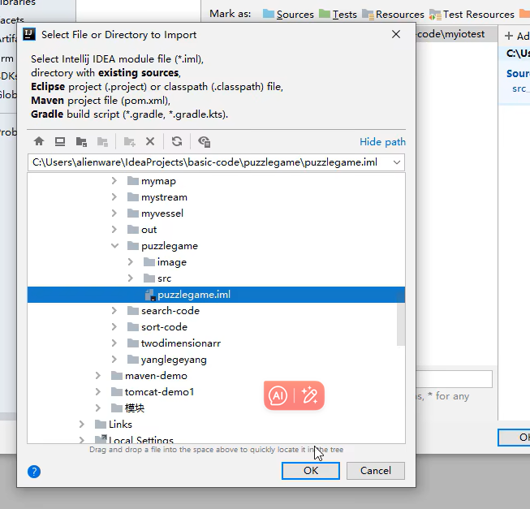
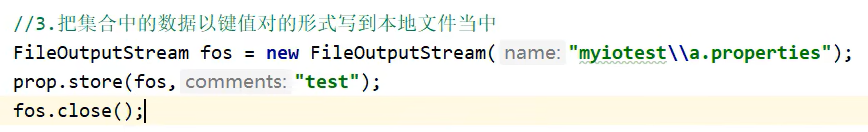
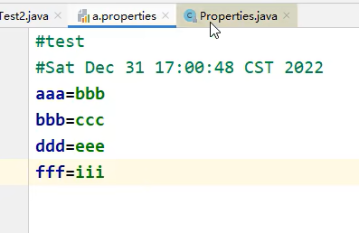

# 1.制造假数据

# 网络爬取（webCrawler） 				crawler爬虫

### 1.名字造假


1.URL网址对象

2.可以通过直接打开网址看能不能访问来验证网址能不能在代码中访问

URL对象.openConnection()会返回一个跟这个网址连接的对象URLConnection//这个方法的调用 要保证网络是畅通可以被访问的

3.URLConnection对象.getInputStream()可以返回一个字节流

在Java中，InputStream 是一个抽象类，它定义了输入流的基本功能和方法，但它本身不能被实例化。然而，**URLConnection 对象的 getInputStream()** 方法**返回的是一个 InputStream 的子类的实例**，这个子类实现了 InputStream 接口的所有抽象方法，因此可以被实例化。
具体来说，URLConnection 对象的 getInputStream() 方法**返回的是一个 java.net.URLConnection$InputStream 类型的对象**，这个类是 URLConnection 类的一个内部类，它实现了 InputStream 接口。这个内部类负责从与 URLConnection 关联的网络连接中读取数据。

4.matcher对象.group()中的第二个形参，表示返回的分组，如果想返回正则表达式里的所有内容，这个形参应该写0

##### 2.随机常见的方式：

1.random

2.如果是集合，可以用**Collections**.shuffle()打乱集合的方式进行，然后取第一个

Collections.shuflle()只能作用于List()集合


### 3.使用lambda表达式可能出现的错误问题


#### 4. 代码实现

```java
public class test {
    public static void main(String[] args) throws IOException {
        //https://hanyu.baidu.com/shici/detail?pid=0b2f26d4c0ddb3ee693fdb1137ee1b0d&from=kh0姓
        //http://www.haoming8.cn/baobao/7641.html女孩
        //http://www.haoming8.cn/baobao/10881.html男孩

        String familyName="https://hanyu.baidu.com/shici/detail?pid=0b2f26d4c0ddb3ee693fdb1137ee1b0d&from=kh0";
        String girlName="http://www.haoming8.cn/baobao/7641.html";
        String boyName="http://www.haoming8.cn/baobao/10881.html";

        String fmstr=webCrawler(familyName);
        String girlstr=webCrawler(girlName);
        String botstr=webCrawler(boyName);

        ArrayList<String> fms=getData(fmstr,"(\\W{4})(，|。)",1);
        ArrayList<String> gs=getData(girlstr,"(\\W\\W ){4}\\W{2}",0);
        ArrayList<String> bs=getData(botstr,"([\\u4E00-\\u9FA5]{2})(、|。)",1);


      /*  for (String fm : fms) {
            for (int i = 0; i < fm.length(); i++) {
                familist.add(fm.charAt(i)+"");
            }
        }//姓的处理*/


      /* for (String b : bs) {
            boylist.add(b);
        }*/

        ArrayList<String> familist=new ArrayList<>();
        fms.stream().forEach(s-> {
            for (int i = 0; i < s.length(); i++) {
                familist.add(s.charAt(i) + "");
            }
        });//Stream流去重处理 姓氏
        ArrayList<String> boylist=bs.stream().distinct().collect(Collectors.toCollection(ArrayList::new));//Stream流去重处理 男孩名
             /*   for (String g : gs) {
            String[] gnames=g.split(" ");
            for (int i = 0; i < gnames.length; i++) {
                girlist.add(gnames[i]);
            }
        }//女孩名的处理*/

        ArrayList<String> temgirlist=new ArrayList<>();
        gs.stream().forEach(s->{
            String[] names=s.split(" ");
            for (int i = 0; i < names.length; i++) {
                temgirlist.add(names[i]);
            }
        });//Stream流去重处理 女孩名
        ArrayList<String> girlist=temgirlist.stream().distinct().collect(Collectors.toCollection(ArrayList::new));
       ArrayList<String> studentInf=getStuNams(familist,girlist,boylist,10,15);

        //把随机生成的学生信息写入到文本文件中去
        BufferedWriter bw=new BufferedWriter(new FileWriter("D:\\Codeeeeeeeeeeeeeeeeeeeeeeeeeee\\java\\mylearn\\studentInfo"));
        for (int i = 0; i < studentInf.size(); i++) {
            bw.write(studentInf.get(i));
            bw.newLine();
        }
        bw.close();
    }

    public static ArrayList<String> getStuNams(ArrayList<String> famlist,ArrayList<String> girllist,ArrayList<String> boylist,int g,int b){
        Random rand=new Random();
        ArrayList<String> studentInfo=new ArrayList<>();
        String name;

        for (int i = 0; i < b; i++) {
            Collections.shuffle(famlist);
            Collections.shuffle(boylist);
            name=famlist.get(0)+boylist.get(0);
            studentInfo.add(name+"-"+"男"+"-"+(rand.nextInt(10)+18));//18-27
        }//获取男生的名字
        for (int i = 0; i < g; i++) {
            Collections.shuffle(famlist);
            Collections.shuffle(girllist);
            name=famlist.get(0)+girllist.get(0);
            studentInfo.add(name+"-"+"女"+"-"+(rand.nextInt(8)+18));//18-25
        }//获取女生的名字
        Collections.shuffle(studentInfo);
        return studentInfo;
    }//随机拼接学生的姓名
    public static ArrayList<String> getData(String fmstr, String regex,int index) {
        ArrayList<String> names=new ArrayList<>();
        Pattern p=Pattern.compile(regex);
        Matcher m=p.matcher(fmstr);
        while(m.find()){
            String gp=m.group(index);
            names.add(gp);
        }
        return names;
    }//爬取到的名字数据的处理

    public static String webCrawler(String address) throws IOException {
        StringBuilder sb=new StringBuilder();
        URL url=new URL(address);
        URLConnection urc=url.openConnection();
        InputStreamReader isr=new InputStreamReader(urc.getInputStream());
        int ch;
        while((ch=isr.read())!=-1){
            sb.append((char)ch);
        }
        isr.close();
        return sb.toString();

    }//网络爬虫
}
```

# 2.带权重随机点名器


二分查找之前一定要先进行排序（升序/降序）都行

**二分查找方法的返回=	-插入点的索引-1**

也就是说     **插入点的索引=	-二分查找方法的返回-1**


比如一个随机数是 0.31 那么他返回的索引就是3相当于在0.3对应权重的右边对应的那个索引

# 3.登录注册

### 1.怎么把代码导入到一个模块里面

1.先复制代码文件

2.


打开->粘贴

3.

4.

5.



再点击OK->Ok

**这样导入的话才不会有路径的问题**

### 2.


之前还没有学IO流的时候数据是直接存储在集合之中，可是这样的话就有个弊端，一旦程序运行结束，那么所有数据都会消失

### 3.关于登录的小细节

1.请问是在登录界面出现的时候从文件中读取数据，还是按下登录按钮的时候再从文件中读取数据？

答：登录界面出现的时候从文件中读取数据更好

因为如果读取数据是随着按钮的按下而进行的话，在每次按钮都会读取，会造成了资源空间的重复利用，资源空间被浪费

2.请问文件的读取是写在	静态代码块 里还是	构造方法	里？

答：其实不是说读取多次就一定不好，最主要是看	**每次读取的之前，文件里的数据有没有发生变化**。

静态代码块：类第一次加载时执行，并且只执行一次
构造方法里：每次创建对象时执行

而在这里，写在构造方法里会更好，因为注册的时候文件里的数据会发生改变

### 4.有些时候可以把前面步骤所从文件中读取到的数据作为形参在方法之中传递//尤其是当正在写的这个方法也需要从文件中读取一样的数据时


### 5. JTextField对象.setText("")//相当于清空输入框			JTextField对象.getText()获取用户输入的数据

### 6.注册界面


### 7.用糊涂包向文件中写数据的时候，如果形参内传递的是对象，那么这个方法会调用这个对象的ToString()方法把这个对象以String的形式写到文件中

# 4.游戏存档

#### 1.存档文件的名字建议从0开始，这样的话方便匹配很多代码


2.

# 5.游戏配置//properties

#### 1.好处：

1/可以把软件的设置永久化存储

2/如果修改参数，不需要改动代码，直接修改配置文件就可

但是实际应用中，只要修改代码，就要重新打包、重新发布.....一系列工作必不可少

### 2.properties配置文件


是一个双列集合，拥有Map集合所有特点 

有一些特有方法，可以把集合中的数据按照键值对的形式写到配置文件当中，也可以把配置文件中的数据读取到集合中来

#### 1.properties作为Map集合的基本用法：


不是一个泛型类，所以创建对象的时候不用给出泛型


虽然可以添加任意数据类型，但是一般只会添加String类型的数据

### 2.特有方法

1/load 会把properties文件里的数据读取到集合之中

2/store 会把集合里的数据保存到本地文件职中

3/第二个参数是表示文件里的注释信息//注释一般不写中文



注意关流的对象是谁



4/load读取的时候，不会把#后面的数据，即标签里的数据加载出来

### 3.应用


配置文件中不要写；分号，也不要写多余的空白字符（串）


properties相关方法的返回值是Object类型的，所以可以对他进行强制类型转换