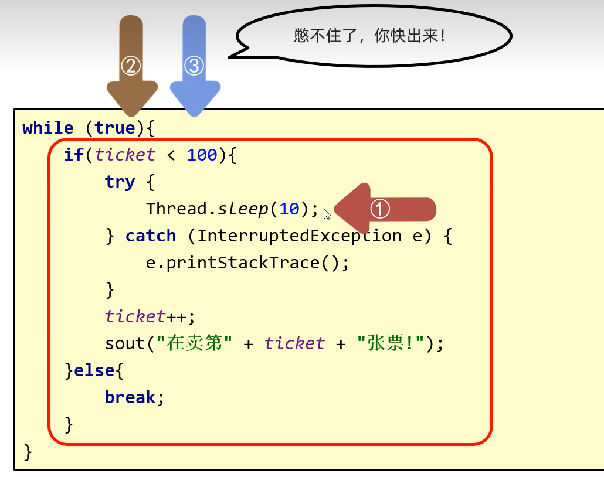
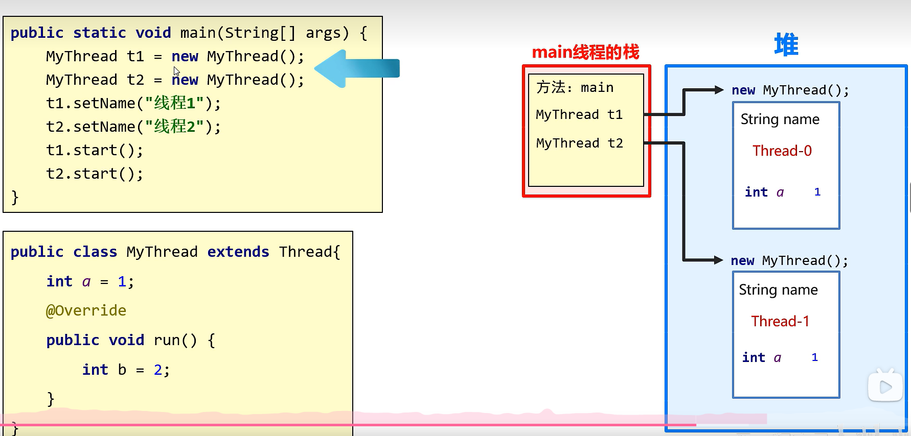

## 1.实现多线程

#### 进程：每一个正在运行的软件都是一个进程


### 线程：


就相当于一个杀毒软件运行的时候（是一个进程），里面的每一个小功能都可以算作一个线程

#### 单线程：


cpu必须是当前代码执行完之后才去按顺序依次执行后面的代码，效率比较低

#### 多线程：提高程序的运行效率

eg:拷贝、迁移大文件

加载大量的资源文件：比如游戏在加载的同时：可以去检查其他配置是否正确，播放背景音乐，让画面动起来......

所有聊天软件

所有后台服务器


**cpu**可以**在多个程序之间来回切换**，把**等待的时间充分利用**起来，

//比如这个小白要每隔10分钟搬箱子，当我们把它搬箱子的时间错开，导致在某个等待的10分钟内可以去搬其他流水线的箱子，这样就提高了工作的效率


### 1.1简单了解多线程【理解】

是指从软件或者硬件上实现多个线程并发执行的技术。
具有多线程能力的计算机因有硬件支持而能够在同一时间执行多个线程，提升性能。


### 1.2并发和并行【理解】

+ **并行**：在同一时刻，有多个指令在**多个**CPU上**同时**执行。

  

+ **并发**：在同一时刻，有多个指令在**单个**CPU上**交替**执行。

  


CPU在电脑中只有一个，但是他的构造可以是不同的

后面的线程就表示：CPU可以在电脑中**同时并行**多少条线程的个数


#### 在计算机中，并发和并行可能会同时发生：


假如需要执行的线程只有4条，那么一般来说不用切换

如果是>4条线程，cpu中的线程就会在程序中的多个线程中随机的进行切换。所以在计算机中并发和并行是很可能同时在发生的


- 进程：是正在运行的程序

  独立性：进程是一个能独立运行的基本单位，同时也是系统分配资源和调度的独立单位
  动态性：进程的实质是程序的一次执行过程，进程是动态产生，动态消亡的
  并发性：任何进程都可以同其他进程一起并发执行

- 线程：是进程中的单个顺序控制流，是一条执行路径

  ​	单线程：一个进程如果只有一条执行路径，则称为单线程程序

  ​	多线程：一个进程如果有多条执行路径，则称为多线程程序

  ​	
  
  #### 多线程的实现方式：
  
  

### 1.4实现多线程方式一：继承Thread类【应用】//在继承类里面自己写任务

//不过现在不再推荐这种方法。应当要把并行运行的任务与运行机制解耦合。如果有多个任务，为每个任务分别创建一个单独的线程池开销太大。实际上可以用一个线程池

*<u>**表示Java中的一个线程**</u>*

*<u>**创建他的对象并开启他**</u>*


- 方法介绍

  | 方法名          | 说明                         |
  | ------------ | -------------------------- |
  | void run()   | 在线程开启后，此方法将被调用执行           |
  | void start() | 使此线程开始执行，Java虚拟机会调用run方法() |

- 实现步骤
  - 定义一个类MyThread继承Thread类
  - 在MyThread类中重写run()方法
  - 创建MyThread类的对象
  - 启动线程

- 代码演示

  ```java
  public class MyThread extends Thread {
      @Override
      public void run() {
          for(int i=0; i<100; i++) {
              System.out.println(i);
          }
      }
  }
  public class MyThreadDemo {
      public static void main(String[] args) {
          MyThread my1 = new MyThread();
          MyThread my2 = new MyThread();

  //        my1.run();
  //        my2.run();

          //void start() 导致此线程开始执行; Java虚拟机调用此线程的run方法
          my1.start();
          my2.start();
      }
  }
  ```

- 两个小问题

  - 为什么要重写run()方法？

    因为run()是用来封装被线程执行的代码

  - run()方法和start()方法的区别？

    run()：封装线程执行的代码，直接调用，相当于普通方法的调用

    start()：启动线程；然后由JVM调用此线程的run()方法
    
    
    
    **不能用Thread(子类)对象直接去调用run方法**，这样和之前普通的对象调用成员方法是一样的，**直接调用run方法只会在同一个线程中执行这个任务，而没有启动新的线程。**
    
    
    
    要去调用**start()开启线程**，这样会创建一个新线程来执行run方法。

### 1.5实现多线程方式二：实现Runnable接口【应用】//把写完任务的类交给Thread//MyRunnable的这个对象，分别交给不同的线程去执行


**上图可以理解这两个线程都会去分别执行这个任务（互不影响），只不过是每个线程在不同for遍历时执行的时间不同而已**


- Thread构造方法

  | 方法名                                  | 说明             |
  | ------------------------------------ | -------------- |
  | Thread(Runnable target)              | 分配一个新的Thread对象 |
  | Thread(Runnable target, String name) | 分配一个新的Thread对象 |

- 实现步骤

  - 定义一个类MyRunnable实现Runnable接口
  - 在MyRunnable类中重写run()方法
  - 创建MyRunnable类的对象
  - **创建Thread类的对象，把MyRunnable对象作为构造方法的参数**
  - **启动线程**

- 代码演示

  ```java
  public class MyRunnable implements Runnable {
      @Override
      public void run() {
          for(int i=0; i<100; i++) {
              System.out.println(Thread.currentThread().getName()+":"+i);
          }
      }
  }
  public class MyRunnableDemo {
      public static void main(String[] args) {
          //创建MyRunnable类的对象
          MyRunnable my = new MyRunnable();

          //创建Thread类的对象，把MyRunnable对象作为构造方法的参数
          //Thread(Runnable target)
  //        Thread t1 = new Thread(my);
  //        Thread t2 = new Thread(my);
          //Thread(Runnable target, String name)
          Thread t1 = new Thread(my,"坦克");
          Thread t2 = new Thread(my,"飞机");

          //启动线程
          t1.start();
          t2.start();
      }
  }
  ```

### 1.6实现多线程方式三: 实现Callable接口【应用】//前两种方法返回值是void，就没办法获取多线程运行的结果


这里的泛型，就是表示多线程运行返回值的类型

#### 关于FutureTask的个数:


在Java中，**一个FutureTask对象可以被多个Thread对象共享**，**这意味着多个线程可以同时等待同一个FutureTask对象的结果**。但是，通常情况下，一个FutureTask对象只会与一个Thread对象相关联，因为FutureTask的设计目的是为了封装一个可调用的任务，并允许线程获取该任务的执行结果。
在你提供的代码示例中，FutureTask对象ft被两个Thread对象t1和t2共享。这是合法的，因为FutureTask实现了Runnable接口，所以它可以被多个线程同时执行。但是，需要注意的是，**如果多个线程同时调用FutureTask的run方法，只有一个线程会实际执行任务，其他线程会被阻塞，直到任务完成。**
此外，FutureTask还提供了get方法，用于获取任务的执行结果。如果任务已经完成，get方法会立即返回结果；如果任务还没有完成，get方法会阻塞当前线程，直到任务完成。
因此，虽然一个FutureTask可以被多个Thread对象共享，但通常情况下，一个FutureTask对象只会与一个Thread对象相关联，以确保任务的执行和结果的获取是有序和可控的


在Java中，FutureTask 是一个可取消的异步计算框架，它实现了 RunnableFuture 接口，该接口继承自 Runnable 和 Future 接口。FutureTask 可以用来封装一个可调用的任务，并允许线程获取该任务的执行结果。
当多个线程同时调用 FutureTask 的 run 方法时，只有一个线程会实际执行任务，其他线程会被阻塞，直到任务完成。这是因为 **FutureTask 内部维护了一个状态机**，**用于跟踪任务的执行状态。当任务状态为 NEW 时，表示任务尚未开始执行；当任务状态为 RUNNING 时，表示任务正在执行；当任务状态为 COMPLETED 时，表示任务已经完成。**
如果多个线程同时尝试执行同一个 FutureTask 的 run 方法，**只有一个线程能够成功将任务状态从 NEW 转换为 RUNNING，其他线程会发现任务状态已经不是 NEW，因此它们会放弃执行任务，并等待任务完成**。
一旦任务完成，FutureTask 的 get 方法会返回任务的结果。如果任务被取消，get 方法会抛出 CancellationException 异常。如果任务执行过程中发生异常，get 方法会抛出 ExecutionException 异常，并将原始异常作为原因传递给 ExecutionException。


+ 方法介绍

  | 方法名                              | 说明                                  |
  | -------------------------------- | ----------------------------------- |
  | V call()                         | 计算结果，如果无法计算结果，则抛出一个异常               |
  | FutureTask(Callable<V> callable) | 创建一个 FutureTask，一旦运行就执行给定的 Callable |
  | V get()                          | 如有必要，等待计算完成，然后获取其结果                 |

+ 实现步骤

  + 定义一个类MyCallable实现Callable接口
  + 在MyCallable类中重写call()方法
  + 创建MyCallable类的对象
  + 创建**Future的实现类FutureTask对象**，把MyCallable对象作为构造方法的参数
  + 创建Thread类的对象，把FutureTask对象作为构造方法的参数
  + 启动线程
  + 再调用get方法，就可以获取线程结束之后的结果。

+ 代码演示

  ```java
  public class MyCallable implements Callable<String> {
      @Override
      public String call() throws Exception {
          for (int i = 0; i < 100; i++) {
              System.out.println("跟女孩表白" + i);
          }
          //返回值就表示线程运行完毕之后的结果
          return "答应";
      }
  }
  public class Demo {
      public static void main(String[] args) throws ExecutionException, InterruptedException {
          //线程开启之后需要执行里面的call方法
          MyCallable mc = new MyCallable();

          //Thread t1 = new Thread(mc);

          //可以获取线程执行完毕之后的结果.也可以作为参数传递给Thread对象
          FutureTask<String> ft = new FutureTask<>(mc);

          //创建线程对象
          Thread t1 = new Thread(ft);

          String s = ft.get();
          //开启线程
          t1.start();

          //String s = ft.get();
          System.out.println(s);
      }
  }
  ```

+ 三种实现方式的对比
  + 实现Runnable、Callable接口
    + 好处: 扩展性强，实现该接口的同时还可以继承其他的类
    + 缺点: 编程相对复杂，不能直接使用Thread类中的方法
    + 
  + 继承Thread类
    + 好处: 编程比较简单，可以直接使用Thread类中的方法
    + 缺点: 可以扩展性较差，不能再继承其他的类

### 1.7设置和获取线程名称【应用】

- 方法介绍

  | 方法名                     | 说明                                                         |
  | -------------------------- | ------------------------------------------------------------ |
  | void  setName(String name) | 将此线程的名称更改为等于参数name                             |
  | String  getName()          | 返回此线程的名称                                             |
  | Thread  currentThread()    | 返回对当前正在执行的线程对象的引用**//哪条线程执行到这个方法，此时获取的就是哪条线程的对象** |

  ##### 1.如果没有手动的给线程设置名称，他的默认名称是Thread-X(X是序号，从0开始)

  ##### 一些小细节：

  1.Thread-X(X是序号，从0开始)//如果不给Thread设置名字

  2.Thread的构造方法也可以传递Thread的名字

  // 如果是用第一种Thread创造对象的方法去执行，即自己定义一个Thread的继承类，那么记得要重写一下所写类的构造方法（因为构造方法不参与继承）

  *<u>3.**当JVM虚拟机启动之后，会自动启动多条线程**</u>*

  *<u>**其中有一条main线程，他专门调用main方法，并执行里面的代码**</u>*

  *<u>**在以前写的所有的代码，都是运行在main线程当中**</u>*

  

- 代码演示

  ```java
  public class MyThread extends Thread {
      public MyThread() {}
      public MyThread(String name) {
          super(name);
      }

      @Override
      public void run() {
          for (int i = 0; i < 100; i++) {
              System.out.println(getName()+":"+i);
          }
      }
  }
  public class MyThreadDemo {
      public static void main(String[] args) {
          MyThread my1 = new MyThread();
          MyThread my2 = new MyThread();

          //void setName(String name)：将此线程的名称更改为等于参数 name
          my1.setName("高铁");
          my2.setName("飞机");

          //Thread(String name)
          MyThread my1 = new MyThread("高铁");
          MyThread my2 = new MyThread("飞机");

          my1.start();
          my2.start();

          //static Thread currentThread() 返回对当前正在执行的线程对象的引用
          System.out.println(Thread.currentThread().getName());
      }
  }
  ```

### 1.8线程休眠【应用】

+ 相关方法

  | 方法名                            | 说明                       |
  | ------------------------------ | ------------------------ |
  | static void sleep(long millis) | 使当前正在执行的线程停留（暂停执行）指定的毫秒数 |

  ##### 一些小细节：

  *<u>1.哪条线程执行到这个方法，那么那条线程就会在这里停留对应的时间</u>*

  *<u>2.方法的参数：表示睡眠的时间，单位毫秒ms</u>*

  *<u>1s=1000ms</u>*

  *<u>3.时间到了之后，线程会自动的醒来，继续执行下面的其他代码</u>*

+ #### 继承类中出现异常是否抛出异常的问题：

  如果父类抛出，子类也可以抛出异常

  如果父类不可以抛出异常，那么子类也不可以抛出异常

  

  这个图中的Thread就没有抛出异常，所以在子类里只能try-catch捕获

+ 代码演示

  ```java
  public class MyRunnable implements Runnable {
      @Override
      public void run() {
          for (int i = 0; i < 100; i++) {
              try {
                  Thread.sleep(100);
              } catch (InterruptedException e) {
                  e.printStackTrace();
              }

              System.out.println(Thread.currentThread().getName() + "---" + i);
          }
      }
  }
  public class Demo {
      public static void main(String[] args) throws InterruptedException {
          /*System.out.println("睡觉前");
          Thread.sleep(3000);
          System.out.println("睡醒了");*/

          MyRunnable mr = new MyRunnable();

          Thread t1 = new Thread(mr);
          Thread t2 = new Thread(mr);

          t1.start();
          t2.start();
      }
  }
  ```

### 1.9线程优先级【应用】

- 线程调度

  - 两种调度方式
    
    - 分时调度模型：所有线程**轮流**使用 CPU 的使用权，平均分配每个线程占用 CPU 的时间片
    
  - 抢占式调度模型：优先让优先级高的线程使用 CPU，如果线程的优先级相同，那么会随机选择一个，优先级高的线程获取的 CPU 时间片相对多一些**//随机性**//java中采取这个//优先级越大，抢到CPU的概率更大
    
      **抢占式调度系统给每一个可运行的线程一个时间片来执行任务。当时间片用完时，操作系统会剥夺该线程的运行权，并给另一个线程一个机会来运行**
    
    - **每个处理器可以运行一个线程，如果线程数多于处理器数，调度器还要分配时间片**
    
    - **<u>*static void yield()当前正在执行的线程向另一个线程交出执行权*</u>**
    
  - Java使用的是抢占式调度模型

  - 随机性

    假如计算机只有一个 CPU，那么 CPU 在某一个时刻只能执行一条指令，线程只有得到CPU时间片，也就是使用权，才可以执行指令。所以说多线程程序的执行是有随机性，因为谁抢到CPU的使用权是不一定的

    

- 优先级相关方法

  | 方法名                                  | 说明                                                         |
  | --------------------------------------- | ------------------------------------------------------------ |
  | final int getPriority()                 | 返回此线程的优先级                                           |
  | final void setPriority(int newPriority) | 更改此线程的优先级线程默认优先级是5；线程优先级的范围是：1-10   优先级越高，抢占到CPU的概率越大 |

- 代码演示

  ```java
  public class MyCallable implements Callable<String> {
      @Override
      public String call() throws Exception {
          for (int i = 0; i < 100; i++) {
              System.out.println(Thread.currentThread().getName() + "---" + i);
          }
          return "线程执行完毕了";
      }
  }
  public class Demo {
      public static void main(String[] args) {
          //优先级: 1 - 10 默认值:5
          MyCallable mc = new MyCallable();

          FutureTask<String> ft = new FutureTask<>(mc);

          Thread t1 = new Thread(ft);
          t1.setName("飞机");
          t1.setPriority(10);
          //System.out.println(t1.getPriority());//5
          t1.start();

          MyCallable mc2 = new MyCallable();

          FutureTask<String> ft2 = new FutureTask<>(mc2);

          Thread t2 = new Thread(ft2);
          t2.setName("坦克");
          t2.setPriority(1);
          //System.out.println(t2.getPriority());//5
          t2.start();
      }
  }
  ```

### 1.10守护线程【应用】

##### 优先级、守护线程.....类似的设置应该在Thread   start()开始执行之前设置完毕

- 相关方法

  | 方法名                        | 说明                                   |
  | -------------------------- | ------------------------------------ |
  | void setDaemon(boolean on) | 将此线程标记为守护线程，当运行的线程都是守护线程时，Java虚拟机将退出 |

  

  **当非守护线程执行完毕之后，守护线程没有执行的必要了，会陆续结束**

  原因：由于信息的传递需要一定的时间，当非守护线程执行完之后，会发出一个信息，而在这个信息传递到守护线程的过程中，守护线程本身还在运行，所以最后表现出来的结果就是：****

  #### 守护线程的应用场景:

  


- 代码演示

  ```java
  public class MyThread1 extends Thread {
      @Override
      public void run() {
          for (int i = 0; i < 10; i++) {
              System.out.println(getName() + "---" + i);
          }
      }
  }
  public class MyThread2 extends Thread {
      @Override
      public void run() {
          for (int i = 0; i < 100; i++) {
              System.out.println(getName() + "---" + i);
          }
      }
  }
  public class Demo {
      public static void main(String[] args) {
          MyThread1 t1 = new MyThread1();
          MyThread2 t2 = new MyThread2();

          t1.setName("女神");
          t2.setName("备胎");

          //把第二个线程设置为守护线程
          //当普通线程执行完之后,那么守护线程也没有继续运行下去的必要了.
          t2.setDaemon(true);

          t1.start();
          t2.start();
      }
  }
  ```

## 1.11(了解即可，不做要求)出让线程/礼让线程public static void yield()//Thread.yield()

在Java中，CPU的执行权与线程之间的关系是通过线程调度来实现的。线程调度是操作系统内核中的一个组件，它负责决定哪个线程应该在CPU上执行，以及何时执行。
Java中的线程调度是基于线程优先级和线程状态的。每个线程都有一个优先级，优先级高的线程通常会比优先级低的线程更容易获得CPU执行权。但是，这并不意味着优先级高的线程总是会先执行，因为线程调度还会考虑其他因素，如线程的等待时间、线程的类型（如用户线程和守护线程）等。
当一个线程被创建并启动后，它会进入就绪状态，等待CPU的执行权。一旦线程获得了CPU执行权，它就会开始执行。在执行过程中，线程可能会因为等待I/O操作、等待同步锁、调用Thread.sleep()等原因而进入阻塞状态。当这些阻塞条件解除后，线程会重新进入就绪状态，等待下一次CPU执行权的分配。
在你的代码示例中，你创建了两个线程m1和m2，并分别设置了它们的优先级和守护状态。m1的优先级被设置为10，而m2的优先级被设置为1。此外，m2被设置为守护线程。这意味着m2会在所有非守护线程（如m1）结束后自动结束，即使它自己的任务还没有完成。
当你调用m1.start()和m2.start()时，这两个线程会进入就绪状态，等待CPU的执行权。由于m1的优先级更高，它通常会比m2更容易获得CPU执行权，因此m1可能会先执行。但是，如果m1在执行过程中进入了阻塞状态，而m2此时处于就绪状态，那么m2可能会获得CPU执行权并开始执行。
总的来说，CPU的执行权是通过线程调度来分配的，线程调度会根据线程的优先级、状态和其他因素来决定哪个线程应该在CPU上执行。在你的代码中，你可以通过设置线程的优先级和守护状态来影响线程调度的结果，但并不能完全控制线程的执行顺序。


看右边的代码，假如说当前这个for循环的这个i次是“飞机”这个线程抢夺到的CPU的执行权，那么当他yield之后他会把执行权进行让度，此时“飞机”和“坦克”两个线程又会重新争取CPU的执行权

也就是说，这个yield方法只是**尽可能**！！！！！的让两个线程的**交叉均匀一点**


在这个例子中，Thread.yield() 被调用在 main 线程的循环中，当 i 等于 10 时。这意味着在 main 线程打印了10次 "main" 之后，它会主动让出CPU执行权，让其他线程有机会执行。然后 main 线程会继续执行循环的剩余部分。
请注意，调用 Thread.yield() 并不保证其他线程会立即获得执行权，它只是一个提示，线程调度器可能会忽略这个提示。此外，过度使用 Thread.yield() 可能会导致性能下降，因为线程切换也有一定的开销。因此，应该谨慎使用这个方法，只在必要时调用。

## 1.12插入线程/插队线程public final void join()


如图，如果不写join()的话，“土豆”线程和"main"线程会去争夺cpu的执行权

某个线程.join()//就会先把CPU的执行权给“土豆”线程，等他的任务全部执行完之后，当前线程再得到CPU的执行权


## 1.13线程的生命周期


没有执行资格：不能够去抢CPU的执行权

## 2.线程同步

#### class里的static变量是这个类的所有类对象都共享的变量//在Java中，类的静态变量（也称为类变量）是在类第一次加载到内存时创建的，并且它们的值在类的所有实例之间共享。这意味着，无论创建多少个类的实例，静态变量只有一个副本，并且所有实例都可以访问和修改这个副本。
静态变量在类加载时被初始化，并且它们的生命周期与类的生命周期相同。当类被卸载时，静态变量也会被销毁。


#### 补充：竞态条件：

两个或两个以上的线程需要共享存取相同的数据，调用同一个修改该对象状态的方法，这两个线程可能会相互覆盖，取决于线程访问数据的次序，可能会导致对象被破坏

### 2.1卖票【应用】

- 案例需求

  某电影院目前正在上映国产大片，共有100张票，而它有3个窗口卖票，请设计一个程序模拟该电影院卖票

- 实现步骤

  - 定义一个类SellTicket实现Runnable接口，里面定义一个成员变量：private int tickets = 100;

  - 在SellTicket类中重写run()方法实现卖票，代码步骤如下

  - 判断票数大于0，就卖票，并告知是哪个窗口卖的
  - 卖了票之后，总票数要减1
  - 票卖没了，线程停止
  - 定义一个测试类SellTicketDemo，里面有main方法，代码步骤如下
  - 创建SellTicket类的对象
  - 创建三个Thread类的对象，把SellTicket对象作为构造方法的参数，并给出对应的窗口名称
  - 启动线程

- 代码实现

  ```java
  public class SellTicket implements Runnable {
      private int tickets = 100;
      //在SellTicket类中重写run()方法实现卖票，代码步骤如下
      @Override
      public void run() {
          while (true) {
              if(ticket <= 0){
                      //卖完了
                      break;
                  }else{
                      try {
                          Thread.sleep(100);
                      } catch (InterruptedException e) {
                          e.printStackTrace();
                      }
                      ticket--;
                      System.out.println(Thread.currentThread().getName() + "在卖票,还剩下" + ticket + "张票");
                  }
          }
      }
  }
  public class SellTicketDemo {
      public static void main(String[] args) {
          //创建SellTicket类的对象
          SellTicket st = new SellTicket();

          //创建三个Thread类的对象，把SellTicket对象作为构造方法的参数，并给出对应的窗口名称
          Thread t1 = new Thread(st,"窗口1");
          Thread t2 = new Thread(st,"窗口2");
          Thread t3 = new Thread(st,"窗口3");

          //启动线程
          t1.start();
          t2.start();
          t3.start();
      }
  }
  ```


### 2.2卖票案例的问题【理解】

- 卖票出现了问题

  #### 1.相同的票出现了多次

  

  原因：线程执行的时候，**随时**都有可能发生**CPU执行权被**不同线程**抢夺**的情况

  假设

  1/ 1号先抢的执行权，那么他会执行到sleep进行堵塞，然后2号抢到，他也会到sleep堵塞，然后3号抢到，再堵塞

  2/ 1号苏醒过来抢到，然后ticket++，还没来得及打印，执行权就被苏醒过来的2抢走了，2进行ticket++，还没来得及打印，执行权就被苏醒过来的3抢走了

  3/最后不管执行权会到谁的手上，打印出来的都会使同一个ticket值

  

  #### 2.出现了负数的票

  

  票卖超了，假如ticket此时是99,进入代码块执行，其实还是上面的那个原因

- 问题产生原因

  线程执行的随机性导致的,可能在卖票过程中丢失cpu的执行权,导致出现问题

### 2.3同步！！代码块！！解决数据安全问题【应用】//解决多线程处理共享数据时的数据安全问题



想办法把这段操作共享static数据的代码**锁起来**，使得当有线程进入这段代码的时候，其他线程即使抢夺到CPU执行权也进不来。只有当进入这段代码的那个线程出来了，其他的线程才能进去

**锁起来，让所有线程能轮流执行这段代码**

- 安全问题出现的条件

  - 是多线程环境

  - 有共享数据

  - 有多条语句操作共享数据

- 如何解决多线程安全问题呢?

  - 基本思想：让程序没有安全问题的环境

- 怎么实现呢?

  - 把多条语句操作共享数据的代码给锁起来，让任意时刻只能有一个线程执行即可

  - Java提供了同步代码块的方式来解决

- 同步代码块格式：

  ```java
  synchronized(任意对象) { 
  	多条语句操作共享数据的代码 
  }
  ```

  synchronized(任意对象)：就相当于给代码加锁了，任意对象就可以看成是一把锁

  #### 特点：

  ##### 1.锁默认打开，有一个线程进去了，锁自动关闭

  ##### 2.里面的代码全部执行完毕，线程出来，锁自动打开

  #### 锁对象：

  

  **这个对象可以是任意类的对象，但是一定要保证无论创建多少个MyThread对象，这个锁对象一定要是唯一的，也就是所有MyThread对象都能共享的，也就是静态static对象**，如果锁对象不是唯一的，sychronized这个方法失效，相当于没有写

  

  这样写的时候，sychronized()形参里的this不是指这个所属类的类对象，而是指当前的线程，因为在这个例子中用的是线程的第一种构造方法，就是**extends Thread** **//线程1进来的时候，这里的this指的是线程1本身；线程2进来的时候，这里的this指的是线程2本身；就不是唯一的锁了，失效**


这样写的话，由于在同一个文件夹下只会有一个MyThread类，所以他对应的字节码文件对象也是唯一的，所以可以用这个类的字节码文件对象当做锁对象

- 同步的好处和弊端  

  - 好处：解决了多线程的数据安全问题
  - 弊端：当线程很多时，因为每个线程都会去判断同步上的锁，这是很耗费资源的，无形中会降低程序的运行效率

  ### 一些补充的小点：

  可能导致某个线程连续执行多次，而其他线程没有机会执行。这通常发生在以下情况下：
  线程的优先级设置较高，导致它更容易获得CPU执行权。
  线程的执行时间较短，使得它在其他线程有机会执行之前就完成了。
  线程调度器的实现方式可能导致某些线程长时间占用CPU

  

- 代码演示

  ```java
  public class SellTicket implements Runnable {
      private int tickets = 100;
      private Object obj = new Object();

      @Override
      public void run() {
          while (true) {
              synchronized (obj) { // 对可能有安全问题的代码加锁,多个线程必须使用同一把锁
                  //t1进来后，就会把这段代码给锁起来
                  if (tickets > 0) {
                      try {
                          Thread.sleep(100);
                          //t1休息100毫秒
                      } catch (InterruptedException e) {
                          e.printStackTrace();
                      }
                      //窗口1正在出售第100张票
                      System.out.println(Thread.currentThread().getName() + "正在出售第" + tickets + "张票");
                      tickets--; //tickets = 99;
                  }
              }
              //t1出来了，这段代码的锁就被释放了
          }
      }
  }

  public class SellTicketDemo {
      public static void main(String[] args) {
          SellTicket st = new SellTicket();

          Thread t1 = new Thread(st, "窗口1");
          Thread t2 = new Thread(st, "窗口2");
          Thread t3 = new Thread(st, "窗口3");

          t1.start();
          t2.start();
          t3.start();
      }
  }
  ```

### 2.4同步！！方法！！！解决数据安全问题【应用】


**图片中的this指的是当前方法的调用者**

- 同步方法的格式

  同步方法：就是把synchronized关键字加到方法上

  ```java
  修饰符 synchronized 返回值类型 方法名(方法参数) { 
  	方法体；
  }
  ```

  同步方法的锁对象是什么呢?

  ​	this

- 静态同步方法

  同步静态方法：就是把synchronized关键字加到静态方法上

  ```java
  修饰符 static synchronized 返回值类型 方法名(方法参数) { 
  	方法体；
  }
  ```

  同步静态方法的锁对象是什么呢?

  ​	类名.class


##### 理解：如果一个方法声明时有Synchronized关键字，那么对象的锁将保护整个方法//要调用这个方法，线程必须获得内部对象锁0：


```java
public synchronized void method(){
    method body
}
等价于
public void method(){
    this.intrinsicLock().lock();
    try{
        method body
    }finally {
        this.intrinsicLock().unlock();

    }
}
```


- 代码演示

  ```java
  public class MyRunnable implements Runnable {
      private static int ticketCount = 100;
  
      @Override
      public void run() {
          while(true){
              if("窗口一".equals(Thread.currentThread().getName())){
                  //同步方法
                  boolean result = synchronizedMthod();
                  if(result){
                      break;
                  }
              }
  
              if("窗口二".equals(Thread.currentThread().getName())){
                  //同步代码块
                  synchronized (MyRunnable.class){
                      if(ticketCount == 0){
                         break;
                      }else{
                          try {
                              Thread.sleep(10);
                          } catch (InterruptedException e) {
                              e.printStackTrace();
                          }
                          ticketCount--;
                          System.out.println(Thread.currentThread().getName() + "在卖票,还剩下" + ticketCount + "张票");
                      }
                  }
              }
  
          }
      }
  
      private static synchronized boolean synchronizedMthod() {
          if(ticketCount == 0){
              return true;
          }else{
              try {
                  Thread.sleep(10);
              } catch (InterruptedException e) {
                  e.printStackTrace();
              }
              ticketCount--;
              System.out.println(Thread.currentThread().getName() + "在卖票,还剩下" + ticketCount + "张票");
              return false;
          }
      }
  }
  ```


  public class Demo {
      public static void main(String[] args) {
          MyRunnable mr = new MyRunnable();

          Thread t1 = new Thread(mr);
          Thread t2 = new Thread(mr);
    
          t1.setName("窗口一");
          t2.setName("窗口二");
    
          t1.start();
          t2.start();
      }
  }
  ```


### 2.5Lock锁【应用】

虽然我们可以理解同步代码块和同步方法的锁对象问题，但是我们并没有直接看到在哪里加上了锁，在哪里释放了锁，为了更清晰的表达如何加锁和释放锁，JDK5以后提供了一个新的锁对象Lock

Lock是接口不能直接实例化，这里采用它的实现类ReentrantLock来实例化

- ReentrantLock构造方法

  | 方法名             | 说明                   |
  | --------------- | -------------------- |
  | ReentrantLock() | 创建一个ReentrantLock的实例 |

- 加锁解锁方法

  | 方法名           | 说明   |
  | ------------- | ---- |
  | void lock()   | 获得锁  |
  | void unlock() | 释放锁  |

- 代码演示

  ```java
  public class Ticket implements Runnable {
      //票的数量
      private int ticket = 100;
      private Object obj = new Object();
      private ReentrantLock lock = new ReentrantLock();

      @Override
      public void run() {
          while (true) {
              //synchronized (obj){//多个线程必须使用同一把锁.
              try {
                  lock.lock();
                  if (ticket <= 0) {
                      //卖完了
                      break;
                  } else {
                      Thread.sleep(100);
                      ticket--;
                      System.out.println(Thread.currentThread().getName() + "在卖票,还剩下" + ticket + "张票");
                  }
              } catch (InterruptedException e) {
                  e.printStackTrace();
              } finally {
                  lock.unlock();
              }
              // }
          }
      }
  }

  public class Demo {
      public static void main(String[] args) {
          Ticket ticket = new Ticket();

          Thread t1 = new Thread(ticket);
          Thread t2 = new Thread(ticket);
          Thread t3 = new Thread(ticket);

          t1.setName("窗口一");
          t2.setName("窗口二");
          t3.setName("窗口三");

          t1.start();
          t2.start();
          t3.start();
      }
  }
  ```


##### 关于锁相关原理的理解：


1来到sleep是会阻塞的，此时2、3还会抢夺执行权。但是即使是2、3抢到了，当他们来到lock()的时候仍然进不去，只能等待1苏醒了以后被1把执行权抢走

##### 注意细节：如果像下图这样写的话，线程1break直接跳转到循环外面，还没有执行Unlock就出去了，就导致2,3线程一直停留在lock()的那里，所以就导致程序仍然在运行，不停止

reentrant再进去的adj


关于这个图的理解可以看下面的第2张图

##### 用ReentrantLock保护代码块的基本结构如下：

myLock.lock();//a ReentrantLock object

try{

critical section

}

finally{

myLock.unlock();//如果临界区的代码抛出一个异常，必须释放锁，否则其他线程将永远阻塞

}


##### public class Bank{    private Lock bankLock=new ReentrantLock();...}中所有实例化对象的bankLock都不是同一个对象

在这个代码片段中，Bank 类有一个私有字段 bankLock，它被实例化为一个 ReentrantLock 对象。如果你在 Bank 类的多个实例中访问 bankLock，那么每个实例都会有自己的 bankLock 对象，它们是不同的对象。


##### 关于finally的补充：相当于finally是对前面try,catch语句结果的处理，处理完之后才会返回之类的操作


##### 补充：由于StringBuilder和StringBuffer的方法内容是一样，如果只是单线程，就用StringBuilder，如果是多线程涉及到数据安全的问题就用StringBuffer


### 2.6死锁【理解】//程序中出现了锁的嵌套//是一个错误，学习了防止以后再犯这个错误

+ 概述

  线程死锁是指由于两个或者多个线程互相持有对方所需要的资源，导致这些线程处于等待状态，无法前往执行

+ 什么情况下会产生死锁

  1. 资源有限

  2. 同步嵌套

  3. ##### 产生死锁的最本质原因

     

     

     总之就是在线程安全的程序设计中，哪个线程拿到锁对象就可以把它传递给方法作为形参开始执行，但是在线程安全的程序设计中，引用类型的对象在同一时刻只能允许一个线程访问它，所以其他程序没办法访问，更不用说同时把它作为其他程序的锁对象了

+ 代码演示

  ```java
  public class Demo {
      public static void main(String[] args) {
          Object objA = new Object();
          Object objB = new Object();

          new Thread(()->{
              while(true){
                  synchronized (objA){
                      //线程一
                      synchronized (objB){
                          System.out.println("小康同学正在走路");
                      }
                  }
              }
          }).start();

          new Thread(()->{
              while(true){
                  synchronized (objB){
                      //线程二
                      synchronized (objA){
                          System.out.println("小薇同学正在走路");
                      }
                  }
              }
          }).start();
      }
  }
  ```

## 3.生产者消费者（等待唤醒机制）

### 3.1生产者和消费者模式概述【应用】


##### 当一个线程wait的时候，CPU的执行权会被另一个线程抢走


- 概述

  生产者消费者模式是一个十分经典的多线程协作的模式，弄懂生产者消费者问题能够让我们对多线程编程的理解更加深刻。

  所谓生产者消费者问题，实际上主要是包含了两类线程：

  ​	一类是生产者线程用于生产数据

  ​	一类是消费者线程用于消费数据

  为了解耦生产者和消费者的关系，通常会采用共享的数据区域，就像是一个仓库

  生产者生产数据之后直接放置在共享数据区中，并不需要关心消费者的行为

  消费者只需要从共享数据区中去获取数据，并不需要关心生产者的行为

- Object类的等待和唤醒方法

  | 方法名           | 说明                                                         |
  | ---------------- | ------------------------------------------------------------ |
  | void wait()      | 导致当前线程等待，直到另一个线程调用该对象的 notify()方法或 notifyAll()方法 |
  | void notify()    | 唤醒正在等待对象监视器的**单个**线程                         |
  | void notifyAll() | 唤醒正在等待对象监视器的**所有**线程                         |
  
  锁对象.wait()// synchronized的时候就已经把当前线程与锁对象进行捆绑了
  
  **后面调用唤醒的方法也是锁对象去进行调用**

### 3.2生产者和消费者案例【应用】

- 案例需求

  + 桌子类(Desk)：定义表示包子数量的变量,定义锁对象变量,定义标记桌子上有无包子的变量

  + 生产者类(Cooker)：实现Runnable接口，重写run()方法，设置线程任务

      1.判断是否有包子,决定当前线程是否执行

      2.如果有包子,就进入等待状态,如果没有包子,继续执行,生产包子

      3.生产包子之后,更新桌子上包子状态,唤醒消费者消费包子

  + 消费者类(Foodie)：实现Runnable接口，重写run()方法，设置线程任务

      1.判断是否有包子,决定当前线程是否执行

      2.如果没有包子,就进入等待状态,如果有包子,就消费包子

      3.消费包子后,更新桌子上包子状态,唤醒生产者生产包子

  + 测试类(Demo)：里面有main方法，main方法中的代码步骤如下

      创建生产者线程和消费者线程对象

      分别开启两个线程
      
      # 多线程代码的套路：
      
      

- 代码实现

  ```java
  public class Desk {

      //定义一个标记
      //true 就表示桌子上有汉堡包的,此时允许吃货执行
      //false 就表示桌子上没有汉堡包的,此时允许厨师执行
      public static boolean flag = false;

      //汉堡包的总数量
      public static int count = 10;

      //锁对象
      public static final Object lock = new Object();
  }

  public class Cooker extends Thread {
  //    生产者步骤：
  //            1，判断桌子上是否有汉堡包
  //    如果有就等待，如果没有才生产。
  //            2，把汉堡包放在桌子上。
  //            3，叫醒等待的消费者开吃。
      @Override
      public void run() {
          while(true){
              synchronized (Desk.lock){
                  if(Desk.count == 0){
                      break;
                  }else{
                      if(!Desk.flag){
                          //生产
                          System.out.println("厨师正在生产汉堡包");
                          Desk.flag = true;
                          Desk.lock.notifyAll();
                      }else{
                          try {
                              Desk.lock.wait();
                          } catch (InterruptedException e) {
                              e.printStackTrace();
                          }
                      }
                  }
              }
          }
      }
  }

  public class Foodie extends Thread {
      @Override
      public void run() {
  //        1，判断桌子上是否有汉堡包。
  //        2，如果没有就等待。
  //        3，如果有就开吃
  //        4，吃完之后，桌子上的汉堡包就没有了
  //                叫醒等待的生产者继续生产
  //        汉堡包的总数量减一

          //套路:
              //1. while(true)死循环
              //2. synchronized 锁,锁对象要唯一
              //3. 判断,共享数据是否结束. 结束
              //4. 判断,共享数据是否结束. 没有结束
          while(true){
              synchronized (Desk.lock){
                  if(Desk.count == 0){
                      break;
                  }else{
                      if(Desk.flag){
                          //有
                          System.out.println("吃货在吃汉堡包");
                          Desk.flag = false;
                          Desk.lock.notifyAll();
                          Desk.count--;
                      }else{
                          //没有就等待
                          //使用什么对象当做锁,那么就必须用这个对象去调用等待和唤醒的方法.
                          try {
                              Desk.lock.wait();
                          } catch (InterruptedException e) {
                              e.printStackTrace();
                          }
                      }
                  }
              }
          }

      }
  }

  public class Demo {
      public static void main(String[] args) {
          /*消费者步骤：
          1，判断桌子上是否有汉堡包。
          2，如果没有就等待。
          3，如果有就开吃
          4，吃完之后，桌子上的汉堡包就没有了
                  叫醒等待的生产者继续生产
          汉堡包的总数量减一*/

          /*生产者步骤：
          1，判断桌子上是否有汉堡包
          如果有就等待，如果没有才生产。
          2，把汉堡包放在桌子上。
          3，叫醒等待的消费者开吃。*/

          Foodie f = new Foodie();
          Cooker c = new Cooker();

          f.start();
          c.start();

      }
  }
  ```

### 3.3生产者和消费者案例优化【应用】

+ 需求

  + 将Desk类中的变量,采用面向对象的方式封装起来
  + 生产者和消费者类中构造方法接收Desk类对象,之后在run方法中进行使用
  + 创建生产者和消费者线程对象,构造方法中传入Desk类对象
  + 开启两个线程

+ 代码实现

  ```java
  public class Desk {

      //定义一个标记
      //true 就表示桌子上有汉堡包的,此时允许吃货执行
      //false 就表示桌子上没有汉堡包的,此时允许厨师执行
      //public static boolean flag = false;
      private boolean flag;

      //汉堡包的总数量
      //public static int count = 10;
      //以后我们在使用这种必须有默认值的变量
     // private int count = 10;
      private int count;

      //锁对象
      //public static final Object lock = new Object();
      private final Object lock = new Object();

      public Desk() {
          this(false,10); // 在空参内部调用带参,对成员变量进行赋值,之后就可以直接使用成员变量了
      }

      public Desk(boolean flag, int count) {
          this.flag = flag;
          this.count = count;
      }

      public boolean isFlag() {
          return flag;
      }

      public void setFlag(boolean flag) {
          this.flag = flag;
      }

      public int getCount() {
          return count;
      }

      public void setCount(int count) {
          this.count = count;
      }

      public Object getLock() {
          return lock;
      }

      @Override
      public String toString() {
          return "Desk{" +
                  "flag=" + flag +
                  ", count=" + count +
                  ", lock=" + lock +
                  '}';
      }
  }

  public class Cooker extends Thread {

      private Desk desk;

      public Cooker(Desk desk) {
          this.desk = desk;
      }
  //    生产者步骤：
  //            1，判断桌子上是否有汉堡包
  //    如果有就等待，如果没有才生产。
  //            2，把汉堡包放在桌子上。
  //            3，叫醒等待的消费者开吃。

      @Override
      public void run() {
          while(true){
              synchronized (desk.getLock()){
                  if(desk.getCount() == 0){
                      break;
                  }else{
                      //System.out.println("验证一下是否执行了");
                      if(!desk.isFlag()){
                          //生产
                          System.out.println("厨师正在生产汉堡包");
                          desk.setFlag(true);
                          desk.getLock().notifyAll();
                      }else{
                          try {
                              desk.getLock().wait();
                          } catch (InterruptedException e) {
                              e.printStackTrace();
                          }
                      }
                  }
              }
          }
      }
  }

  public class Foodie extends Thread {
      private Desk desk;

      public Foodie(Desk desk) {
          this.desk = desk;
      }

      @Override
      public void run() {
  //        1，判断桌子上是否有汉堡包。
  //        2，如果没有就等待。
  //        3，如果有就开吃
  //        4，吃完之后，桌子上的汉堡包就没有了
  //                叫醒等待的生产者继续生产
  //        汉堡包的总数量减一

          //套路:
              //1. while(true)死循环
              //2. synchronized 锁,锁对象要唯一
              //3. 判断,共享数据是否结束. 结束
              //4. 判断,共享数据是否结束. 没有结束
          while(true){
              synchronized (desk.getLock()){
                  if(desk.getCount() == 0){
                      break;
                  }else{
                      //System.out.println("验证一下是否执行了");
                      if(desk.isFlag()){
                          //有
                          System.out.println("吃货在吃汉堡包");
                          desk.setFlag(false);
                          desk.getLock().notifyAll();
                          desk.setCount(desk.getCount() - 1);
                      }else{
                          //没有就等待
                          //使用什么对象当做锁,那么就必须用这个对象去调用等待和唤醒的方法.
                          try {
                              desk.getLock().wait();
                          } catch (InterruptedException e) {
                              e.printStackTrace();
                          }
                      }
                  }
              }
          }

      }
  }

  public class Demo {
      public static void main(String[] args) {
          /*消费者步骤：
          1，判断桌子上是否有汉堡包。
          2，如果没有就等待。
          3，如果有就开吃
          4，吃完之后，桌子上的汉堡包就没有了
                  叫醒等待的生产者继续生产
          汉堡包的总数量减一*/

          /*生产者步骤：
          1，判断桌子上是否有汉堡包
          如果有就等待，如果没有才生产。
          2，把汉堡包放在桌子上。
          3，叫醒等待的消费者开吃。*/

          Desk desk = new Desk();

          Foodie f = new Foodie(desk);
          Cooker c = new Cooker(desk);

          f.start();
          c.start();

      }
  }
  ```

### 3.4阻塞队列基本使用【理解】


**阻塞队列中最多可以放几碗面（容量）是可以人为规定的**

+ 阻塞队列继承结构

  
  
  **创建ArrayBlockingQueue的时候一定要指定他的大小**
  
  


用这个方法我们不用创建锁对象了，因为方法的底层已经帮我们创建了 


这个打印语句是写在锁过程的外面，所以有时他可能会出现错乱的情况，但是并不对共享数据的数据安全造成影响


lockInterruptibly是用来获取锁对象的


+ 常见BlockingQueue:

   ArrayBlockingQueue: 底层是数组,有界

   LinkedBlockingQueue: 底层是链表,无界.但不是真正的无界,最大为int的最大值

+ BlockingQueue的核心方法:

   put(anObject): 将参数放入队列,如果放不进去会阻塞

   take(): 取出第一个数据,取不到会阻塞

+ 代码示例

  ```java
  public class Demo02 {
      public static void main(String[] args) throws Exception {
          // 创建阻塞队列的对象,容量为 1
          ArrayBlockingQueue<String> arrayBlockingQueue = new ArrayBlockingQueue<>(1);

          // 存储元素
          arrayBlockingQueue.put("汉堡包");

          // 取元素
          System.out.println(arrayBlockingQueue.take());
          System.out.println(arrayBlockingQueue.take()); // 取不到会阻塞

          System.out.println("程序结束了");
      }
  }
  ```

### 3.5阻塞队列实现等待唤醒机制【理解】

+ 案例需求

  + 生产者类(Cooker)：实现Runnable接口，重写run()方法，设置线程任务

      1.构造方法中接收一个阻塞队列对象

      2.在run方法中循环向阻塞队列中添加包子

      3.打印添加结果

  + 消费者类(Foodie)：实现Runnable接口，重写run()方法，设置线程任务

       1.构造方法中接收一个阻塞队列对象

       2.在run方法中循环获取阻塞队列中的包子

       3.打印获取结果

  + 测试类(Demo)：里面有main方法，main方法中的代码步骤如下

      创建阻塞队列对象

      创建生产者线程和消费者线程对象,构造方法中传入阻塞队列对象

      分别开启两个线程

+ 代码实现

  ```java
  public class Cooker extends Thread {
  
      private ArrayBlockingQueue<String> bd;
  
      public Cooker(ArrayBlockingQueue<String> bd) {
          this.bd = bd;
      }
  //    生产者步骤：
  //            1，判断桌子上是否有汉堡包
  //    如果有就等待，如果没有才生产。
  //            2，把汉堡包放在桌子上。
  //            3，叫醒等待的消费者开吃。
  
      @Override
      public void run() {
          while (true) {
              try {
                  bd.put("汉堡包");
                  System.out.println("厨师放入一个汉堡包");
              } catch (InterruptedException e) {
                  e.printStackTrace();
              }
          }
      }
  }
  
  public class Foodie extends Thread {
      private ArrayBlockingQueue<String> bd;
  
      public Foodie(ArrayBlockingQueue<String> bd) {
          this.bd = bd;
      }
  
      @Override
      public void run() {
  //        1，判断桌子上是否有汉堡包。
  //        2，如果没有就等待。
  //        3，如果有就开吃
  //        4，吃完之后，桌子上的汉堡包就没有了
  //                叫醒等待的生产者继续生产
  //        汉堡包的总数量减一
  
          //套路:
          //1. while(true)死循环
          //2. synchronized 锁,锁对象要唯一
          //3. 判断,共享数据是否结束. 结束
          //4. 判断,共享数据是否结束. 没有结束
          while (true) {
              try {
                  String take = bd.take();
                  System.out.println("吃货将" + take + "拿出来吃了");
              } catch (InterruptedException e) {
                  e.printStackTrace();
              }
          }
  
      }
  }
  
  public class Demo {
      public static void main(String[] args) {
          ArrayBlockingQueue<String> bd = new ArrayBlockingQueue<>(1);
  
          Foodie f = new Foodie(bd);
          Cooker c = new Cooker(bd);
  
          f.start();
          c.start();
      }
  }
  ```

#### 线程的状态：


实际上jvm中是没有定义运行的这种状态的

因为一旦此线程抢到CPU的执行权，就会被交给操作系统去管理


所以实际上只有这6种状态


### 作业题的一些小细节：

#### 1.如果想要对成员变量进行一些作用，可以用构造方法//也可以用静态代码块（前提是这个成员变量是static的）


#### 2.如果成员变量定义的是像上面这种引用数据类型，传递的是这个引用数据的地址，也可以理解成共享数据了//相当于static

#### 3.由于一个线程执行时的速度非常快，所以可能这个线程一抢到CPU的执行权就把可以执行的全部执行完了。为了使线程的执行能够有交叉的结果，可以让这个线程sleep,失去CPU的执行权，失去抢夺资格，等苏醒后再看能否强到执行权 //sleep如果放在同步代码块中，是无法起到交叉作用的，因为锁对象无法被另一个线程引用

原因：因为每个线程在再次休眠之前所做的工作很少，调度器不太可能在线程计算过程中间抢夺他的运行权


#### 4.关于多线程的内存图解//堆只有唯一的一个，但是每一个线程都有一个线程栈


1.某个变量-----写在run()里与直接定义在成员变量里的区别：
**在方法中创建变量的一些好处：**
局部性：方法中的变量只在该方法的作用域内有效，这有助于保持代码的封装性和模块化。局部变量不会影响类的其他部分，因此可以减少潜在的命名冲突和副作用。
内存管理：局部变量在**方法执行完毕后会自动释放内存**，这有助于减少内存占用和提高垃圾回收效率。**而成员变量则会一直存在，直到对象被销毁。**
灵活性：<u>*在方法中创建变量可以根据需要随时创建和销毁*</u>，这使得代码更加灵活和易于维护。如果某个变量只在特定方法中使用，那么将其声明为局部变量是一个好的选择。
线程安全：局部变量是线程安全的，**因为每个线程都有自己的栈空间，局部变量只在当前线程的栈中存在。而成员变量则可能需要额外的同步机制来保证线程安全//比如静态变量！！！！！！！！！！！！！！！！**
性能：在某些情况下，使用局部变量可以提高性能，因为它们不需要通过对象引用来访问，而是**直接存储在栈上**。这可以**减少内存访问的开销**，特别是在频繁调用的方法中。

**成员变量的优点:**
状态共享：成员变量可以在类的多个方法之间**共享状态**，这对于需要跨方法访问和修改数据的场景非常有用。
持久化：成员变量的生命周期**与对象的生命周期相同**，因此它们可以在对象的多次调用之间保持状态。
封装：成员变量可以通过**访问修饰符（如private）来限制访问!!!!!!!!!!**，从而提供更好的封装和数据隐藏。


如果需要在多个方法之间**共享数据**，或者需要**保持对象的状态**，那么<u>*成员变量*</u>可能是更好的选择。

如果只需要在**方法内部临时存储**数据，或者需要**提高代码的局部性和封装性**，那么<u>*局部变量*</u>可能更合适。


2.内存




创建出来的线程start()之后去执行对应的run()方法


### 5. 终止线程的2个可能的原因：

1.由于run方法的正常退出，线程自然终止

2.因为一个没有捕获的异常终止了run方法，使线程意外终止//可以用stop方法杀死一个线程，不过stop方法已经放弃，不要在你的代码中调用这个方法

### 6.Thread.State getState()得到这个线程的状态