## 1. 网络编程入门

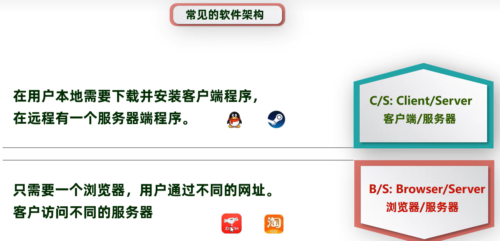

客户端和浏览器 向用户**展示**数据信息

真正的核心数据在服务器里

BS:如果更新的话，直接刷新网页就可以了

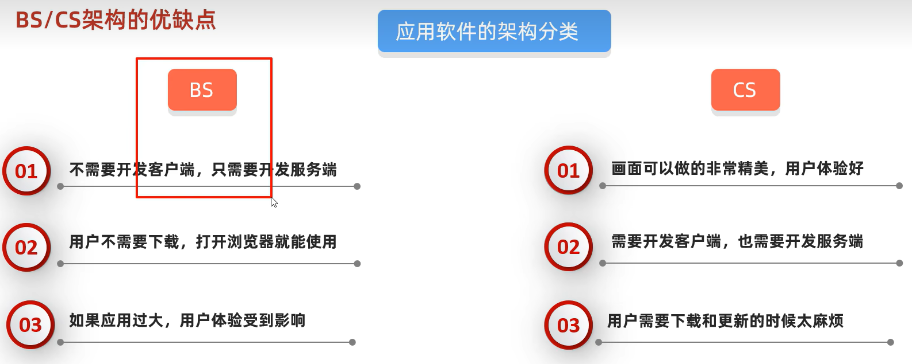

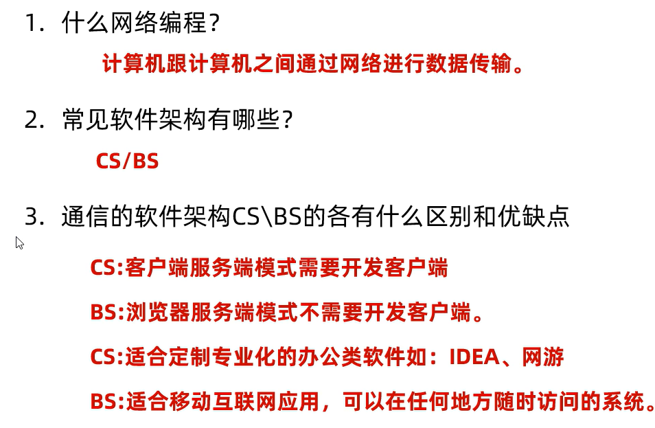


### 1.1 网络编程概述

- 计算机网络

  是指将地理位置不同的具有独立功能的多台计算机及其外部设备，通过通信线路连接起来，在网络操作系统，网络管理软件及网络通信协议的管理和协调下，实现资源共享和信息传递的计算机系统

- 网络编程

  在网络通信协议下，不同计算机上运行的程序，可以进行数据传输

### 1.2 网络编程三要素

- IP地址

  要想让网络中的计算机能够互相通信，必须为每台计算机指定一个标识号，通过这个标识号来指定要接收数据的计算机和识别发送的计算机，而IP地址就是这个标识号。也就是设备的标识

- 端口(哪个软件)

  网络的通信，本质上是两个应用程序的通信。每台计算机都有很多的应用程序，那么在网络通信时，如何区分这些应用程序呢？如果说IP地址可以唯一标识网络中的设备，那么端口号就可以唯一标识设备中的应用程序了。也就是应用程序的标识

- 协议（网络传输的规则）

  通过计算机网络可以使多台计算机实现连接，位于同一个网络中的计算机在进行连接和通信时需要遵守一定的规则，这就好比在道路中行驶的汽车一定要遵守交通规则一样。在计算机网络中，这些连接和通信的规则被称为网络通信协议，它对数据的传输格式、传输速率、传输步骤等做了统一规定，通信双方必须同时遵守才能完成数据交换。常见的协议有UDP协议和TCP协议

### 1.3 IP地址//Internet Protocol

protocol协议

IP地址：是**网络中设备**的**唯一**标识

- IP地址分为两大类
  - IPv4（Internet Protocol version4互联网通信协议第4版）：是给每个连接在网络上的主机分配一个32bit地址。按照TCP/IP规定，IP地址用二进制来表示，每个IP地址长32bit，也就是4个字节。例如一个采用二进制形式的IP地址是“11000000 10101000 00000001 01000010”，这么长的地址，处理起来也太费劲了。为了方便使用，IP地址经常被写成十进制的形式，中间使用符号“.”分隔不同的字节。于是，上面的IP地址可以表示为“192.168.1.66”。IP地址的这种表示法叫做“点分十进制表示法”，这显然比1和0容易记忆得多
  
  - 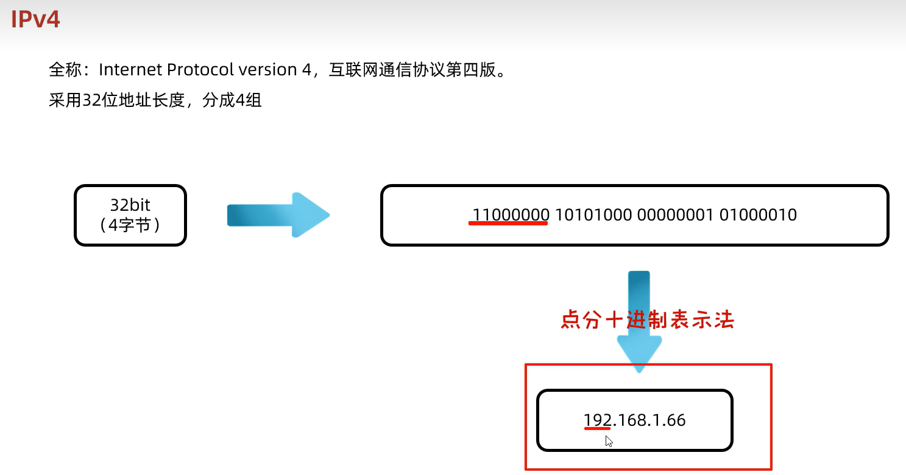
  
    每一组取值范围0-255，不考虑负数//43亿个ip，不够
  
  - IPv6：由于互联网的蓬勃发展，IP地址的需求量愈来愈大，但是网络地址资源有限，使得IP的分配越发紧张。为了扩大地址空间，通过IPv6重新定义地址空间，采用128位地址长度，每16个字节一组，分成8组十六进制数，这样就解决了网络地址资源数量不够的问题
  
    解决了ip不够用的问题
  
    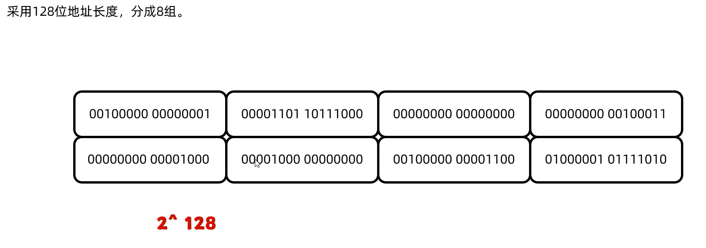
  
    ##### ipv6还在初级阶段，还没有大规模使用，2019才发布的，这个ip数多到地球上每一粒沙子都能使用
  
    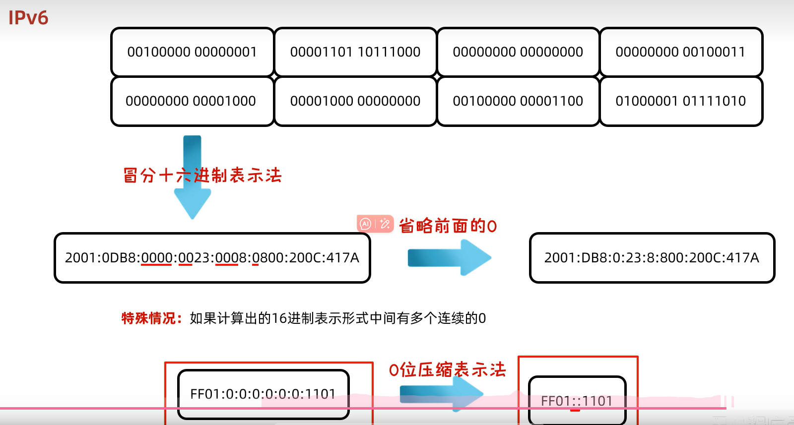
  
    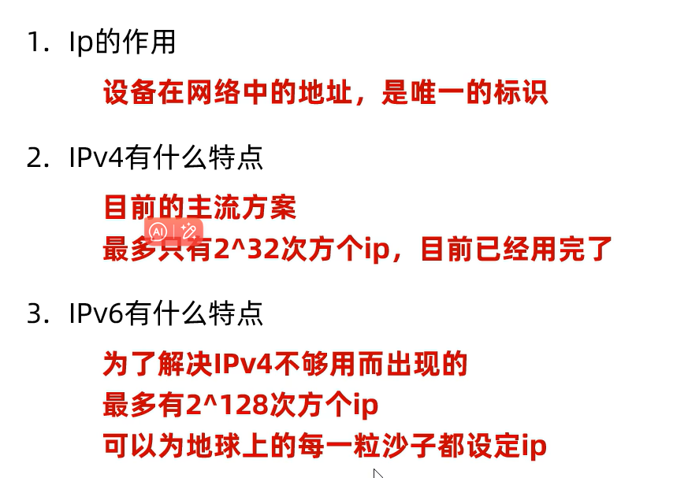


### 目前是怎么解决ip不够用的问题的？

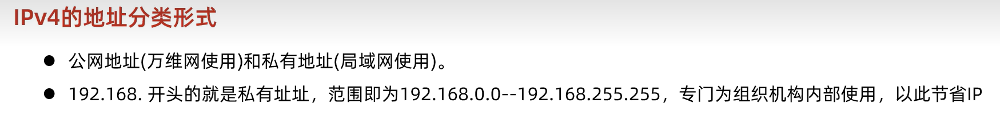


- DOS常用命令：
  - ipconfig：查看本机IP地址
  - ping IP地址：检查网络是否连通
  
- 特殊IP地址：
  
  - 127.0.0.1：是回送地址，可以代表本机地址，一般用来测试使用
  
  - 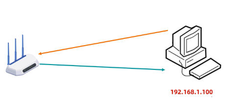
  
    这样的发送是先发送给路由器，在发送给自己。如果在不同的地方上网，那么路由器分配给你的ip可能会不一样
  
  - 
  
    这个地址不经过路由器，当他经过网卡的时候，网卡又给他发送回来，不管在哪里上网都是这样的
  
  ##### 常用的cmd命令：
  
  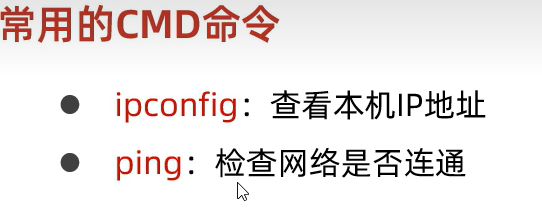
  
  ping后面 空格 然后根Ip地址或者网址（网址的底层逻辑也是ip）都行
  
  ### 1.4 InetAddress	//Ip对象  由于一台电脑有一个ip,所以可以看成是一台电脑的对象

InetAddress：此类表示Internet协议（IP）地址//在创建InetAddress的时候方法的底层会先判断系统用的是ipv4还是ipv6，然后创造相应的对象    Inet4Address、Inet6Address  //这两个都是InetAddress的子类

- 相关方法

  | 方法名                                    | 说明                                                         |
  | ----------------------------------------- | ------------------------------------------------------------ |
  | static InetAddress getByName(String host) | 确定主机名称的IP地址。主机名称可以是机器名称，也可以是IP地址 |
  | String getHostName()                      | 获取此IP地址的主机名（）//如果网络不行或者局域网中压根就没有这台电脑，那么返回的可能是一个ip |
  | String getHostAddress()                   | 返回文本显示中的IP地址字符串                                 |

- 代码演示

  ```java
  public class InetAddressDemo {
      public static void main(String[] args) throws UnknownHostException {
  		//InetAddress address = InetAddress.getByName("itheima");
          InetAddress address = InetAddress.getByName("192.168.1.66");
  
          //public String getHostName()：获取此IP地址的主机名
          String name = address.getHostName();
          //public String getHostAddress()：返回文本显示中的IP地址字符串
          String ip = address.getHostAddress();
  
          System.out.println("主机名：" + name);
          System.out.println("IP地址：" + ip);
      }
  }
  ```

### 1.5 端口和协议

- **端口//在网络术语中，端口并不是指物理设备，而是便于实现服务器与客户端之间的通信所使用的抽象概念**

  - **设备**上**应用程序**的唯一标识

- 端口号

  - 用**两个字节**表示的整数，它的取值范围是**0~65535**。其中，**0~1023之间的端口号**用于一些知名的网络服务和应用**//不能用**，**普通的应用程序需要使用1024以上的端口号**。如果端口号被另外一个服务或应用所占用，会导致当前程序启动失败

    **一个端口号只能被一个应用程序使用**

    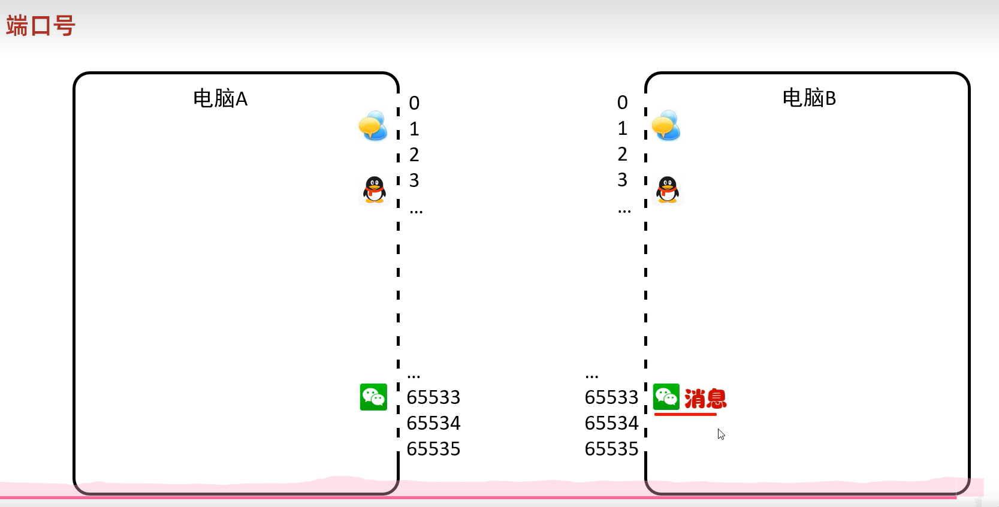

    可以理解成**端口是电脑发送、接收数据的门**

- **协议**

  - 计算机网络中，**连接和通信的规则**被称为网络通信协议
  - 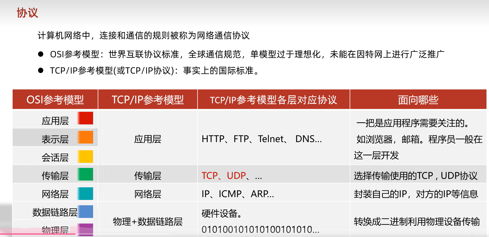
  - 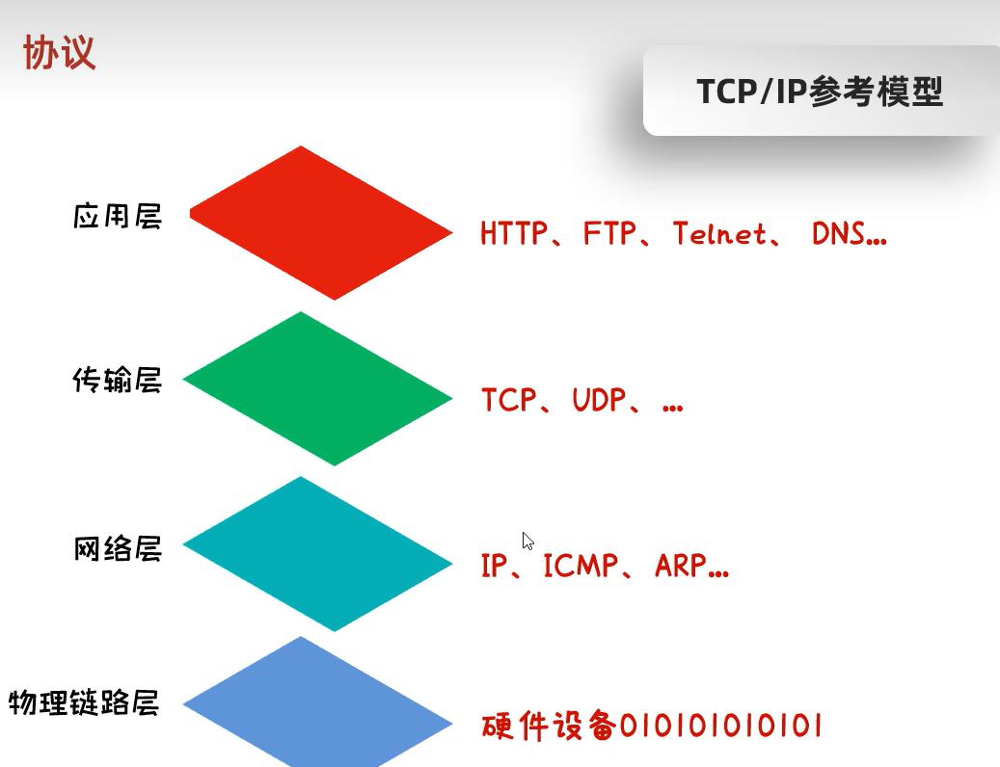

- UDP协议

  - 用户数据报协议(User Datagram Protocol)
  - UDP是无连接通信协议，即在数据传输时，数据的发送端和接收端不建立逻辑连接。简单来说，当一台计算机向另外一台计算机发送数据时，发送端不会确认接收端是否存在，就会发出数据，同样接收端在收到数据时，也不会向发送端反馈是否收到数据。
  - 由于使用UDP协议消耗系统资源小，通信效率高，所以通常都会用于音频、视频和普通数据的传输
  - 例如视频会议通常采用UDP协议，因为这种情况即使偶尔丢失一两个数据包，也不会对接收结果产生太大影响。但是在使用UDP协议传送数据时，由于UDP的面向无连接性，不能保证数据的完整性，因此在传输重要数据时不建议使用UDP协议

- TCP协议

  - 传输控制协议 (Transmission Control Protocol)

  - TCP协议是面向连接的通信协议，即传输数据之前，在发送端和接收端建立逻辑连接，然后再传输数据，它提供了两台计算机之间可靠无差错的数据传输。在TCP连接中必须要明确客户端与服务器端，由客户端向服务端发出连接请求，每次连接的创建都需要经过“三次握手”

  - 三次握手：TCP协议中，在发送数据的准备阶段，客户端与服务器之间的三次交互，以保证连接的可靠

    第一次握手，客户端向服务器端发出连接请求，等待服务器确认

    第二次握手，服务器端向客户端回送一个响应，通知客户端收到了连接请求

    第三次握手，客户端再次向服务器端发送确认信息，确认连接

  - 完成三次握手，连接建立后，客户端和服务器就可以开始进行数据传输了。由于这种面向连接的特性，TCP协议可以保证传输数据的安全，所以应用十分广泛。例如上传文件、下载文件、浏览网页等
  
  - 
  
  - 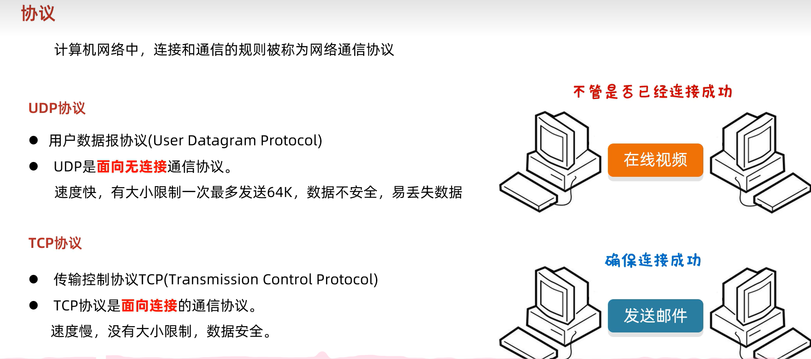
  
    UDP：不管有没有连接成功，直接发送数据，不管你能不能收到我给你发的都无所谓
  
    TCP:先检查有没有连接成功，只有连接成功的情况下我才会给你发消息

## 2.UDP通信程序

### 2.1 UDP发送数据

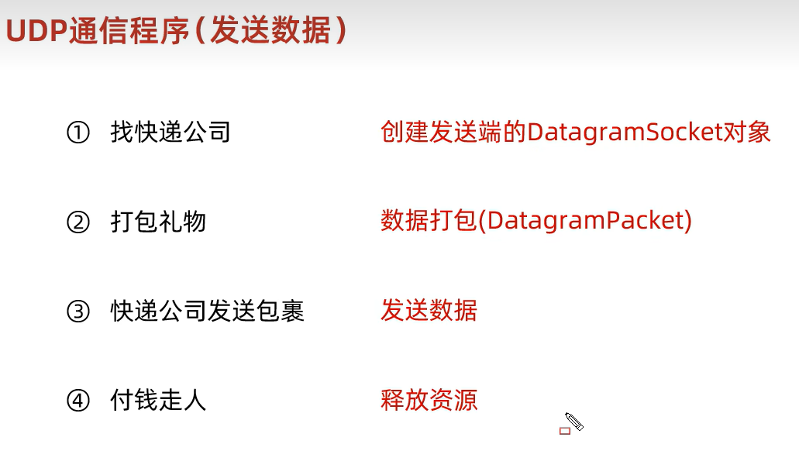

- Java中的UDP通信

  - UDP协议是一种不可靠的网络协议，它在通信的两端各建立一个Socket对象，但是这两个Socket只是发送，接收数据的对象，因此对于基于UDP协议的通信双方而言，没有所谓的客户端和服务器的概念
  - Java提供了DatagramSocket类作为基于UDP协议的Socket

- 构造方法

  | 方法名                                                      | 说明                                                 |
  | ----------------------------------------------------------- | ---------------------------------------------------- |
  | DatagramSocket()                                            | 创建数据报套接字并将其绑定到本机地址上的任何可用端口 |
  | DatagramPacket(byte[] buf,int len,InetAddress add,int port) | 创建数据包,发送长度为len的数据包到指定主机的指定端口 |

- 相关方法

  | 方法名                         | 说明                   |
  | ------------------------------ | ---------------------- |
  | void send(DatagramPacket p)    | 发送数据报包           |
  | void close()                   | 关闭数据报套接字       |
  | void receive(DatagramPacket p) | 从此套接字接受数据报包 |

- 发送数据的步骤

  - 创建发送端的Socket对象(DatagramSocket)

    #### DatagramSocket的细节：

    **参数：//绑定端口，以后都是通过这个端口向外发送**
    空参：从所有可用的端口中随机一个进行使用

    有参：指定端口号进行绑定

  - 创建数据，并把数据打包

  - 调用DatagramSocket对象的方法发送数据

    #### send()细节：

    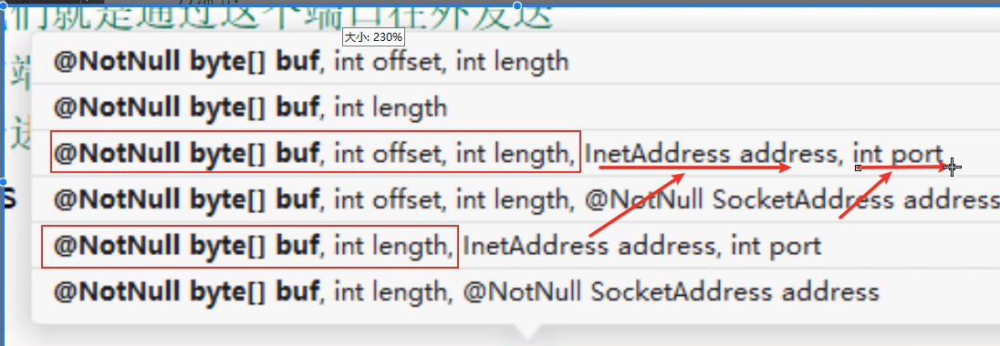

    第一个参数是字节数组：表示要尽心传输数据的字节数组

    offset表示起始索引

    port:发送给的那个接受对象用哪个端口接收数据

  - 关闭发送端


#### 由于UDP协议发送的时候是无所谓对方是否接收到数据的，所以代码一定是会成功运行的//前提是接收的那个ip是真实存在的

- 代码演示

  ```java
  public class SendDemo {
      public static void main(String[] args) throws IOException {
          //创建发送端的Socket对象(DatagramSocket)
          // DatagramSocket() 构造数据报套接字并将其绑定到本地主机上的任何可用端口
          DatagramSocket ds = new DatagramSocket();
  
          //创建数据，并把数据打包
          //DatagramPacket(byte[] buf, int length, InetAddress address, int port)
          //构造一个数据包，发送长度为 length的数据包到指定主机上的指定端口号。
          byte[] bys = "hello,udp,我来了".getBytes();
  
          DatagramPacket dp = new DatagramPacket(bys,bys.length,InetAddress.getByName("127.0.0.1"),10086);
  
          //调用DatagramSocket对象的方法发送数据
          //void send(DatagramPacket p) 从此套接字发送数据报包
          ds.send(dp);
  
          //关闭发送端
          //void close() 关闭此数据报套接字
          ds.close();
      }
  }
  ```

### 2.2UDP接收数据

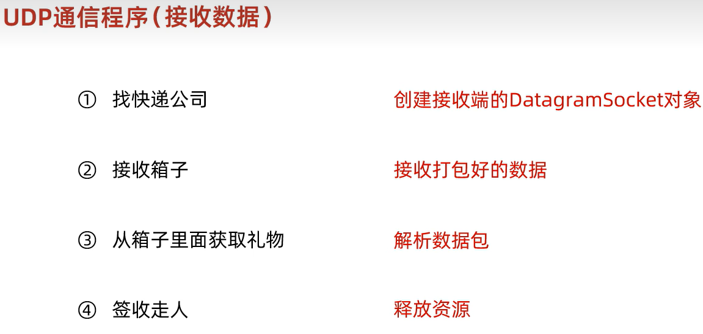

- 接收数据的步骤

  - 创建接收端的Socket对象(DatagramSocket)

    #### DatagramSocket的细节：

    参数里面指的是**这个“公司”作用的端口**（这个作用可能为	发送/接收）

    port指的是对方作用的端口，这里的作用可能是 发送/接收

  - 创建一个数据包，用于接收数据

    **receive方法是阻塞的，当程序执行到这里的时候，会在这里死等，等发送端发送消息才会继续执行下面的代码**

  - 调用DatagramSocket对象的方法接收数据

  - 解析数据包，并把数据在控制台显示

  - 关闭接收端

- 构造方法

  | 方法名                              | 说明                                            |
  | ----------------------------------- | ----------------------------------------------- |
  | DatagramPacket(byte[] buf, int len) | 创建一个DatagramPacket用于接收长度为len的数据包 |

  接收到的数据会被存储到buf数组里面

  ##### 从数据包裹可以查找到一些信息：

  *<u>1.getLength()//字节数组的长度</u>*

  *<u>2.getData()//直接获取字节数组</u>*

  *<u>3.getAddress//获取发送方的ip</u>*

  *<u>4.getPort//获取发送方的发送端口</u>*

  

- 相关方法

  | 方法名            | 说明                                     |
  | ----------------- | ---------------------------------------- |
  | byte[]  getData() | 返回数据缓冲区                           |
  | int  getLength()  | 返回要发送的数据的长度或接收的数据的长度 |

- 示例代码

  ```java
  public class ReceiveDemo {
      public static void main(String[] args) throws IOException {
        	//创建接收端的Socket对象(DatagramSocket)
        	DatagramSocket ds = new DatagramSocket(12345);
  
        	//创建一个数据包，用于接收数据
        	byte[] bys = new byte[1024];
        	DatagramPacket dp = new DatagramPacket(bys, bys.length);
  
        	//调用DatagramSocket对象的方法接收数据
        	ds.receive(dp);
  
        	//解析数据包，并把数据在控制台显示
        	System.out.println("数据是：" + new String(dp.getData(), 0,                                             dp.getLength()));
          }
      }
  }
  ```

### 2.3UDP通信程序练习

- 案例需求

  UDP发送数据：数据来自于键盘录入，直到输入的数据是886，发送数据结束

  UDP接收数据：因为接收端不知道发送端什么时候停止发送，故采用死循环接收

- 代码实现

  ```java
  /*
      UDP发送数据：
          数据来自于键盘录入，直到输入的数据是886，发送数据结束
   */
  public class SendDemo {
      public static void main(String[] args) throws IOException {
          //创建发送端的Socket对象(DatagramSocket)
          DatagramSocket ds = new DatagramSocket();
          //键盘录入数据
          Scanner sc = new Scanner(System.in);
          while (true) {
            	String s = sc.nextLine();
              //输入的数据是886，发送数据结束
              if ("886".equals(s)) {
                  break;
              }
              //创建数据，并把数据打包
              byte[] bys = s.getBytes();
              DatagramPacket dp = new DatagramPacket(bys, bys.length, InetAddress.getByName("192.168.1.66"), 12345);
  
              //调用DatagramSocket对象的方法发送数据
              ds.send(dp);
          }
          //关闭发送端
          ds.close();
      }
  }
  
  /*
      UDP接收数据：
          因为接收端不知道发送端什么时候停止发送，故采用死循环接收
   */
  public class ReceiveDemo {
      public static void main(String[] args) throws IOException {
          //创建接收端的Socket对象(DatagramSocket)
          DatagramSocket ds = new DatagramSocket(12345);
          while (true) {
              //创建一个数据包，用于接收数据
              byte[] bys = new byte[1024];
              DatagramPacket dp = new DatagramPacket(bys, bys.length);
              //调用DatagramSocket对象的方法接收数据
              ds.receive(dp);
              //解析数据包，并把数据在控制台显示
              System.out.println("数据是：" + new String(dp.getData(), 0, dp.getLength()));
          }
          //关闭接收端
  //        ds.close();
      }
  }
  ```


#### InetAddress 对象的 getAddress() 方法和 getAddress().getHostAddress() 方法

在功能上有所不同，主要区别在于它们返回的地址格式。
**getAddress() 方法：**
返回一个**字节数组**，其中包含了 IP 地址的**原始二进制表示**。
这个字节数组的格式取决于 IP 地址的类型（IPv4 或 IPv6）。
对于 IPv4 地址，字节数组长度为 4；对于 IPv6 地址，字节数组长度为 16。
通常情况下，这个方法返回的字节数组**不适合直接用于显示或文本处理**，因为它是二进制格式。
**getAddress().getHostAddress() 方法**：
调用 getAddress() 方法获取字节数组后，进一步将其转换为字符串形式的 IP 地址。
这个字符串形式的 IP 地址是<u>*点分十进制*</u>格式（IPv4）或<u>*十六进制冒号分隔格式*</u>（IPv6）。
这种格式的 IP 地址更易于阅读和处理，可以直接用于显示或文本传输。

总结：
getAddress() 方法返回原始的字节数组形式的 IP 地址。
getAddress().getHostAddress() 方法返回易于阅读和处理的字符串形式的 IP 地址。
在实际使用中，如果你需要将 IP 地址显示给用户或者在文本中使用，通常应该使用 getAddress().getHostAddress() 方法。如果你需要处理 IP 地址的二进制数据，或者需要进行底层网络编程，可能需要使用 getAddress() 方法。


### 补充聊天室的原理（某个程序可以重复运行）

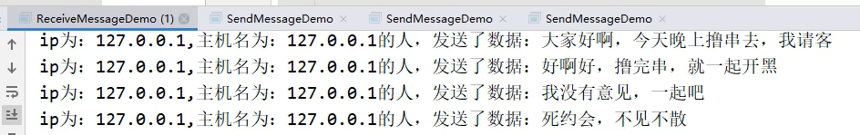

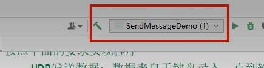

-> Edit Configuration...

->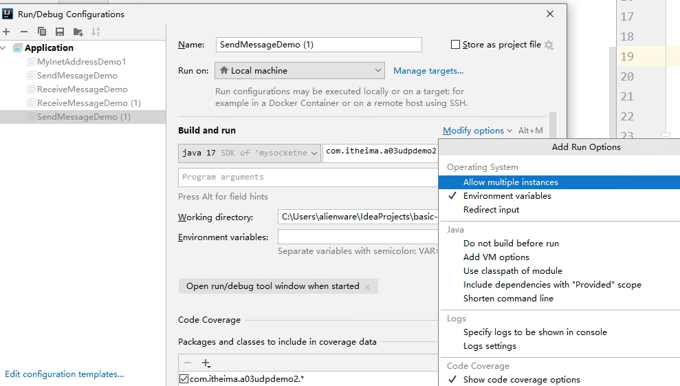

### 2.4UDP三种通讯方式

- 单播//一对一

  单播用于两个主机之间的端对端通信

- 组播

  组播用于对一组特定的主机进行通信

  #### 组播地址： 224.0.0.0~239.255.255.255

  **其中 224.0.0.0~224.0.0.255为预留的、可用的组播地址**

- 广播

  广播用于一个主机对整个局域网上所有主机上的数据通信
  
  #### 广播地址：
  **255.255.255.255**

### 2.5UDP组播实现

- 实现步骤

  - 发送端
    1. 创建发送端的Socket对象(DatagramSocket)
    2. 创建数据，并把数据打包(DatagramPacket)
    3. 调用DatagramSocket对象的方法发送数据(在单播中,这里是发给指定IP的电脑但是在组播当中,这里是发给**组播地址**)
    4. 释放资源
  - 接收端
    1. **创建接收端Socket对象(MulticastSocket)**//形参仍然写发送时设置的接受者的端口
    
    2. 创建一个箱子,用于接收数据
    
    3. **把当前计算机绑定一个组播地址**//ms**.joinGroup**(InetAddress.getByName("224.0.1.0"));**放在receive之前**
    
    4. 将数据接收到箱子中
    
    5. 解析数据包,并打印数据
    
    6. 释放资源
    
       ### socket：相当于本机的ip+端口号 套接字（Socket）：套接字是网络通信的端点，它是网络中两个节点之间进行双向通信的门户。套接字由IP地址和端口号组成，用于标识网络中的特定通信端点。在TCP/IP网络中，套接字通常指的是TCP套接字或UDP套接字，它们分别使用传输控制协议（TCP）和用户数据报协议（UDP）进行通信。

- 代码实现

  ```java
  // 发送端
  public class ClinetDemo {
      public static void main(String[] args) throws IOException {
          // 1. 创建发送端的Socket对象(DatagramSocket)
          DatagramSocket ds = new DatagramSocket();
          String s = "hello 组播";
          byte[] bytes = s.getBytes();
          InetAddress address = InetAddress.getByName("224.0.1.0");
          int port = 10000;
          // 2. 创建数据，并把数据打包(DatagramPacket)
          DatagramPacket dp = new DatagramPacket(bytes,bytes.length,address,port);
          // 3. 调用DatagramSocket对象的方法发送数据(在单播中,这里是发给指定IP的电脑但是在组播当中,这里是发给组播地址)
          ds.send(dp);
          // 4. 释放资源
          ds.close();
      }
  }
  // 接收端
  public class ServerDemo {
      public static void main(String[] args) throws IOException {
          // 1. 创建接收端Socket对象(MulticastSocket)
          MulticastSocket ms = new MulticastSocket(10000);
          // 2. 创建一个箱子,用于接收数据
          DatagramPacket dp = new DatagramPacket(new byte[1024],1024);
          // 3. 把当前计算机绑定一个组播地址,表示添加到这一组中.
          ms.joinGroup(InetAddress.getByName("224.0.1.0"));
          // 4. 将数据接收到箱子中
          ms.receive(dp);
          // 5. 解析数据包,并打印数据
          byte[] data = dp.getData();
          int length = dp.getLength();
          System.out.println(new String(data,0,length));
          // 6. 释放资源
          ms.close();
      }
  }
  ```

### 2.6UDP广播实现

- 实现步骤

  - 发送端
    1. 创建发送端Socket对象(DatagramSocket)
    2. 创建存储数据的箱子,将**广播地址**封装进去
    3. 发送数据
    4. 释放资源
  - 接收端
    1. 创建接收端的Socket对象(DatagramSocket)
    2. 创建一个数据包，用于接收数据
    3. 调用DatagramSocket对象的方法接收数据
    4. 解析数据包，并把数据在控制台显示
    5. 关闭接收端

- 代码实现

  ```java
  // 发送端
  public class ClientDemo {
      public static void main(String[] args) throws IOException {
        	// 1. 创建发送端Socket对象(DatagramSocket)
          DatagramSocket ds = new DatagramSocket();
  		// 2. 创建存储数据的箱子,将广播地址封装进去
          String s = "广播 hello";
          byte[] bytes = s.getBytes();
          InetAddress address = InetAddress.getByName("255.255.255.255");
          int port = 10000;
          DatagramPacket dp = new DatagramPacket(bytes,bytes.length,address,port);
  		// 3. 发送数据
          ds.send(dp);
  		// 4. 释放资源
          ds.close();
      }
  }
  
  // 接收端
  public class ServerDemo {
      public static void main(String[] args) throws IOException {
          // 1. 创建接收端的Socket对象(DatagramSocket)
          DatagramSocket ds = new DatagramSocket(10000);
          // 2. 创建一个数据包，用于接收数据
          DatagramPacket dp = new DatagramPacket(new byte[1024],1024);
          // 3. 调用DatagramSocket对象的方法接收数据
          ds.receive(dp);
          // 4. 解析数据包，并把数据在控制台显示
          byte[] data = dp.getData();
          int length = dp.getLength();
          System.out.println(new String(data,0,length));
          // 5. 关闭接收端
          ds.close();
      }
  }
  ```

## 3. TCP通信程序

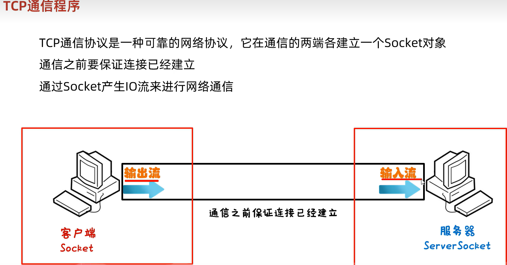

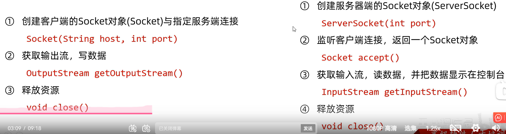

### 3.1TCP发送数据

### Socket套接字：

是网络软件中的一个抽象概念，腐恶启动该程序内部和外部之间的通信

一旦套接字被打开，java.net.Socket类中的getInputStream方法会返回一个InputStream对象，该对象可以像任何其他流对象一样使用。**这个过程将一直持续到流发送完毕且服务器断开连接为止**

- Java中的TCP通信

  - Java对基于TCP协议的的网络提供了良好的封装，使用Socket对象来代表两端的通信端口，并通过Socket产生IO流来进行网络通信。
  - Java为客户端提供了Socket类，为**服务器端**提供了**ServerSocket**类

- 构造方法

  | 方法名                               | 说明                                           |
  | ------------------------------------ | ---------------------------------------------- |
  | Socket(InetAddress address,int port) | 创建流套接字并将其连接到指定IP指定端口号       |
  | Socket(String host, int port)        | 创建流套接字并将其连接到指定主机上的指定端口号 |

  #### Socket()这里的形参指的都是连接对象对应的数据。////Socket和ServerSocket形参里的端口代表的是服务器的端口，是同一个

- 相关方法

  | 方法名                         | 说明                 |
  | ------------------------------ | -------------------- |
  | InputStream  getInputStream()  | 返回此套接字的输入流 |
  | OutputStream getOutputStream() | 返回此套接字的输出流 |

- 示例代码

  ```java
  public class Client {
      public static void main(String[] args) throws IOException {
          //TCP协议，发送数据
  
          //1.创建Socket对象
          //细节：在创建对象的同时会连接服务端
          //      如果连接不上，代码会报错
          Socket socket = new Socket("127.0.0.1",10000);
  
          //2.可以从连接通道中获取输出流
          OutputStream os = socket.getOutputStream();
          //写出数据
          os.write("aaa".getBytes());
  
          //3.释放资源
          os.close();
          socket.close();
      }
  }
  ```

//这样写传递的中文是乱码

### 3.2TCP接收数据

- 构造方法

  | 方法名                  | 说明                             |
  | ----------------------- | -------------------------------- |
  | ServletSocket(int port) | 创建绑定到指定端口的服务器套接字 |

- 相关方法

  | 方法名              | 说明                               |
  | ------------------- | ---------------------------------- |
  | **Socket** accept() | 监听要连接到此的套接字**并接受它** |

- 注意事项

  1. accept方法是阻塞的,作用就是等待客户端连接
  2. 客户端创建对象并连接服务器,此时是通过三次握手协议,保证跟服务器之间的连接
  3. 针对客户端来讲,是往外写的,所以是输出流
     针对服务器来讲,是往里读的,所以是输入流
  4. read方法也是阻塞的
  5. 客户端在关流的时候,还多了一个往服务器写结束标记的动作
  6. 最后一步断开连接,通过四次挥手协议保证连接终止

- 三次握手和四次挥手

  - 三次握手**//确保连接**

    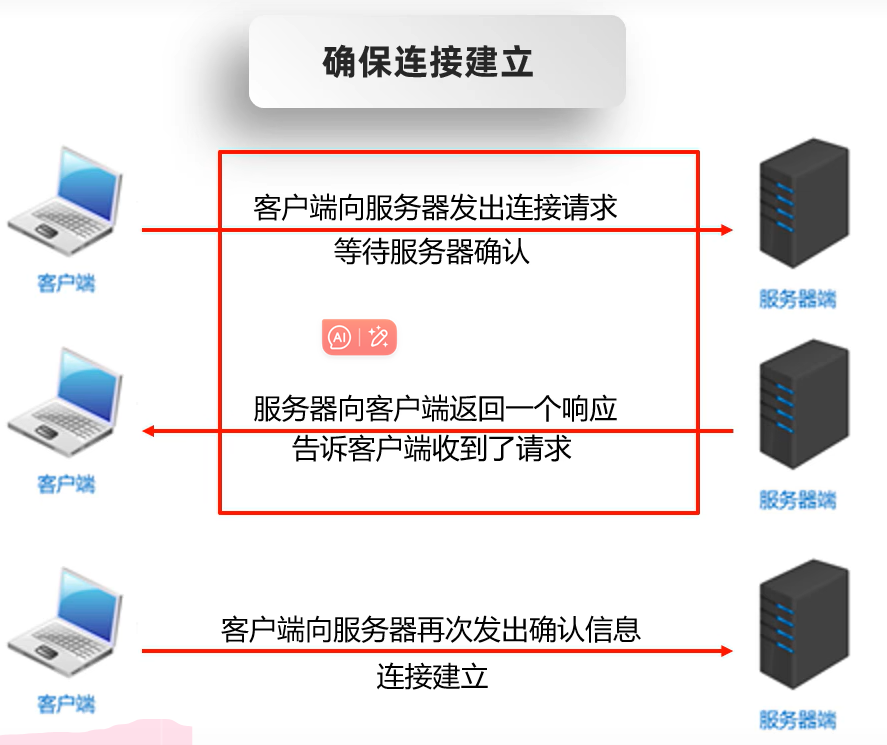

  - 四次挥手**//确保断开**

    

- 示例代码

  ```java
  public class Server {
      public static void main(String[] args) throws IOException {
          //TCP协议，接收数据
  
          //1.创建对象ServerSocker
          ServerSocket ss = new ServerSocket(10000);
  
          //2.监听客户端的链接
          Socket socket = ss.accept();
  
          //3.从连接通道中获取输入流读取数据
          InputStream is = socket.getInputStream();
          int b;
          while ((b = is.read()) != -1){
              System.out.println((char) b);
          }
  
          //4.释放资源
          socket.close();
          ss.close();
      }
  }
  ```

## TCP协议发送与接收数据的一些小细节：

1.在创建Socket时，由于方法的形参要填服务端的的ServerSocket对象，所以只能先运行服务端在运行客户端不然会报错；

2.Socket对象.accept()会一直死等客户端来连接

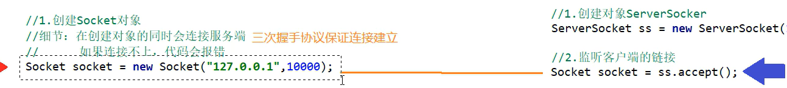

客户端的对象一建立，连接就成功，就能监听到

3.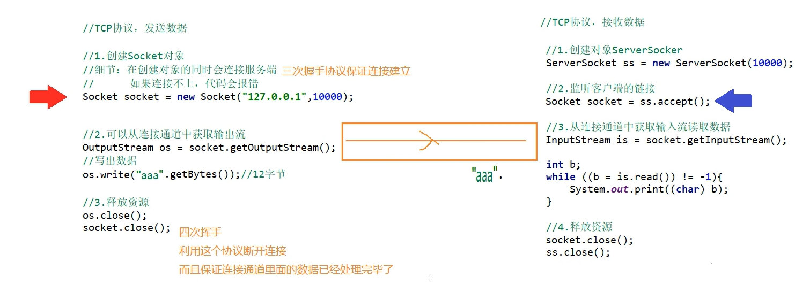

##### 自己的理解：

Socket-----路的所属权

ServerSocket-----快递公司

只要有了路的所属权不管是输入流（道路）还是输出流（道理）都可以自行建立，但都是经过   路的所属权   才能建立的

所以对于客户端，其实释放资源的时候可以省略os.close()，因为只要连所属权都失去了，路也消失了

### 3.3TCP程序练习（传输中文）

发送端：

```java
public class Client {
    public static void main(String[] args) throws IOException {
        //TCP协议，发送数据

        //1.创建Socket对象
        //细节：在创建对象的同时会连接服务端
        //      如果连接不上，代码会报错
        Socket socket = new Socket("127.0.0.1",10000);


        //2.可以从连接通道中获取输出流
        OutputStream os = socket.getOutputStream();
        //写出数据
        os.write("你好你好".getBytes());//12字节

        //3.释放资源
        os.close();
        socket.close();

    }
}

```

接收端：

```java
public class Server {
    public static void main(String[] args) throws IOException {
        //TCP协议，接收数据

        //1.创建对象ServerSocker
        ServerSocket ss = new ServerSocket(10000);

        //2.监听客户端的链接
        Socket socket = ss.accept();

        //3.从连接通道中获取输入流读取数据
        InputStream is = socket.getInputStream();
        InputStreamReader isr = new InputStreamReader(is);
        BufferedReader br = new BufferedReader(isr);

        // BufferedReader br = new BufferedReader(new InputStreamReader(socket.getInputStream()));

        int b;
        while ((b = br.read()) != -1){
            System.out.print((char) b);
        }

        //4.释放资源
        socket.close();
        ss.close();

    }
}
```

## 4. 综合练习

### 练习一：多发多收

需求：

​	客户端：多次发送数据

​	服务器：接收多次接收数据，并打印

代码示例：

```java
public class Client {
    public static void main(String[] args) throws IOException {
        //客户端：多次发送数据
        //服务器：接收多次接收数据，并打印

        //1. 创建Socket对象并连接服务端
        Socket socket = new Socket("127.0.0.1",10000);

        //2.写出数据
        Scanner sc = new Scanner(System.in);
        OutputStream os = socket.getOutputStream();

        while (true) {
            System.out.println("请输入您要发送的信息");
            String str = sc.nextLine();
            if("886".equals(str)){
                break;
            }
            os.write(str.getBytes());
        }
        //3.释放资源
        socket.close();
    }
}
```

```java
public class Server {
    public static void main(String[] args) throws IOException {
        //客户端：多次发送数据
        //服务器：接收多次接收数据，并打印

        //1.创建对象绑定10000端口
        ServerSocket ss = new ServerSocket(10000);

        //2.等待客户端来连接
        Socket socket = ss.accept();

        //3.读取数据
        InputStreamReader isr = new InputStreamReader(socket.getInputStream());
        int b;
        while ((b = isr.read()) != -1){
            System.out.print((char)b);
        }

        //4.释放资源
        socket.close();
        ss.close();
    }
}
```


### 练习二：接收并反馈

#### 小细节：

#### 1.半关闭（half-close）：

#### read（）的阻塞问题：

实际上，read和write方法在执行的时候都将阻塞，直至字节确实被读入或写出。这就意味着**如果流不能立即被访问（通常是因为网络连接忙），那么当前线程将被阻塞**。使得这两个方法等待指定的流变为可用的这段时间里，其他线程就有机会去执行有用的工作

之前学的InputStream流，遇到输入源的结尾会返回-1；

在Java中，输入流的read()方法用于从输入流中读取数据。当调用read()方法时，它会尝试从输入流中读取数据。如果输入流中没有数据可读，read()方法会阻塞当前线程，即当前线程会进入等待状态，直到有数据可读为止。这种阻塞行为是为了确保程序能够正确地读取数据，因为如果没有数据可读，继续执行读取操作是没有意义的。
##### 数据已经读取完毕和没有数据可读取导致的线程阻塞的区别在于：
**数据已经读取完毕：**当输入流中的数据已经被全部读取完毕时，read()方法会返回-1，表示已经到达输入流的末尾，没有更多的数据可读。此时，线程不会被阻塞，而是会继续执行下一条语句。
**没有数据可读取导致的线程阻塞：**当输入流中没有数据可读时，read()方法会阻塞当前线程，即当前线程会进入等待状态，直到有数据可读为止。这种情况下，线程会一直等待，直到有数据到达输入流，或者等待超时（如果设置了超时时间）。


#### Socket对象的shutdownOutput()方法和设置其值为-1是两个不同的概念：
**shutdownOutput()方法**：
这个方法用于**关闭**Socket的**输出流**，即告诉对方发送端已经完成了数据的发送，不再发送数据了。
调用shutdownOutput()方法后，你仍然可以从Socket的输入流中读取数据，但是不能再向其输出流写入数据。
这个方法通常在需要显式通知对方发送结束时使用，比如在文件传输完成后，或者在需要关闭连接的一部分时。
**设置值为-1：**
在InputStream的read()方法中，返回-1表示已经**到达输入流的末尾**，没有更多的数据可读。
当从Socket的输入流中读取数据时，如果对方关闭了连接或者发送完毕，read()方法会返回-1。
返回-1是一种信号，告诉程序输入流已经结束，应该停止读取数据。

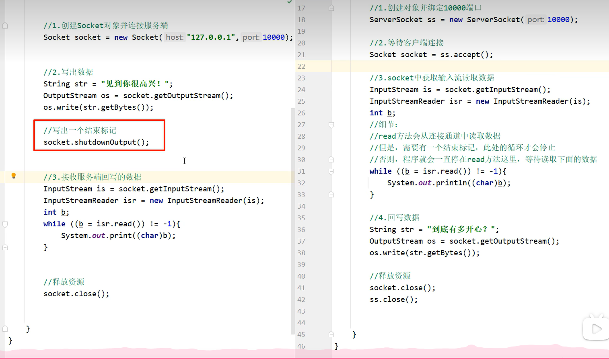

意义：半关闭是一种很典型的情况，比如我们向服务器传输数据，一开始并不知道传输多少数据。在向文件写数据的时候，我们只需在数据写入后关闭文件即可。可是如果关闭一整个套接字，那么与服务器的连接会立刻断开，所以也就无法读取服务器的相应。

所以可以用半关闭的方法，通过关闭一个套接字的输出流来表示发送给服务器的请求数据已经结束，但必须保持输入流处于打开状态

#### 不直接关闭这个输出流的原因：

最近在看 《linux多线程服务端编程:使用moduo C++网络库》一书中，看到一段话

“如果要主动关闭连接，如何保证对方已经收到全部数据？如果应用层有缓冲（这在非阻塞网络编程中是必需的，见下文），那么如何保证先发送完缓冲区中的数据，然后再断开连接？直接调用close(2)恐怕是不行的。”

摘录来自: 陈硕. “Linux多线程服务端编程:使用muduo C++网络库。” 

往socket连接中write数据，其实先到write buffer之中的，如果是非堵塞IO write操作会立刻返回，此时数据可能还在write buffer中，还没来得及发送给对端

如果此时立刻执行close，内核会首先检查tcp的read buffer里有没有客户端发送过来的数据留在内核态没有被用户态进程读取，如果有则发送给客户端RST报文来关闭tcp连接 并丢弃write buffer里的数据，如果没有则等待write buffer里的数据发送完毕，然后再经过正常的4次分手报文断开连接。

 

所以直接关闭，对端是否能成功收到数据，分两种情况

1、如果write的时候，read buffer为空，那么write完立即close就没问题，

2、如果write的时候，read buffer不为空，那么对端会收到RST，连接被重置，write buffer数据可能被丢弃，对端可能收不到
————————————————


2.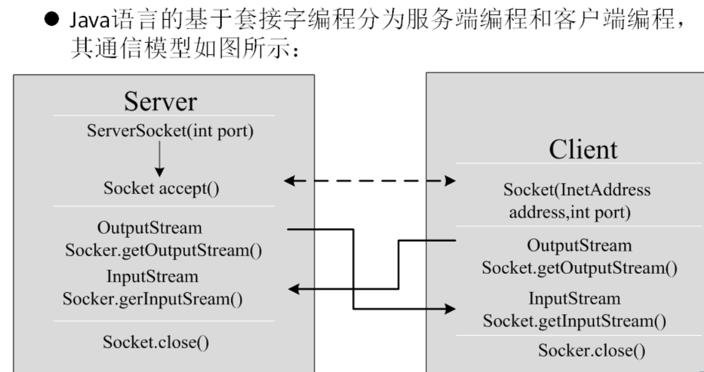

注意输入流输出流的方向以及他们的对应

#### 服务器发送给服务器输出流的所有信息都会成为客户端程序的输入，同时来自客户端程序的所有输出都会被包含在服务器输入流中


- 案例需求

  客户端：发送数据，接受服务器反馈

  服务器：收到消息后给出反馈

- 案例分析

  - 客户端创建对象，使用输出流输出数据
  - 服务端创建对象，使用输入流接受数据
  - 服务端使用输出流给出反馈数据
  - 客户端使用输入流接受反馈数据

- 代码实现

  ```java
  // 客户端
  public class ClientDemo {
      public static void main(String[] args) throws IOException {
          Socket socket = new Socket("127.0.0.1",10000);
  
          OutputStream os = socket.getOutputStream();
          os.write("hello".getBytes());
         // os.close();如果在这里关流,会导致整个socket都无法使用
          socket.shutdownOutput();//仅仅关闭输出流.并写一个结束标记,对socket没有任何影响
          
          BufferedReader br = new BufferedReader(new InputStreamReader(socket.getInputStream()));
          String line;
          while((line = br.readLine())!=null){
              System.out.println(line);
          }
          br.close();
          os.close();
          socket.close();
      }
  }
  // 服务器
  public class ServerDemo {
      public static void main(String[] args) throws IOException {
          ServerSocket ss = new ServerSocket(10000);
  
          Socket accept = ss.accept();
  
          InputStream is = accept.getInputStream();
          int b;
          while((b = is.read())!=-1){
              System.out.println((char) b);
          }
  
          System.out.println("看看我执行了吗?");
  
          BufferedWriter bw = new BufferedWriter(new OutputStreamWriter(accept.getOutputStream()));
          bw.write("你谁啊?");
          bw.newLine();
          bw.flush();
  
          bw.close();
          is.close();
          accept.close();
          ss.close();
      }
  }
  ```

### 练习三：上传练习（TCP协议）

### 很重要的细节1 关于网络流的.close和Socket对象.close()之间的联系：

Java的socket是一个全双工套接字，任何的**输入流或输出流的close()都会造成socket关闭**。//这里的输入流输出流指的是网络里的输入流输出流（通过Socket get获取得到的）

而造成socket关闭常见的有以下两种：
1、调用了.close()方法关闭socket
2、***关闭了输入输出流\***


#### 很重要的细节2 关于什么时候用到flush()刷新数据：

1/在向**网络输出流写入数据后**，**立即调用 flush** 方法，以确保数据被立即发送到网络上。这通常在发送确认消息或其他重要数据时进行。
2/在向**文件输出流写入数据后**，如果你希望确保数据被**立即写入到文件中**，而不是缓存在内存中，可以调用 **flush** 方法。这通常在文件传输完成后进行，以确保文件的完整性。
3/在**关闭输出流**之前，调用 flush 方法可以确保所有缓冲的数据都被写入到目标设备中。这可以避免数据丢失，特别是在程序意外终止的情况下。


客户端：

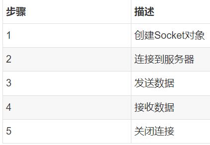

- 案例需求

  客户端：数据来自于本地文件，接收服务器反馈

  服务器：接收到的数据写入本地文件，给出反馈

- 案例分析

  - 创建客户端对象，创建输入流对象指向文件，每读一次数据就给服务器输出一次数据，输出结束后使用shutdownOutput()方法告知服务端传输结束
  - 创建服务器对象，创建输出流对象指向文件，每接受一次数据就使用输出流输出到文件中，传输结束后。使用输出流给客户端反馈信息
  - 客户端接受服务端的回馈信息

- 相关方法

  | 方法名                | 说明                               |
  | --------------------- | ---------------------------------- |
  | void shutdownInput()  | 将此套接字的输入流放置在“流的末尾” |
  | void shutdownOutput() | 禁止用此套接字的输出流             |

- 代码实现

  ```java
  public class Client {
      public static void main(String[] args) throws IOException {
          //客户端：将本地文件上传到服务器。接收服务器的反馈。
          //服务器：接收客户端上传的文件，上传完毕之后给出反馈。
  
  
          //1. 创建Socket对象，并连接服务器
          Socket socket = new Socket("127.0.0.1",10000);
  
          //2.读取本地文件中的数据，并写到服务器当中
          BufferedInputStream bis = new BufferedInputStream(new FileInputStream("mysocketnet\\clientdir\\a.jpg"));
          BufferedOutputStream bos = new BufferedOutputStream(socket.getOutputStream());
          byte[] bytes = new byte[1024];
          int len;
          while ((len = bis.read(bytes)) != -1){
              bos.write(bytes,0,len);
          }
  
          //往服务器写出结束标记
          socket.shutdownOutput();
  
  
          //3.接收服务器的回写数据
          BufferedReader br = new BufferedReader(new InputStreamReader(socket.getInputStream()));
          String line = br.readLine();
          System.out.println(line);
  
  
          //4.释放资源
          socket.close();
  
      }
  }
  ```

  ```java
  public class Server {
      public static void main(String[] args) throws IOException {
          //客户端：将本地文件上传到服务器。接收服务器的反馈。
          //服务器：接收客户端上传的文件，上传完毕之后给出反馈。
  
  
          //1.创建对象并绑定端口
          ServerSocket ss = new ServerSocket(10000);
  
          //2.等待客户端来连接
          Socket socket = ss.accept();
  
          //3.读取数据并保存到本地文件中
          BufferedInputStream bis = new BufferedInputStream(socket.getInputStream());
          BufferedOutputStream bos = new BufferedOutputStream(new FileOutputStream("mysocketnet\\serverdir\\a.jpg"));
          int len;
          byte[] bytes = new byte[1024];
          while ((len = bis.read(bytes)) != -1){
              bos.write(bytes,0,len);
          }
          bos.close();
          //4.回写数据
          BufferedWriter bw = new BufferedWriter(new OutputStreamWriter(socket.getOutputStream()));
          bw.write("上传成功");
          bw.newLine();
          bw.flush();
  
          //5.释放资源
          socket.close();
          ss.close();
      }
  }
  ```

### 练习四：文件名重复

     ```java
**UUID是个类：可以生成一个随机的字符串，并且字符串的内容是唯一的，通过对其静态方法的调用来获取该类的对象**

public class UUIDTest {
    public static void main(String[] args) {
        String str = **UUID.randomUUID()**.toString().replace("-", "");
        System.out.println(str);//9f15b8c356c54f55bfcb0ee3023fce8a
    }
}

     ```
    
     ```

```java
public class Client {
    public static void main(String[] args) throws IOException {
        //客户端：将本地文件上传到服务器。接收服务器的反馈。
        //服务器：接收客户端上传的文件，上传完毕之后给出反馈。


        //1. 创建Socket对象，并连接服务器
        Socket socket = new Socket("127.0.0.1",10000);

        //2.读取本地文件中的数据，并写到服务器当中
        BufferedInputStream bis = new BufferedInputStream(new FileInputStream("mysocketnet\\clientdir\\a.jpg"));
        BufferedOutputStream bos = new BufferedOutputStream(socket.getOutputStream());
        byte[] bytes = new byte[1024];
        int len;
        while ((len = bis.read(bytes)) != -1){
            bos.write(bytes,0,len);
        }

        //往服务器写出结束标记
        socket.shutdownOutput();


        //3.接收服务器的回写数据
        BufferedReader br = new BufferedReader(new InputStreamReader(socket.getInputStream()));
        String line = br.readLine();
        System.out.println(line);


        //4.释放资源
        socket.close();

    }
}
```

```java
public class Server {
    public static void main(String[] args) throws IOException {
        //客户端：将本地文件上传到服务器。接收服务器的反馈。
        //服务器：接收客户端上传的文件，上传完毕之后给出反馈。


        //1.创建对象并绑定端口
        ServerSocket ss = new ServerSocket(10000);

        //2.等待客户端来连接
        Socket socket = ss.accept();

        //3.读取数据并保存到本地文件中
        BufferedInputStream bis = new BufferedInputStream(socket.getInputStream());
        String name = UUID.randomUUID().toString().replace("-", "");
        BufferedOutputStream bos = new BufferedOutputStream(new FileOutputStream("mysocketnet\\serverdir\\" + name + ".jpg"));
        int len;
        byte[] bytes = new byte[1024];
        while ((len = bis.read(bytes)) != -1) {
            bos.write(bytes, 0, len);
        }
        bos.close();
        //4.回写数据
        BufferedWriter bw = new BufferedWriter(new OutputStreamWriter(socket.getOutputStream()));
        bw.write("上传成功");
        bw.newLine();
        bw.flush();

        //5.释放资源
        socket.close();
        ss.close();
    }
}
```

### 练习五：服务器改写为多线程

服务器只能处理一个客户端请求，接收完一个图片之后，服务器就关闭了。

优化方案一：

​	**使用循环**

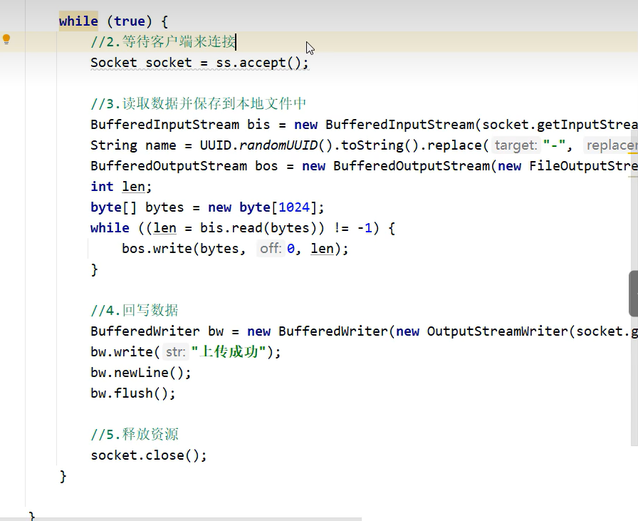

##### 单线程处理该问题时的理解：

只有等该线程从accepy->socket.close()执行完毕之后，才能和下一个客户端进行连接

##### accept是 连接的操作


弊端：

​	第一个用户正在上传数据，第二个用户就来访问了，此时第二个用户是无法成功上传的。

​	所以，使用多线程改进

优化方案二：

​	每来一个用户，就开启多线程处理

```java
public class Client {
    public static void main(String[] args) throws IOException {
        //客户端：将本地文件上传到服务器。接收服务器的反馈。
        //服务器：接收客户端上传的文件，上传完毕之后给出反馈。


        //1. 创建Socket对象，并连接服务器
        Socket socket = new Socket("127.0.0.1",10000);

        //2.读取本地文件中的数据，并写到服务器当中
        BufferedInputStream bis = new BufferedInputStream(new FileInputStream("mysocketnet\\clientdir\\a.jpg"));
        BufferedOutputStream bos = new BufferedOutputStream(socket.getOutputStream());
        byte[] bytes = new byte[1024];
        int len;
        while ((len = bis.read(bytes)) != -1){
            bos.write(bytes,0,len);
        }

        //往服务器写出结束标记
        socket.shutdownOutput();


        //3.接收服务器的回写数据
        BufferedReader br = new BufferedReader(new InputStreamReader(socket.getInputStream()));
        String line = br.readLine();
        System.out.println(line);


        //4.释放资源
        socket.close();

    }
}
```

```java
public class Server {
    public static void main(String[] args) throws IOException {
        //客户端：将本地文件上传到服务器。接收服务器的反馈。
        //服务器：接收客户端上传的文件，上传完毕之后给出反馈。


        //1.创建对象并绑定端口
        ServerSocket ss = new ServerSocket(10000);

        while (true) {
            //2.等待客户端来连接
            Socket socket = ss.accept();

            //开启一条线程
            //一个用户就对应服务端的一条线程
            new Thread(new MyRunnable(socket)).start();
        }

    }
}


public class MyRunnable implements Runnable{

    Socket socket;

    public MyRunnable(Socket socket){
        this.socket = socket;
    }

    @Override
    public void run() {
        try {
            //3.读取数据并保存到本地文件中
            BufferedInputStream bis = new BufferedInputStream(socket.getInputStream());
            String name = UUID.randomUUID().toString().replace("-", "");
            BufferedOutputStream bos = new BufferedOutputStream(new FileOutputStream("mysocketnet\\serverdir\\" + name + ".jpg"));
            int len;
            byte[] bytes = new byte[1024];
            while ((len = bis.read(bytes)) != -1) {
                bos.write(bytes, 0, len);
            }
            bos.close();
            //4.回写数据
            BufferedWriter bw = new BufferedWriter(new OutputStreamWriter(socket.getOutputStream()));
            bw.write("上传成功");
            bw.newLine();
            bw.flush();
        } catch (IOException e) {
            e.printStackTrace();
        } finally {
            //5.释放资源
           if(socket != null){
               try {
                   socket.close();
               } catch (IOException e) {
                   e.printStackTrace();
               }
           }
        }
    }
}
```

### 练习六：线程池改进

```java
public class Client {
    public static void main(String[] args) throws IOException {
        //客户端：将本地文件上传到服务器。接收服务器的反馈。
        //服务器：接收客户端上传的文件，上传完毕之后给出反馈。


        //1. 创建Socket对象，并连接服务器
        Socket socket = new Socket("127.0.0.1",10000);

        //2.读取本地文件中的数据，并写到服务器当中
        BufferedInputStream bis = new BufferedInputStream(new FileInputStream("mysocketnet\\clientdir\\a.jpg"));
        BufferedOutputStream bos = new BufferedOutputStream(socket.getOutputStream());
        byte[] bytes = new byte[1024];
        int len;
        while ((len = bis.read(bytes)) != -1){
            bos.write(bytes,0,len);
        }

        //往服务器写出结束标记
        socket.shutdownOutput();


        //3.接收服务器的回写数据
        BufferedReader br = new BufferedReader(new InputStreamReader(socket.getInputStream()));
        String line = br.readLine();
        System.out.println(line);


        //4.释放资源
        socket.close();

    }
}
```

```java
public class Server {
    public static void main(String[] args) throws IOException {
        //客户端：将本地文件上传到服务器。接收服务器的反馈。
        //服务器：接收客户端上传的文件，上传完毕之后给出反馈。


        //创建线程池对象
        ThreadPoolExecutor pool = new ThreadPoolExecutor(
                3,//核心线程数量
                16,//线程池总大小
                60,//空闲时间
                TimeUnit.SECONDS,//空闲时间（单位）
                new ArrayBlockingQueue<>(2),//队列
                Executors.defaultThreadFactory(),//线程工厂，让线程池如何创建线程对象
                new ThreadPoolExecutor.AbortPolicy()//阻塞队列
        );


        //1.创建对象并绑定端口
        ServerSocket ss = new ServerSocket(10000);

        while (true) {
            //2.等待客户端来连接
            Socket socket = ss.accept();

            //开启一条线程
            //一个用户就对应服务端的一条线程
            //new Thread(new MyRunnable(socket)).start();
            pool.submit(new MyRunnable(socket));
        }

    }
}
```

```java
public class MyRunnable implements Runnable{

    Socket socket;

    public MyRunnable(Socket socket){
        this.socket = socket;
    }

    @Override
    public void run() {
        try {
            //3.读取数据并保存到本地文件中
            BufferedInputStream bis = new BufferedInputStream(socket.getInputStream());
            String name = UUID.randomUUID().toString().replace("-", "");
            BufferedOutputStream bos = new BufferedOutputStream(new FileOutputStream("mysocketnet\\serverdir\\" + name + ".jpg"));
            int len;
            byte[] bytes = new byte[1024];
            while ((len = bis.read(bytes)) != -1) {
                bos.write(bytes, 0, len);
            }
            bos.close();
            //4.回写数据
            BufferedWriter bw = new BufferedWriter(new OutputStreamWriter(socket.getOutputStream()));
            bw.write("上传成功");
            bw.newLine();
            bw.flush();
        } catch (IOException e) {
            e.printStackTrace();
        } finally {
            //5.释放资源
           if(socket != null){
               try {
                   socket.close();
               } catch (IOException e) {
                   e.printStackTrace();
               }
           }
        }
    }
}
```

